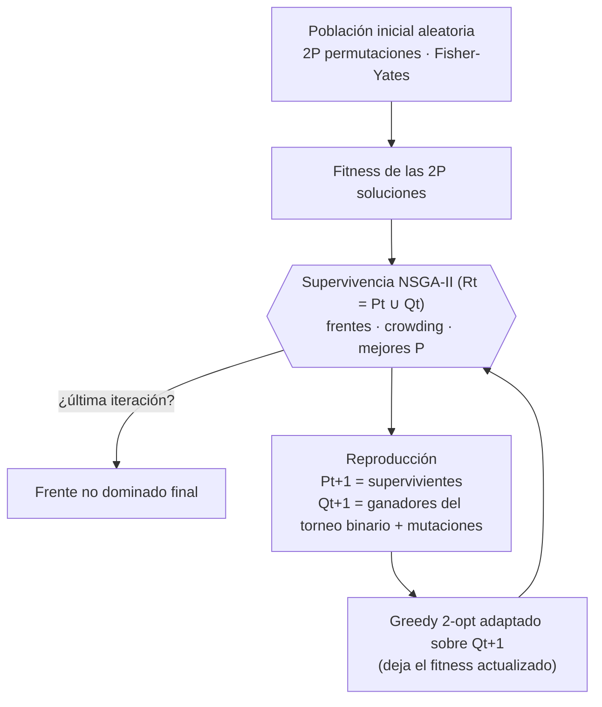

# cuda_mqap — NSGA-II + Greedy 2-opt adaptado en CUDA para el mQAP

[English](README.md) | **Español**

Implementación paralela en GPU (CUDA C++) del algoritmo evolutivo multiobjetivo **NSGA-II**,
combinado con una búsqueda local **Greedy 2-opt adaptada**, para resolver instancias del
**Problema de Asignación Cuadrática Multiobjetivo** (mQAP, *multiobjective Quadratic Assignment Problem*).

Todo el algoritmo se ejecuta en la GPU: la evaluación del fitness, la ordenación no dominada, el
[crowding distance](#g-crowding), la selección, la mutación y la búsqueda local. El host solo copia la instancia antes
del bucle y los resultados al terminar, de modo que **no sincroniza con el dispositivo dentro del
bucle**. Una generación son **3 lanzamientos de [kernel](#g-kernel) hasta P = 256**, donde la supervivencia de cada
ejecución cabe en un bloque; por encima, la supervivencia multibloque añade un
[lanzamiento cooperativo](#g-cooperative-launch) y las ordenaciones por segmentos de [CUB](#g-cub) (la biblioteca de primitivas paralelas de NVIDIA), unos 37
lanzamientos por generación medidos con P = 4096. Además,
se ejecutan **varias ejecuciones independientes de forma concurrente** en una sola llamada al programa.

---

## Índice

1. [Características](#características)
2. [El problema: mQAP](#el-problema-mqap)
3. [El algoritmo](#el-algoritmo)
4. [Arquitectura del proyecto](#arquitectura-del-proyecto)
5. [Diseño en GPU](#diseño-en-gpu)
6. [Requisitos](#requisitos)
7. [Compilación](#compilación)
8. [Uso](#uso)
9. [Experimentos y métricas](#experimentos-y-métricas)
10. [Pruebas y validación](#pruebas-y-validación)
11. [Rendimiento](#rendimiento)
12. [Mejoras respecto a la versión original](#mejoras-respecto-a-la-versión-original)
13. [Límites del tamaño de población y recursos de la GPU](#límites-del-tamaño-de-población-y-recursos-de-la-gpu)
14. [Limitaciones y trabajo futuro](#limitaciones-y-trabajo-futuro)
15. [Solución de problemas](#solución-de-problemas)
16. [Glosario](#glosario)
17. [Créditos y licencia](#créditos-y-licencia)

---

## Características

**Algoritmo**
- NSGA-II completo: ordenación no dominada rápida, crowding distance y selección
  [elitista (μ + λ)](#g-elitism).
- Selección por torneo binario, mutación por intercambio y mutación por transposición (inversión de un segmento).
- Greedy 2-opt adaptado a varios objetivos: en cada generación se elige al azar si el criterio de mejora
  es la suma de todos los objetivos o un único objetivo.
- Instancias de 2 y 3 objetivos (flujos) y hasta 64 instalaciones. El cargador rechaza cualquier
  instancia mayor (`kMaxFacilities` en `include/config.h`), y con 3 objetivos el límite efectivo es
  63 en GPU con 64 KB de *shared memory*, porque con n = 64 las matrices de flujo y distancia de un
  bloque ya ocupan 64 KB. La supervivencia multibloque no cambia esto: solo afecta a la
  supervivencia, que no depende de n.

**Rendimiento en GPU**
- Fitness en **O(n²)** por cromosoma (un [*warp*](#g-warp) por cromosoma, con las matrices en
  [*shared memory*](#g-shared-memory)),
  en lugar de tres productos de matrices densas de O(n³).
- NSGA-II completo **en la GPU**: un bloque por ejecución hasta P = 256 (matriz de dominancia empaquetada en
  bits en *shared memory*) y una supervivencia multibloque con lanzamiento cooperativo y ordenaciones por
  segmentos (CUB) para P hasta 65536.
- Greedy 2-opt con **[evaluación incremental (delta)](#g-delta) en O(n)** de cada intercambio; la búsqueda local de
  toda la descendencia es un único kernel.
- Estados aleatorios [Philox](#g-philox) persistentes, que se inicializan una sola vez.
- **Ejecuciones independientes en paralelo** (`--runs R`) para aprovechar toda la GPU en las campañas de experimentos.

**Ingeniería**
- Separación estricta host/device: `main.cpp` no contiene código CUDA, y los kernels se exponen mediante funciones lanzadoras.
- Instancias leídas de los ficheros `.dat` en tiempo de ejecución; los parámetros se pasan por línea de comandos.
- Control de errores `CUDA_CHECK`/`CUDA_CHECK_KERNEL` y gestión de memoria RAII (`DeviceBuffer<T>`).
- **Plug and play en Visual Studio 2026**: clonar, abrir `cuda_mqap.slnx` y pulsar F5. La versión de CUDA,
  el toolset de C++ y las arquitecturas de GPU se adaptan a la máquina. También `CMakeLists.txt` con `ctest`.
- Batería de pruebas que compara cada kernel con una implementación independiente en CPU, y la opción
  `--verify`, que valida los resultados de cada ejecución.
- Resultados reproducibles mediante semilla (`--seed`).

---

## El problema: mQAP

Hay `n` instalaciones (*facilities*) que deben asignarse a `n` ubicaciones (*locations*). Una solución es
una permutación `p`, donde `p[i]` es la ubicación de la instalación `i`. Cada objetivo `k` tiene su propia
matriz de flujos `Fk`, y todos comparten la matriz de distancias `D`. Se minimizan simultáneamente los `m` costes:

```
cost_k(p) = Σ_i Σ_j  Fk[i][j] · D[p(i)][p(j)]          k = 1..m   (m = 2 o 3)
```

Esta expresión es equivalente a la formulación matricial `Trace(Fk · X · Dᵀ · Xᵀ)` que usaba la versión
original, donde `X` es la matriz de permutación; las pruebas verifican esa equivalencia. Como los
objetivos están en conflicto, el resultado no es una única solución sino una aproximación del **frente de
Pareto**: el conjunto de soluciones no dominadas.

### Instancias (`mQAPData/`)

Las instancias son el conjunto de pruebas del mQAP de Knowles y Corne
([página archivada](https://web.archive.org/web/2019/http://www.cs.bham.ac.uk/~jdk/mQAP/)), tomadas de la copia de
<https://github.com/fredizzimo/keyboardlayout/tree/master/tests/mQAPData>. Son datos de terceros, no cubiertos
por la licencia de este proyecto: ver [Datos de terceros](#datos-de-terceros).

| Fichero | Contenido |
|---|---|
| `KC<n>-<m>fl-<tipo>.dat` | Cabecera (`facilities = 10 objectives = 2 …` o `facilities: 10 objectives: 2 …`), la matriz de distancias `n×n` y `m` matrices de flujo `n×n` |
| `KC10-2fl-*.PO` | Frente de Pareto óptimo publicado: en cada línea, una permutación en base 1 y sus `m` costes |

`rl` son instancias con distancias y flujos del tipo *real-like*, y `uni` con valores uniformes.
Hay 23 instancias con n = 10, 20 y 30, y los frentes óptimos de las 8 instancias KC10.

---

## El algoritmo



Cada generación hace lo siguiente:

1. **Supervivencia NSGA-II** sobre las `2P` soluciones de `Rt = Pt ∪ Qt`:
   - *Ordenación no dominada*: [rango](#g-rank) 1 para el primer
     [frente de Pareto](#g-pareto-front), rango 2 para el siguiente, etc.
   - *Crowding distance* de cada frente. Para cada objetivo se ordenan los miembros del frente; los
     extremos reciben ∞ y los puntos interiores suman `(f[siguiente] − f[anterior]) / (máx − mín)`,
     con el máximo y el mínimo calculados sobre toda la población.
   - Se seleccionan las `P` mejores soluciones por (rango ascendente, crowding descendente).
2. **Reproducción**. Las `P` supervivientes forman `Pt+1`. Para cada una se celebra un **torneo binario**
   contra otra superviviente elegida al azar: gana el rango menor y, en caso de empate, el mayor crowding.
   El ganador se copia y se muta:
   - **Mutación por intercambio**: se intercambian dos genes al azar; se aplica 2 veces.
   - **Mutación por transposición**: se invierte el segmento comprendido entre dos posiciones aleatorias.
3. **[Greedy 2-opt](#g-greedy-2opt) adaptado** sobre cada descendiente. Los pares de posiciones se recorren en el orden
   de la versión original —`r` en `[0, n−2]`, `s` en `[1, n−1]`, saltando `r == s`, así que casi todos los
   pares se visitan en los dos órdenes— y se conserva el intercambio si no empeora el criterio de la
   generación, elegido al azar para cada ejecución y generación: la suma de todos los objetivos o un
   único objetivo `k`. Volver a visitar un par después de aceptar un intercambio puede mejorarlo otra
   vez, y eso es lo que hace que la calidad iguale a la de la versión original; ver [Calidad frente al
   Greedy 2-opt original](#quality-vs-original). La idea de adaptar el criterio proviene de
   <https://arxiv.org/ftp/arxiv/papers/1109/1109.1276.pdf>.

Parámetros:

| Parámetro | Dónde | Valor por defecto |
|---|---|---|
| Tamaño de población `P` | `--population` | 64 (potencia de 2 entre 16 y 65536) |
| Generaciones | `--iterations` | 70 |
| Ejecuciones independientes | `--runs` | 1 |
| Semilla | `--seed` | aleatoria (se imprime) |
| Mutaciones por intercambio por hijo | `include/config.h` (`kExchangeMutations`) | 2 |
| Probabilidad de intercambio / transposición | `include/config.h` | 1.0 / 1.0 |
| Recorrido de pares del greedy 2-opt | `include/config.h` (`kGreedyFullPairs`) | `true`: el de la versión original, `(n−1) + (n−2)²` intentos |

---

## Arquitectura del proyecto

```
cuda_mqap/
├── include/
│   ├── config.h            Límites (n, P, objetivos) y parámetros de los operadores
│   ├── cuda_check.cuh      CUDA_CHECK / CUDA_CHECK_KERNEL
│   ├── device_buffer.cuh   DeviceBuffer<T>: memoria de GPU con RAII
│   ├── device_common.cuh   Funciones __device__ compartidas (coste por warp, delta del greedy 2-opt, bitonic sort)
│   ├── instance.h          Struct Instance, loadInstance(), cost() de referencia en CPU
│   ├── kernels.cuh         Declaración de los lanzadores de kernels y del layout de memoria
│   ├── solver.h            SolverOptions, Solution, RunResult, solve()
│   └── survival_workspace.cuh   Búferes de la supervivencia multibloque (se reservan una vez)
├── src/
│   ├── main.cpp            Línea de comandos, fichero de resultados y --verify (solo host)
│   ├── instance.cpp        Parser de los ficheros .dat y validación (incluido el desbordamiento del fitness)
│   ├── solver.cu           Orquestación en el host: reservas, bucle de generaciones y recogida de resultados
│   ├── fitness.cu          Kernel de fitness
│   ├── nsga2.cu            Kernel de supervivencia NSGA-II (un bloque por ejecución, P ≤ 256)
│   ├── nsga2_multiblock.cu Supervivencia NSGA-II repartida en varios bloques (P > 256)
│   ├── operators.cu        RNG, población inicial, torneo y mutaciones
│   └── local_search.cu     Kernel Greedy 2-opt
├── tests/test_kernels.cu   Pruebas de cada kernel contra referencias en CPU
├── scripts/run_experiments.ps1   Campaña de experimentos con los parámetros de cada instancia
├── scripts/run_convergence.ps1   Trazas de cada generación y su análisis (ver más abajo)
├── scripts/analyze_convergence.py   Hipervolumen, estancamiento y cobertura del frente óptimo
├── scripts/run_original_comparison.ps1   Comparación con la versión original, varias ejecuciones
├── scripts/prepare_original.py   Árbol de compilación de la versión original para una instancia
├── scripts/compare_versions.py   Hipervolumen, cobertura y Mann-Whitney entre dos versiones
├── mQAPData/               Instancias (.dat) y frentes óptimos (.PO)
├── mQAPMetrics/            Scripts Node.js de métricas y gráficos 3D
├── comparative_results_kcX_datasets.xlsx   Resultados comparativos
├── cuda_mqap.slnx, cuda_mqap.vcxproj, test_kernels.vcxproj   Solución y proyectos de Visual Studio
├── cuda_mqap.props, cuda_toolkit.props   Configuración común y detección de la versión de CUDA
├── .vsconfig, .gitattributes             Componentes de Visual Studio y finales de línea
└── CMakeLists.txt
```

**Separación host/device.** El programa se organiza en tres capas:

| Capa | Ficheros | Responsabilidad |
|---|---|---|
| Aplicación (host) | `main.cpp`, `instance.cpp` | Argumentos, lectura de la instancia, escritura de resultados y verificación en CPU |
| Orquestación (host) | `solver.cu` | Reserva de toda la memoria una sola vez, secuencia de lanzamientos y copia final de resultados |
| Kernels (device) | `fitness.cu`, `nsga2.cu`, `operators.cu`, `local_search.cu` | Kernels `template<int OBJ>` (instanciados para 2 y 3 objetivos) y sus lanzadores |

Los kernels viven en el espacio de nombres `mqap::detail`. Fuera de su `.cu` solo se ven los lanzadores
declarados en `kernels.cuh` (`launchFitness`, `launchSurvival`, `launchReproduce`, `launchGreedy2Opt`…),
y cada uno comprueba el lanzamiento con `CUDA_CHECK_KERNEL()`.

---

## Diseño en GPU

### Layout de memoria

Para `R` ejecuciones, población `P`, `n` instalaciones y `OBJ` objetivos:

| Buffer | Tipo y forma | Descripción |
|---|---|---|
| `genes` (×2, doble búfer) | `short [R][2P][n]` | Filas `[0, P)`: supervivientes; filas `[P, 2P)`: descendencia |
| `fitness` (×2) | `unsigned int [R][2P][OBJ]` | Coste de cada objetivo |
| `survivorIndex / Rank / Crowding` | `[R][P]` | Resultado de la supervivencia, ordenado por (rango, −crowding) |
| `rng` | `curandStatePhilox4_32_10_t [R][2P]` | Estados aleatorios persistentes |
| `flow`, `dist` | `int [OBJ][n][n]`, `int [n][n]` | Matrices de la instancia |

Toda la memoria se reserva **una vez** con `DeviceBuffer<T>` y se libera automáticamente. Entre
generaciones solo se intercambian los punteros del doble búfer.

### Kernels

| Kernel | Grid × bloque | Paralelismo | Técnicas |
|---|---|---|---|
| `fitnessKernel<OBJ>` | `(⌈2P/4⌉, R)` × 128 | 1 warp por cromosoma | `F` y `D` en *shared memory* (carga coalescente); lecturas de `F` consecutivas por carril (sin conflictos de banco); reducción con `__shfl_down_sync` |
| `survivalKernel<OBJ>` (P ≤ 256) | `R` × `2P` | 1 bloque por ejecución, 1 hilo por individuo | Dominancia en bits (`2P × 2P/32` palabras), frentes con `__ballot_sync` + `__popc`, bitonic sort de claves de 64 bits `(rango, fitness)` y `(rango, −crowding)` en *shared memory* |
| `reproduceKernel<OBJ>` | `(⌈P/128⌉, R)` × 128 | 1 hilo por descendiente | Estado Philox en registros; torneo, mutaciones y copia en un solo paso |
| `greedy2OptKernel<OBJ>` | `(⌈P/4⌉, R)` × 128 | 1 warp por descendiente | Matrices en *shared memory*; delta O(n) repartido entre los 32 carriles; criterio uniforme en el warp (sin divergencia) |
| `initPopulationKernel` | `(⌈2P/128⌉, R)` × 128 | 1 hilo por cromosoma | Fisher-Yates sin sesgo |
| `rngInitKernel` | `⌈R·2P/128⌉` × 128 | 1 hilo por estado | Una subsecuencia Philox independiente por hilo |
| Supervivencia multibloque (P > 256) | `(⌈2P/256⌉, R)` × 256, más un lanzamiento cooperativo | 1 hilo por individuo en toda la malla | Conteo de dominadores con teselas de fitness en *shared memory*, pelado de frentes con `grid.sync()`, crowding y selección con ordenaciones por segmentos (CUB) |

*Shared memory* por bloque:
- **Fitness y greedy 2-opt:** `(OBJ + 1)·n²·4 + 4·n·2` bytes, por ejemplo 14,6 KB para n = 30 y 3 objetivos.
  Si hace falta más de 48 KB se solicita automáticamente el máximo *opt-in* del dispositivo
  (`cudaFuncAttributeMaxDynamicSharedMemorySize`), lo que permite n = 63 con 3 objetivos en Turing,
  cuyo máximo *opt-in* es de 64 KB: n = 63 necesita 64.008 bytes y n = 64 necesita 66.048, que el
  cargador rechaza.
- **Supervivencia:** hasta ~46 KB con P = 256 (camino de un bloque). El camino multibloque (P > 256) solo usa
  teselas de fitness de unos 3 KB; ver [Límites del tamaño de población](#límites-del-tamaño-de-población-y-recursos-de-la-gpu).

### Evaluación incremental del greedy 2-opt

Intercambiar las posiciones `r` y `s` de `p` solo modifica los términos del coste en los que aparecen `r` o `s`:

```
Δ(r,s) = (F_rr − F_ss)(D_{ps ps} − D_{pr pr}) + (F_rs − F_sr)(D_{ps pr} − D_{pr ps})
       + Σ_{k≠r,s} [ (F_kr − F_ks)(D_{pk ps} − D_{pk pr}) + (F_rk − F_sk)(D_{ps pk} − D_{pr pk}) ]
```

Cada carril del warp calcula una parte del sumatorio y el resultado se reduce con `__shfl_down_sync`.
Así, cada una de las `(n−1) + (n−2)²` evaluaciones del recorrido (343 con n = 20) cuesta O(n) en lugar
de recalcular el fitness completo.
Los acumuladores son de 64 bits.

### Sincronización

- Todos los kernels se lanzan en el *default stream*, que ya garantiza el orden entre ellos, así que no se
  usa `cudaDeviceSynchronize` durante la ejecución.
- El host solo espera al final (`cudaEventSynchronize`), para medir el tiempo y copiar los resultados.
- Dentro de los kernels, `__syncthreads()` solo separa fases que comparten *shared memory*, y `__syncwarp()`
  hace visible a todo el warp el intercambio aplicado en el greedy 2-opt.
- La supervivencia multibloque (P > 256) pela los frentes de Pareto con un **lanzamiento cooperativo**:
  toda la malla se sincroniza con `grid.sync()` entre las fases de cada frente, dentro del kernel, sin
  volver al host.
- `--trace` es la excepción: copia los supervivientes una vez por generación, así que una ejecución con
  traza sí sincroniza con el dispositivo y su tiempo no es comparable con el de una normal.
- En Debug, `MQAP_SYNC_CHECK` hace que `CUDA_CHECK_KERNEL()` sincronice después de cada kernel, de modo
  que un error de ejecución se reporta en el lanzamiento que lo causó.

---

## Requisitos

- GPU NVIDIA con *compute capability* ≥ 7.5 (GeForce RTX 20xx o posterior) y un driver actualizado.
- **Visual Studio 2026** con la carga de trabajo *Desarrollo para el escritorio con C++*. Al abrir la
  solución, Visual Studio lee `.vsconfig` y ofrece instalar los componentes que falten.
- **CUDA Toolkit 12.x o 13.x** (≥ 11.8), instalado **después** de Visual Studio para que se añada su
  *Visual Studio Integration*. El proyecto detecta automáticamente la versión instalada; se desarrolló
  con CUDA 13.4.
- Alternativa sin el IDE: CMake ≥ 3.24 + Ninja (incluidos con Visual Studio).

---

## Compilación

### Abrir en Visual Studio 2026 (plug and play)

```
git clone https://github.com/apupiales/cuda_mqap.git
cd cuda_mqap
git checkout develop_large_population_multiblock
start cuda_mqap.slnx
```

1. Visual Studio abre la solución con sus dos proyectos: `cuda_mqap` (el programa, proyecto de inicio) y
   `test_kernels` (las pruebas).
2. Selecciona `Release | x64` y pulsa **F5** (o Ctrl+F5). El programa se ejecuta con
   `mQAPData\KC10-2fl-1rl.dat --verify`, usando la raíz del repositorio como directorio de trabajo. Los
   argumentos se cambian en *Proyecto → Propiedades → Depuración*.
3. Para ejecutar las pruebas: clic derecho en `test_kernels` → *Establecer como proyecto de inicio* → Ctrl+F5.
4. Los ejecutables se generan en `build\x64\<Configuración>\`.

Nada depende de la máquina donde se creó el proyecto:

| Qué | Cómo se adapta |
|---|---|
| Versión de CUDA | `cuda_toolkit.props` la toma de `CUDA_PATH` (p. ej. `...\CUDA\v12.6` → `CUDA 12.6.props`). Para usar otra versión instalada: `set CudaVersion=12.6` antes de abrir VS, o `msbuild /p:CudaVersion=12.6` |
| Falta la integración de CUDA | La compilación se detiene con un mensaje que explica cómo arreglarlo (en lugar de "tipo de elemento CudaCompile desconocido") |
| Toolset de C++ | `$(DefaultPlatformToolset)` del Visual Studio que lo abre (v145 en VS 2026); SDK de Windows `10.0` (el más reciente instalado) |
| GPU | Código nativo para `sm_75`, `sm_80`, `sm_86` y `sm_89`, más el PTX que el driver compila para GPUs más nuevas (RTX 50xx) |
| Rutas | Todas relativas al repositorio (`$(MSBuildThisFileDirectory)`); salidas en `build\` (ignorado por git) |
| Finales de línea | `.gitattributes` mantiene CRLF en los ficheros de Visual Studio |

La configuración común está en `cuda_mqap.props`: C++17, `/W4`, `-lineinfo` en Release, y `-G` más
`MQAP_SYNC_CHECK` en Debug.

### CMake

```
cmake -S . -B build/cmake -G Ninja -DCMAKE_BUILD_TYPE=Release
cmake --build build/cmake
ctest --test-dir build/cmake --output-on-failure
```

Por defecto compila `sm_75`, `sm_80`, `sm_86` y `sm_89` más PTX; para compilar solo para tu GPU usa
`-DCMAKE_CUDA_ARCHITECTURES=native`. En Visual Studio también sirve *Archivo → Abrir → Carpeta*.

### nvcc directo

Desde una consola *x64 Native Tools*:

```
nvcc -O3 -arch=sm_75 -std=c++17 -Iinclude src\main.cpp src\instance.cpp src\solver.cu src\fitness.cu ^
     src\nsga2.cu src\nsga2_multiblock.cu src\operators.cu src\local_search.cu -o cuda_mqap.exe
```

---

## Uso

```
cuda_mqap <instance.dat> [opciones]
  --population P   tamaño de población, potencia de 2 en [16, 65536] (defecto 64)
  --iterations N   generaciones (defecto 70)
  --runs R         ejecuciones independientes concurrentes (defecto 1)
  --seed S         semilla (defecto: aleatoria, se imprime en la salida)
  --output FILE    fichero de resultados, en modo append (defecto result_<instancia>_nsga2_greedy_2opt.txt)
  --trace FILE     escribe el frente de cada generacion en FILE (CSV, se sobrescribe)
  --trace-max N    puntos guardados por ejecucion y generacion en la traza (defecto 4096)
  --trace-every K  guarda el frente cada K generaciones, mas la ultima (defecto 1)
  --verify         verifica las poblaciones finales en CPU
  --quiet          no imprime las soluciones finales
```

Ejemplos:

```
:: Una ejecución con verificación
build\x64\Release\cuda_mqap.exe mQAPData\KC10-2fl-1rl.dat --verify

:: 30 ejecuciones independientes en paralelo, reproducibles
build\x64\Release\cuda_mqap.exe mQAPData\KC20-2fl-1rl.dat --iterations 300 --runs 30 --seed 2026 --quiet

:: Instancia de 3 objetivos
build\x64\Release\cuda_mqap.exe mQAPData\KC30-3fl-1rl.dat --population 32 --runs 10
```

Salida por consola (resumida):

```
Instance KC10-2fl-1rl: n = 10, objectives = 2 | population = 64, iterations = 70, runs = 1, seed = 42

FINAL SOLUTION (run 0, 64 non-dominated)
0 3 6 1 9 4 8 7 5 2 5925064 2282788
5 1 3 4 0 6 2 8 7 9 1665490 5884156
5 1 6 3 0 2 8 9 7 4 1869616 4670952
...
Verification: OK

Results appended to result_KC10-2fl-1rl_nsga2_greedy_2opt.txt
Time Spent: 0.148970 s (GPU 13.494 ms)
```

### Fichero de resultados

Mantiene el formato original, así que los scripts de `mQAPMetrics` siguen funcionando. Cada ejecución
añade un bloque con las soluciones no dominadas (rango 1) de la población final: la clave es la
permutación y el valor, sus costes.

```
{
'0361948752': [5925064, 2282788],
'5134062879': [1665490, 5884156],
'5163028974': [1869616, 4670952],
},
```

La población final suele contener la misma solución muchas veces, porque converge y los supervivientes
son copias unos de otros. **El frente se escribe sin repeticiones:** cada solución no dominada distinta
aparece una vez, en el orden que le da NSGA-II. La población completa, con sus repeticiones, es la que
comprueba `--verify` y la que constituye la población final de la ejecución.

### Verificación (`--verify`)

Recalcula en CPU, de forma independiente, cada solución de la población final de cada ejecución:
- que la permutación sea válida;
- que el fitness coincida exactamente con `cost()` en CPU;
- que el rango 1 corresponda exactamente a las soluciones no dominadas (y que toda solución con rango > 1
  esté dominada por alguna superviviente).

Si algo falla, el código de salida es 1.

---

## Experimentos y métricas

`scripts/run_experiments.ps1` ejecuta la campaña de `comparative_results_kcX_datasets.xlsx` con la
población y las iteraciones que usaba cada instancia en la versión original:

```
.\scripts\run_experiments.ps1 -Runs 30                              # todas las instancias
.\scripts\run_experiments.ps1 -Runs 10 -Seed 2026 -Instances KC10-2fl-1rl,KC30-3fl-1rl
```

### Cuántas generaciones necesita cada instancia (`--trace`)

> **Las cifras de esta sección y las del libro de Excel se midieron con el recorrido de pares
> anterior**, el de una sola pasada `r < s`, antes de que el de la versión original pasara a ser el
> comportamiento por defecto (ver [B8 retirado](#errores-corregidos)). El recorrido nuevo mejora el
> frente por generación y cuesta entre 1,4 y 1,8 veces más tiempo de GPU, así que cabe esperar que
> las generaciones de estancamiento bajen y que las fracciones de calidad suban; los frentes de
> referencia `.KBP` salen de esas mismas ejecuciones, y por lo tanto también son una cota inferior
> más holgada de lo que serían ahora. Volver a lanzar la campaña completa es un trabajo de horas y
> está pendiente. Lo que sí se volvió a medir con el recorrido nuevo es la comparación con la versión
> original y el barrido de poblaciones de
> [Calidad frente al Greedy 2-opt original](#quality-vs-original), y las tablas de
> [Rendimiento](#rendimiento).

`--trace FICHERO` escribe un CSV con `run,generation,f1,f2[,f3]`: las soluciones no dominadas distintas
de **cada** generación de cada ejecución, desde la supervivencia de la población inicial (generación 0)
hasta el frente final. Copia los supervivientes al host una vez por generación, así que sincroniza con el
dispositivo y **el tiempo de una ejecución con traza no es comparable** con el de una normal; la copia es
despreciable frente a una generación con población grande, y se nota con población pequeña.

`scripts/run_convergence.ps1` graba las trazas y las analiza con `scripts/analyze_convergence.py`, que
informa, por instancia:

| Indicador | Significado |
|---|---|
| `t_stall` | Primera generación tras la cual el [hipervolumen](#g-hypervolume) crece menos de `--epsilon` (relativo) durante `--patience` generaciones. La supervivencia es elitista, así que el hipervolumen solo puede crecer: una curva plana es estancamiento real, no ruido |
| `t_final` | Primera generación cuyo frente ya es igual al último. No necesita datos de referencia y dice cuándo deja de encontrarse algo nuevo |
| `t_optimum` | Primera generación que cubre el frente `.PO` publicado. Solo lo tienen las instancias KC10 |
| `coverage` | [Fracción del frente óptimo](#g-coverage) encontrada al final |

El punto de referencia del hipervolumen es fijo para todo el fichero (la esquina peor de la generación 0),
de modo que las generaciones y las ejecuciones son comparables entre sí. Los tres números de generación son
variables aleatorias —cada ejecución estanca en un punto distinto—, así que el resumen da la mediana y el
percentil 90 sobre las ejecuciones, nunca un único valor.

```
.\scripts\run_convergence.ps1 -Population 1024 -Iterations 200 -Runs 30
.\scripts\run_convergence.ps1 -Population 4096 -Iterations 300 -Instances KC10-2fl-1rl
python scripts\analyze_convergence.py results\convergence\*.csv --patience 30 --epsilon 1e-5
```

`--iterations` tiene que estar claramente por encima del estancamiento esperado o la medición informará
del tope en su lugar; el análisis avisa cuando una ejecución sigue mejorando en la última generación. Las
curvas por generación se escriben en `results/convergence/curves/<instancia>_curve.csv` (hipervolumen
mediano, su fracción del valor final y el tamaño mediano del frente), listas para graficar.

El número de generaciones depende mucho de la población, así que la respuesta útil es el coste total: el
tiempo de una generación se conoce para cada P (ver [Rendimiento](#rendimiento)), de modo que
`generaciones × tiempo por generación` indica qué pareja (P, generaciones) alcanza antes el objetivo.

#### Resultados de la campaña (RTX 2060, 2026-09-22)

Tres poblaciones por instancia: P = 1024 con tope de 2000 generaciones (30 ejecuciones en las instancias
de 2 objetivos, 10 en las de 3), y P = 16384 y P = 65536 con el tope que cada instancia necesitó, desde
300 generaciones en KC10 hasta 10 000 en KC30-3fl-1rl y KC30-3fl-1uni.

Todo está medido en la misma escala, y llegar a eso exigió dos correcciones que conviene declarar:

- **La calidad es una fracción de un [frente de referencia](#g-reference-front), no de la propia
  ejecución.** En KC10 ese frente
  es el óptimo publicado, así que la cifra es la fracción del hipervolumen óptimo. En KC20 y KC30 no hay
  óptimo publicado, de modo que la referencia es el mejor frente que conoce la campaña: la unión no
  dominada de los frentes finales de todas las ejecuciones y todas las poblaciones. Normalizar cada
  ejecución contra su propia última generación, como hacía una versión anterior de esta sección, hace
  aparecer un 100 % por construcción y esconde la diferencia entre poblaciones.
- **La prueba de estancamiento usa la misma ventana en todas partes** (`--hv-window`): 20 generaciones en
  KC10 y KC20, 50 en KC30. Con cada fichero eligiendo su ventana, KC30-3fl-1rl parecía estancarse en la
  generación 612 con P = 1024 y en la 4875 con P = 65536; con ventana común las mismas trazas dan 1200 y
  1450. La mayor parte de esa diferencia era la ventana.

**Generaciones hasta que el frente deja de cambiar.** Es el número que hay que usar para elegir
`--iterations`: a partir de ahí ninguna ejecución encontró nada nuevo.

| Instancia | P = 1024 | P = 16384 | P = 65536 |
|---|---|---|---|
| KC10-2fl-2uni | 1 | 1 | ≤ 5 |
| KC10-2fl-1uni | 6,5 | 5,5 | 10 |
| KC10-2fl-2rl | 9 | 4,5 | 5 |
| KC10-2fl-1rl | 53 | 6,5 | 10 |
| KC10-2fl-4rl | 320 | 20 | 10 |
| KC10-2fl-3rl | 845 | 143 | 30 |
| KC10-2fl-5rl | 1054 | 104 | 10 |
| KC10-2fl-3uni | 1182 | 149 | 55 |
| KC20-2fl-2uni | 65 | 31,5 | 40 |
| KC20-2fl-1rl | 1817 | 236 | 230 |
| KC20-2fl-1uni | 1892 | 230 | 200 |
| KC20-2fl-3uni | 1987 | 294 | 285 |
| KC30-3fl-2uni | 1997 | 1490 | 4975 |
| KC30-3fl-1uni | 1998 | > 5000 | > 10000 |
| KC30-3fl-1rl | 1999 | > 5000 | > 10000 |

**Calidad alcanzada.** Cada celda tiene dos números medidos contra el mismo frente de referencia, de modo
que las tres columnas se pueden leer una al lado de otra:

- El **primero es el [hipervolumen](#g-hypervolume)** del frente con el que terminó la ejecución, como
  fracción del que domina el frente de referencia. Responde a "cuánto de la región interesante del
  espacio de objetivos cubre este frente", y se satura enseguida: un puñado de soluciones bien situadas
  ya captura la mayor parte del volumen.
- El **segundo es la [cobertura](#g-coverage)**: cuántos puntos del frente de referencia encontró
  realmente la ejecución, en fracción. Responde a "cuántos compromisos distintos ofrece este frente", y
  es lo que separa a las configuraciones.

KC30-3fl-2uni lo hace evidente. Su frente de referencia tiene 751 puntos: con P = 1024 la ejecución
domina el 88,06 % de su volumen habiendo encontrado el 5,8 % de sus puntos, unos 44 de 751, y con
P = 65536 domina el 98,00 % habiendo encontrado el 61,6 %, unos 463. Casi el mismo volumen, diez veces
más soluciones entre las que elegir.

| Instancia | P = 1024 | P = 16384 | P = 65536 |
|---|---|---|---|
| KC10-2fl-2uni | 100 % · 100 % | 100 % · 100 % | 100 % · 100 % |
| KC10-2fl-2rl | 100 % · 100 % | 100 % · 100 % | 100 % · 100 % |
| KC10-2fl-1uni | 99,99 % · 92,3 % | 99,99 % · 92,3 % | 99,99 % · 92,3 % |
| KC10-2fl-5rl | 99,97 % · 78,6 % | 99,97 % · 79,6 % | 99,98 % · 81,2 % |
| KC10-2fl-3uni | 99,96 % · 86,3 % | 99,96 % · 87,1 % | 99,96 % · 87,4 % |
| KC10-2fl-1rl | 99,94 % · 79,3 % | 99,94 % · 79,3 % | 99,94 % · 79,3 % |
| KC10-2fl-4rl | 99,49 % · 73,6 % | 99,49 % · 73,8 % | 99,49 % · 74,3 % |
| KC10-2fl-3rl | 99,25 % · 72,7 % | 99,25 % · 72,9 % | 99,30 % · 73,8 % |
| KC20-2fl-1rl | 99,94 % · 87,4 % | 99,96 % · 88,1 % | 99,98 % · 92,3 % |
| KC20-2fl-1uni | 99,44 % · 52,0 % | 99,88 % · 84,5 % | 99,99 % · 95,8 % |
| KC20-2fl-2uni | 99,31 % · 60,4 % | 99,93 % · 91,3 % | 100 % · 97,5 % |
| KC20-2fl-3uni | 99,30 % · 43,1 % | 99,51 % · 60,9 % | 99,68 % · 77,4 % |
| KC30-3fl-1rl | 95,52 % · 1,4 % | 98,64 % · 32,8 % | 99,31 % · 61,6 % |
| KC30-3fl-1uni | 88,88 % · 1,5 % | 96,38 % · 20,0 % | 98,93 % · 48,1 % |
| KC30-3fl-2uni | 88,06 % · 5,8 % | 96,17 % · 28,3 % | 98,00 % · 61,6 % |

Lo que dice la campaña:

- **El hipervolumen apenas separa las instancias de 2 objetivos.** Todas las configuraciones de KC10 y
  KC20 quedan entre el 99,25 % y el 100 % de su referencia, y en KC10 esa referencia es el óptimo
  publicado: el frente encontrado domina prácticamente el mismo volumen que el óptimo incluso con
  P = 1024.
- **Lo que sí las separa es cuántas soluciones de ese frente encuentran.** En KC20-2fl-1uni se pasa del
  52 % de los puntos de referencia con P = 1024 al 95,8 % con P = 65536, y en KC30-3fl-2uni del 5,8 % al
  61,6 %. Una población pequeña devuelve un frente que vale casi lo mismo en volumen con muchas menos
  soluciones distintas.
- **Más población necesita menos generaciones**, y ahora el patrón es limpio: KC10-2fl-5rl pasa de 1054
  generaciones a 10, y KC20-2fl-1rl de 1817 a 230. Una generación no es una cantidad fija de trabajo —con
  P = 65536 evalúa 64 veces más descendientes que con P = 1024—, así que esto no dice nada del tiempo
  total: en KC10-2fl-1rl una generación cuesta 0,25 ms por ejecución con P = 1024 y 86 ms con P = 65536.
- **En KC10 hay un techo que no rompe ni la población ni las generaciones**: KC10-2fl-1rl se queda en el
  79,3 % de los puntos óptimos publicados con las tres poblaciones, y KC10-2fl-3rl en torno al 73 %. Lo
  que queda es el algoritmo: esta combinación de NSGA-II con el greedy 2-opt converge a un subconjunto
  del frente óptimo.
- **Las instancias de 3 objetivos no paran nunca**: KC30-3fl-1rl y KC30-3fl-1uni seguían mejorando en la
  generación 10 000 con P = 65536, habiendo alcanzado el 99,31 % y el 98,93 % del hipervolumen de
  referencia. Pasar de 5000 a 10 000 generaciones añadió 0,67 y 2,55 puntos. Ahí el número de
  generaciones es una decisión de presupuesto, no una medición.

**Los frentes de referencia están en el repositorio**, para poder comprobar los porcentajes y graficar o
comparar los frentes. En KC10 es el óptimo publicado; en KC20 y KC30 es el mejor frente que conoce esta
campaña, escrito como fichero `.KBP` con el mismo formato que un `.PO`: una permutación en base 1 y sus
costes por línea.

| Instancia | Frente de referencia | Puntos | Fichero |
|---|---|---|---|
| KC10-2fl-* | óptimo publicado | 1 a 130 | [`mQAPData/KC10-2fl-*.PO`](mQAPData/) |
| KC20-2fl-1rl | mejor conocido | 88 | [`KC20-2fl-1rl.KBP`](mQAPData/KC20-2fl-1rl.KBP) |
| KC20-2fl-1uni | mejor conocido | 71 | [`KC20-2fl-1uni.KBP`](mQAPData/KC20-2fl-1uni.KBP) |
| KC20-2fl-2uni | mejor conocido | 8 | [`KC20-2fl-2uni.KBP`](mQAPData/KC20-2fl-2uni.KBP) |
| KC20-2fl-3uni | mejor conocido | 233 | [`KC20-2fl-3uni.KBP`](mQAPData/KC20-2fl-3uni.KBP) |
| KC30-3fl-1rl | mejor conocido | 14 029 | [`KC30-3fl-1rl.KBP`](mQAPData/KC30-3fl-1rl.KBP) |
| KC30-3fl-1uni | mejor conocido | 3112 | [`KC30-3fl-1uni.KBP`](mQAPData/KC30-3fl-1uni.KBP) |
| KC30-3fl-2uni | mejor conocido | 751 | [`KC30-3fl-2uni.KBP`](mQAPData/KC30-3fl-2uni.KBP) |

Los puntos son los que sobreviven al filtro de dominancia sobre la unión de los frentes finales de todas
las ejecuciones y todas las poblaciones: 751 de 4727 en KC30-3fl-2uni, y 14 029 de 37 029 en
KC30-3fl-1rl. Cada línea se verificó recalculando el coste de su permutación contra la instancia.

Un `.KBP` es una cota inferior, no un óptimo: una ejecución más larga o más afortunada puede mejorarlo, y
entonces todos los porcentajes medidos contra él bajan. Los frentes `.PO` de KC10 no tienen esa salvedad.
Cualquiera de los dos se le puede pasar al análisis con `--reference-front`, y
`python scripts/analyze_convergence.py <trazas> --write-reference <fichero>` reconstruye uno.

Dos notas prácticas para repetirlo. Graba todas las trazas con el mismo `--trace-every`, elegido por la
instancia más cara, para que cualquier ventana múltiplo de él esté disponible en todos los ficheros sin
volver a usar la GPU; eso es lo que obligó a las correcciones anteriores. Y en las instancias de 3
objetivos el hipervolumen de frentes de diez mil puntos es lo que limita la resolución de las curvas:
`--hv-runs 1` da cinco veces más resolución al mismo coste, y las cifras de KC30 de arriba lo usan.

### Resultados en el libro de Excel

El 2026-09-19 se añadieron a `comparative_results_kcX_datasets.xlsx` los resultados de esta versión:

- **Pestañas de instancia (KC10-\*, KC20-\*):** cada pestaña tiene un bloque nuevo a la derecha de los
  existentes, con 20 o 10 genes y 2 objetivos por fila, y una serie **verde** en su gráfico:
  *"CUDA NSGA-II Paralelo + Greedy 2opt, N iteraciones (optimizado con claude)"*. Se usaron la población y
  las iteraciones de cada pestaña, con `--verify`.
  - En las KC10 se muestra la primera de 100 ejecuciones concurrentes; en las KC20, una única ejecución.
  - Debajo de cada bloque hay una nota con el comando, la semilla y el tiempo.
  - KC10-2fl-2uni se ejecutó con P = 16 (las series originales usaron P = 2).
- **Distance Metric:** columnas F–G (media y desviación típica) y columna H de la segunda tabla, con la
  [distancia gama](#g-gamma) de esta versión sobre 100 ejecuciones por instancia KC10. Se calcula igual que
  `mQAPMetrics/distance_metric_*.js` y se trunca a 2 decimales, como los valores existentes.

**Población máxima de la rama (2026-09-21).** Los mismos 12 experimentos se repitieron con
`--population 65536`, el tope de esta rama, manteniendo las iteraciones de cada pestaña (70, 30 o 25 en
KC10; 300 en KC20), una ejecución, semilla 20260920 y `--verify` OK. Cada pestaña tiene un segundo bloque
nuevo y una serie **roja** en su gráfico: *"CUDA NSGA-II Paralelo + Greedy 2opt, N iteraciones (optimizado
con claude, poblacion 65536)"*.

Con esa población toda la población final es no dominada, así que el frente que escribe el programa tiene
65 536 filas, de las cuales solo entre 1 y 212 son soluciones distintas; el bloque y la serie guardan las
distintas, porque las repeticiones dibujarían los mismos puntos. La nota bajo cada bloque recoge el
comando, la semilla, el número de puntos distintos y el tiempo de la ejecución.

Calidad frente al frente óptimo publicado (`.PO`), junto a la serie verde de la misma rama. *Encontrados*
cuenta cuántos puntos del óptimo reproduce exactamente la ejecución; la gama es la distancia calculada
igual que `mQAPMetrics/distance_metric_*.js` (menor es mejor):

| Instancia | Puntos `.PO` | Verde: encontrados | Verde: gama | Roja: encontrados | Roja: gama |
|---|---|---|---|---|---|
| KC10-2fl-1rl | 58 | 38 | 685,46 | **46** | **568,78** |
| KC10-2fl-1uni | 13 | 7 | 241,93 | **12** | **0,00** |
| KC10-2fl-2rl | 15 | 12 | 0,00 | **15** | 0,00 |
| KC10-2fl-2uni | 1 | 1 | 0,00 | 1 | 0,00 |
| KC10-2fl-3rl | 55 | 28 | 24 466,49 | **40** | **17 757,94** |
| KC10-2fl-3uni | 130 | 66 | 420,75 | **114** | **11,47** |
| KC10-2fl-4rl | 53 | 29 | 7992,15 | **40** | **3793,44** |
| KC10-2fl-5rl | 49 | 26 | 24 552,85 | **39** | **2629,05** |

Las instancias KC20 no tienen frente publicado; sus series rojas tienen 86, 68, 8 y 212 puntos distintos
(1rl, 1uni, 2uni y 3uni). Cada permutación graficada se comprobó en el host: su coste recalculado coincide
con el fitness que escribió el programa, y cada frente es no dominado.

Tiempos en la RTX 2060: 6,6–6,8 s por pestaña KC10 de 70 generaciones y 38–39 s por pestaña KC20 de 300;
201 s las doce.

**Distance Metric.** Las columnas H e I de la primera tabla (media y desviación típica) y la columna I de
la segunda contienen la distancia gama de esta población, medida con el mismo protocolo que las columnas
verdes: **100 ejecuciones por instancia KC10** con las iteraciones de su pestaña, `--seed 20260921`, y la
distancia calculada igual que `mQAPMetrics/distance_metric_*.js` (por ejecución, la media sobre sus
permutaciones únicas de la distancia al punto más cercano del frente `.PO`; después, media y desviación
típica entre ejecuciones). La nota de A11 recoge el comando. Media / desviación típica, verde frente a roja:

| Instancia | Verde (población de la pestaña) | Roja (P = 65536) |
|---|---|---|
| KC10-2fl-1rl | 850,56 / 656,20 | 557,92 / 56,58 |
| KC10-2fl-1uni | 192,02 / 342,12 | 0,00 / 0,00 |
| KC10-2fl-2rl | 10.941,55 / 7.430,27 | 0,00 / 0,00 |
| KC10-2fl-2uni | 532,56 / 1.806,81 | 0,00 / 0,00 |
| KC10-2fl-3rl | 20.531,69 / 2.896,06 | 16.132,53 / 2.893,64 |
| KC10-2fl-3uni | 376,23 / 77,04 | 12,51 / 5,86 |
| KC10-2fl-4rl | 7.515,98 / 2.082,63 | 3.001,91 / 1.277,88 |
| KC10-2fl-5rl | 26.891,28 / 10.070,77 | 3.409,13 / 921,20 |

Una gama de 0,00 significa que **todas las soluciones encontradas en cada una de las 100 ejecuciones están
exactamente sobre el frente óptimo publicado**, no que se haya encontrado el frente entero: la serie roja
de KC10-2fl-1uni tiene 12 de sus 13 puntos. La ejecución que se dibuja en los gráficos es una ejecución
única aparte, con semilla 20260920; esta tabla compara los lotes de 100 ejecuciones.

**Una semilla para el lote, un flujo aleatorio por ejecución.** `--seed` no repite la misma aleatoriedad en
todas las ejecuciones. `curand_init(seed, id, 0, ...)`, en `src/operators.cu`, da a cada uno de los
`runs × 2P` estados su propia subsecuencia de Philox, así que la ejecución *r* saca sus números del tramo
`[r·2P, (r+1)·2P)` y dos ejecuciones nunca comparten números: con la misma semilla, tres ejecuciones de
P = 16 y cero generaciones ya dan tres poblaciones distintas. Lo que se repite entre ejecuciones es la
convergencia, no la aleatoriedad. Contando los frentes distintos de las 100 ejecuciones de cada lote:

| Instancia | Frentes distintos / 100 | Tamaños |
|---|---|---|
| KC10-2fl-3uni | 60 | 113–119 puntos |
| KC10-2fl-1rl | 21 | 47–50 puntos |
| KC10-2fl-1uni | 2 | 12 y 13 puntos |

En KC10-2fl-1rl, 64 de las 100 ejecuciones acaban exactamente en el mismo frente de 47 puntos, porque con
P = 65536 la búsqueda converge a él; en KC10-2fl-1uni uno de los dos frentes tiene 12 de los 13 puntos
óptimos publicados y el otro los 13. Por eso también la desviación típica vale 0,00 en 1uni, 2rl y 2uni:
no porque las ejecuciones sean iguales, sino porque en todas ellas cada solución encontrada está sobre el
frente óptimo, de modo que la distancia es 0 en todas.

Una semilla fija mantiene el lote reproducible: repetir el comando de la nota de A11 devuelve exactamente
las cifras de la tabla. Una semilla tomada del reloj no añadiría independencia entre ejecuciones —ya la
tienen— y sí se perdería eso. Lo que tampoco responde un timestamp es si el resultado depende de la
semilla concreta; eso se comprueba repitiendo el lote con una segunda semilla fija y comparando las medias.

<a id="quality-vs-original"></a>
**Calidad frente al Greedy 2-opt original.** En KC10 hay frente óptimo publicado, así que su
comparación usa la [distancia gama](#g-gamma) sobre 100 ejecuciones y los parámetros de cada
instancia. Los resultados son mixtos:

| Instancia | Original | Esta versión | Recorrido anterior (190 pares) |
|---|---|---|---|
| KC10-2fl-1rl | 1.484,66 | **1.297,82** | 910,62 |
| KC10-2fl-3rl | **22.541,34** | 22.790,46 | 20.854,50 |
| KC10-2fl-4rl | 12.399,20 | **12.324,67** | 7.590,60 |
| KC10-2fl-5rl | 32.418,89 | **30.353,31** | 26.775,80 |
| KC10-2fl-3uni | **381,15** | 382,38 | 384,86 |
| KC10-2fl-1uni | 79,32 | **57,10** | 133,05 |
| KC10-2fl-2rl | 4.451,70 | **3.318,46** | 12.322,12 |
| KC10-2fl-2uni (P distinto, no comparable) | 1.346,43 | **0,00** | 136,45 |

Esta versión tiene mejor distancia gama en 6 de las ocho instancias y la original en 2. Lo que
cambió al adoptar el recorrido de pares de la original es *cuáles*: con el recorrido anterior, la
tercera columna, esta versión perdía en KC10-2fl-1uni y KC10-2fl-2rl, y con el actual gana en las
dos; en KC10-2fl-2uni encuentra el frente óptimo completo en todas las ejecuciones, de ahí el 0. La
fracción de puntos del frente óptimo encontrada no acompaña siempre: baja en KC10-2fl-4rl (del 53,4
% al 36,5 %) y en KC10-2fl-5rl (del 50,3 % al 39,2 %), y sube en KC10-2fl-2rl (del 71,9 % al 82,5 %)
y en KC10-2fl-1uni (del 67,2 % al 71,2 %). Una búsqueda local más exhaustiva acerca el frente pero
deja menos soluciones distintas cuando la población es grande; ver [Efecto del tamaño de población
en la calidad](#efecto-del-tamaño-de-población-en-la-calidad).

En las KC20 no hay óptimo publicado, así que su comparación usa el mejor frente conocido de cada
instancia (su fichero `.KBP`) y los dos indicadores de la campaña: el [hipervolumen](#g-hypervolume)
que domina cada ejecución, como fracción del que domina el [frente de
referencia](#g-reference-front), y la [cobertura](#g-coverage), la fracción de sus puntos que
encuentra. Son **30 ejecuciones por configuración** en lugar de una, y la diferencia se contrasta
con la prueba U de Mann-Whitney bilateral, que compara distribuciones sin suponer normalidad, lo
habitual al comparar optimizadores estocásticos. El experimento y el cálculo están versionados:

```
powershell -ExecutionPolicy Bypass -File scripts\run_original_comparison.ps1
```

`scripts/prepare_original.py` construye la versión original instancia por instancia desde la rama
`master`, generando su fichero de *settings* a partir del propio `.dat` y aplicando los arreglos de
memoria B1 y B2; `scripts/compare_versions.py` mide las dos versiones contra el mismo frente de
referencia y aplica la prueba.

Con la configuración con la que se distribuye la versión original, P = 64 y 300 generaciones, la
única en la que ambas son directamente comparables, **la prueba no distingue las dos versiones en
tres de las cuatro instancias**. La original sigue por delante en KC20-2fl-2uni:

| Instancia | Hipervolumen original | Hipervolumen esta versión | p | Cobertura original | Cobertura esta versión | p |
|---|---|---|---|---|---|---|
| KC20-2fl-1rl | 99,28 % ± 0,19 | 99,22 % ± 0,32 | 0,98 | 39,7 % ± 3,9 | 40,2 % ± 4,4 | 0,81 |
| KC20-2fl-1uni | 96,25 % ± 0,71 | 95,91 % ± 0,98 | 0,17 | 8,6 % ± 3,2 | 8,1 % ± 4,1 | 0,64 |
| KC20-2fl-2uni | **90,95 % ± 8,91** | 87,77 % ± 10,10 | 0,021 | **32,9 % ± 15,2** | 25,0 % ± 13,1 | 0,048 |
| KC20-2fl-3uni | 95,72 % ± 0,51 | 95,78 % ± 0,53 | 0,62 | 2,8 % ± 1,7 | 3,0 % ± 1,4 | 0,59 |

**Cómo se llegó aquí.** No siempre fue así. Con el recorrido de pares anterior, una sola pasada `r <
s`, esta versión perdía en las cuatro instancias con p ≤ 1,1·10⁻⁵. La causa no estaba en la
reescritura de NSGA-II, sino en dos diferencias de operador, que se aíslan recompilando:

- **Mutación por intercambio.** La original aplica un intercambio por hijo; esta versión aplica dos
  (`kExchangeMutations` en `include/config.h`).
- **Pares que recorre el greedy 2-opt.** La original recorre `r` en `[0, n−2]` y `s` en `[1, n−1]`
  saltando `r == s`, es decir casi todos los pares en los dos órdenes: 343 intentos de intercambio
  con n = 20, frente a los 190 de una pasada `r < s`. Volver a visitar un par después de aceptar un
  intercambio puede mejorarlo otra vez, así que es una búsqueda local más exhaustiva, no redundante.

Hipervolumen medio de 30 ejecuciones, con P = 64 y 300 generaciones:

| Configuración | KC20-2fl-1rl | KC20-2fl-1uni | KC20-2fl-2uni | KC20-2fl-3uni |
|---|---|---|---|---|
| Original | 99,28 % | 96,25 % | 90,95 % | 95,72 % |
| 190 pares, dos intercambios (antes del cambio) | 98,31 % (p = 2,4·10⁻¹⁰) | 93,72 % (p = 5,6·10⁻¹⁰) | 77,91 % (p = 1,1·10⁻⁵) | 94,72 % (p = 4,4·10⁻⁷) |
| 190 pares, un intercambio | 98,90 % (p = 3,1·10⁻⁶) | 93,96 % (p = 1,4·10⁻⁸) | 76,45 % (p = 2,9·10⁻⁶) | 95,26 % (p = 0,011) |
| **343 pares, dos intercambios (ahora por defecto)** | 99,22 % (p = 0,98) | 95,91 % (p = 0,17) | 87,77 % (p = 0,021) | 95,78 % (p = 0,62) |
| 343 pares, un intercambio | 99,34 % (p = 0,23) | 96,17 % (p = 0,98) | 81,71 % (p = 8,0·10⁻⁴) | 96,10 % (p = 0,022) |

El recorrido de pares explica casi toda la diferencia, y por eso **es el comportamiento por
defecto** de la rama. Cuesta entre 1,4 y 1,8 veces el tiempo de GPU, según cuánto pese la búsqueda
local en la instancia. La mutación por intercambio no se cambió: por sí sola no cierra la
diferencia, y con el recorrido nuevo su efecto ya no es significativo en tres de las cuatro
instancias.

KC20-2fl-2uni se queda por detrás incluso con las dos diferencias restauradas, pero es la menos
concluyente de las cuatro: su frente de referencia tiene 8 puntos y la desviación típica entre
ejecuciones ronda los 12,3 puntos porcentuales, un orden de magnitud más que en las otras tres.

**Lo que aporta la población.** La comparación anterior usa P = 64 porque es lo que admite la
versión original. Manteniendo las mismas 300 generaciones y subiendo solo la población, esta versión
adelanta a la original mucho antes de llegar a su máximo (hipervolumen · cobertura, media de 30
ejecuciones):

| Configuración | KC20-2fl-1rl | KC20-2fl-1uni | KC20-2fl-2uni | KC20-2fl-3uni |
|---|---|---|---|---|
| Original, P = 64 | 99,28 % · 39,7 % | 96,25 % · 8,6 % | 90,95 % · 32,9 % | 95,72 % · 2,8 % |
| Esta versión, P = 64 | 99,22 % · 40,2 % | 95,91 % · 8,1 % | 87,77 % · 25,0 % | 95,78 % · 3,0 % |
| Esta versión, P = 256 | 99,71 % · 65,0 % | 98,04 % · 20,4 % | 93,55 % · 43,8 % | 97,77 % · 13,7 % |
| Esta versión, P = 1024 | 99,81 % · 76,9 % | 99,41 % · 49,7 % | 99,12 % · 67,5 % | 98,73 % · 31,4 % |
| Esta versión, P = 4096 | 99,87 % · 83,6 % | 99,84 % · 77,7 % | 99,59 % · 82,1 % | 99,25 % · 50,0 % |
| Esta versión, P = 16384 | 99,91 % · 87,2 % | 99,94 % · 90,0 % | 99,74 % · 92,5 % | 99,55 % · 67,0 % |
| Esta versión, P = 65536 | 99,96 % · 90,6 % | 99,99 % · 96,4 % | 100 % · 100 % | 99,73 % · 77,7 % |

Es el argumento de esta rama: la población de la original es el punto donde la búsqueda local hace
casi todo el trabajo y las dos versiones empatan; lo que la separa son las poblaciones que la
original no puede ejecutar.

Todo se mide contra los ficheros `.KBP` del repositorio, los mismos contra los que se publicó la
campaña, para que las dos tablas sean comparables. Esas configuraciones encontraron 38 soluciones
que esos frentes no dominan, 6 en KC20-2fl-1rl y 32 en KC20-2fl-3uni, así que los frentes del
repositorio son una cota inferior: `scripts/compare_versions.py --update-reference` los reconstruye,
pero eso cambiaría las cifras ya publicadas contra ellos, así que se dejan como están.

**Correcciones del libro (2026-09-19)**
- **KC20-2fl-3uni:** las series NSGA-II, Greedy 2opt y la serie oculta del óptimo de Pareto del gráfico
  apuntaban a la pestaña KC20-2fl-1uni, y la celda A1 decía "KC20-2fl-1uni Pareto Optimal". Ahora usan los
  datos de su propia pestaña.
- **KC20-2fl-1rl:** las series originales contenían resultados de la instancia **KC20-2fl-2rl**, porque el
  antiguo `settings_KC20_2fl_1rl.cu` tenía esas matrices (bug B3). Se volvieron a ejecutar con la instancia
  correcta, P = 64 y 300 iteraciones, usando el código original (`kernel.cu` de `ec882da`) con **solo** los
  arreglos de memoria B1 y B2:
  - NSGA-II: la llamada a `greedy2Opt` comentada (2,8 s);
  - NSGA-II + Greedy 2opt: 104,5 s;
  - población inicial: la de la ejecución con Greedy.

  Las 320 filas de la pestaña tienen un fitness igual a su coste en KC20-2fl-1rl. Las notas están en X67 y
  CS67, y los datos antiguos siguen en el historial de git.
- **Datos de 2019:** en las 12 pestañas, cada fila de los bloques NSGA-II, Greedy y población inicial
  tiene exactamente el coste de su permutación, así que los resultados originales son internamente
  coherentes.
- **Pendiente:** en la segunda columna de Distance Metric, el valor de NSGA-II para KC10-2fl-2uni
  (27.629,49) no coincide con los datos actuales de `mQAPMetrics/distance_metric_KC10_2fl_2uni.js`
  (15.195,66).

> **Aviso sobre el código original.** Con CUDA 13.4, el `kernel.cu` de `ec882da` ejecutado sin el Greedy
> 2-opt produce fitness imposibles (negativos o de miles de millones). La causa son las escrituras fuera
> de límites de `curand_setup` (bug B1), que corrompen los buffers de NSGA-II. Si necesitas reproducir la
> versión original, usa el commit `3f3a187` o aplica al menos los arreglos B1 y B2, y compruébalo con
> `compute-sanitizer --tool memcheck`.

---

## Pruebas y validación

`test_kernels` (proyecto `test_kernels` en Visual Studio, o `ctest`) compara cada kernel con una
implementación independiente en CPU:

| Prueba | Qué verifica |
|---|---|
| Carga de instancias | Los 23 `.dat` se leen (en ambos formatos de cabecera) y `n`/`m` coinciden con el nombre del fichero |
| Frentes óptimos `.PO` | Las **374 soluciones óptimas publicadas** tienen exactamente su coste publicado, tanto en CPU como en GPU |
| Fitness | El kernel coincide con la `Trace(F·X·Dᵀ·Xᵀ)` literal de la versión original en KC10, KC20 y KC30, con varias ejecuciones |
| Supervivencia NSGA-II | Los rangos, el crowding y la selección coinciden con un NSGA-II en CPU para P = 16, 64 y 256, con 2 y 3 objetivos |
| Supervivencia multibloque | La misma comprobación forzando el camino multibloque con P = 16, 64 y 256, y con P = 512, 1024 y 2048 |
| Poblaciones grandes | Con P = 32768 y P = 65536 (más de 32767 individuos por ejecución): los supervivientes son distintos, están ordenados por (rango, crowding) y nadie de la población domina a un superviviente de rango 1 |
| Greedy 2-opt | La permutación resultante es **idéntica** a la de un greedy en CPU que recalcula el coste completo (n = 10, 30 y 60, este último con más de 48 KB de *shared memory*) |
| Reproducción | Los supervivientes y su fitness se copian correctamente y los hijos son permutaciones válidas |
| Población inicial | Todas las permutaciones son válidas y están barajadas |

```
build\x64\Release\test_kernels.exe mQAPData

:: --quick omite las dos pruebas con más de 32767 individuos (demasiado lentas bajo compute-sanitizer)
build\x64\Release\test_kernels.exe mQAPData --quick
```

Validación adicional realizada con `compute-sanitizer` sobre el programa y sobre las pruebas:

```
compute-sanitizer --tool memcheck --leak-check full build\x64\Release\cuda_mqap.exe mQAPData\KC30-3fl-1rl.dat --population 32 --iterations 5 --runs 2 --verify
compute-sanitizer --tool racecheck  ...
compute-sanitizer --tool synccheck  ...
compute-sanitizer --tool initcheck  ...
```

Resultado: 0 errores, 0 fugas y 0 *hazards*.

---

## Rendimiento

GeForce RTX 2060 (sm_75, 30 SM), builds Release, CUDA 13.4. La columna "Original corregida" es el código
monolítico anterior (`kernel.cu`, commit `3f3a187`) con sus errores de memoria corregidos.

| Caso | Original corregida | Esta versión | Aceleración (tiempo de pared) |
|---|---|---|---|
| KC10-2fl-1rl, P=64, 70 gen., 1 ejecución | 2,2 s | 0,13 s (16 ms de GPU) | ~17× |
| KC10-2fl-1rl, P=64, 70 gen., 10 ejecuciones | 23,7 s | 0,13 s (29 ms de GPU) | ~180× |
| KC20-2fl-1rl, P=64, 300 gen., 1 ejecución | 48,8 s | 0,23 s (123 ms de GPU) | ~210× |
| KC30-3fl-1rl, P=32, 70 gen., 1 ejecución | 42,4 s | 0,17 s (65 ms de GPU) | ~250× |
| KC30-3fl-1rl, P=32, 70 gen., 30 ejecuciones | ~21 min (estimado) | 0,34 s (250 ms de GPU) | ~3 700× |

En esta versión, el tiempo de pared está dominado por la creación del contexto CUDA (~0,1 s), así
que el tiempo de GPU refleja mejor el coste del algoritmo.

Perfil con Nsight Systems (KC10-2fl-1rl, 70 generaciones, 1 ejecución):

| Métrica | Original (`ec882da`) | Esta versión |
|---|---|---|
| Tiempo total | 3,64 s | 0,13 s |
| Lanzamientos de kernel | 87 510 | 214 |
| `cudaMemcpy` | 80 558 | 6 |
| `cudaDeviceSynchronize` | 68 335 | 0 |
| `cudaMalloc` / `cudaFree` | 21 507 / 20 724 (783 fugas) | 11 / 11 |
| Tiempo total en kernels | ~340 ms | ~8,3 ms, el 73 % en el greedy 2-opt |

**Calidad de las soluciones.** La comparación de calidad con la versión original está en [Calidad
frente al Greedy 2-opt original](#quality-vs-original), con 30 ejecuciones de cada versión en cada
instancia, medida como la distancia gama al frente óptimo publicado y la fracción de sus puntos
encontrada exactamente; sustituye a la única ejecución por versión que se publicaba aquí. En la
campaña completa del libro de Excel los resultados son mixtos: ver [Resultados en el libro de
Excel](#resultados-en-el-libro-de-excel).

---

## Mejoras respecto a la versión original

### Errores corregidos

| # | Error en la versión original | Corrección |
|---|---|---|
| B1 | Se reservaba 1 `curandState` pero se inicializaban hasta 8 192, escribiendo fuera de límites en memoria de GPU (con CUDA 13.4 corrompe los resultados de la variante sin Greedy) | Estados Philox dimensionados por hilo (`[R][2P]`) y persistentes |
| B2 | El torneo binario usaba 2P bloques sobre arrays de tamaño P (accesos fuera de límites) | Un hilo por descendiente, con guarda de límites |
| B3 | `settings_KC20_2fl_1rl.cu` contenía las matrices de KC20-2fl-2rl | Las instancias se leen directamente de los `.dat` |
| B4 | La semilla del torneo era `time(NULL)` en cada generación, así que ~19 generaciones seguidas repetían adversarios | RNG persistente con una sola semilla de 64 bits |
| B5 | El barajado inicial usaba estados curand compartidos entre bloques y estaba sesgado | Fisher-Yates con un estado por cromosoma |
| B6 | En el crowding, `(unsigned)HUGE_VALF` (comportamiento indefinido), un extremo de frente mal detectado y posible división por cero | Crowding reescrito con ∞ real y comprobación del rango |
| B7 | 11 reservas de GPU por generación sin liberar | `DeviceBuffer<T>` RAII; todas las reservas se hacen una vez |
| B9 | ~0,9 MB de arrays de depuración en la pila del host (1 MB en Windows) | Eliminados |
| B10 | `DEV_MODE \|\| PRINT_*` en lugar de `&&`, y `sizeof` incorrecto | Eliminados junto con el código de depuración |
| B11 | La última iteración sacaba solo el primer frente mezclado con filas obsoletas | La salida es exactamente el frente no dominado de la población final |
| B12 | Soluciones fuera del frente podían ganar la ordenación por crowding | Selección por clave compuesta (rango, −crowding) |

> **B8 queda retirado.** Decía «el greedy evaluaba cada par dos veces ((i,j) y (j,i))», y la corrección
> era visitar cada par `r < s` una sola vez. No era un defecto. Volver a visitar un par después de
> aceptar un intercambio puede mejorarlo otra vez, así que el recorrido de la versión original es una
> búsqueda local más exhaustiva, no una redundante: con 30 ejecuciones por configuración, reducirlo a la
> mitad costaba calidad en las cuatro instancias KC20. El recorrido de la versión original vuelve a ser
> el comportamiento por defecto, a cambio de entre 1,4 y 1,8 veces el tiempo de GPU; ver
> [Calidad frente al Greedy 2-opt original](#quality-vs-original).

### Optimizaciones

| Área | Antes | Ahora |
|---|---|---|
| Fitness | 3 productos de matrices densas O(n³), bloques de 32×32 hilos (≈10 % útiles con n = 10), accesos no coalescentes y memoria constante serializada | O(n²), un warp por cromosoma, matrices en *shared memory*, reducción con *shuffles* |
| NSGA-II | Bucle en el host por frente, con ~10 kernels y copias por frente; bitonic sort con bloques de 2 hilos (28 lanzamientos por ordenación) | Un único kernel por generación, todo en *shared memory* |
| Greedy 2-opt | ~50 llamadas a la API por par evaluado (fitness completo, `cudaMalloc`/`cudaFree`, copias) | Un lanzamiento por generación, delta O(n) |
| Configuración de lanzamiento | 13 kernels con 1 hilo por bloque (1/32 de eficiencia SIMT) | 1 hilo o 1 warp por elemento, bloques de 128 hilos |
| Transferencias | Copias de depuración siempre activas (~1 150 por generación) | Solo 6 copias al final de la ejecución |
| Sincronización | `cudaDeviceSynchronize` tras cada kernel | Ninguna durante la ejecución |
| Escalabilidad | Ejecuciones en serie (bucle `TIMES`) | `--runs R` concurrentes (`blockIdx.y = run`) |

### Ingeniería

- `kernel.cu` monolítico (2 081 líneas) → módulos con separación host/device.
- 15 `settings_*.cu` recompilados por instancia → instancia y parámetros en tiempo de ejecución.
- Errores ignorados → `CUDA_CHECK` / `CUDA_CHECK_KERNEL` que abortan con fichero y línea.
- Proyecto de Visual Studio no versionado (excluido por `.gitignore`) → `cuda_mqap.slnx` + `CMakeLists.txt` versionados.
- Sin pruebas → `test_kernels` + `--verify` + `compute-sanitizer`.

### Diferencias de comportamiento

- El greedy 2-opt evalúa cada par una sola vez. Con el criterio "todos los objetivos" compara la suma
  exacta de las variaciones, en lugar de medias truncadas a entero.
- El fichero de resultados contiene solo las soluciones no dominadas de la población final.
- La población mínima es 16 (antes KC10-2fl-2uni usaba 4) y debe ser potencia de 2.
- El adversario del torneo se elige de forma uniforme entre las P supervivientes.

---

## Límites del tamaño de población y recursos de la GPU

**En esta rama la población máxima es P = 65536 en cualquier GPU, para las 15 instancias.** Hasta P = 256 la
supervivencia NSGA-II de cada ejecución la sigue haciendo un único bloque de 2P hilos (`nsga2.cu`); por
encima se usa la supervivencia multibloque de `nsga2_multiblock.cu`:

1. `countDominatorsKernel`: cuántos individuos dominan a cada uno, leyendo el fitness en teselas en memoria
   compartida.
2. `peelFrontsKernel`: **lanzamiento cooperativo**, para que toda la malla pueda sincronizarse
   (`grid.sync()`). En cada frente, los individuos sin dominadores restantes se añaden a una lista y los
   demás descuentan a los miembros que los dominaban, hasta que todos tienen rango.
3. Crowding distance: una **ordenación por segmentos** (CUB) por objetivo según (rango, fitness), que deja
   cada frente contiguo, y después la misma acumulación que en el kernel de un bloque.
4. Selección: ordenación por segmentos según (rango ascendente, crowding descendente); sobreviven los P
   primeros de cada ejecución.

Todos los búferes son O(N) por ejecución (N = 2P), no O(N²), así que **la VRAM tampoco es el límite**: el
coste de una población mayor es el tiempo, que crece como N². Los índices y rangos de los supervivientes
son `int`, así que nada se rompe al pasar de 32767 individuos; el tope de 65536 es práctico: más allá, una
sola generación ya cuesta cientos de milisegundos (ver la tabla siguiente).

### Medido en la RTX 2060

- **Con P ≤ 256 los resultados son idénticos a `develop_with_claude_opus_5`** (mismo kernel de un bloque):
  con la misma semilla, los ficheros de resultados coinciden byte a byte en KC10, KC20 y KC30.
- **Las poblaciones grandes funcionan en las 23 instancias `.dat`** con `--verify` OK (P = 8192), y también
  KC10-2fl-1rl y KC30-3fl-1rl con P = 65536. Tiempo de GPU de una ejecución, con las iteraciones de cada
  pestaña del libro:

| Instancia (iteraciones) | P = 256 | P = 512 | P = 1024 | P = 2048 | P = 4096 |
|---|---|---|---|---|---|
| KC10-2fl-1rl (70) | 23 ms | 45 ms | 64 ms | 87 ms | 153 ms |
| KC30-3fl-1rl (70) | 64 ms | 138 ms | 206 ms | 367 ms | 683 ms |

  Con las poblaciones más grandes, tiempo de GPU de 10 generaciones de una ejecución (semilla 12345) y el
  tiempo por generación que resulta:

| Instancia | P = 8192 | P = 16384 | P = 32768 | P = 65536 |
|---|---|---|---|---|
| KC10-2fl-1rl | 71 ms (7,1 ms/gen.) | 167 ms (16,7) | 353 ms (35,3) | 1183 ms (118,3) |
| KC30-3fl-1rl | 206 ms (20,6 ms/gen.) | 439 ms (43,9) | 1049 ms (104,9) | 2800 ms (280,0) |

  Entre P = 32768 y P = 65536 el tiempo se multiplica aproximadamente por tres: el conteo de dominancia, que
  es O(N²), empieza a dominar sobre la parte O(N) de la generación. Una ejecución completa de 70
  generaciones con P = 65536 cuesta 6,7 s de GPU en KC10-2fl-1rl y 17,7 s en KC30-3fl-1rl.

### Efecto del tamaño de población en la calidad

Instancias KC10, 70 iteraciones y 100 ejecuciones por caso. La primera cifra es la distancia gama al frente
de Pareto óptimo publicado (menor es mejor, calculada como `mQAPMetrics/distance_metric_*.js`); el
porcentaje es la fracción media del frente óptimo encontrada por ejecución.

| Instancia | P = 256 | P = 512 | P = 1024 | P = 2048 | P = 4096 |
|---|---|---|---|---|---|
| KC10-2fl-1rl | 436,89 / 68,3 % | 264,91 / 70,6 % | 122,18 / 72,5 % | 45,63 / 73,3 % | 13,93 / 73,8 % |
| KC10-2fl-5rl | 19.982,94 / 46,7 % | 18.587,26 / 49,1 % | 18.153,32 / 50,4 % | 17.938,56 / 51,1 % | 17.995,81 / 51,2 % |
| KC10-2fl-3uni | 238,82 / 59,8 % | 206,96 / 63,3 % | 191,45 / 65,2 % | 176,75 / 67,0 % | 162,48 / 68,4 % |

La fracción del frente óptimo encontrada crece con P en las tres instancias, y la distancia gama
baja, salvo en KC10-2fl-5rl, donde entre P = 1024 y P = 4096 ya no se mueve. El tiempo de GPU del
lote completo (100 ejecuciones) crece aproximadamente de forma lineal con P: 0,82 s con P = 512 y
8,2 s con P = 4096 en KC10-2fl-1rl.

Estas celdas están medidas con el recorrido de pares por defecto (`kGreedyFullPairs = true`). Con el
anterior, una sola pasada `r < s`, y la misma semilla, se ve el compromiso que introduce: en
KC10-2fl-1rl con P = 1024 la distancia gama era 629,04 en lugar de 122,18, pero se encontraba el
78,5 % de los puntos óptimos en lugar del 72,5 %; y en KC10-2fl-5rl y KC10-2fl-3uni el recorrido
anterior es mejor en las dos métricas. Una búsqueda local más exhaustiva acerca el frente pero
colapsa cada descendiente a su óptimo local, así que en instancias pequeñas con población grande la
población pierde diversidad y encuentra menos puntos óptimos distintos.

En KC20 ocurre lo contrario, y es el caso que decidió el valor por defecto: el recorrido completo
mejora la cobertura en las cinco poblaciones medidas de KC20-2fl-1uni, KC20-2fl-2uni y KC20-2fl-3uni
—por ejemplo 100 % frente al 97,5 % con P = 65536 en KC20-2fl-2uni—, y en KC20-2fl-1rl gana hasta P
= 4096 y se queda algo por detrás a partir de P = 16384. Ver [Calidad frente al Greedy 2-opt
original](#quality-vs-original).

La serie roja de `comparative_results_kcX_datasets.xlsx` muestra el mismo efecto con el tope de la rama,
P = 65536, en las doce instancias del libro: ver
[Resultados en el libro de Excel](#resultados-en-el-libro-de-excel).

### Cómo calcular el límite en otra GPU

1. **Tope del código:** P ≤ 65536 (`kMaxPopulation` en `include/config.h`). Es un límite de tiempo, no de
   memoria ni del tipo de los índices: los índices y rangos de los supervivientes son `int`.
2. **Memoria compartida:** solo importa con P ≤ 256 (camino de un bloque, 47 KB como máximo). El camino
   multibloque usa teselas de fitness de unos 3 KB.
3. **Lanzamiento cooperativo:** necesario para el pelado de frentes; lo admiten todas las GPU NVIDIA desde
   Pascal.
4. **VRAM:** determina cuántas ejecuciones concurrentes caben:

```
ejecuciones máximas   = min(65 535, VRAM libre / memoria por ejecución)
memoria por ejecución = 2P·(4n + 8·OBJ + 64) + 12P + 40·2P bytes  (el último término es el espacio de trabajo)
```

Con P = 4096 en KC30, una ejecución ocupa unos 2 MB, así que 100 ejecuciones concurrentes necesitan unos
200 MB. El espacio de trabajo solo se reserva cuando P > 256.

| GPU | VRAM | P máx. (esta rama) | Ejecuciones concurrentes de KC30 con P = 4096 (calculado) |
|---|---|---|---|
| RTX 2060 (medida) | 6 GB | **65536** | ~2600 |
| RTX 3070 Laptop | 8 GB | **65536** | ~3500 |
| RTX 3080 | 10–12 GB | **65536** | ~4400–5200 |
| RTX 4080 / 4090 | 16 / 24 GB | **65536** | ~7000–10 500 |
| RTX 5080 / 5090 | 16 / 32 GB | **65536** | ~7000–14 000 |

Solo la fila de la RTX 2060 está medida; las demás usan el 85 % de la VRAM de cada GPU. Estas cifras quedan
muy por encima de lo que permite el tiempo: con P = 4096, cada ejecución de KC30 cuesta unos 0,7 s de GPU.

### Cómo explorar más soluciones

1. **Más ejecuciones concurrentes:** `--runs` (islas sin migración, por ahora).
2. **Población mayor:** hasta 65536 en esta rama. A partir de unos pocos miles de individuos, el conteo de
   dominancia O(N²) domina el coste de la generación, así que el límite útil es el tiempo que se quiera
   gastar, no la memoria.
3. **Ambas cosas:** el producto (ejecuciones × P) lo limita la VRAM y, en la práctica, el tiempo.

---

## Limitaciones y trabajo futuro

**Límites actuales:**
- n ≤ 64. La *shared memory* disponible también influye: con 3 objetivos, n ≤ 63 en GPUs con 64 KB *opt-in*.
- P es una potencia de 2 entre 16 y 65536; hasta 256 la supervivencia usa un bloque de 2P hilos
  (ver [Límites del tamaño de población y recursos de la GPU](#límites-del-tamaño-de-población-y-recursos-de-la-gpu)).
- Solo se admiten 2 o 3 objetivos (los kernels están instanciados para esos valores).
- Los costes se almacenan como enteros de 32 bits; el cargador rechaza las instancias que podrían desbordarlos.

**Posibles mejoras:**
- Modelo de islas con migración entre las ejecuciones concurrentes.
- CUDA Graphs para capturar la generación; con 3 kernels por generación, el beneficio esperado es pequeño.
- Análisis con Nsight Compute de la supervivencia: el camino de un bloque (P ≤ 256) está limitado por la
  latencia, y en el camino multibloque lo interesante es el coste de `grid.sync()` y de las ordenaciones
  por segmentos de CUB.
- Más operadores de cruce y variantes del criterio del greedy 2-opt, empezando por el recorrido
  de pares de la versión original (343 intentos con n = 20 en lugar de 190), que explica casi
  toda la diferencia de calidad en las KC20 con P = 64.

---

## Solución de problemas

| Síntoma | Causa y solución |
|---|---|
| `CUDA Toolkit X.Y Visual Studio integration not found` | El CUDA Toolkit se instaló antes que Visual Studio, o sin su *Visual Studio Integration*: vuelve a ejecutar el instalador de CUDA (instalación personalizada → Visual Studio Integration). Si tienes varios toolkits instalados, elige uno con `CudaVersion` (ver [Abrir en Visual Studio 2026](#abrir-en-visual-studio-2026-plug-and-play)) |
| `no kernel image is available for execution on the device` | La GPU es anterior a `sm_75`, o el driver es demasiado antiguo para compilar el PTX: actualiza el driver o añade la arquitectura en `cuda_mqap.props` (`CodeGeneration`) |
| Visual Studio pide instalar componentes al abrir la solución | Viene de `.vsconfig`: acepta para instalar la carga de trabajo de C++ y el SDK de Windows |
| `population must be a power of two in [16, 65536]` | Usa una potencia de 2 entre 16 y 65536 |
| `instance too large: … shared memory` | La instancia no cabe en la *shared memory* del bloque (ver límites) |
| `costs may overflow 32-bit fitness values` | La instancia podría desbordar el fitness de 32 bits |
| Ejecución muy lenta en Debug | Es lo esperado: Debug compila el device con `-G` y sincroniza tras cada kernel. Usa Release para medir |
| `[CUDA] … at <fichero>:<línea>` | Error de CUDA con su ubicación exacta; para más detalle, ejecuta bajo `compute-sanitizer` |

---

## Glosario

Términos que aparecen a lo largo del documento, en el sentido que tienen aquí.

**La GPU**

| Término | Qué significa |
|---|---|
| <a id="g-kernel"></a>Kernel | Función que se ejecuta en la GPU. El host la *lanza* con una malla de bloques de hilos; cada lanzamiento cuesta unos microsegundos de trámite, y por eso importa cuántos hay por generación |
| <a id="g-block"></a>Bloque de hilos | Grupo de hilos que se ejecutan en el mismo multiprocesador, pueden compartir *shared memory* y sincronizarse entre sí (`__syncthreads()`). Como máximo 1024 hilos |
| <a id="g-warp"></a>Warp | Los 32 hilos que un multiprocesador ejecuta realmente al unísono. Si toman ramas distintas, los dos caminos se ejecutan uno detrás de otro (*divergencia*), y por eso el código procura que un warp entero haga el mismo trabajo |
| <a id="g-grid"></a>Malla (*grid*) | El conjunto de bloques de un lanzamiento. Los bloques de una misma malla no pueden sincronizarse entre sí, salvo que el lanzamiento sea cooperativo |
| <a id="g-sm"></a>SM (*streaming multiprocessor*) | La unidad que ejecuta bloques. Una RTX 2060 tiene 30, cada uno con hasta 1024 hilos residentes: 30 720 ranuras de hilo en total |
| <a id="g-shared-memory"></a>Shared memory | Memoria dentro del multiprocesador, compartida por un bloque y unas cien veces más rápida que la global. Es el recurso escaso que limita la población de la supervivencia de un bloque |
| <a id="g-occupancy"></a>Ocupación | Cómo de llena está la GPU: aquí, la media temporal de las ranuras de hilo en uso |
| <a id="g-cooperative-launch"></a>Lanzamiento cooperativo | Lanzamiento en el que toda la malla puede sincronizarse (`grid.sync()`), porque CUDA garantiza que todos los bloques están residentes a la vez. La supervivencia multibloque lo necesita para pelar un frente de Pareto antes de empezar el siguiente |
| <a id="g-cub"></a>CUB | Biblioteca de primitivas paralelas de NVIDIA para CUDA (ordenaciones, *scans*, reducciones), incluida en el toolkit. Este proyecto usa su *ordenación por segmentos*: una sola llamada ordena muchos bloques de datos independientes a la vez —aquí, los individuos de cada ejecución— en lugar de lanzar una ordenación por ejecución |
| <a id="g-philox"></a>Philox | Generador aleatorio basado en contador de cuRAND. Cada hilo recibe su propia subsecuencia de la misma semilla, así que las ejecuciones son independientes y reproducibles |
| <a id="g-stream"></a>Stream | La cola por la que van los lanzamientos. Aquí todo usa el *default stream*, que ya los mantiene en orden |

**El algoritmo**

| Término | Qué significa |
|---|---|
| <a id="g-mqap"></a>mQAP | Problema de Asignación Cuadrática Multiobjetivo: asignar `n` instalaciones a `n` ubicaciones minimizando a la vez varios costes de flujo por distancia |
| <a id="g-dominance"></a>Dominancia | Una solución domina a otra cuando no es peor en ningún objetivo y es mejor en al menos uno |
| <a id="g-pareto-front"></a>Frente de Pareto | El conjunto de soluciones no dominadas. Con objetivos en conflicto no hay una solución mejor, sino un frente de compromisos |
| <a id="g-rank"></a>Rango | Resultado de la ordenación no dominada: rango 1 es el frente de la población, rango 2 el frente de lo que queda, y así sucesivamente |
| <a id="g-crowding"></a>Crowding distance | Cómo de aislada está una solución dentro de su frente. NSGA-II prefiere las aisladas, para repartir el frente en lugar de amontonarlo en una zona |
| <a id="g-elitism"></a>Elitismo (μ + λ) | Padres y descendientes compiten juntos, de modo que las mejores soluciones no se pueden perder entre generaciones |
| <a id="g-greedy-2opt"></a>Greedy 2-opt | Búsqueda local que prueba intercambiar cada par de posiciones de una permutación y conserva el intercambio cuando no empeora el criterio de la generación |
| <a id="g-delta"></a>Evaluación incremental (*delta*) | Calcular lo que cambia un intercambio, en O(n), en lugar de recalcular el coste completo, en O(n²) |

**Las métricas**

| Término | Qué significa |
|---|---|
| <a id="g-hypervolume"></a>Hipervolumen | Volumen de la región dominada por un frente, acotada por un punto de referencia. Es la medida de calidad habitual porque premia a la vez acercarse al óptimo y cubrirlo; con supervivencia elitista solo puede crecer |
| <a id="g-reference-point"></a>Punto de referencia | La esquina que acota el hipervolumen. Tiene que ser el mismo en todas las mediciones que se comparen, o las cifras no significan nada juntas |
| <a id="g-reference-front"></a>Frente de referencia | Aquello contra lo que se mide la calidad: el óptimo publicado (`.PO`) cuando existe y, si no, el mejor frente que conoce la campaña |
| <a id="g-coverage"></a>Cobertura | Fracción de los puntos del frente de referencia que una ejecución llegó a encontrar. Separa configuraciones que el hipervolumen muestra casi iguales |
| <a id="g-gamma"></a>Distancia gama | Distancia media de cada solución encontrada al punto más cercano del frente publicado; es la métrica que calculan los scripts originales de `mQAPMetrics` |

---

## Créditos y licencia

### Créditos

- **Autor:** Andrés Pupiales Arévalo — <apupiales@gmail.com> — <https://github.com/apupiales>. Proyecto iniciado en mayo de 2019.
- **Instancias mQAP:** J. Knowles y D. Corne; frentes óptimos de G. Lamont (ver [Datos de terceros](#datos-de-terceros)).
- **Refactorización y optimización de la versión actual:** realizadas con la asistencia de Claude (Anthropic).

### Licencia

Copyright (C) 2019-2026 Andrés Pupiales Arévalo.

Este programa es software libre: puedes redistribuirlo y/o modificarlo bajo los términos de la
**GNU General Public License**, publicada por la Free Software Foundation, en su **versión 3** o, a tu
elección, cualquier versión posterior (`SPDX-License-Identifier: GPL-3.0-or-later`). Se distribuye con
la esperanza de que sea útil, pero **sin ninguna garantía**. Consulta el texto completo en [`LICENSE`](LICENSE).

Todos los ficheros fuente llevan la cabecera correspondiente.

**Sobre CUDA.** El CUDA Toolkit de NVIDIA (compilador `nvcc`, runtime `cudart` y cabeceras de cuRAND)
**no forma parte de este repositorio**: es software propietario de NVIDIA, distribuido bajo su propia
licencia (CUDA EULA), y se necesita para compilar y ejecutar el programa. La licencia GPL v3 cubre
únicamente el código de este proyecto.

### Datos de terceros

Los ficheros de `mQAPData/` **no están cubiertos por la licencia GPL v3** de este proyecto: son datos
de *benchmark* de terceros, redistribuidos sin modificar para uso académico y de investigación.

- **Instancias (`.dat`):** conjunto de pruebas del mQAP de Joshua Knowles y David Corne, generado con
  sus generadores `makeQAPuni`/`makeQAPrl` ((C) J. Knowles, 2002). La página original ya no está en
  línea; [copia archivada](https://web.archive.org/web/2019/http://www.cs.bham.ac.uk/~jdk/mQAP/).
- **Frentes óptimos (`.PO`):** enumeración de las instancias de 10 instalaciones realizada por Gary Lamont,
  publicada en la misma página.
- **Copia utilizada:** [fredizzimo/keyboardlayout](https://github.com/fredizzimo/keyboardlayout/tree/master/tests/mQAPData)
  (ficheros idénticos). La licencia MIT de ese repositorio no cubre estos datos, cuyos autores son los citados arriba.
- **Condiciones:** no se ha publicado una licencia explícita. La página original ofrece los generadores
  como software libre *"for academic or educational use"* y pide contactar con el autor para uso
  comercial; aplica el mismo criterio a las instancias.
- **Cita:** J. D. Knowles y D. W. Corne, *Instance Generators and Test Suites for the Multiobjective
  Quadratic Assignment Problem*, EMO 2003, LNCS 2632, pp. 295–310, Springer, 2003.

Detalles y entrada BibTeX en [`mQAPData/README.txt`](mQAPData/README.txt).
