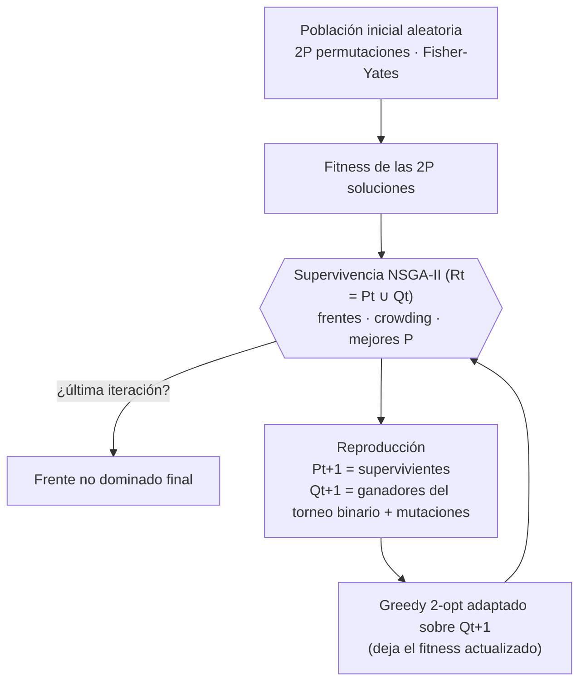

# cuda_mqap — NSGA-II + Greedy 2-opt adaptado en CUDA para el mQAP

[English](README.md) | **Español**

Implementación paralela en GPU (CUDA C++) del algoritmo evolutivo multiobjetivo **NSGA-II**,
combinado con una búsqueda local **Greedy 2-opt adaptada**, para resolver instancias del
**Problema de Asignación Cuadrática Multiobjetivo** (mQAP, *multiobjective Quadratic Assignment Problem*).

Todo el algoritmo se ejecuta en la GPU: la evaluación del fitness, la ordenación no dominada, el
[crowding distance](#g-crowding), la selección, la mutación y la búsqueda local. El host solo copia la instancia antes
del bucle y los resultados al terminar, de modo que **no sincroniza con el dispositivo dentro del
bucle**. Una generación son **3 lanzamientos de [kernel](#g-kernel) hasta P = 256**, donde la supervivencia
de cada ejecución cabe en un bloque; por encima, la supervivencia multibloque añade un [lanzamiento
cooperativo](#g-cooperative-launch) y las ordenaciones por segmentos de [CUB](#g-cub) (la biblioteca
de primitivas paralelas de NVIDIA), y son 36 lanzamientos por generación desde P = 512 hasta P =
4096 y 38 con P = 65536. Además, se ejecutan **varias ejecuciones independientes de forma
concurrente** en una sola llamada al programa.

---

## Índice

1. [Características](#características)
2. [El problema: mQAP](#el-problema-mqap)
3. [El algoritmo](#el-algoritmo)
4. [Arquitectura del proyecto](#arquitectura-del-proyecto)
5. [Diseño en GPU](#diseño-en-gpu)
6. [Requisitos](#requisitos)
7. [Compilación](#compilación)
8. [Uso](#uso)
9. [Experimentos y métricas](#experimentos-y-métricas)
10. [Pruebas y validación](#pruebas-y-validación)
11. [Rendimiento](#rendimiento)
12. [Mejoras respecto a la versión original](#mejoras-respecto-a-la-versión-original)
13. [Límites del tamaño de población y recursos de la GPU](#límites-del-tamaño-de-población-y-recursos-de-la-gpu)
14. [Conclusiones](#conclusiones)
15. [Limitaciones y trabajo futuro](#limitaciones-y-trabajo-futuro)
16. [Solución de problemas](#solución-de-problemas)
17. [Glosario](#glosario)
18. [Créditos y licencia](#créditos-y-licencia)

---

## Características

**Algoritmo**
- NSGA-II completo: ordenación no dominada rápida, crowding distance y selección
  [elitista (μ + λ)](#g-elitism).
- Selección por torneo binario, mutación por intercambio y mutación por transposición (inversión de un segmento).
- Greedy 2-opt adaptado a varios objetivos: en cada generación se elige al azar si el criterio de mejora
  es la suma de todos los objetivos o un único objetivo.
- La búsqueda local se puede limitar a una fracción de los descendientes o a una generación de cada
  N (`--greedy-rate`, `--greedy-every`), y **cada instancia usa por defecto la configuración que se
  midió mejor para ella**; ver [La mejor configuración de cada
  problema](#la-mejor-configuración-de-cada-problema).
- Instancias de 2 y 3 objetivos (flujos) y hasta 64 instalaciones. El cargador rechaza cualquier
  instancia mayor (`kMaxFacilities` en `include/config.h`), y con 3 objetivos el límite efectivo es
  63 en GPU con 64 KB de *shared memory*, porque con n = 64 las matrices de flujo y distancia de un
  bloque ya ocupan 64 KB. La supervivencia multibloque no cambia esto: solo afecta a la
  supervivencia, que no depende de n.

**Rendimiento en GPU**
- Fitness en **O(n²)** por cromosoma (un [*warp*](#g-warp) por cromosoma, con las matrices en
  [*shared memory*](#g-shared-memory)),
  en lugar de tres productos de matrices densas de O(n³).
- NSGA-II completo **en la GPU**: un bloque por ejecución hasta P = 256 (matriz de dominancia empaquetada en
  bits en *shared memory*) y una supervivencia multibloque con lanzamiento cooperativo y ordenaciones por
  segmentos (CUB) para P hasta 65536.
- Greedy 2-opt con **[evaluación incremental (delta)](#g-delta) en O(n)** de cada intercambio; la búsqueda local de
  toda la descendencia es un único kernel.
- Estados aleatorios [Philox](#g-philox) persistentes, que se inicializan una sola vez.
- **Ejecuciones independientes en paralelo** (`--runs R`) para aprovechar toda la GPU en las campañas de experimentos.

**Ingeniería**
- Separación estricta host/device: `main.cpp` no contiene código CUDA, y los kernels se exponen mediante funciones lanzadoras.
- Instancias leídas de los ficheros `.dat` en tiempo de ejecución; los parámetros se pasan por línea
  de comandos, y los que no se dan salen de la tabla de la instancia (`include/best_configuration.h`).
- Control de errores `CUDA_CHECK`/`CUDA_CHECK_KERNEL` y gestión de memoria RAII (`DeviceBuffer<T>`).
- **Plug and play en Visual Studio 2026**: clonar, abrir `cuda_mqap.slnx` y pulsar F5. La versión de CUDA,
  el toolset de C++ y las arquitecturas de GPU se adaptan a la máquina. También `CMakeLists.txt` con `ctest`.
- Batería de pruebas que compara cada kernel con una implementación independiente en CPU, y la opción
  `--verify`, que valida los resultados de cada ejecución.
- Resultados reproducibles mediante semilla (`--seed`).

---

## El problema: mQAP

Hay `n` instalaciones (*facilities*) que deben asignarse a `n` ubicaciones (*locations*). Una solución es
una permutación `p`, donde `p[i]` es la ubicación de la instalación `i`. Cada objetivo `k` tiene su propia
matriz de flujos `Fk`, y todos comparten la matriz de distancias `D`. Se minimizan simultáneamente los `m` costes:

```
cost_k(p) = Σ_i Σ_j  Fk[i][j] · D[p(i)][p(j)]          k = 1..m   (m = 2 o 3)
```

Esta expresión es equivalente a la formulación matricial `Trace(Fk · X · Dᵀ · Xᵀ)` que usaba la versión
original, donde `X` es la matriz de permutación; las pruebas verifican esa equivalencia. Como los
objetivos están en conflicto, el resultado no es una única solución sino una aproximación del **frente de
Pareto**: el conjunto de soluciones no dominadas.

### Instancias (`mQAPData/`)

Las instancias son el conjunto de pruebas del mQAP de Knowles y Corne
([página archivada](https://web.archive.org/web/2019/http://www.cs.bham.ac.uk/~jdk/mQAP/)), tomadas de la copia de
<https://github.com/fredizzimo/keyboardlayout/tree/master/tests/mQAPData>. Son datos de terceros, no cubiertos
por la licencia de este proyecto: ver [Datos de terceros](#datos-de-terceros).

| Fichero | Contenido |
|---|---|
| `KC<n>-<m>fl-<tipo>.dat` | Cabecera (`facilities = 10 objectives = 2 …` o `facilities: 10 objectives: 2 …`), la matriz de distancias `n×n` y `m` matrices de flujo `n×n` |
| `KC10-2fl-*.PO` | Frente de Pareto óptimo publicado: en cada línea, una permutación en base 1 y sus `m` costes |

`rl` son instancias con distancias y flujos del tipo *real-like*, y `uni` con valores uniformes.
Hay 23 instancias con n = 10, 20 y 30, y los frentes óptimos de las 8 instancias KC10.

---

## El algoritmo


```mermaid
flowchart TD
    A[Población inicial aleatoria<br/>2P permutaciones · Fisher-Yates] --> B[Fitness de las 2P soluciones]
    B --> C{{"Supervivencia NSGA-II (Rt = Pt ∪ Qt)<br/>frentes · crowding · mejores P"}}
    C -->|¿última iteración?| Z[Frente no dominado final]
    C --> D["Reproducción<br/>Pt+1 = supervivientes<br/>Qt+1 = ganadores del torneo binario + mutaciones"]
    D --> E["Greedy 2-opt adaptado sobre Qt+1<br/>(deja el fitness actualizado)"]
    E --> C
```

Cada generación hace lo siguiente:

1. **Supervivencia NSGA-II** sobre las `2P` soluciones de `Rt = Pt ∪ Qt`:
   - *Ordenación no dominada*: [rango](#g-rank) 1 para el primer
     [frente de Pareto](#g-pareto-front), rango 2 para el siguiente, etc.
   - *Crowding distance* de cada frente. Para cada objetivo se ordenan los miembros del frente; los
     extremos reciben ∞ y los puntos interiores suman `(f[siguiente] − f[anterior]) / (máx − mín)`,
     con el máximo y el mínimo calculados sobre toda la población.
   - Se seleccionan las `P` mejores soluciones por (rango ascendente, crowding descendente).
2. **Reproducción**. Las `P` supervivientes forman `Pt+1`. Para cada una se celebra un **torneo binario**
   contra otra superviviente elegida al azar: gana el rango menor y, en caso de empate, el mayor crowding.
   El ganador se copia y se muta:
   - **Mutación por intercambio**: se intercambian dos genes al azar; se aplica 2 veces.
   - **Mutación por transposición**: se invierte el segmento comprendido entre dos posiciones aleatorias.
3. **[Greedy 2-opt](#g-greedy-2opt) adaptado** sobre los descendientes que indique la configuración
   —todos salvo que `--greedy-rate` o `--greedy-every` digan otra cosa. Los pares de posiciones se
   recorren en el orden de la versión original —`r` en `[0, n−2]`, `s` en `[1, n−1]`, saltando
   `r == s`, así que casi todos los pares se visitan en los dos órdenes— y se conserva el
   intercambio si no empeora el criterio de la generación, elegido al azar para cada ejecución y
   generación: la suma de todos los objetivos o un único objetivo `k`. Volver a visitar un par
   después de aceptar un intercambio puede mejorarlo otra vez, y eso es lo que hace que la calidad
   iguale a la de la versión original; ver [Calidad frente al Greedy 2-opt
   original](#quality-vs-original). La idea de adaptar el criterio proviene de
   <https://arxiv.org/ftp/arxiv/papers/1109/1109.1276.pdf>.

Parámetros:

| Parámetro | Dónde | Valor por defecto |
|---|---|---|
| Tamaño de población `P` | `--population` | la de la instancia, o 64 (potencia de 2 entre 16 y 65536) |
| Generaciones | `--iterations` | las de la instancia, o 70 |
| Fracción de descendientes con búsqueda local | `--greedy-rate` | la de la instancia, o 1.0 |
| Generaciones entre búsquedas locales | `--greedy-every` | la de la instancia, o 1 |
| Ejecuciones independientes | `--runs` | 1 |
| Semilla | `--seed` | aleatoria (se imprime) |
| Mutaciones por intercambio por hijo | `include/config.h` (`kExchangeMutations`) | 2 |
| Probabilidad de intercambio / transposición | `include/config.h` | 1.0 / 1.0 |
| Recorrido de pares del greedy 2-opt | `include/config.h` (`kGreedyFullPairs`) | `true`: el de la versión original, `(n−1) + (n−2)²` intentos |

---

## Arquitectura del proyecto

```
cuda_mqap/
├── include/
│   ├── best_configuration.h  Configuración medida como mejor de cada instancia, que usa por defecto
│   ├── config.h            Límites (n, P, objetivos) y parámetros de los operadores
│   ├── cuda_check.cuh      CUDA_CHECK / CUDA_CHECK_KERNEL
│   ├── device_buffer.cuh   DeviceBuffer<T>: memoria de GPU con RAII
│   ├── device_common.cuh   Funciones __device__ compartidas (coste por warp, delta del greedy 2-opt, bitonic sort)
│   ├── instance.h          Struct Instance, loadInstance(), cost() de referencia en CPU
│   ├── kernels.cuh         Declaración de los lanzadores de kernels y del layout de memoria
│   ├── solver.h            SolverOptions, Solution, RunResult, solve()
│   └── survival_workspace.cuh   Búferes de la supervivencia multibloque (se reservan una vez)
├── src/
│   ├── main.cpp            Línea de comandos, fichero de resultados y --verify (solo host)
│   ├── instance.cpp        Parser de los ficheros .dat y validación (incluido el desbordamiento del fitness)
│   ├── solver.cu           Orquestación en el host: reservas, bucle de generaciones y recogida de resultados
│   ├── fitness.cu          Kernel de fitness
│   ├── nsga2.cu            Kernel de supervivencia NSGA-II (un bloque por ejecución, P ≤ 256)
│   ├── nsga2_multiblock.cu Supervivencia NSGA-II repartida en varios bloques (P > 256)
│   ├── operators.cu        RNG, población inicial, torneo y mutaciones
│   └── local_search.cu     Kernel Greedy 2-opt
├── tests/test_kernels.cu   Pruebas de cada kernel contra referencias en CPU
├── scripts/run_experiments.ps1   Campaña de experimentos con los parámetros de cada instancia
├── scripts/run_convergence.ps1   Trazas de cada generación y su análisis (ver más abajo)
├── scripts/analyze_convergence.py   Hipervolumen, estancamiento y cobertura del frente óptimo
├── scripts/run_original_comparison.ps1   Comparación con la versión original, varias ejecuciones
├── scripts/prepare_original.py   Árbol de compilación de la versión original para una instancia
├── scripts/compare_versions.py   Hipervolumen, cobertura y Mann-Whitney entre dos versiones
├── scripts/run_rate_grid.ps1     Rejilla de población x configuración del greedy, por instancia
├── scripts/analyze_rate_grid.py  Puntúa las celdas de la rejilla y da la mejor configuración
├── scripts/build_reference.py    Construye el mejor frente conocido de una instancia (.KBP)
├── mQAPData/               Instancias (.dat) y frentes óptimos (.PO)
├── reference/v0.x/         Mejores frentes conocidos (.KBP) por versión, con su summary.json
├── mQAPMetrics/            Scripts Node.js de métricas y gráficos 3D
├── comparative_results_kcX_datasets.xlsx   Resultados comparativos
├── cuda_mqap.slnx, cuda_mqap.vcxproj, test_kernels.vcxproj   Solución y proyectos de Visual Studio
├── cuda_mqap.props, cuda_toolkit.props   Configuración común y detección de la versión de CUDA
├── .vsconfig, .gitattributes             Componentes de Visual Studio y finales de línea
└── CMakeLists.txt
```

**Separación host/device.** El programa se organiza en tres capas:

| Capa | Ficheros | Responsabilidad |
|---|---|---|
| Aplicación (host) | `main.cpp`, `instance.cpp` | Argumentos, lectura de la instancia, escritura de resultados y verificación en CPU |
| Orquestación (host) | `solver.cu` | Reserva de toda la memoria una sola vez, secuencia de lanzamientos y copia final de resultados |
| Kernels (device) | `fitness.cu`, `nsga2.cu`, `operators.cu`, `local_search.cu` | Kernels `template<int OBJ>` (instanciados para 2 y 3 objetivos) y sus lanzadores |

Los kernels viven en el espacio de nombres `mqap::detail`. Fuera de su `.cu` solo se ven los lanzadores
declarados en `kernels.cuh` (`launchFitness`, `launchSurvival`, `launchReproduce`, `launchGreedy2Opt`…),
y cada uno comprueba el lanzamiento con `CUDA_CHECK_KERNEL()`.

---

## Diseño en GPU

### Layout de memoria

Para `R` ejecuciones, población `P`, `n` instalaciones y `OBJ` objetivos:

| Buffer | Tipo y forma | Descripción |
|---|---|---|
| `genes` (×2, doble búfer) | `short [R][2P][n]` | Filas `[0, P)`: supervivientes; filas `[P, 2P)`: descendencia |
| `fitness` (×2) | `unsigned int [R][2P][OBJ]` | Coste de cada objetivo |
| `survivorIndex / Rank / Crowding` | `[R][P]` | Resultado de la supervivencia, ordenado por (rango, −crowding) |
| `rng` | `curandStatePhilox4_32_10_t [R][2P]` | Estados aleatorios persistentes |
| `flow`, `dist` | `int [OBJ][n][n]`, `int [n][n]` | Matrices de la instancia |

Toda la memoria se reserva **una vez** con `DeviceBuffer<T>` y se libera automáticamente. Entre
generaciones solo se intercambian los punteros del doble búfer.

### Kernels

| Kernel | Grid × bloque | Paralelismo | Técnicas |
|---|---|---|---|
| `fitnessKernel<OBJ>` | `(⌈2P/4⌉, R)` × 128 | 1 warp por cromosoma | `F` y `D` en *shared memory* (carga coalescente); lecturas de `F` consecutivas por carril (sin conflictos de banco); reducción con `__shfl_down_sync` |
| `survivalKernel<OBJ>` (P ≤ 256) | `R` × `2P` | 1 bloque por ejecución, 1 hilo por individuo | Dominancia en bits (`2P × 2P/32` palabras), frentes con `__ballot_sync` + `__popc`, bitonic sort de claves de 64 bits `(rango, fitness)` y `(rango, −crowding)` en *shared memory* |
| `reproduceKernel<OBJ>` | `(⌈P/128⌉, R)` × 128 | 1 hilo por descendiente | Estado Philox en registros; torneo, mutaciones y copia en un solo paso |
| `greedy2OptKernel<OBJ>` | `(⌈P/4⌉, R)` × 128 | 1 warp por descendiente | Matrices en *shared memory*; delta O(n) repartido entre los 32 carriles; criterio uniforme en el warp (sin divergencia) |
| `initPopulationKernel` | `(⌈2P/128⌉, R)` × 128 | 1 hilo por cromosoma | Fisher-Yates sin sesgo |
| `rngInitKernel` | `⌈R·2P/128⌉` × 128 | 1 hilo por estado | Una subsecuencia Philox independiente por hilo |
| Supervivencia multibloque (P > 256) | `(⌈2P/256⌉, R)` × 256, más un lanzamiento cooperativo | 1 hilo por individuo en toda la malla | Conteo de dominadores con teselas de fitness en *shared memory*, pelado de frentes con `grid.sync()`, crowding y selección con ordenaciones por segmentos (CUB) |

*Shared memory* por bloque:
- **Fitness y greedy 2-opt:** `(OBJ + 1)·n²·4 + 4·n·2` bytes, por ejemplo 14,6 KB para n = 30 y 3 objetivos.
  Si hace falta más de 48 KB se solicita automáticamente el máximo *opt-in* del dispositivo
  (`cudaFuncAttributeMaxDynamicSharedMemorySize`), lo que permite n = 63 con 3 objetivos en Turing,
  cuyo máximo *opt-in* es de 64 KB: n = 63 necesita 64.008 bytes y n = 64 necesita 66.048, que el
  cargador rechaza.
- **Supervivencia:** hasta 46 KB con P = 256 (camino de un bloque; 47.168 bytes con 3 objetivos). El camino multibloque (P > 256) solo usa
  teselas de fitness de unos 3 KB; ver [Límites del tamaño de población](#límites-del-tamaño-de-población-y-recursos-de-la-gpu).

### Evaluación incremental del greedy 2-opt

Intercambiar las posiciones `r` y `s` de `p` solo modifica los términos del coste en los que aparecen `r` o `s`:

```
Δ(r,s) = (F_rr − F_ss)(D_{ps ps} − D_{pr pr}) + (F_rs − F_sr)(D_{ps pr} − D_{pr ps})
       + Σ_{k≠r,s} [ (F_kr − F_ks)(D_{pk ps} − D_{pk pr}) + (F_rk − F_sk)(D_{ps pk} − D_{pr pk}) ]
```

Cada carril del warp calcula una parte del sumatorio y el resultado se reduce con `__shfl_down_sync`.
Así, cada una de las `(n−1) + (n−2)²` evaluaciones del recorrido (343 con n = 20) cuesta O(n) en lugar
de recalcular el fitness completo.
Los acumuladores son de 64 bits.

### Sincronización

- Todos los kernels se lanzan en el *default stream*, que ya garantiza el orden entre ellos, así que no se
  usa `cudaDeviceSynchronize` durante la ejecución.
- El host solo espera al final (`cudaEventSynchronize`), para medir el tiempo y copiar los resultados.
- Dentro de los kernels, `__syncthreads()` solo separa fases que comparten *shared memory*, y `__syncwarp()`
  hace visible a todo el warp el intercambio aplicado en el greedy 2-opt.
- La supervivencia multibloque (P > 256) pela los frentes de Pareto con un **lanzamiento cooperativo**:
  toda la malla se sincroniza con `grid.sync()` entre las fases de cada frente, dentro del kernel, sin
  volver al host.
- `--trace` es la excepción: copia los supervivientes una vez por generación, así que una ejecución con
  traza sí sincroniza con el dispositivo y su tiempo no es comparable con el de una normal.
- En Debug, `MQAP_SYNC_CHECK` hace que `CUDA_CHECK_KERNEL()` sincronice después de cada kernel, de modo
  que un error de ejecución se reporta en el lanzamiento que lo causó.

---

## Requisitos

- GPU NVIDIA con *compute capability* ≥ 7.5 (GeForce RTX 20xx o posterior) y un driver actualizado.
- **Visual Studio 2026** con la carga de trabajo *Desarrollo para el escritorio con C++*. Al abrir la
  solución, Visual Studio lee `.vsconfig` y ofrece instalar los componentes que falten.
- **CUDA Toolkit 12.x o 13.x** (≥ 11.8), instalado **después** de Visual Studio para que se añada su
  *Visual Studio Integration*. El proyecto detecta automáticamente la versión instalada; se desarrolló
  con CUDA 13.4.
- Alternativa sin el IDE: CMake ≥ 3.24 + Ninja (incluidos con Visual Studio).

---

## Compilación

### Abrir en Visual Studio 2026 (plug and play)

```
git clone https://github.com/apupiales/cuda_mqap.git
cd cuda_mqap
git checkout develop_large_population_multiblock
start cuda_mqap.slnx
```

1. Visual Studio abre la solución con sus dos proyectos: `cuda_mqap` (el programa, proyecto de inicio) y
   `test_kernels` (las pruebas).
2. Selecciona `Release | x64` y pulsa **F5** (o Ctrl+F5). El programa se ejecuta con
   `mQAPData\KC10-2fl-1rl.dat --verify`, usando la raíz del repositorio como directorio de trabajo. Los
   argumentos se cambian en *Proyecto → Propiedades → Depuración*.
3. Para ejecutar las pruebas: clic derecho en `test_kernels` → *Establecer como proyecto de inicio* → Ctrl+F5.
4. Los ejecutables se generan en `build\x64\<Configuración>\`.

Nada depende de la máquina donde se creó el proyecto:

| Qué | Cómo se adapta |
|---|---|
| Versión de CUDA | `cuda_toolkit.props` la toma de `CUDA_PATH` (p. ej. `...\CUDA\v12.6` → `CUDA 12.6.props`). Para usar otra versión instalada: `set CudaVersion=12.6` antes de abrir VS, o `msbuild /p:CudaVersion=12.6` |
| Falta la integración de CUDA | La compilación se detiene con un mensaje que explica cómo arreglarlo (en lugar de "tipo de elemento CudaCompile desconocido") |
| Toolset de C++ | `$(DefaultPlatformToolset)` del Visual Studio que lo abre (v145 en VS 2026); SDK de Windows `10.0` (el más reciente instalado) |
| GPU | Código nativo para `sm_75`, `sm_80`, `sm_86` y `sm_89`, más el PTX que el driver compila para GPUs más nuevas (RTX 50xx) |
| Rutas | Todas relativas al repositorio (`$(MSBuildThisFileDirectory)`); salidas en `build\` (ignorado por git) |
| Finales de línea | `.gitattributes` mantiene CRLF en los ficheros de Visual Studio |

La configuración común está en `cuda_mqap.props`: C++17, `/W4`, `-lineinfo` en Release, y `-G` más
`MQAP_SYNC_CHECK` en Debug.

### CMake

```
cmake -S . -B build/cmake -G Ninja -DCMAKE_BUILD_TYPE=Release
cmake --build build/cmake
ctest --test-dir build/cmake --output-on-failure
```

Por defecto compila `sm_75`, `sm_80`, `sm_86` y `sm_89` más PTX; para compilar solo para tu GPU usa
`-DCMAKE_CUDA_ARCHITECTURES=native`. En Visual Studio también sirve *Archivo → Abrir → Carpeta*.

### nvcc directo

Desde una consola *x64 Native Tools*:

```
nvcc -O3 -arch=sm_75 -std=c++17 -Iinclude src\main.cpp src\instance.cpp src\solver.cu src\fitness.cu ^
     src\nsga2.cu src\nsga2_multiblock.cu src\operators.cu src\local_search.cu -o cuda_mqap.exe
```

---

## Uso

Sin opciones, la población, las generaciones y los ajustes del greedy 2-opt son los que se midieron
mejores para la instancia ([La mejor configuración de cada
problema](#la-mejor-configuración-de-cada-problema)); cada opción que se dé manda sobre ellos.

```
cuda_mqap <instance.dat> [opciones]
  --population P   tamaño de población, potencia de 2 en [16, 65536] (defecto: el de la instancia, o 64)
  --iterations N   generaciones (defecto: las de la instancia, o 70)
  --greedy-rate R  fracción de los descendientes que mejora el greedy 2-opt, en [0, 1]
  --greedy-every K la búsqueda local se aplica cada K generaciones (defecto: el de la instancia, o 1)
  --untuned        ignora la tabla de la instancia: población 64, 70 generaciones, greedy al 100 %
  --runs R         ejecuciones independientes concurrentes (defecto 1)
  --seed S         semilla (defecto: aleatoria, se imprime en la salida)
  --output FILE    fichero de resultados, en modo append (defecto result_<instancia>_nsga2_greedy_2opt.txt)
  --trace FILE     escribe el frente de cada generacion en FILE (CSV, se sobrescribe)
  --trace-max N    puntos guardados por ejecucion y generacion en la traza (defecto 4096)
  --trace-every K  guarda el frente cada K generaciones, mas la ultima (defecto 1)
  --verify         verifica las poblaciones finales en CPU
  --quiet          no imprime las soluciones finales
```

Ejemplos:

```
:: Con la configuración medida mejor para la instancia
build\x64\Release\cuda_mqap.exe mQAPData\KC10-2fl-1rl.dat --verify

:: Con la configuración genérica, P = 64 y 70 generaciones
build\x64\Release\cuda_mqap.exe mQAPData\KC10-2fl-1rl.dat --untuned --verify

:: 30 ejecuciones independientes en paralelo, reproducibles
build\x64\Release\cuda_mqap.exe mQAPData\KC20-2fl-1rl.dat --runs 30 --seed 2026 --quiet

:: Instancia de 3 objetivos con una población pequeña
build\x64\Release\cuda_mqap.exe mQAPData\KC30-3fl-1rl.dat --population 32 --runs 10
```

Salida por consola de la segunda, la genérica, que es la que cabe en unas líneas:

```
Instance KC10-2fl-1rl: n = 10, objectives = 2 | population = 64, iterations = 70, runs = 1, seed = 42
Greedy 2-opt on 100 % of the offspring | --untuned: generic defaults

FINAL SOLUTION (run 0, 37 non-dominated)
5 1 3 4 0 6 2 8 7 9 1665490 5884156
0 3 6 1 9 4 8 7 5 2 5925064 2282788
5 0 6 3 1 2 8 9 7 4 1874454 4641012
...
Verification: OK

Results appended to result_KC10-2fl-1rl_nsga2_greedy_2opt.txt
Time Spent: 0.112270 s (GPU 12.258 ms)
```

### La ejecución por defecto de cada instancia

Sin ninguna opción, el programa toma la configuración medida como mejor para la instancia, así que
la llamada es solo el fichero de la instancia:

```
build\x64\Release\cuda_mqap.exe mQAPData\KC10-2fl-1rl.dat
```

La segunda columna de la tabla es el comando equivalente escrito entero. Da exactamente la misma
ejecución —comprobado byte a byte en KC10-2fl-1uni, KC10-2fl-2rl y KC10-2fl-2uni— y, al llevar
`--untuned`, no depende de la tabla: seguirá significando lo mismo aunque la tabla cambie. A
cualquiera de las dos formas se le añaden luego las opciones de siempre, `--runs`, `--seed`,
`--verify`, `--output`:

| Instancia | Opciones equivalentes |
|---|---|
| KC10-2fl-1rl | `--population 16384 --iterations 70 --greedy-rate 0.5 --untuned` |
| KC10-2fl-1uni | `--population 1024 --iterations 70 --greedy-rate 0.25 --untuned` |
| KC10-2fl-2rl | `--population 1024 --iterations 70 --greedy-rate 0.1 --untuned` |
| KC10-2fl-2uni | `--population 256 --iterations 70 --greedy-rate 0.1 --untuned` |
| KC10-2fl-3rl | `--population 16384 --iterations 70 --greedy-rate 0.1 --untuned` |
| KC10-2fl-3uni | `--population 65536 --iterations 70 --greedy-rate 0.1 --untuned` |
| KC10-2fl-4rl | `--population 16384 --iterations 70 --greedy-rate 0.1 --untuned` |
| KC10-2fl-5rl | `--population 16384 --iterations 70 --greedy-rate 0.1 --untuned` |
| KC20-2fl-1rl | `--population 65536 --iterations 300 --greedy-rate 0.25 --untuned` |
| KC20-2fl-1uni | `--population 65536 --iterations 300 --greedy-rate 1.0 --greedy-every 2 --untuned` |
| KC20-2fl-2rl | `--population 65536 --iterations 300 --greedy-rate 0.25 --untuned` |
| KC20-2fl-2uni | `--population 65536 --iterations 300 --greedy-rate 0.1 --untuned` |
| KC20-2fl-3rl | `--population 65536 --iterations 300 --greedy-rate 0.25 --untuned` |
| KC20-2fl-3uni | `--population 65536 --iterations 300 --greedy-rate 1.0 --untuned` |
| KC20-2fl-4rl | `--population 65536 --iterations 300 --greedy-rate 0.1 --untuned` |
| KC20-2fl-5rl | `--population 65536 --iterations 300 --greedy-rate 0.25 --untuned` |
| KC30-2fl-1rl | `--population 65536 --iterations 300 --greedy-rate 0.5 --untuned` |
| KC30-3fl-1rl | `--population 65536 --iterations 300 --greedy-rate 1.0 --untuned` |
| KC30-3fl-1uni | `--population 65536 --iterations 300 --greedy-rate 1.0 --untuned` |
| KC30-3fl-2rl | `--population 65536 --iterations 300 --greedy-rate 1.0 --untuned` |
| KC30-3fl-2uni | `--population 65536 --iterations 300 --greedy-rate 1.0 --untuned` |
| KC30-3fl-3rl | `--population 65536 --iterations 300 --greedy-rate 1.0 --untuned` |
| KC30-3fl-3uni | `--population 65536 --iterations 300 --greedy-rate 1.0 --untuned` |

Conviene saber lo que cuesta: en 15 de las 23 instancias la mejor configuración es el tope de
población con 300 generaciones, así que una llamada sin opciones es de minutos de GPU, no de
segundos. Con `--untuned` a secas se vuelve a la configuración genérica —población 64, 70
generaciones, greedy al 100 %—, que es la que usan los scripts de medición del repositorio.

Las instancias que no están en la tabla usan también esa configuración genérica, y el programa lo
dice al empezar, en la línea que sigue a la de la instancia.

### Fichero de resultados

Mantiene el formato original, así que los scripts de `mQAPMetrics` siguen funcionando. Cada ejecución
añade un bloque con las soluciones no dominadas (rango 1) de la población final: la clave es la
permutación y el valor, sus costes.

```
{
'0361948752': [5925064, 2282788],
'5134062879': [1665490, 5884156],
'5163028974': [1869616, 4670952],
},
```

La población final suele contener la misma solución muchas veces, porque converge y los supervivientes
son copias unos de otros. **El frente se escribe sin repeticiones:** cada solución no dominada distinta
aparece una vez, en el orden que le da NSGA-II. La población completa, con sus repeticiones, es la que
comprueba `--verify` y la que constituye la población final de la ejecución.

### Verificación (`--verify`)

Recalcula en CPU, de forma independiente, cada solución de la población final de cada ejecución:
- que la permutación sea válida;
- que el fitness coincida exactamente con `cost()` en CPU;
- que el rango 1 corresponda exactamente a las soluciones no dominadas (y que toda solución con rango > 1
  esté dominada por alguna superviviente).

Si algo falla, el código de salida es 1.

---

## Experimentos y métricas

`scripts/run_experiments.ps1` ejecuta la campaña de `comparative_results_kcX_datasets.xlsx` con la
población y las iteraciones que usaba cada instancia en la versión original:

```
.\scripts\run_experiments.ps1 -Runs 30                              # todas las instancias
.\scripts\run_experiments.ps1 -Runs 10 -Seed 2026 -Instances KC10-2fl-1rl,KC30-3fl-1rl
```

### Cuántas generaciones necesita cada instancia (`--trace`)

`--trace FICHERO` escribe un CSV con `run,generation,f1,f2[,f3]`: las soluciones no dominadas distintas
de **cada** generación de cada ejecución, desde la supervivencia de la población inicial (generación 0)
hasta el frente final. Copia los supervivientes al host una vez por generación, así que sincroniza con el
dispositivo y **el tiempo de una ejecución con traza no es comparable** con el de una normal; la copia es
despreciable frente a una generación con población grande, y se nota con población pequeña.

`scripts/run_convergence.ps1` graba las trazas y las analiza con `scripts/analyze_convergence.py`, que
informa, por instancia:

| Indicador | Significado |
|---|---|
| `t_stall` | Primera generación tras la cual el [hipervolumen](#g-hypervolume) crece menos de `--epsilon` (relativo) durante `--patience` generaciones. La supervivencia es elitista, así que el hipervolumen solo puede crecer: una curva plana es estancamiento real, no ruido |
| `t_final` | Primera generación cuyo frente ya es igual al último. No necesita datos de referencia y dice cuándo deja de encontrarse algo nuevo |
| `t_optimum` | Primera generación que cubre el frente `.PO` publicado. Solo lo tienen las instancias KC10 |
| `coverage` | [Fracción del frente óptimo](#g-coverage) encontrada al final |

El punto de referencia del hipervolumen es fijo para todo el fichero (la esquina peor de la generación 0),
de modo que las generaciones y las ejecuciones son comparables entre sí. Los tres números de generación son
variables aleatorias —cada ejecución estanca en un punto distinto—, así que el resumen da la mediana y el
percentil 90 sobre las ejecuciones, nunca un único valor.

```
.\scripts\run_convergence.ps1 -Population 1024 -Iterations 200 -Runs 30
.\scripts\run_convergence.ps1 -Population 4096 -Iterations 300 -Instances KC10-2fl-1rl
python scripts\analyze_convergence.py results\convergence\*.csv --patience 30 --epsilon 1e-5
```

`--iterations` tiene que estar claramente por encima del estancamiento esperado o la medición informará
del tope en su lugar; el análisis avisa cuando una ejecución sigue mejorando en la última generación. Las
curvas por generación se escriben en `results/convergence/curves/<instancia>_curve.csv` (hipervolumen
mediano, su fracción del valor final y el tamaño mediano del frente), listas para graficar.

El número de generaciones depende mucho de la población, así que la respuesta útil es el coste total: el
tiempo de una generación se conoce para cada P (ver [Rendimiento](#rendimiento)), de modo que
`generaciones × tiempo por generación` indica qué pareja (P, generaciones) alcanza antes el objetivo.

#### Resultados de la campaña (RTX 2060, 2026-09-26)

Tres poblaciones por instancia: P = 1024 con tope de 2000 generaciones (30 ejecuciones en las
instancias de 2 objetivos, 10 en las de 3), y P = 16384 y P = 65536 con el tope que cada instancia
necesitó, desde 300 generaciones en KC10 hasta 100 000 en KC30-3fl-1rl, KC30-3fl-1uni y
KC30-3fl-2uni.

Todo está medido en la misma escala, y llegar a eso exigió dos decisiones que conviene declarar:

- **La calidad es una fracción de un [frente de referencia](#g-reference-front), no de la propia
  ejecución.** En KC10 ese frente es el óptimo publicado, así que la cifra es la fracción del
  hipervolumen óptimo. En KC20 y KC30 no hay óptimo publicado, de modo que la referencia es el mejor
  frente que conoce la campaña: la unión no dominada de los frentes finales de todas las ejecuciones
  y todas las poblaciones. Normalizar cada ejecución contra su propia última generación hace
  aparecer un 100 % por construcción y esconde la diferencia entre poblaciones.
- **La prueba de estancamiento usa la misma ventana en todas partes** (`--hv-window`): 20
  generaciones en KC10 y KC20, 50 en KC30. Con cada fichero eligiendo su ventana según el coste, las
  instancias de 3 objetivos parecían estancarse mucho antes de lo que dicen sus trazas, y la mayor
  parte de esa diferencia era la ventana, no el algoritmo.

**Generaciones hasta que el frente deja de cambiar.** Es el número que hay que usar para elegir
`--iterations`. Cada celda da la mediana y el percentil 90 entre las ejecuciones, porque lo que un
presupuesto tiene que cubrir es la ejecución más lenta. Un «> N» quiere decir que con un tope de N
generaciones el frente seguía cambiando, de modo que ahí la cifra es el presupuesto y no la
medición; el tope se subió hasta que dejó de serlo donde fue asequible. Una «†» marca que el
percentil 90 llegó al tope aunque la mediana no: ahí la ejecución más lenta seguía cambiando.

| Instancia | P = 1024 | P = 16 384 | P = 65 536 |
|---|---|---|---|
| KC10-2fl-2uni | 1 | 1 | 5 |
| KC10-2fl-1uni | 19 · 42 | 4,5 · 6,1 | 10 · 13 |
| KC20-2fl-2uni | 80,5 · 1030,8 | 23,5 · 414,4 | 15 · 23 |
| KC10-2fl-2rl | 86 · 283,5 | 5,5 · 14,2 | 10 · 15 |
| KC10-2fl-1rl | 148 · 256,8 | 6 · 11,6 | 10 · 15 |
| KC10-2fl-5rl | 495 · 1471,5 | 12,5 · 159,4 | 20 · 83 |
| KC10-2fl-3rl | 816,5 · 1582,1 | 70 · 121,0 | 65 · 217 |
| KC10-2fl-4rl | 1301,5 · 1794,4 | 98,5 · 257,7 | 35 · 268 |
| KC10-2fl-3uni | 1333 · 1765,7 | 131,5 · 194,6 | 50 · 147 |
| KC20-2fl-1rl | 1552,5 · 1919,3 † | 2157 · 2870 † | 1325 · 1859 |
| KC20-2fl-1uni | 1851 · 1940,3 † | 2302 · 2731,4 | 700 · 900 |
| KC20-2fl-3uni | > 2000 | 93 050 · 98 045 † | 8950 · 9388 |
| KC30-3fl-2uni | > 2000 | > 5000 | > 100 000 |
| KC30-3fl-1uni | > 2000 | > 5000 | > 100 000 |
| KC30-3fl-1rl | > 2000 | > 5000 | > 100 000 |

**Calidad alcanzada.** Cada celda tiene dos números medidos contra el mismo frente de referencia,
[`reference/v0.1`](#reference-versions), de modo que las tres columnas se pueden leer una al lado de
otra:

- El **primero es el [hipervolumen](#g-hypervolume)** del frente con el que terminó la ejecución,
  como fracción del que domina el frente de referencia. Responde a "cuánto de la región interesante
  del espacio de objetivos cubre este frente", y se satura enseguida: un puñado de soluciones bien
  situadas ya captura la mayor parte del volumen.
- El **segundo es la [cobertura](#g-coverage)**: cuántos puntos del frente de referencia encontró
  realmente la ejecución, en fracción. Responde a "cuántos compromisos distintos ofrece este
  frente", y es lo que separa a las configuraciones.

KC30-3fl-2uni lo hace evidente. Su frente de referencia tiene 821 puntos en `v0.1`: con P = 1024 la ejecución
domina el 92,54 % de su volumen habiendo encontrado el 9,5 % de sus puntos, unos 78, y con P = 65536
domina el 99,52 % habiendo encontrado el 76,8 %, unos 630. Casi el mismo volumen, muchas más
soluciones entre las que elegir.

| Instancia | P = 1024 | P = 16 384 | P = 65 536 |
|---|---|---|---|
| KC10-2fl-2rl | 100 % · 100 % | 100 % · 100 % | 100 % · 100 % |
| KC10-2fl-2uni | 100 % · 100 % | 100 % · 100 % | 100 % · 100 % |
| KC10-2fl-1rl | 99,90 % · 74,1 % | 99,90 % · 74,3 % | 99,90 % · 76,2 % |
| KC20-2fl-1rl | 99,88 % · 87,6 % | 99,95 % · 95,0 % | 99,99 % · 95,8 % |
| KC10-2fl-1uni | 99,84 % · 84,6 % | 99,84 % · 84,6 % | 99,84 % · 84,6 % |
| KC10-2fl-3uni | 99,80 % · 71,3 % | 99,80 % · 72,0 % | 99,80 % · 72,8 % |
| KC10-2fl-5rl | 99,80 % · 52,6 % | 99,80 % · 53,5 % | 99,81 % · 54,7 % |
| KC20-2fl-1uni | 99,79 % · 75,8 % | 99,99 % · 97,5 % | 99,98 % · 98,0 % |
| KC20-2fl-3uni | 99,49 % · 54,2 % | 99,99 % · 97,2 % | 99,98 % · 94,2 % |
| KC10-2fl-4rl | 99,36 % · 45,6 % | 99,36 % · 46,2 % | 99,38 % · 49,1 % |
| KC20-2fl-2uni | 99,31 % · 70,4 % | 99,93 % · 92,5 % | 100 % · 100 % |
| KC10-2fl-3rl | 99,15 % · 54,5 % | 99,15 % · 55,1 % | 99,19 % · 57,1 % |
| KC30-3fl-1rl | 95,97 % · 1,3 % | 98,42 % · 28,3 % | 99,70 % · 74,3 % |
| KC30-3fl-2uni | 92,54 % · 9,5 % | 97,56 % · 43,3 % | 99,52 % · 76,8 % |
| KC30-3fl-1uni | 91,22 % · 2,0 % | 96,81 % · 23,4 % | 99,03 % · 61,3 % |

Lo que dice la campaña:

- **El hipervolumen apenas separa las instancias de 2 objetivos.** Todas las configuraciones de KC10
  y KC20 quedan entre el 99,15 % y el 100 % de su referencia, y en KC10 esa referencia es el óptimo
  publicado: el frente encontrado domina prácticamente el mismo volumen que el óptimo incluso con
  P = 1024.
- **Lo que sí las separa es cuántas soluciones de ese frente encuentran.** En KC20-2fl-3uni se pasa
  del 54,2 % de los puntos de referencia con P = 1024 al 94,2 % con P = 65536, y en KC30-3fl-1rl del
  1,3 % al 74,3 %. Una población pequeña devuelve un frente que vale casi lo mismo en volumen con
  muchas menos soluciones distintas.
- **Más población necesita menos generaciones**: la mediana de KC10-2fl-4rl pasa de 1301,5
  generaciones a 35. Una generación no es una cantidad fija de trabajo —con P = 65536 evalúa 64
  veces más descendientes que con P = 1024—, así que esto no dice nada del tiempo total: en
  KC10-2fl-1rl una generación cuesta 0,82 ms por ejecución con P = 1024 y 105 ms con P = 65536.
- **En KC10 hay un techo que no rompe ni la población ni las generaciones**: KC10-2fl-1uni se queda
  en el 84,6 % de los puntos óptimos publicados con las tres poblaciones. Lo que queda es el
  algoritmo: esta combinación de NSGA-II con el greedy 2-opt converge a un subconjunto del frente
  óptimo.
- **Las instancias de 3 objetivos no paran nunca**: KC30-3fl-1rl seguía mejorando en la generación
  100 000 con P = 65536, habiendo alcanzado el 99,70 % del hipervolumen de referencia. Pasar de 5000
  a 100 000 generaciones añadió 0,21 puntos, medidos sobre las curvas de la traza. Ahí el número de
  generaciones es una decisión de presupuesto, no una medición.

<a id="reference-versions"></a>

**Los frentes de referencia están en el repositorio, por versiones**, para poder comprobar los porcentajes
y graficar o comparar los frentes. En KC10 es el óptimo publicado, `mQAPData/<instancia>.PO`, datos de
terceros que no se modifican nunca. En KC20 y KC30 es el mejor frente que conoce este proyecto, escrito
como fichero `.KBP` con el mismo formato que un `.PO` —una permutación en base 1 y sus costes por línea— y
guardado en `reference/<versión>/`, un directorio por versión.

**Cada tabla de este documento dice contra qué versión está medida**, y el párrafo que sigue a la
tabla recoge cuál usa cada una. Una solución que ningún frente de una versión domina se añade siempre, y eso no invalida lo
publicado contra una versión anterior: significa que el mejor frente conocido ha mejorado. Una versión
publicada no se edita; lo que se añade crea el directorio siguiente. La regla y el comando están en
[`reference/README.md`](reference/README.md).

| Instancia | Frente de referencia | `v0.1` | `v0.2` | `v0.3` |
|---|---|---|---|---|
| KC10-2fl-* | óptimo publicado | 1 a 130, en [`mQAPData/*.PO`](mQAPData/) | los mismos, sin versionar | — |
| KC20-2fl-1rl | mejor conocido | [91](reference/v0.1/KC20-2fl-1rl.KBP) | [94](reference/v0.2/KC20-2fl-1rl.KBP) | [94](reference/v0.3/KC20-2fl-1rl.KBP) |
| KC20-2fl-1uni | mejor conocido | [71](reference/v0.1/KC20-2fl-1uni.KBP) | [71](reference/v0.2/KC20-2fl-1uni.KBP) | [71](reference/v0.3/KC20-2fl-1uni.KBP) |
| KC20-2fl-2rl | mejor conocido | — | — | [150](reference/v0.3/KC20-2fl-2rl.KBP) |
| KC20-2fl-2uni | mejor conocido | [8](reference/v0.1/KC20-2fl-2uni.KBP) | [8](reference/v0.2/KC20-2fl-2uni.KBP) | [8](reference/v0.3/KC20-2fl-2uni.KBP) |
| KC20-2fl-3rl | mejor conocido | — | — | [215](reference/v0.3/KC20-2fl-3rl.KBP) |
| KC20-2fl-3uni | mejor conocido | [243](reference/v0.1/KC20-2fl-3uni.KBP) | [241](reference/v0.2/KC20-2fl-3uni.KBP) | [243](reference/v0.3/KC20-2fl-3uni.KBP) |
| KC20-2fl-4rl | mejor conocido | — | — | [99](reference/v0.3/KC20-2fl-4rl.KBP) |
| KC20-2fl-5rl | mejor conocido | — | — | [174](reference/v0.3/KC20-2fl-5rl.KBP) |
| KC30-2fl-1rl | mejor conocido | — | — | [251](reference/v0.3/KC30-2fl-1rl.KBP) |
| KC30-3fl-1rl | mejor conocido | [16 989](reference/v0.1/KC30-3fl-1rl.KBP) | [16 989](reference/v0.2/KC30-3fl-1rl.KBP) | [17 097](reference/v0.3/KC30-3fl-1rl.KBP) |
| KC30-3fl-1uni | mejor conocido | [3448](reference/v0.1/KC30-3fl-1uni.KBP) | [3448](reference/v0.2/KC30-3fl-1uni.KBP) | [3562](reference/v0.3/KC30-3fl-1uni.KBP) |
| KC30-3fl-2rl | mejor conocido | — | — | [13 388](reference/v0.3/KC30-3fl-2rl.KBP) |
| KC30-3fl-2uni | mejor conocido | [821](reference/v0.1/KC30-3fl-2uni.KBP) | [821](reference/v0.2/KC30-3fl-2uni.KBP) | [847](reference/v0.3/KC30-3fl-2uni.KBP) |
| KC30-3fl-3rl | mejor conocido | — | — | [26 219](reference/v0.3/KC30-3fl-3rl.KBP) |
| KC30-3fl-3uni | mejor conocido | — | — | [4181](reference/v0.3/KC30-3fl-3uni.KBP) |

`v0.2` añade las siete soluciones que encontró el experimento de la tasa del greedy en KC20 con
P = 65536. `v0.3` es la de la rejilla de configuraciones: da frente por primera vez a ocho instancias y
mejora cuatro de las siete que ya lo tenían, así que **las quince instancias sin óptimo publicado tienen
ya su frente**. Las tablas de este documento dicen contra qué versión están medidas: la campaña de
convergencia y la comparación con la original contra `v0.1`, y la rejilla y el libro de Excel contra
`v0.3`. Una fracción de hipervolumen publicada contra `v0.1` se reescala por 0,9999825 en KC20-2fl-1rl y
0,9999194 en KC20-2fl-3uni, y una de cobertura por 0,96809 y 1,00830.

Los puntos son los que sobreviven al filtro de dominancia sobre la unión de los frentes finales de
todas las ejecuciones y todas las poblaciones: 821 de 4428 en KC30-3fl-2uni, y 16 989 de 39 644 en
KC30-3fl-1rl. Cada línea se verificó recalculando el coste de su permutación contra la instancia.

### Resultados en el libro de Excel

El 2026-10-03 se volvieron a medir en `comparative_results_kcX_datasets.xlsx` las dos series de esta
versión, con el recorrido de pares de la versión original, que es ahora el comportamiento por
defecto de la rama (`kGreedyFullPairs = true`: 73 intentos de intercambio por individuo en las
instancias KC10 y 343 en las KC20). Ya no queda ninguna cifra del libro medida con el recorrido
anterior.

- **Pestañas de instancia (KC10-\*, KC20-\*):** cada pestaña tiene dos bloques de esta versión a la
  derecha de los originales, con 10 o 20 genes y 2 objetivos por fila, y dos series en su gráfico:
  la **línea base** (verde) usa la población y las iteraciones de la pestaña, y **tope de
  población** (roja) esas mismas iteraciones con P = 65536, el máximo de la rama. Las dos con
  `--verify` OK.
- En las KC10 la línea base dibuja la primera de 100 ejecuciones concurrentes; el tope de
  población, una ejecución única. En las KC20, una ejecución en las dos.
- Debajo de cada bloque hay una nota con la fecha, la rama, el comando, la semilla y el número de
  soluciones distintas.
- KC10-2fl-2uni se ejecutó con P = 16 (la serie original usaba P = 2) y con 30 iteraciones, que es
  lo que dicen todas las series de su pestaña, aunque su antiguo fichero de *settings* diga 70.

El 2026-10-05 se añadieron dos series más, y las dos anteriores pasaron a llamarse por su papel en
el experimento en vez de por su color, que es lo que dice la leyenda de cada gráfico:

- **Mejor configuración** (azul): la que encontró [la rejilla de
  configuraciones](#la-mejor-configuración-de-cada-problema) para esa instancia. Una sola ejecución,
  la primera del lote con el que se confirmó.
- **Mejor frente conocido** (gris), solo en las pestañas KC20: `reference/v0.3`. En las KC10 ese
  papel ya lo cumple la serie «Optimo de Pareto» del libro original, que es el óptimo publicado.

| Instancia | Mejor configuración | Puntos | Mejor frente conocido | Puntos |
|---|---|---|---|---|
| KC10-2fl-1rl | P = 16384, greedy 50 %, 70 iteraciones | 58 | óptimo publicado | 58 |
| KC10-2fl-1uni | P = 1024, greedy 25 %, 70 iteraciones | 13 | óptimo publicado | 13 |
| KC10-2fl-2rl | P = 1024, greedy 10 %, 70 iteraciones | 15 | óptimo publicado | 15 |
| KC10-2fl-2uni | P = 256, greedy 10 %, 30 iteraciones | 1 | óptimo publicado | 1 |
| KC10-2fl-3rl | P = 16384, greedy 10 %, 70 iteraciones | 55 | óptimo publicado | 55 |
| KC10-2fl-3uni | P = 65536, greedy 10 %, 25 iteraciones | 130 | óptimo publicado | 130 |
| KC10-2fl-4rl | P = 16384, greedy 10 %, 70 iteraciones | 53 | óptimo publicado | 53 |
| KC10-2fl-5rl | P = 16384, greedy 10 %, 70 iteraciones | 49 | óptimo publicado | 49 |
| KC20-2fl-1rl | P = 65536, greedy 25 %, 300 iteraciones | 92 | reference/v0.3 | 94 |
| KC20-2fl-1uni | P = 65536, greedy 100 % cada 2 generaciones, 300 iteraciones | 70 | reference/v0.3 | 71 |
| KC20-2fl-2uni | P = 65536, greedy 10 %, 300 iteraciones | 8 | reference/v0.3 | 8 |
| KC20-2fl-3uni | — | — | reference/v0.3 | 243 |

Todas las series de una pestaña usan las iteraciones de esa pestaña, así que en KC10-2fl-2uni y
KC10-2fl-3uni la mejor configuración se ejecutó con 30 y 25 iteraciones, no con las 70 con las que
la midió la rejilla y que el programa usa por defecto; aun con menos generaciones reproduce el
frente óptimo completo.

Las notas del 2026-10-03 registran el comando tal como se ejecutó entonces, antes de que el programa
tomara sus valores por defecto de la tabla de cada instancia: para repetirlas hoy hace falta
`--untuned`, o se aplican los ajustes del greedy de la tabla. Las notas del 2026-10-05 llaman a esos
ajustes `kGreedyRate` y `kGreedyPeriod`, que en la línea de órdenes son `--greedy-rate` y
`--greedy-every`.

En KC20-2fl-3uni no hay serie de mejor configuración porque la mejor es la del tope de población, y
repetirla con otra semilla solo cargaría la leyenda. Y una corrección: la actualización del
2026-10-03 había dejado las dos series de esta versión **sin nombre**, porque al limpiar las
columnas de su bloque borraba también su celda de cabecera y la leyenda se quedaba con el nombre que
el gráfico tenía en caché; ahora la cabecera está escrita y dice el papel de la serie.

Con P = 65536 la población final entera es no dominada, así que el frente que escribe el programa
tiene 65 536 filas, de las que solo 1 a 227 son soluciones distintas. El bloque y la serie guardan
las distintas: desde que el programa no repite soluciones en la salida, el frente que escribe ya no
tiene filas repetidas, y las repeticiones dibujarían los mismos puntos.

Calidad frente al frente óptimo publicado (`.PO`). *Encontrados* cuenta cuántos puntos del óptimo
reproduce exactamente la ejecución dibujada; la [gama](#g-gamma) es la distancia calculada igual que
`mQAPMetrics/distance_metric_*.js` (menor es mejor):

| Instancia | Puntos `.PO` | Línea base: encontrados | Línea base: gama | Tope: encontrados | Tope: gama |
|---|---|---|---|---|---|
| KC10-2fl-1rl | 58 | 38 | 4.415,64 | **43** | **231,74** |
| KC10-2fl-1uni | 13 | 10 | **32,89** | **11** | 212,35 |
| KC10-2fl-2rl | 15 | 13 | 0,00 | **15** | 0,00 |
| KC10-2fl-2uni | 1 | 1 | 0,00 | 1 | 0,00 |
| KC10-2fl-3rl | 55 | 25 | 25.093,97 | **31** | **18.809,27** |
| KC10-2fl-3uni | 130 | 61 | 328,38 | **93** | **76,71** |
| KC10-2fl-4rl | 53 | 21 | **8.608,65** | **24** | 10.749,13 |
| KC10-2fl-5rl | 49 | 17 | 35.863,35 | **26** | **23.388,89** |

Las instancias KC20 no tienen frente publicado; sus series de tope de población tienen 88, 69, 8,
227 puntos distintos (1rl, 1uni, 2uni y 3uni). Cada permutación graficada se comprobó en el host: su
coste recalculado coincide con el fitness que escribió el programa, y cada frente es no dominado.

Tiempos en la RTX 2060 para las ejecuciones con P = 65536: de 13,6 a 21,6 s por pestaña KC10 y de 58
a 65 s por pestaña KC20; 399 s las doce.

**Lo que cambió el recorrido de pares.** Las series de tope de población publicadas el 21-09-2026 se
midieron con el recorrido anterior, una sola pasada `r < s`. Recompilar el código actual con
`kGreedyFullPairs = false` y repetir las ocho ejecuciones con la misma semilla devuelve exactamente
las cifras que estaban publicadas, hasta el último decimal, así que la diferencia es del recorrido y
no de ningún otro cambio que entrara en la rama entremedias. Para el tope de población en KC10,
recorrido anterior → recorrido actual (en negrita el mejor de los dos):

| Instancia | Óptimos encontrados | Gama de la ejecución | Media de 100 ejecuciones |
|---|---|---|---|
| KC10-2fl-1rl | 46 → 43 | 568,78 → **231,74** | 557,92 → **72,22** |
| KC10-2fl-1uni | 12 → 11 | 0,00 → 212,35 | 0,00 → 97,78 |
| KC10-2fl-2rl | 15 → 15 | 0,00 → 0,00 | 0,00 → 0,00 |
| KC10-2fl-2uni | 1 → 1 | 0,00 → 0,00 | 0,00 → 0,00 |
| KC10-2fl-3rl | 40 → 31 | 17.757,93 → 18.809,27 | 16.132,53 → 17.895,91 |
| KC10-2fl-3uni | 114 → 93 | 11,47 → 76,71 | 12,51 → 131,74 |
| KC10-2fl-4rl | 40 → 24 | 3.793,44 → 10.749,13 | 3.001,91 → 8.967,04 |
| KC10-2fl-5rl | 39 → 26 | 2.629,04 → 23.388,89 | 3.409,13 → 17.656,55 |

Ese binario con `kGreedyFullPairs = false` se compiló solo para esta atribución, fuera del
repositorio: todas las cifras instaladas en el libro y en esta sección son con el recorrido por
defecto, el de la versión original (`kernel.cu`, `greedy2Opt`: `i` de 0 a n-2, `j` de 1 a n-1
saltando `i == j`).

El recorrido completo encuentra menos puntos óptimos en seis de las ocho instancias y empeora la
media de las 100 ejecuciones en cinco. Es el mismo compromiso que mide [Efecto del tamaño de
población en la calidad](#efecto-del-tamaño-de-población-en-la-calidad): una búsqueda local más
exhaustiva acerca al frente las soluciones que encuentra, pero colapsa cada descendiente a su óptimo
local, y en instancias pequeñas con población grande la población pierde diversidad y acaba en
frentes más pequeños. En KC10-2fl-1rl se ve en una sola fila: la gama baja de 568,78 a 231,74 y a la
vez encuentra tres puntos óptimos menos.

En KC20 el efecto va al contrario, y es el caso que decidió el valor por defecto: las cuatro series
de tope de población pasan de 86, 68, 8, 212 puntos distintos a 88, 69, 8, 227. Ver [Calidad frente
al Greedy 2-opt original](#quality-vs-original).

**Distance Metric.** Las columnas F-G de la primera tabla (media y desviación típica de la línea
base), las H-I (las del tope de población) y las columnas H e I de la segunda tabla contienen la
distancia gama de esta versión, medida con el mismo protocolo que las columnas originales: **100
ejecuciones por instancia KC10** con las iteraciones de su pestaña, `--seed 20260921`, y la
distancia calculada igual que `mQAPMetrics/distance_metric_*.js` (por ejecución, la media sobre sus
permutaciones únicas de la distancia al punto más cercano del frente `.PO`; después, media y
desviación típica entre ejecuciones), truncada a dos decimales como las celdas que ya estaban. La
nota de A11 recoge el comando. Media / desviación típica:

| Instancia | Línea base (población de la pestaña) | Tope de población (P = 65536) |
|---|---|---|
| KC10-2fl-1uni | 42,53 / 52,67 | 97,78 / 27,89 |
| KC10-2fl-1rl | 1.223,20 / 1.598,49 | 72,22 / 296,75 |
| KC10-2fl-2uni | 66,43 / 661,03 | 0,00 / 0,00 |
| KC10-2fl-2rl | 3.587,60 / 4.934,85 | 0,00 / 0,00 |
| KC10-2fl-3uni | 389,98 / 68,11 | 131,74 / 34,05 |
| KC10-2fl-3rl | 23.512,19 / 3.791,34 | 17.895,91 / 4.235,31 |
| KC10-2fl-4rl | 12.670,80 / 1.620,08 | 8.967,04 / 2.068,29 |
| KC10-2fl-5rl | 28.294,55 / 9.013,65 | 17.656,55 / 3.690,52 |

La ejecución dibujada en los gráficos es otra, única y con semilla 20260920; esta tabla compara los
lotes de 100 ejecuciones.

Una gama de 0,00 significa que **todas las soluciones encontradas en cada una de las 100 ejecuciones
están exactamente sobre el frente óptimo publicado**. Ocurre en dos instancias con P = 65536,
KC10-2fl-2uni y KC10-2fl-2rl, y en las dos cada ejecución encuentra además el frente entero: los 15
puntos de KC10-2fl-2rl y el único de KC10-2fl-2uni, en las 100. No es garantía de lo segundo:
KC10-2fl-1uni llegaba a 0,00 con el recorrido anterior y ahora da 97,78, porque sus ejecuciones
encuentran 12 o 13 soluciones distintas de las que 11 o 12 están sobre el frente de 13 puntos.

**Una semilla para el lote, un flujo aleatorio por ejecución.** `--seed` no repite la misma
aleatoriedad en todas las ejecuciones. `curand_init(seed, id, 0, ...)`, en `src/operators.cu`, da a
cada uno de los `runs × 2P` estados su propia subsecuencia de Philox, así que la ejecución *r* saca
sus números del tramo `[r·2P, (r+1)·2P)` y dos ejecuciones nunca comparten números: con la misma
semilla, tres ejecuciones de P = 16 y cero generaciones ya dan tres poblaciones distintas. Lo que se
repite entre ejecuciones es la convergencia, no la aleatoriedad. Contando los frentes distintos de
las 100 ejecuciones con P = 65536:

| Instancia | Frentes distintos / 100 | Tamaños |
|---|---|---|
| KC10-2fl-3uni | 96 | 106–116 puntos |
| KC10-2fl-1rl | 31 | 43–46 puntos |
| KC10-2fl-1uni | 4 | 12–13 puntos |

En KC10-2fl-1rl, 47 de las 100 ejecuciones acaban exactamente en el mismo frente de 43 puntos,
porque con P = 65536 la búsqueda converge a él. El recorrido nuevo deja más variedad que el anterior
—KC10-2fl-3uni pasa de 60 frentes distintos a 96, y KC10-2fl-1rl de 21 a 31—, que es la otra cara
del mismo efecto: cada ejecución explora más pares y acaba en un sitio distinto, aunque el frente al
que llega tenga menos puntos.

Una semilla fija mantiene el lote reproducible: repetir el comando de la nota de A11 devuelve
exactamente las cifras de la tabla. Una semilla tomada del reloj no añadiría independencia entre
ejecuciones —ya la tienen— y sí se perdería eso. Lo que tampoco responde un timestamp es si el
resultado depende de la semilla concreta; eso se comprueba repitiendo el lote con una segunda
semilla fija y comparando las medias.

<a id="quality-vs-original"></a>
**Calidad frente al Greedy 2-opt original.** En KC10 hay frente óptimo publicado, así que su
comparación usa la [distancia gama](#g-gamma) sobre 100 ejecuciones y los parámetros de cada
instancia. Los resultados son mixtos:

| Instancia | Original | Esta versión | Recorrido anterior (190 pares) |
|---|---|---|---|
| KC10-2fl-1rl | 1.484,66 | **1.297,82** | 910,62 |
| KC10-2fl-3rl | **22.541,34** | 22.790,46 | 20.854,50 |
| KC10-2fl-4rl | 12.399,20 | **12.324,67** | 7.590,60 |
| KC10-2fl-5rl | 32.418,89 | **30.353,31** | 26.775,80 |
| KC10-2fl-3uni | **381,15** | 382,38 | 384,86 |
| KC10-2fl-1uni | 79,32 | **57,10** | 133,05 |
| KC10-2fl-2rl | 4.451,70 | **3.318,46** | 12.322,12 |
| KC10-2fl-2uni (P distinto, no comparable) | 1.346,43 | **0,00** | 136,45 |

Esta versión tiene mejor distancia gama en 6 de las ocho instancias y la original en 2. Lo que
cambió al adoptar el recorrido de pares de la original es *cuáles*: con el recorrido anterior, la
tercera columna, esta versión perdía en KC10-2fl-1uni y KC10-2fl-2rl, y con el actual gana en las
dos; en KC10-2fl-2uni encuentra el frente óptimo completo en todas las ejecuciones, de ahí el 0. La
fracción de puntos del frente óptimo encontrada no acompaña siempre: baja en KC10-2fl-4rl (del 53,4
% al 36,5 %) y en KC10-2fl-5rl (del 50,3 % al 39,2 %), y sube en KC10-2fl-2rl (del 71,9 % al 82,5 %)
y en KC10-2fl-1uni (del 67,2 % al 71,2 %). Una búsqueda local más exhaustiva acerca el frente pero
deja menos soluciones distintas cuando la población es grande; ver [Efecto del tamaño de población
en la calidad](#efecto-del-tamaño-de-población-en-la-calidad).

En las KC20 no hay óptimo publicado, así que su comparación usa el mejor frente conocido de cada
instancia (su fichero `.KBP`) y los dos indicadores de la campaña: el [hipervolumen](#g-hypervolume)
que domina cada ejecución, como fracción del que domina el [frente de
referencia](#g-reference-front), y la [cobertura](#g-coverage), la fracción de sus puntos que
encuentra. Son **30 ejecuciones por configuración** en lugar de una, y la diferencia se contrasta
con la prueba U de Mann-Whitney bilateral, que compara distribuciones sin suponer normalidad, lo
habitual al comparar optimizadores estocásticos. El experimento y el cálculo están versionados:

```
powershell -ExecutionPolicy Bypass -File scripts\run_original_comparison.ps1
```

`scripts/prepare_original.py` construye la versión original instancia por instancia desde la rama
`master`, generando su fichero de *settings* a partir del propio `.dat` y aplicando los arreglos de
memoria B1 y B2; `scripts/compare_versions.py` mide las dos versiones contra el mismo frente de
referencia y aplica la prueba.

Con la configuración con la que se distribuye la versión original, P = 64 y 300 generaciones, la
única en la que ambas son directamente comparables, **la prueba no distingue las dos versiones en
tres de las cuatro instancias**. La original sigue por delante en KC20-2fl-2uni:

| Instancia | Hipervolumen original | Hipervolumen esta versión | p | Cobertura original | Cobertura esta versión | p |
|---|---|---|---|---|---|---|
| KC20-2fl-1rl | 99,27 % ± 0,19 | 99,22 % ± 0,32 | 0,98 | 39,0 % ± 3,8 | 39,4 % ± 4,5 | 0,86 |
| KC20-2fl-1uni | 96,25 % ± 0,71 | 95,91 % ± 0,98 | 0,17 | 8,6 % ± 3,2 | 8,1 % ± 4,1 | 0,64 |
| KC20-2fl-2uni | **90,95 % ± 8,91** | 87,77 % ± 10,10 | 0,021 | **32,9 % ± 15,2** | 25,0 % ± 13,1 | 0,048 |
| KC20-2fl-3uni | 95,69 % ± 0,51 | 95,75 % ± 0,53 | 0,62 | 2,8 % ± 1,7 | 2,9 % ± 1,3 | 0,76 |

**Cómo se llegó aquí.** No siempre fue así. Con el recorrido de pares anterior, una sola pasada `r <
s`, esta versión perdía en las cuatro instancias con p ≤ 1,1·10⁻⁵. La causa no estaba en la
reescritura de NSGA-II, sino en dos diferencias de operador, que se aíslan recompilando:

- **Mutación por intercambio.** La original aplica un intercambio por hijo; esta versión aplica dos
  (`kExchangeMutations` en `include/config.h`).
- **Pares que recorre el greedy 2-opt.** La original recorre `r` en `[0, n−2]` y `s` en `[1, n−1]`
  saltando `r == s`, es decir casi todos los pares en los dos órdenes: 343 intentos de intercambio
  con n = 20, frente a los 190 de una pasada `r < s`. Volver a visitar un par después de aceptar un
  intercambio puede mejorarlo otra vez, así que es una búsqueda local más exhaustiva, no redundante.

Hipervolumen medio de 30 ejecuciones, con P = 64 y 300 generaciones:

| Configuración | KC20-2fl-1rl | KC20-2fl-1uni | KC20-2fl-2uni | KC20-2fl-3uni |
|---|---|---|---|---|
| Original | 99,27 % | 96,25 % | 90,95 % | 95,69 % |
| 190 pares, dos intercambios (antes del cambio) | 98,30 % (p = 2,4·10⁻¹⁰) | 93,72 % (p = 5,6·10⁻¹⁰) | 77,91 % (p = 1,1·10⁻⁵) | 94,70 % (p = 4,4·10⁻⁷) |
| 190 pares, un intercambio | 98,89 % (p = 3,1·10⁻⁶) | 93,96 % (p = 1,4·10⁻⁸) | 76,45 % (p = 2,9·10⁻⁶) | 95,23 % (p = 0,011) |
| **343 pares, dos intercambios (ahora por defecto)** | 99,22 % (p = 0,98) | 95,91 % (p = 0,17) | 87,77 % (p = 0,021) | 95,75 % (p = 0,62) |
| 343 pares, un intercambio | 99,33 % (p = 0,23) | 96,17 % (p = 0,98) | 81,71 % (p = 8,0·10⁻⁴) | 96,08 % (p = 0,022) |

El recorrido de pares explica casi toda la diferencia, y por eso **es el comportamiento por
defecto** de la rama. Cuesta entre 1,4 y 1,8 veces el tiempo de GPU, según cuánto pese la búsqueda
local en la instancia. La mutación por intercambio no se cambió: por sí sola no cierra la
diferencia, y con el recorrido nuevo su efecto ya no es significativo en tres de las cuatro
instancias.

KC20-2fl-2uni se queda por detrás incluso con las dos diferencias restauradas, pero es la menos
concluyente de las cuatro: su frente de referencia tiene 8 puntos y la desviación típica entre
ejecuciones ronda los 12,3 puntos porcentuales, un orden de magnitud más que en las otras tres.

**Lo que aporta la población.** La comparación anterior usa P = 64 porque es lo que admite la
versión original. Manteniendo las mismas 300 generaciones y subiendo solo la población, esta versión
adelanta a la original mucho antes de llegar a su máximo (hipervolumen · cobertura, media de 30
ejecuciones):

| Configuración | KC20-2fl-1rl | KC20-2fl-1uni | KC20-2fl-2uni | KC20-2fl-3uni |
|---|---|---|---|---|
| Original, P = 64 | 99,27 % · 39,0 % | 96,25 % · 8,6 % | 90,95 % · 32,9 % | 95,69 % · 2,8 % |
| Esta versión, P = 64 | 99,22 % · 39,4 % | 95,91 % · 8,1 % | 87,77 % · 25,0 % | 95,75 % · 2,9 % |
| Esta versión, P = 256 | 99,70 % · 64,7 % | 98,04 % · 20,4 % | 93,55 % · 43,8 % | 97,74 % · 13,7 % |
| Esta versión, P = 1024 | 99,80 % · 77,3 % | 99,41 % · 49,7 % | 99,12 % · 67,5 % | 98,70 % · 31,3 % |
| Esta versión, P = 4096 | 99,86 % · 83,9 % | 99,84 % · 77,7 % | 99,59 % · 82,1 % | 99,22 % · 49,4 % |
| Esta versión, P = 16384 | 99,90 % · 88,1 % | 99,94 % · 90,0 % | 99,74 % · 92,5 % | 99,52 % · 65,7 % |
| Esta versión, P = 65536 | 99,95 % · 91,6 % | 99,99 % · 96,4 % | 100 % · 100 % | 99,70 % · 75,4 % |

Es el argumento de esta rama: la población de la original es el punto donde la búsqueda local hace
casi todo el trabajo y las dos versiones empatan; lo que la separa son las poblaciones que la
original no puede ejecutar.

Todo se mide contra `reference/v0.1`, los mismos frentes contra los que se publicó la
campaña, para que las dos tablas sean comparables. Esas configuraciones encontraron 2 soluciones que
esos frentes no dominan, 1 en KC20-2fl-1rl y 1 en KC20-2fl-3uni, así que los frentes del repositorio
son una cota inferior: `scripts/compare_versions.py --update-reference` los reconstruye, pero eso
cambiaría las cifras ya publicadas contra ellos, así que se dejan como están.

**Correcciones del libro (2026-09-19)**
- **KC20-2fl-3uni:** las series NSGA-II, Greedy 2opt y la serie oculta del óptimo de Pareto del gráfico
  apuntaban a la pestaña KC20-2fl-1uni, y la celda A1 decía "KC20-2fl-1uni Pareto Optimal". Ahora usan los
  datos de su propia pestaña.
- **KC20-2fl-1rl:** las series originales contenían resultados de la instancia **KC20-2fl-2rl**, porque el
  antiguo `settings_KC20_2fl_1rl.cu` tenía esas matrices (bug B3). Se volvieron a ejecutar con la instancia
  correcta, P = 64 y 300 iteraciones, usando el código original (`kernel.cu` de `ec882da`) con **solo** los
  arreglos de memoria B1 y B2:
  - NSGA-II: la llamada a `greedy2Opt` comentada (2,8 s);
  - NSGA-II + Greedy 2opt: 104,5 s;
  - población inicial: la de la ejecución con Greedy.

  Las 320 filas de la pestaña tienen un fitness igual a su coste en KC20-2fl-1rl. Las notas están en X67 y
  CS67, y los datos antiguos siguen en el historial de git.
- **Datos de 2019:** en las 12 pestañas, cada fila de los bloques NSGA-II, Greedy y población inicial
  tiene exactamente el coste de su permutación, así que los resultados originales son internamente
  coherentes.
- **Pendiente:** en la segunda columna de Distance Metric, el valor de NSGA-II para KC10-2fl-2uni
  (27.629,49) no coincide con los datos actuales de `mQAPMetrics/distance_metric_KC10_2fl_2uni.js`
  (15.195,66).

> **Aviso sobre el código original.** Con CUDA 13.4, el `kernel.cu` de `ec882da` ejecutado sin el Greedy
> 2-opt produce fitness imposibles (negativos o de miles de millones). La causa son las escrituras fuera
> de límites de `curand_setup` (bug B1), que corrompen los buffers de NSGA-II. Si necesitas reproducir la
> versión original, usa el commit `3f3a187` o aplica al menos los arreglos B1 y B2, y compruébalo con
> `compute-sanitizer --tool memcheck`.

---

## Pruebas y validación

`test_kernels` (proyecto `test_kernels` en Visual Studio, o `ctest`) compara cada kernel con una
implementación independiente en CPU:

| Prueba | Qué verifica |
|---|---|
| Carga de instancias | Los 23 `.dat` se leen (en ambos formatos de cabecera) y `n`/`m` coinciden con el nombre del fichero |
| Frentes óptimos `.PO` | Las **374 soluciones óptimas publicadas** tienen exactamente su coste publicado, tanto en CPU como en GPU |
| Fitness | El kernel coincide con la `Trace(F·X·Dᵀ·Xᵀ)` literal de la versión original en KC10, KC20 y KC30, con varias ejecuciones |
| Supervivencia NSGA-II | Los rangos, el crowding y la selección coinciden con un NSGA-II en CPU para P = 16, 64 y 256, con 2 y 3 objetivos |
| Supervivencia multibloque | La misma comprobación forzando el camino multibloque con P = 16, 64 y 256, y con P = 512, 1024 y 2048 |
| Poblaciones grandes | Con P = 32768 y P = 65536 (más de 32767 individuos por ejecución): los supervivientes son distintos, están ordenados por (rango, crowding) y nadie de la población domina a un superviviente de rango 1 |
| Greedy 2-opt | La permutación resultante es **idéntica** a la de un greedy en CPU que recalcula el coste completo (n = 10, 30 y 60, este último con más de 48 KB de *shared memory*) |
| Tasa y periodo del greedy | Un descendiente que la puerta deja fuera conserva su permutación y su fitness se escribe igual: con la tasa al 25 % y con el periodo 2 en una generación impar |
| Reproducción | Los supervivientes y su fitness se copian correctamente y los hijos son permutaciones válidas |
| Población inicial | Todas las permutaciones son válidas y están barajadas |
| Frente final | Cada solución distinta aparece una sola vez en el fichero de resultados |
| Traza (`--trace`) | Hay un frente por generación y el de la última coincide con el frente final |

Son **26 comprobaciones**; al terminar imprime `ALL TESTS PASSED` o el detalle de cada fallo con su
fichero y línea.

```
build\x64\Release\test_kernels.exe mQAPData

:: --quick omite las dos pruebas con más de 32767 individuos (demasiado lentas bajo compute-sanitizer)
build\x64\Release\test_kernels.exe mQAPData --quick
```

Validación adicional realizada con `compute-sanitizer` sobre el programa y sobre las pruebas:

```
compute-sanitizer --tool memcheck --leak-check full build\x64\Release\cuda_mqap.exe mQAPData\KC30-3fl-1rl.dat --population 32 --iterations 5 --runs 2 --verify
compute-sanitizer --tool racecheck  ...
compute-sanitizer --tool synccheck  ...
compute-sanitizer --tool initcheck  ...
```

Resultado: 0 errores, 0 fugas y 0 *hazards*.

---

## Rendimiento

GeForce RTX 2060 (sm_75, 30 SM), builds Release, CUDA 13.4. La columna "Original corregida" es el código
monolítico anterior (`kernel.cu`, commit `3f3a187`) con sus errores de memoria corregidos.

| Caso | Original corregida | Esta versión | Aceleración (tiempo de pared) |
|---|---|---|---|
| KC10-2fl-1rl, P=64, 70 gen., 1 ejecución | 2,2 s | 0,13 s (16 ms de GPU) | ~17× |
| KC10-2fl-1rl, P=64, 70 gen., 10 ejecuciones | 23,7 s | 0,13 s (29 ms de GPU) | ~180× |
| KC20-2fl-1rl, P=64, 300 gen., 1 ejecución | 48,8 s | 0,23 s (123 ms de GPU) | ~210× |
| KC30-3fl-1rl, P=32, 70 gen., 1 ejecución | 42,4 s | 0,17 s (65 ms de GPU) | ~250× |
| KC30-3fl-1rl, P=32, 70 gen., 30 ejecuciones | ~21 min (estimado) | 0,34 s (250 ms de GPU) | ~3 700× |

En esta versión, el tiempo de pared está dominado por la creación del contexto CUDA (~0,1 s), así
que el tiempo de GPU refleja mejor el coste del algoritmo. Las filas están medidas con el greedy en
todos los descendientes, que es lo que hace la original, así que para reproducirlas hay que añadir
`--untuned`: si no, cada instancia usa su configuración medida y el tiempo cambia.

Perfil con Nsight Systems (KC10-2fl-1rl, 70 generaciones, 1 ejecución):

| Métrica | Original (`ec882da`) | Esta versión |
|---|---|---|
| Tiempo total | 3,64 s | 0,13 s |
| Lanzamientos de kernel | 87 510 | 214 |
| `cudaMemcpy` | 80 558 | 6 |
| `cudaDeviceSynchronize` | 68 335 | 0 |
| `cudaMalloc` / `cudaFree` | 21 507 / 20 724 (783 fugas) | 11 / 11 |
| Tiempo total en kernels | ~340 ms | ~8,3 ms, el 73 % en el greedy 2-opt |

**Calidad de las soluciones.** La comparación de calidad con la versión original está en [Calidad
frente al Greedy 2-opt original](#quality-vs-original): en KC10, 100 ejecuciones por instancia
medidas como la distancia gama al frente óptimo publicado y la fracción de sus puntos encontrada
exactamente; en KC20, 30 ejecuciones de cada versión por instancia medidas como hipervolumen y
cobertura del mejor frente conocido, con la prueba U de Mann-Whitney. Sustituye a la única ejecución
por versión que se publicaba aquí. En la
campaña completa del libro de Excel los resultados son mixtos: ver [Resultados en el libro de
Excel](#resultados-en-el-libro-de-excel).

---

## Mejoras respecto a la versión original

### Errores corregidos

| # | Error en la versión original | Corrección |
|---|---|---|
| B1 | Se reservaba 1 `curandState` pero se inicializaban hasta 8 192, escribiendo fuera de límites en memoria de GPU (con CUDA 13.4 corrompe los resultados de la variante sin Greedy) | Estados Philox dimensionados por hilo (`[R][2P]`) y persistentes |
| B2 | El torneo binario usaba 2P bloques sobre arrays de tamaño P (accesos fuera de límites) | Un hilo por descendiente, con guarda de límites |
| B3 | `settings_KC20_2fl_1rl.cu` contenía las matrices de KC20-2fl-2rl | Las instancias se leen directamente de los `.dat` |
| B4 | La semilla del torneo era `time(NULL)` en cada generación, así que ~19 generaciones seguidas repetían adversarios | RNG persistente con una sola semilla de 64 bits |
| B5 | El barajado inicial usaba estados curand compartidos entre bloques y estaba sesgado | Fisher-Yates con un estado por cromosoma |
| B6 | En el crowding, `(unsigned)HUGE_VALF` (comportamiento indefinido), un extremo de frente mal detectado y posible división por cero | Crowding reescrito con ∞ real y comprobación del rango |
| B7 | 11 reservas de GPU por generación sin liberar | `DeviceBuffer<T>` RAII; todas las reservas se hacen una vez |
| B9 | ~0,9 MB de arrays de depuración en la pila del host (1 MB en Windows) | Eliminados |
| B10 | `DEV_MODE \|\| PRINT_*` en lugar de `&&`, y `sizeof` incorrecto | Eliminados junto con el código de depuración |
| B11 | La última iteración sacaba solo el primer frente mezclado con filas obsoletas | La salida es exactamente el frente no dominado de la población final |
| B12 | Soluciones fuera del frente podían ganar la ordenación por crowding | Selección por clave compuesta (rango, −crowding) |

> **B8 queda retirado.** Decía «el greedy evaluaba cada par dos veces ((i,j) y (j,i))», y la corrección
> era visitar cada par `r < s` una sola vez. No era un defecto. Volver a visitar un par después de
> aceptar un intercambio puede mejorarlo otra vez, así que el recorrido de la versión original es una
> búsqueda local más exhaustiva, no una redundante: con 30 ejecuciones por configuración, reducirlo a la
> mitad costaba calidad en las cuatro instancias KC20. El recorrido de la versión original vuelve a ser
> el comportamiento por defecto, a cambio de entre 1,4 y 1,8 veces el tiempo de GPU; ver
> [Calidad frente al Greedy 2-opt original](#quality-vs-original).

### Optimizaciones

| Área | Antes | Ahora |
|---|---|---|
| Fitness | 3 productos de matrices densas O(n³), bloques de 32×32 hilos (≈10 % útiles con n = 10), accesos no coalescentes y memoria constante serializada | O(n²), un warp por cromosoma, matrices en *shared memory*, reducción con *shuffles* |
| NSGA-II | Bucle en el host por frente, con ~10 kernels y copias por frente; bitonic sort con bloques de 2 hilos (28 lanzamientos por ordenación) | Hasta P = 256, un único kernel por generación, todo en *shared memory*; por encima, la supervivencia multibloque, que tampoco vuelve al host |
| Greedy 2-opt | ~50 llamadas a la API por par evaluado (fitness completo, `cudaMalloc`/`cudaFree`, copias) | Un lanzamiento por generación, delta O(n) |
| Configuración de lanzamiento | 13 kernels con 1 hilo por bloque (1/32 de eficiencia SIMT) | 1 hilo o 1 warp por elemento, bloques de 128 hilos |
| Transferencias | Copias de depuración siempre activas (~1 150 por generación) | Solo 6 copias al final de la ejecución |
| Sincronización | `cudaDeviceSynchronize` tras cada kernel | Ninguna durante la ejecución |
| Escalabilidad | Ejecuciones en serie (bucle `TIMES`) | `--runs R` concurrentes (`blockIdx.y = run`) |

### Ingeniería

- `kernel.cu` monolítico (2096 líneas) → módulos con separación host/device.
- 15 `settings_*.cu` recompilados por instancia → instancia y parámetros en tiempo de ejecución.
- Errores ignorados → `CUDA_CHECK` / `CUDA_CHECK_KERNEL` que abortan con fichero y línea.
- La original versiona su propio proyecto de Visual Studio desde el 19-09-2026; esta versión añade
  `CMakeLists.txt` y el proyecto de las pruebas, así que también compila sin Visual Studio.
- Sin pruebas → `test_kernels` + `--verify` + `compute-sanitizer`.

### Diferencias de comportamiento

- El greedy 2-opt recorre los pares en el orden de la versión original (`kGreedyFullPairs`), pero con
  el criterio "todos los objetivos" compara la suma exacta de las variaciones, en lugar de medias
  truncadas a entero.
- El fichero de resultados contiene solo las soluciones no dominadas de la población final; la
  original escribe la población final entera, cada solución distinta una vez desde el 21-09-2026.
- La población mínima es 16 (antes KC10-2fl-2uni usaba 4) y debe ser potencia de 2.
- El adversario del torneo se elige de forma uniforme entre las P supervivientes.

---

## Límites del tamaño de población y recursos de la GPU

**En esta rama la población máxima es P = 65536 en cualquier GPU, para las 23 instancias de
`mQAPData/`**, que la rejilla de configuraciones ejecutó a esa población con `--verify` OK. Hasta
P = 256 la supervivencia NSGA-II de cada ejecución la sigue haciendo un único bloque de 2P hilos
(`nsga2.cu`); por encima se usa la supervivencia multibloque de `nsga2_multiblock.cu`:

1. `countDominatorsKernel`: cuántos individuos dominan a cada uno, leyendo el fitness en teselas en memoria
   compartida.
2. `peelFrontsKernel`: **lanzamiento cooperativo**, para que toda la malla pueda sincronizarse
   (`grid.sync()`). En cada frente, los individuos sin dominadores restantes se añaden a una lista y los
   demás descuentan a los miembros que los dominaban, hasta que todos tienen rango.
3. Crowding distance: una **ordenación por segmentos** (CUB) por objetivo según (rango, fitness), que deja
   cada frente contiguo, y después la misma acumulación que en el kernel de un bloque.
4. Selección: ordenación por segmentos según (rango ascendente, crowding descendente); sobreviven los P
   primeros de cada ejecución.

Todos los búferes son O(N) por ejecución (N = 2P), no O(N²), así que **la VRAM tampoco es el límite**: el
coste de una población mayor es el tiempo, que crece como N². Los índices y rangos de los supervivientes
son `int`, así que nada se rompe al pasar de 32767 individuos; el tope de 65536 es práctico: más allá, una
sola generación ya cuesta cientos de milisegundos (ver la tabla siguiente).

### Medido en la RTX 2060

- **Con P ≤ 256 los resultados son idénticos a `develop_with_claude_opus_5`** (mismo kernel de un bloque):
  con la misma semilla, los ficheros de resultados coinciden byte a byte en KC10, KC20 y KC30.
- **Las poblaciones grandes funcionan en las 23 instancias `.dat`** con `--verify` OK (P = 8192), y también
  KC10-2fl-1rl y KC30-3fl-1rl con P = 65536. Tiempo de GPU de una ejecución, con las iteraciones de cada
  pestaña del libro:

| Instancia (iteraciones) | P = 256 | P = 512 | P = 1024 | P = 2048 | P = 4096 |
|---|---|---|---|---|---|
| KC10-2fl-1rl (70) | 23 ms | 45 ms | 64 ms | 87 ms | 153 ms |
| KC30-3fl-1rl (70) | 64 ms | 138 ms | 206 ms | 367 ms | 683 ms |

  Con las poblaciones más grandes, tiempo de GPU de 10 generaciones de una ejecución (semilla 12345) y el
  tiempo por generación que resulta:

| Instancia | P = 8192 | P = 16384 | P = 32768 | P = 65536 |
|---|---|---|---|---|
| KC10-2fl-1rl | 71 ms (7,1 ms/gen.) | 167 ms (16,7) | 353 ms (35,3) | 1183 ms (118,3) |
| KC30-3fl-1rl | 206 ms (20,6 ms/gen.) | 439 ms (43,9) | 1049 ms (104,9) | 2800 ms (280,0) |

  Entre P = 32768 y P = 65536 el tiempo se multiplica aproximadamente por tres: el conteo de dominancia, que
  es O(N²), empieza a dominar sobre la parte O(N) de la generación. Una ejecución completa de 70
  generaciones con P = 65536 cuesta 6,7 s de GPU en KC10-2fl-1rl y 17,7 s en KC30-3fl-1rl.

### Efecto del tamaño de población en la calidad

Instancias KC10, 70 iteraciones y 100 ejecuciones por caso. La primera cifra es la distancia gama al frente
de Pareto óptimo publicado (menor es mejor, calculada como `mQAPMetrics/distance_metric_*.js`); el
porcentaje es la fracción media del frente óptimo encontrada por ejecución.

| Instancia | P = 256 | P = 512 | P = 1024 | P = 2048 | P = 4096 |
|---|---|---|---|---|---|
| KC10-2fl-1rl | 436,89 / 68,3 % | 264,91 / 70,6 % | 122,18 / 72,5 % | 45,63 / 73,3 % | 13,93 / 73,8 % |
| KC10-2fl-5rl | 19.982,94 / 46,7 % | 18.587,26 / 49,1 % | 18.153,32 / 50,4 % | 17.938,56 / 51,1 % | 17.995,81 / 51,2 % |
| KC10-2fl-3uni | 238,82 / 59,8 % | 206,96 / 63,3 % | 191,45 / 65,2 % | 176,75 / 67,0 % | 162,48 / 68,4 % |

La fracción del frente óptimo encontrada crece con P en las tres instancias, y la distancia gama
baja, salvo en KC10-2fl-5rl, donde entre P = 1024 y P = 4096 ya no se mueve. El tiempo de GPU del
lote completo (100 ejecuciones) crece aproximadamente de forma lineal con P: 0,82 s con P = 512 y
8,2 s con P = 4096 en KC10-2fl-1rl.

Estas celdas están medidas con el recorrido de pares por defecto (`kGreedyFullPairs = true`). Con el
anterior, una sola pasada `r < s`, y la misma semilla, se ve el compromiso que introduce: en
KC10-2fl-1rl con P = 1024 la distancia gama era 629,04 en lugar de 122,18, pero se encontraba el
78,5 % de los puntos óptimos en lugar del 72,5 %; y en KC10-2fl-5rl y KC10-2fl-3uni el recorrido
anterior es mejor en las dos métricas. Una búsqueda local más exhaustiva acerca el frente pero
colapsa cada descendiente a su óptimo local, así que en instancias pequeñas con población grande la
población pierde diversidad y encuentra menos puntos óptimos distintos.

En KC20 ocurre lo contrario, y es el caso que decidió el valor por defecto: el recorrido completo
mejora la cobertura en las cinco poblaciones medidas de KC20-2fl-1uni, KC20-2fl-2uni y KC20-2fl-3uni
—por ejemplo 100 % frente al 97,5 % con P = 65536 en KC20-2fl-2uni—, y en KC20-2fl-1rl gana hasta P
= 4096 y se queda algo por detrás a partir de P = 16384. Ver [Calidad frente al Greedy 2-opt
original](#quality-vs-original).

La serie de tope de población de `comparative_results_kcX_datasets.xlsx` muestra el mismo efecto con
P = 65536, en las doce instancias del libro: ver
[Resultados en el libro de Excel](#resultados-en-el-libro-de-excel). Cuánta búsqueda local conviene
entonces es lo que mide el apartado siguiente.

### Cuánta búsqueda local conviene (`--greedy-rate`)

La versión original aplica el greedy 2-opt a **todos** los descendientes de **todas** las
generaciones. Esta versión lo controla con dos opciones, `--greedy-rate` y `--greedy-every`, que
permiten medir menos que eso —la fracción de descendientes que recibe la búsqueda local, y cada
cuántas generaciones se aplica—, porque el apartado anterior deja una pregunta abierta: si una
búsqueda local exhaustiva colapsa la diversidad cuando la población es grande, ¿cuánta conviene?

La decisión es un hash sin estado de (semilla, ejecución, descendiente, generación), así que no
consume números de los flujos aleatorios de los operadores: con el valor por defecto no se extrae
ninguno y la ejecución con la tasa en 1 es idéntica bit a bit a las de antes de que existiera la
opción. El reparto medido con `--greedy-rate 0.5` es del 50,07 % de los descendientes, uniforme
entre generaciones e individuos.

**Con el tope de la rama, P = 65536, en las instancias KC10 el cambio es enorme.** Cada celda da la
distancia gama media, la fracción media del frente óptimo publicado encontrada por ejecución y
cuántas ejecuciones lo encuentran **completo**; 100 ejecuciones con el valor por defecto y 30 con
cada una de las otras, mismas semillas, iteraciones de cada pestaña:

| Instancia | 100 % (por defecto) | 50 % | 10 % |
|---|---|---|---|
| KC10-2fl-1rl | 72,22, 75,2 %, 0/100 | 66,97, 99,8 %, 28/30 | 0,00, 100,0 %, 30/30 |
| KC10-2fl-1uni | 97,78, 85,1 %, 0/100 | 0,00, 100,0 %, 30/30 | 0,00, 100,0 %, 30/30 |
| KC10-2fl-2rl | 0,00, 100,0 %, 100/100 | 0,00, 100,0 %, 30/30 | 0,00, 100,0 %, 30/30 |
| KC10-2fl-2uni | 0,00, 100,0 %, 100/100 | 0,00, 100,0 %, 30/30 | 0,00, 100,0 %, 30/30 |
| KC10-2fl-3rl | 17.895,91, 56,2 %, 0/100 | 86,89, 99,5 %, 26/30 | 0,00, 100,0 %, 30/30 |
| KC10-2fl-3uni | 131,74, 71,8 %, 0/100 | 1,86, 99,0 %, 11/30 | 0,06, 99,7 %, 23/30 |
| KC10-2fl-4rl | 8.967,04, 48,0 %, 0/100 | 0,00, 99,8 %, 28/30 | 0,00, 100,0 %, 30/30 |
| KC10-2fl-5rl | 17.656,55, 54,4 %, 0/100 | 15,88, 99,9 %, 29/30 | 0,00, 100,0 %, 30/30 |

Con el greedy en el 10 % de los descendientes, **siete de las ocho instancias KC10 encuentran el
frente óptimo publicado completo en las 30 ejecuciones**, y la octava (KC10-2fl-3uni) en 23 de 30,
con el 99,8 % de sus puntos de media. Con el 100 % ninguna ejecución de ninguna instancia lo
encuentra completo salvo las dos que ya lo encontraban. Todas las diferencias son significativas (p
≤ 5,5·10⁻¹⁷, U de Mann-Whitney bilateral sobre la fracción encontrada), y los frentes se comprobaron
en el host: coste recalculado y no dominancia.

El tiempo de pared no cambia —de 18 a 21 s por ejecución con cualquiera de las tasas—, porque con P
= 65536 en una instancia KC10 lo que domina no es la búsqueda local sino el trámite de host del
final: copiar la población, deduplicar las soluciones, verificar y escribir.

**Nada de búsqueda local tampoco es la respuesta.** Con `--greedy-rate 0`, es decir NSGA-II con sus
mutaciones y sin greedy, en 30 ejecuciones a P = 65536: KC10-2fl-1rl y KC10-2fl-5rl siguen
encontrando el frente completo en las 30, pero KC10-2fl-3uni baja al 96,1 % de sus puntos y el
frente completo solo aparece en una de las 30 ejecuciones, frente al 99,8 % y 23 de 30 con el 10 %
(p = 7,1·10⁻¹¹). Un poco de búsqueda local rinde mucho; mucha quita diversidad; ninguna deja a la
instancia más difícil de las tres sin cerrar el frente.

**A la población de la versión original, P = 64, la mejora no aparece.** Las mismas instancias, 30
ejecuciones, fracción media del frente óptimo encontrada:

| Instancia | 100 % | 50 % | 25 % | 10 % |
|---|---|---|---|---|
| KC10-2fl-1rl | 61,2 % | 61,8 % | 57,7 % (p = 0,005) | 47,8 % (p = 4,9·10⁻¹¹) |
| KC10-2fl-1uni | 80,5 % | 82,3 % | 76,1 % (p = 0,02) | 61,7 % (p = 4,0·10⁻¹⁰) |
| KC10-2fl-2rl | 93,5 % | 94,0 % | 89,3 % (p = 0,004) | 73,1 % (p = 4,8·10⁻¹²) |
| KC10-2fl-2uni | 100,0 % | 100,0 % | 100,0 % | 83,3 % (p = 0,02) |
| KC10-2fl-3rl | 47,0 % | 50,4 % (p = 2,4·10⁻⁴) | 46,6 % | 40,0 % (p = 3,6·10⁻⁶) |
| KC10-2fl-3uni | 27,0 % | 22,2 % (p = 4,2·10⁻⁷) | 15,6 % (p = 4,1·10⁻¹¹) | 7,7 % (p = 2,8·10⁻¹¹) |
| KC10-2fl-4rl | 36,2 % | 43,5 % (p = 8,7·10⁻¹¹) | 44,5 % (p = 1,0·10⁻¹¹) | 42,4 % (p = 1,0·10⁻⁸) |
| KC10-2fl-5rl | 40,1 % | 42,3 % | 39,1 % | 34,2 % (p = 6,1·10⁻⁶) |

Solo KC10-2fl-4rl y KC10-2fl-3rl ganan algo bajando la tasa; KC10-2fl-3uni pierde, y con el 10 %
empeoran siete de las ocho. Es decir, lo que decide no es el tamaño de la instancia sino **el de la
población frente al espacio de búsqueda**: P = 65536 es el 1,8 % de las 10! = 3 628 800
permutaciones de una instancia KC10, así que la población sola ya cubre el espacio y la búsqueda
local exhaustiva solo le quita diversidad; con P = 64 cubre el 0,002 % y la búsqueda local es lo que
empuja.

**En KC20 a P = 64, bajar la tasa rompe la equivalencia con la versión original.** Cobertura media
del frente de referencia [`reference/v0.1`](#reference-versions), 30 ejecuciones por configuración,
p frente a la original:

| Instancia | Original | 100 % | 50 % | 25 % | 10 % |
|---|---|---|---|---|---|
| KC20-2fl-1rl | 39,0 % | 39,4 % (p = 0,85) | 30,2 % (p = 3,0·10⁻⁹) | 18,1 % (p = 2,7·10⁻¹¹) | 6,9 % (p = 2,7·10⁻¹¹) |
| KC20-2fl-1uni | 8,5 % | 8,1 % (p = 0,63) | 4,6 % (p = 5,4·10⁻⁶) | 1,7 % (p = 2,2·10⁻¹⁰) | 0,3 % (p = 3,7·10⁻¹²) |
| KC20-2fl-2uni | 32,9 % | 25,0 % (p = 0,04) | 17,9 % (p = 5,9·10⁻⁴) | 11,2 % (p = 2,1·10⁻⁶) | 5,4 % (p = 3,1·10⁻⁹) |
| KC20-2fl-3uni | 2,8 % | 2,9 % (p = 0,76) | 1,3 % (p = 5,0·10⁻⁴) | 0,5 % (p = 5,0·10⁻⁸) | 0,0 % (p = 5,9·10⁻¹¹) |

Con el 100 % la prueba no distingue las dos versiones en tres de las cuatro instancias, que es el
resultado de [Calidad frente al Greedy 2-opt original](#quality-vs-original). Cualquier tasa menor
empeora significativamente las cuatro, y el hipervolumen acompaña: del 99,2 % al 98,7 % con el 50 %
en KC20-2fl-1rl y al 93,8 % con el 10 %. Lo mismo ocurre aplicando el greedy cada dos o cada cuatro
generaciones.

**En KC20 a P = 65536 el efecto es mixto**, que es la cuarta casilla del experimento. Diez
ejecuciones por configuración:

| Instancia | 100 %: hipervolumen / cobertura | 50 %: hipervolumen / cobertura | p (cobertura) |
|---|---|---|---|
| KC20-2fl-1rl | 99,93 % / 92,0 % | 99,99 % / 96,9 % | 2,9·10⁻⁴ |
| KC20-2fl-2uni | 100,00 % / 100,0 % | 100,00 % / 100,0 % | — |
| KC20-2fl-3uni | 99,70 % / 75,6 % | 99,65 % / 71,8 % | 6,4·10⁻⁴ |

KC20-2fl-1rl mejora, KC20-2fl-2uni empata en el 100 % de las dos métricas y KC20-2fl-3uni pierde
cobertura con el hipervolumen indistinguible. Con n = 20 el espacio tiene 20! ≈ 2,4·10¹⁸
permutaciones, así que ni P = 65536 lo cubre y la búsqueda local sigue haciendo falta: el efecto no
es del tamaño de la población a secas, sino de la población **en relación con el espacio**.

**Conclusión.** No hay un valor bueno para todas las instancias, así que no hay un valor por defecto
único: el programa toma el que se midió mejor para cada instancia, y la tasa de 1 —la de la versión
original, la que sostiene la equivalencia estadística con ella y la mejor donde el espacio de
búsqueda no se cubre— queda como el valor de las instancias cuya mejor configuración es esa y de las
que no están medidas. Qué configuración usa cada una está en [La mejor configuración de cada
problema](#la-mejor-configuración-de-cada-problema).

> Las ejecuciones en KC20 con P = 65536 encontraron 7 soluciones que no dominaba el frente de
> referencia de KC20-2fl-1rl y KC20-2fl-3uni (6 con el 50 % y 1 con el 100 %), y están añadidas en
> `reference/v0.2`. Las cifras de este apartado son contra `reference/v0.1`; el factor que convierte
> una a la otra está en [Frentes de referencia](#reference-versions).

### La mejor configuración de cada problema

Las dos constantes del greedy y el tamaño de población forman una rejilla, y lo que sigue es su
recorrido completo: las 23 instancias de `mQAPData/` en cinco poblaciones (256, 1024, 4096, 16 384 y
65 536) con seis configuraciones del greedy (al 100 %, 50 %, 25 % y 10 % de los descendientes, y al
100 % cada dos y cada cuatro generaciones), diez ejecuciones por celda, `--seed 20260921` y
`--verify` OK en todas: **690 celdas**, 20,8 h de GPU en la RTX 2060.

```
powershell -ExecutionPolicy Bypass -File scripts\run_rate_grid.ps1
python scripts\analyze_rate_grid.py results\grid --out results\grid\best.json
```

El presupuesto de generaciones está fijado por familia —70 en KC10, 300 en KC20 y KC30—, así que lo
que responde la rejilla es qué configuración es mejor para un presupuesto dado, no cuántas
generaciones necesita una instancia, que es lo que mide [la campaña de
convergencia](#cuántas-generaciones-necesita-cada-instancia---trace). El indicador es la
[cobertura](#g-coverage) del frente de referencia: el óptimo publicado en KC10 y
[`reference/v0.3`](#reference-versions) en el resto, construido con la unión no dominada de las
propias celdas de la rejilla.

| Instancia | Mejor configuración | Cobertura | Mejor con el greedy al 100 % | Cobertura | p |
|---|---|---|---|---|---|
| KC10-2fl-1rl | P = 16 384, greedy 50 % | 100,00 % | P = 65 536, greedy 100 % | 74,66 % | 4,0·10⁻⁵ |
| KC10-2fl-1uni | P = 1024, greedy 25 % | 100,00 % | P = 256, greedy 100 % | 84,62 % | 1,6·10⁻⁵ |
| KC10-2fl-2rl | P = 1024, greedy 10 % | 100,00 % | P = 16 384, greedy 100 % | 100,00 % | — |
| KC10-2fl-2uni | P = 256, greedy 10 % | 100,00 % | P = 256, greedy 100 % | 100,00 % | — |
| KC10-2fl-3rl | P = 16 384, greedy 10 % | 100,00 % | P = 65 536, greedy 100 % | 55,64 % | 4,8·10⁻⁵ |
| KC10-2fl-3uni | P = 65 536, greedy 10 % | 100,00 % | P = 65 536, greedy 100 % | 72,77 % | 5,5·10⁻⁵ |
| KC10-2fl-4rl | P = 16 384, greedy 10 % | 100,00 % | P = 65 536, greedy 100 % | 47,55 % | 4,8·10⁻⁵ |
| KC10-2fl-5rl | P = 16 384, greedy 10 % | 100,00 % | P = 65 536, greedy 100 % | 54,69 % | 5,4·10⁻⁵ |
| KC20-2fl-1rl | P = 65 536, greedy 25 % | 96,60 % | P = 65 536, greedy 100 % | 89,26 % | 1,6·10⁻⁴ |
| KC20-2fl-1uni | P = 65 536, greedy 100 %, cada 2 generaciones | 98,03 % | P = 65 536, greedy 100 % | 95,92 % | 0,005 |
| KC20-2fl-2rl | P = 65 536, greedy 25 % | 58,87 % | P = 65 536, greedy 100 % | 41,20 % | 1,5·10⁻⁴ |
| KC20-2fl-2uni | P = 65 536, greedy 10 % | 100,00 % | P = 65 536, greedy 100 % | 100,00 % | — |
| KC20-2fl-3rl | P = 65 536, greedy 25 % | 59,67 % | P = 65 536, greedy 100 % | 45,63 % | 1,7·10⁻⁴ |
| KC20-2fl-3uni | **la misma** | 73,54 % | P = 65 536, greedy 100 % | 73,54 % | — |
| KC20-2fl-4rl | P = 65 536, greedy 10 % | 48,38 % | P = 65 536, greedy 100 % | 30,91 % | 1,6·10⁻⁴ |
| KC20-2fl-5rl | P = 65 536, greedy 25 % | 63,45 % | P = 65 536, greedy 100 % | 54,25 % | 1,7·10⁻⁴ |
| KC30-2fl-1rl | P = 65 536, greedy 50 % | 45,30 % | P = 65 536, greedy 100 % | 41,27 % | 1,7·10⁻⁴ |
| KC30-3fl-1rl | **la misma** | 14,68 % | P = 65 536, greedy 100 % | 14,68 % | — |
| KC30-3fl-1uni | **la misma** | 14,64 % | P = 65 536, greedy 100 % | 14,64 % | — |
| KC30-3fl-2rl | **la misma** | 24,33 % | P = 65 536, greedy 100 % | 24,33 % | — |
| KC30-3fl-2uni | **la misma** | 42,99 % | P = 65 536, greedy 100 % | 42,99 % | — |
| KC30-3fl-3rl | **la misma** | 28,20 % | P = 65 536, greedy 100 % | 28,20 % | — |
| KC30-3fl-3uni | **la misma** | 22,82 % | P = 65 536, greedy 100 % | 22,82 % | — |

En 13 de las 23 instancias una configuración con el greedy frenado cubre más frente que cualquiera
con el greedy al 100 %, y en 3 más iguala la cobertura con una población o una tasa menores, es
decir más barata. El patrón va por familias:

- **KC10** (n = 10): hay que frenar la búsqueda local. Con el greedy en el 10-50 % de los
  descendientes las ocho instancias encuentran **el frente óptimo publicado completo**, y además con
  poblaciones muy por debajo del tope: P = 256 en KC10-2fl-2uni, P = 1024 en dos y P = 16 384 en
  cuatro. En las seis donde el greedy al 100 % no llegaba al frente entero, se queda entre el 47,5 % y
  el 84,6 % de sus puntos.
- **KC20** (n = 20): el tope de población siempre, P = 65 536, y la búsqueda local frenada en seis
  de las ocho, normalmente al 25 %, con ganancias de 7 a 18 puntos de cobertura. En KC20-2fl-3uni
  gana la de serie y en KC20-2fl-1uni gana aplicar el greedy entero cada dos generaciones.
- **KC30** (n = 30): el greedy al 100 % y en todas las generaciones es lo mejor en las seis de tres
  objetivos; en KC30-2fl-1rl, la de dos, gana frenarlo al 50 %. Aquí la búsqueda local no sobra: es
  lo que empuja.

Es el mismo efecto que mide [Cuánta búsqueda local
conviene](#cuánta-búsqueda-local-conviene---greedy-rate), ahora en las 23 instancias: lo que decide
no es el tamaño de la instancia ni el de la población por separado, sino **la población frente al
espacio de búsqueda**. P = 65 536 es el 1,8 % de las 10! permutaciones de una instancia KC10, el
2,7·10⁻¹¹ % de las 20! de una KC20 y el 2,5·10⁻²⁹ % de las 30! de una KC30: cuanto menos cubre la
población, más falta hace la búsqueda local, y cuanto más cubre, más daño hace quitarle diversidad.

**Confirmación en KC10.** La celda elegida es la más barata que llega al 100 % en diez ejecuciones,
así que conviene repetirla con más y con otra semilla. Treinta ejecuciones con `--seed 20261005`:

| Instancia | Configuración | Puntos del óptimo | Encontrados | Frente completo |
|---|---|---|---|---|
| KC10-2fl-1rl | P = 16 384, greedy 50 % | 58 | 99,71 % | 25/30 |
| KC10-2fl-1uni | P = 1024, greedy 25 % | 13 | 98,71 % | 25/30 |
| KC10-2fl-2rl | P = 1024, greedy 10 % | 15 | 100,00 % | 30/30 |
| KC10-2fl-2uni | P = 256, greedy 10 % | 1 | 100,00 % | 30/30 |
| KC10-2fl-3rl | P = 16 384, greedy 10 % | 55 | 100,00 % | 30/30 |
| KC10-2fl-3uni | P = 65 536, greedy 10 % | 130 | 100,00 % | 30/30 |
| KC10-2fl-4rl | P = 16 384, greedy 10 % | 53 | 99,93 % | 29/30 |
| KC10-2fl-5rl | P = 16 384, greedy 10 % | 49 | 100,00 % | 30/30 |

La elección aguanta: 5 de las 8 instancias cierran el frente óptimo en las treinta ejecuciones. Las
3 que no llegan (1rl, 1uni, 4rl) lo rozan, con 98,71 % de los puntos en el peor caso, que es lo que
cabe esperar de una celda elegida por su resultado en diez ejecuciones: la más barata que llega al
100 % en diez lo hace casi siempre en treinta, no siempre.

**Confirmación en KC20 y KC30.** En las instancias donde ganó una configuración distinta, las dos
con treinta ejecuciones y `--seed 20261005`, al tope de población, y el tiempo de pared de cada
tanda:

| Instancia | Mejor configuración | Cobertura | Greedy al 100 % | p | Minutos |
|---|---|---|---|---|---|
| KC20-2fl-1rl | P = 65 536, greedy 25 % | 96,20 % | 88,93 % | 2,0·10⁻¹¹ | 22,0 vs 28,5 |
| KC20-2fl-1uni | P = 65 536, greedy 100 %, cada 2 generaciones | 97,46 % | 96,80 % | 0,08 | 24,9 vs 29,6 |
| KC20-2fl-2rl | P = 65 536, greedy 25 % | 58,88 % | 41,42 % | 2,3·10⁻¹¹ | 21,6 vs 29,0 |
| KC20-2fl-3rl | P = 65 536, greedy 25 % | 59,44 % | 45,22 % | 2,7·10⁻¹¹ | 21,8 vs 29,1 |
| KC20-2fl-4rl | P = 65 536, greedy 10 % | 48,04 % | 31,17 % | 2,1·10⁻¹¹ | 20,3 vs 30,6 |
| KC20-2fl-5rl | P = 65 536, greedy 25 % | 61,87 % | 53,94 % | 2,7·10⁻¹¹ | 21,4 vs 28,3 |
| KC30-2fl-1rl | P = 65 536, greedy 50 % | 45,17 % | 41,11 % | 1,0·10⁻⁹ | 32,0 vs 42,5 |

Aguantan seis de las siete, con p ≤ 1,1·10⁻⁹. La excepción es KC20-2fl-1uni: la ventaja de aplicar
el greedy entero cada dos generaciones venía de las diez ejecuciones de la rejilla y con treinta
deja de ser significativa (p = 0,081). Y frenar la búsqueda local además sale más rápido, entre un
20 % y un 34 % menos de tiempo de pared por tanda, porque hay menos intentos de intercambio que
evaluar.

**La tabla es el valor por defecto del programa.** Está en `include/best_configuration.h`, generada
desde `results/grid/best.json`, y el programa la aplica por nombre de instancia: sin opciones,
`cuda_mqap.exe mQAPData\KC10-2fl-5rl.dat` usa P = 16 384, 70 generaciones y el greedy en el 10 % de
los descendientes, y lo dice al empezar. Cada opción de la línea de comandos manda sobre la tabla,
`--untuned` la ignora entera (P = 64, 70 generaciones, greedy al 100 %) y una instancia que no esté
en la tabla usa esos mismos valores genéricos.

```
cuda_mqap.exe mQAPData\KC10-2fl-5rl.dat                      # P = 16 384, greedy al 10 %
cuda_mqap.exe mQAPData\KC10-2fl-5rl.dat --greedy-rate 1.0    # la tabla, con el greedy entero
cuda_mqap.exe mQAPData\KC10-2fl-5rl.dat --untuned            # P = 64, greedy al 100 %
```

Las generaciones forman parte de la tabla porque una configuración solo es la mejor para el
presupuesto con el que se midió. Y conviene saber lo que cuesta: en las KC20 y las KC30 la mejor
configuración es el tope de población con 300 generaciones, así que una ejecución sin opciones de
una instancia KC30 son minutos de GPU, no segundos.

Repetir una de las ejecuciones de la confirmación sin dar ninguna opción —solo `--runs 30 --seed
20261005`— devuelve el mismo fichero byte a byte en KC10-2fl-5rl, KC10-2fl-1uni, KC10-2fl-2uni y
KC20-2fl-1rl, que es la comprobación de que la tabla y la medición dicen lo mismo.

Los scripts de medición del repositorio pasan `--untuned`: las series del libro, la campaña de
convergencia y la comparación con la versión original están medidas con el greedy entero en todos
los descendientes, que es lo que hace la original, así que la tabla no debe cambiarlas.

### Cómo calcular el límite en otra GPU

1. **Tope del código:** P ≤ 65536 (`kMaxPopulation` en `include/config.h`). Es un límite de tiempo, no de
   memoria ni del tipo de los índices: los índices y rangos de los supervivientes son `int`.
2. **Memoria compartida:** solo importa con P ≤ 256 (camino de un bloque, 46 KB como máximo). El camino
   multibloque usa teselas de fitness de unos 3 KB.
3. **Lanzamiento cooperativo:** necesario para el pelado de frentes; lo admiten todas las GPU NVIDIA desde
   Pascal.
4. **VRAM:** determina cuántas ejecuciones concurrentes caben:

```
ejecuciones máximas   = min(65 535, VRAM libre / memoria por ejecución)
memoria por ejecución = 2P·(4n + 8·OBJ + 64) + 12P + 40·2P bytes  (el último término es el espacio de trabajo)
```

Con P = 4096 en KC30, una ejecución ocupa unos 2 MB, así que 100 ejecuciones concurrentes necesitan unos
200 MB. El espacio de trabajo solo se reserva cuando P > 256.

| GPU | VRAM | P máx. (esta rama) | Ejecuciones concurrentes de KC30 con P = 4096 (calculado) |
|---|---|---|---|
| RTX 2060 (medida) | 6 GB | **65536** | ~2600 |
| RTX 3070 Laptop | 8 GB | **65536** | ~3500 |
| RTX 3080 | 10–12 GB | **65536** | ~4400–5200 |
| RTX 4080 / 4090 | 16 / 24 GB | **65536** | ~7000–10 500 |
| RTX 5080 / 5090 | 16 / 32 GB | **65536** | ~7000–14 000 |

Solo la fila de la RTX 2060 está medida; las demás usan el 85 % de la VRAM de cada GPU. Estas cifras quedan
muy por encima de lo que permite el tiempo: con P = 4096, cada ejecución de KC30 cuesta unos 0,7 s de GPU.

### Cómo explorar más soluciones

1. **Más ejecuciones concurrentes:** `--runs` (islas sin migración, por ahora).
2. **Población mayor:** hasta 65536 en esta rama. A partir de unos pocos miles de individuos, el conteo de
   dominancia O(N²) domina el coste de la generación, así que el límite útil es el tiempo que se quiera
   gastar, no la memoria.
3. **Ambas cosas:** el producto (ejecuciones × P) lo limita la VRAM y, en la práctica, el tiempo.

---

## Conclusiones

Lo que sigue es lo que las mediciones de este repositorio permiten afirmar, con el apartado donde
está cada una.

1. **La paralelización no cuesta calidad; lo que la costaba era un operador.** En la configuración
   con la que se distribuye la versión original, P = 64 y 300 generaciones, la prueba U de
   Mann-Whitney sobre 30 ejecuciones no distingue las dos versiones en tres de las cuatro instancias
   KC20 (p hasta 0,98 en hipervolumen). Llegar ahí no fue cuestión de ajustar la GPU, sino de
   recorrer los pares del greedy 2-opt como los recorre la original: con una sola pasada `r < s` la
   original ganaba en las cuatro con p ≤ 1,1·10⁻⁵. Ver [Calidad frente al Greedy 2-opt
   original](#quality-vs-original).

2. **La GPU cambia la escala del experimento, no solo el reloj.** De 2,2 s a 0,13 s en una ejecución
   de KC10-2fl-1rl y de ~21 min a 0,34 s en 30 ejecuciones de KC30-3fl-1rl, con 87 510 lanzamientos
   de kernel reducidos a 214 y 80 558 `cudaMemcpy` a 6. Eso es lo que hace asequible lo demás: una
   campaña de 690 celdas, 100 ejecuciones por lote de métrica y poblaciones de hasta 65 536 frente a
   las 64 de la original. Ver [Rendimiento](#rendimiento).

3. **La búsqueda local exhaustiva deja de ser la mejor opción cuando la población cubre el
   espacio.** Es el resultado central de la rejilla: en 13 de las 23 instancias una configuración
   con el greedy frenado cubre más frente de referencia que cualquiera con el greedy entero. En las
   ocho KC10, con el greedy en el 10-50 % de los descendientes se encuentra **el frente óptimo
   publicado completo**, mientras que con el greedy entero se queda entre el 47,5 % y el 84,6 % de sus
   puntos; en KC20 la ganancia es de 7 a 18 puntos de cobertura; y en las seis KC30 de tres
   objetivos lo mejor sigue siendo el greedy entero en todas las generaciones, lo que hace la
   original, en el tope de población. Lo que decide no es el tamaño de
   la instancia ni el de la población por separado, sino la población frente al espacio de búsqueda.
   Ver [Cuánta búsqueda local conviene](#cuánta-búsqueda-local-conviene---greedy-rate) y [La mejor
   configuración de cada problema](#la-mejor-configuración-de-cada-problema).

4. **Ese resultado está aplicado, no solo documentado.** Cada instancia usa por defecto la
   configuración que se midió mejor para ella, y repetir la medición sin dar ninguna opción devuelve
   el mismo fichero byte a byte. La confirmación con treinta ejecuciones y otra semilla aguanta:
   cinco de las ocho instancias KC10 cierran el frente óptimo en las treinta, y en KC20 y KC30 la
   ventaja se mantiene en seis de las siete con p ≤ 1,1·10⁻⁹. Frenar la búsqueda local además cuesta
   menos tiempo. Ver [La ejecución por defecto de cada
   instancia](#la-ejecución-por-defecto-de-cada-instancia).

5. **El presupuesto de generaciones lo manda la instancia, no la población.** Con P = 65 536 las
   KC10 dejan de cambiar en decenas de generaciones, KC20-2fl-3uni necesita unas 8950 y las tres
   KC30 de tres objetivos medidas seguían cambiando a las 100 000. El hipervolumen, en cambio, se
   satura mucho antes que el frente, así que decir «converge» obliga a decir en qué medida. Ver
   [Cuántas generaciones necesita cada
   instancia](#cuántas-generaciones-necesita-cada-instancia---trace).

6. **Lo que sostiene las cifras.** 26 comprobaciones de los kernels contra referencias
   independientes en CPU, `--verify` en cada ejecución de las campañas, los cuatro sanitizers sin
   errores, los costes de las 374 soluciones óptimas publicadas reproducidos exactamente, y los
   frentes de referencia versionados en `reference/`, con 15 instancias que ya tienen el suyo. Una
   comprobación resume el método: en las ocho KC10, de 300 ejecuciones por instancia, **0**
   encontraron un punto que el óptimo publicado no domine, que es exactamente lo que debe pasar con
   un frente demostrado óptimo.

7. **Lo que estas mediciones no dicen.** La rejilla usa diez ejecuciones por celda y una sola
   semilla, así que elige una configuración algo optimista: las tres KC10 que no cierran el frente
   en las treinta ejecuciones de confirmación lo muestran. Los frentes de referencia de KC20 y KC30
   son los mejores que conoce este proyecto, no óptimos demostrados, de modo que sus porcentajes se
   mueven cuando alguien encuentra algo mejor —y por eso están versionados—. El presupuesto de
   generaciones está fijado por familia, no por instancia, así que «mejor configuración» quiere
   decir «para ese presupuesto». Y todo está medido en una RTX 2060: los tiempos relativos entre
   configuraciones deberían trasladarse, pero los absolutos no. Lo que queda por hacer está en
   [Limitaciones y trabajo futuro](#limitaciones-y-trabajo-futuro).

---

## Limitaciones y trabajo futuro

**Límites actuales:**
- n ≤ 64. La *shared memory* disponible también influye: con 3 objetivos, n ≤ 63 en GPUs con 64 KB *opt-in*.
- P es una potencia de 2 entre 16 y 65536; hasta 256 la supervivencia usa un bloque de 2P hilos
  (ver [Límites del tamaño de población y recursos de la GPU](#límites-del-tamaño-de-población-y-recursos-de-la-gpu)).
- Solo se admiten 2 o 3 objetivos (los kernels están instanciados para esos valores).
- Los costes se almacenan como enteros de 32 bits; el cargador rechaza las instancias que podrían desbordarlos.

**Posibles mejoras:**
- Modelo de islas con migración entre las ejecuciones concurrentes.
- CUDA Graphs para capturar la generación: con 3 lanzamientos por generación hasta P = 256 el beneficio
  esperado es pequeño, pero con los 36 a 38 de la supervivencia multibloque vale la pena medirlo.
- Análisis con Nsight Compute de la supervivencia: el camino de un bloque (P ≤ 256) está limitado por la
  latencia, y en el camino multibloque lo interesante es el coste de `grid.sync()` y de las ordenaciones
  por segmentos de CUB.
- Más operadores de cruce y variantes del criterio del greedy 2-opt. El recorrido de pares ya es el de
  la versión original, y la diversidad que cuesta en instancias pequeñas con población grande se recupera
  bajando la tasa del greedy (ver
  [Cuánta búsqueda local conviene](#cuánta-búsqueda-local-conviene---greedy-rate)); queda abierto si un
  criterio más barato da lo mismo sin bajar la tasa.

---

## Solución de problemas

| Síntoma | Causa y solución |
|---|---|
| `CUDA Toolkit X.Y Visual Studio integration not found` | El CUDA Toolkit se instaló antes que Visual Studio, o sin su *Visual Studio Integration*: vuelve a ejecutar el instalador de CUDA (instalación personalizada → Visual Studio Integration). Si tienes varios toolkits instalados, elige uno con `CudaVersion` (ver [Abrir en Visual Studio 2026](#abrir-en-visual-studio-2026-plug-and-play)) |
| `no kernel image is available for execution on the device` | La GPU es anterior a `sm_75`, o el driver es demasiado antiguo para compilar el PTX: actualiza el driver o añade la arquitectura en `cuda_mqap.props` (`CodeGeneration`) |
| Visual Studio pide instalar componentes al abrir la solución | Viene de `.vsconfig`: acepta para instalar la carga de trabajo de C++ y el SDK de Windows |
| `population must be a power of two in [16, 65536]` | Usa una potencia de 2 entre 16 y 65536 |
| `instance too large: … shared memory` | La instancia no cabe en la *shared memory* del bloque (ver límites) |
| `costs may overflow 32-bit fitness values` | La instancia podría desbordar el fitness de 32 bits |
| Ejecución muy lenta en Debug | Es lo esperado: Debug compila el device con `-G` y sincroniza tras cada kernel. Usa Release para medir |
| `[CUDA] … at <fichero>:<línea>` | Error de CUDA con su ubicación exacta; para más detalle, ejecuta bajo `compute-sanitizer` |

---

## Glosario

Términos que aparecen a lo largo del documento, en el sentido que tienen aquí.

**La GPU**

| Término | Qué significa |
|---|---|
| <a id="g-kernel"></a>Kernel | Función que se ejecuta en la GPU. El host la *lanza* con una malla de bloques de hilos; cada lanzamiento cuesta unos microsegundos de trámite, y por eso importa cuántos hay por generación |
| <a id="g-block"></a>Bloque de hilos | Grupo de hilos que se ejecutan en el mismo multiprocesador, pueden compartir *shared memory* y sincronizarse entre sí (`__syncthreads()`). Como máximo 1024 hilos |
| <a id="g-warp"></a>Warp | Los 32 hilos que un multiprocesador ejecuta realmente al unísono. Si toman ramas distintas, los dos caminos se ejecutan uno detrás de otro (*divergencia*), y por eso el código procura que un warp entero haga el mismo trabajo |
| <a id="g-grid"></a>Malla (*grid*) | El conjunto de bloques de un lanzamiento. Los bloques de una misma malla no pueden sincronizarse entre sí, salvo que el lanzamiento sea cooperativo |
| <a id="g-sm"></a>SM (*streaming multiprocessor*) | La unidad que ejecuta bloques. Una RTX 2060 tiene 30, cada uno con hasta 1024 hilos residentes: 30 720 ranuras de hilo en total |
| <a id="g-shared-memory"></a>Shared memory | Memoria dentro del multiprocesador, compartida por un bloque y unas cien veces más rápida que la global. Es el recurso escaso que limita la población de la supervivencia de un bloque |
| <a id="g-occupancy"></a>Ocupación | Cómo de llena está la GPU: aquí, la media temporal de las ranuras de hilo en uso |
| <a id="g-cooperative-launch"></a>Lanzamiento cooperativo | Lanzamiento en el que toda la malla puede sincronizarse (`grid.sync()`), porque CUDA garantiza que todos los bloques están residentes a la vez. La supervivencia multibloque lo necesita para pelar un frente de Pareto antes de empezar el siguiente |
| <a id="g-cub"></a>CUB | Biblioteca de primitivas paralelas de NVIDIA para CUDA (ordenaciones, *scans*, reducciones), incluida en el toolkit. Este proyecto usa su *ordenación por segmentos*: una sola llamada ordena muchos bloques de datos independientes a la vez —aquí, los individuos de cada ejecución— en lugar de lanzar una ordenación por ejecución |
| <a id="g-philox"></a>Philox | Generador aleatorio basado en contador de cuRAND. Cada hilo recibe su propia subsecuencia de la misma semilla, así que las ejecuciones son independientes y reproducibles |
| <a id="g-stream"></a>Stream | La cola por la que van los lanzamientos. Aquí todo usa el *default stream*, que ya los mantiene en orden |

**El algoritmo**

| Término | Qué significa |
|---|---|
| <a id="g-mqap"></a>mQAP | Problema de Asignación Cuadrática Multiobjetivo: asignar `n` instalaciones a `n` ubicaciones minimizando a la vez varios costes de flujo por distancia |
| <a id="g-dominance"></a>Dominancia | Una solución domina a otra cuando no es peor en ningún objetivo y es mejor en al menos uno |
| <a id="g-pareto-front"></a>Frente de Pareto | El conjunto de soluciones no dominadas. Con objetivos en conflicto no hay una solución mejor, sino un frente de compromisos |
| <a id="g-rank"></a>Rango | Resultado de la ordenación no dominada: rango 1 es el frente de la población, rango 2 el frente de lo que queda, y así sucesivamente |
| <a id="g-crowding"></a>Crowding distance | Cómo de aislada está una solución dentro de su frente. NSGA-II prefiere las aisladas, para repartir el frente en lugar de amontonarlo en una zona |
| <a id="g-elitism"></a>Elitismo (μ + λ) | Padres y descendientes compiten juntos, de modo que las mejores soluciones no se pueden perder entre generaciones |
| <a id="g-greedy-2opt"></a>Greedy 2-opt | Búsqueda local que prueba intercambiar cada par de posiciones de una permutación y conserva el intercambio cuando no empeora el criterio de la generación |
| <a id="g-delta"></a>Evaluación incremental (*delta*) | Calcular lo que cambia un intercambio, en O(n), en lugar de recalcular el coste completo, en O(n²) |

**Las métricas**

| Término | Qué significa |
|---|---|
| <a id="g-hypervolume"></a>Hipervolumen | Volumen de la región dominada por un frente, acotada por un punto de referencia. Es la medida de calidad habitual porque premia a la vez acercarse al óptimo y cubrirlo; con supervivencia elitista solo puede crecer |
| <a id="g-reference-point"></a>Punto de referencia | La esquina que acota el hipervolumen. Tiene que ser el mismo en todas las mediciones que se comparen, o las cifras no significan nada juntas |
| <a id="g-reference-front"></a>Frente de referencia | Aquello contra lo que se mide la calidad: el óptimo publicado (`.PO`) cuando existe y, si no, el mejor frente que conoce la campaña |
| <a id="g-coverage"></a>Cobertura | Fracción de los puntos del frente de referencia que una ejecución llegó a encontrar. Separa configuraciones que el hipervolumen muestra casi iguales |
| <a id="g-gamma"></a>Distancia gama | Distancia media de cada solución encontrada al punto más cercano del frente publicado; es la métrica que calculan los scripts originales de `mQAPMetrics` |

---

## Créditos y licencia

### Créditos

- **Autor:** Andrés Pupiales Arévalo — <apupiales@gmail.com> — <https://github.com/apupiales>. Proyecto iniciado en mayo de 2019.
- **Instancias mQAP:** J. Knowles y D. Corne; frentes óptimos de G. Lamont (ver [Datos de terceros](#datos-de-terceros)).
- **Refactorización y optimización de la versión actual:** realizadas con la asistencia de Claude (Anthropic).

### Licencia

Copyright (C) 2019-2026 Andrés Pupiales Arévalo.

Este programa es software libre: puedes redistribuirlo y/o modificarlo bajo los términos de la
**GNU General Public License**, publicada por la Free Software Foundation, en su **versión 3** o, a tu
elección, cualquier versión posterior (`SPDX-License-Identifier: GPL-3.0-or-later`). Se distribuye con
la esperanza de que sea útil, pero **sin ninguna garantía**. Consulta el texto completo en [`LICENSE`](LICENSE).

Todos los ficheros fuente llevan la cabecera correspondiente.

**Sobre CUDA.** El CUDA Toolkit de NVIDIA (compilador `nvcc`, runtime `cudart` y cabeceras de cuRAND)
**no forma parte de este repositorio**: es software propietario de NVIDIA, distribuido bajo su propia
licencia (CUDA EULA), y se necesita para compilar y ejecutar el programa. La licencia GPL v3 cubre
únicamente el código de este proyecto.

### Datos de terceros

Los ficheros de `mQAPData/` **no están cubiertos por la licencia GPL v3** de este proyecto: son datos
de *benchmark* de terceros, redistribuidos sin modificar para uso académico y de investigación.

- **Instancias (`.dat`):** conjunto de pruebas del mQAP de Joshua Knowles y David Corne, generado con
  sus generadores `makeQAPuni`/`makeQAPrl` ((C) J. Knowles, 2002). La página original ya no está en
  línea; [copia archivada](https://web.archive.org/web/2019/http://www.cs.bham.ac.uk/~jdk/mQAP/).
- **Frentes óptimos (`.PO`):** enumeración de las instancias de 10 instalaciones realizada por Gary Lamont,
  publicada en la misma página.
- **Copia utilizada:** [fredizzimo/keyboardlayout](https://github.com/fredizzimo/keyboardlayout/tree/master/tests/mQAPData)
  (ficheros idénticos). La licencia MIT de ese repositorio no cubre estos datos, cuyos autores son los citados arriba.
- **Condiciones:** no se ha publicado una licencia explícita. La página original ofrece los generadores
  como software libre *"for academic or educational use"* y pide contactar con el autor para uso
  comercial; aplica el mismo criterio a las instancias.
- **Cita:** J. D. Knowles y D. W. Corne, *Instance Generators and Test Suites for the Multiobjective
  Quadratic Assignment Problem*, EMO 2003, LNCS 2632, pp. 295–310, Springer, 2003.

Detalles y entrada BibTeX en [`mQAPData/README.txt`](mQAPData/README.txt).
