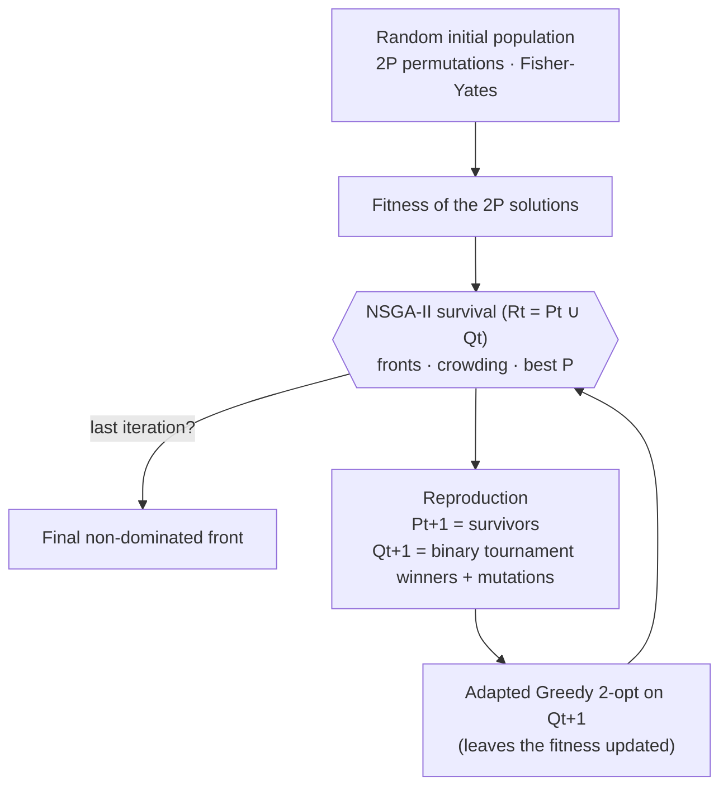

# cuda_mqap — NSGA-II + Adapted Greedy 2-opt in CUDA for the mQAP

**English** | [Español](LEEME.md)

GPU-parallel implementation (CUDA C++) of the multiobjective evolutionary algorithm **NSGA-II**,
combined with an **adapted Greedy 2-opt** local search, to solve instances of the
**multiobjective Quadratic Assignment Problem** (mQAP).

The whole algorithm runs on the GPU: fitness evaluation, non-dominated sorting,
[crowding distance](#g-crowding),
selection, mutation and local search. The host only copies the instance in before the loop and the
results out after it, so **it does not synchronize with the device inside the loop**. A generation takes
**3 [kernel](#g-kernel) launches up to P = 256**, where the survival of each run fits in one block; above that the
multi-block survival adds a [cooperative launch](#g-cooperative-launch) and the segmented sorts of
[CUB](#g-cub) (NVIDIA's library of
parallel primitives), about 37 launches per
generation measured at P = 4096. **Several independent runs execute concurrently** in a single call to
the program.

---

## Contents

1. [Features](#features)
2. [The problem: mQAP](#the-problem-mqap)
3. [The algorithm](#the-algorithm)
4. [Project architecture](#project-architecture)
5. [GPU design](#gpu-design)
6. [Requirements](#requirements)
7. [Build](#build)
8. [Usage](#usage)
9. [Experiments and metrics](#experiments-and-metrics)
10. [Tests and validation](#tests-and-validation)
11. [Performance](#performance)
12. [Improvements over the original version](#improvements-over-the-original-version)
13. [Population size limits and GPU resources](#population-size-limits-and-gpu-resources)
14. [Limitations and future work](#limitations-and-future-work)
15. [Troubleshooting](#troubleshooting)
16. [Glossary](#glossary)
17. [Credits and license](#credits-and-license)

---

## Features

**Algorithm**
- Complete NSGA-II: fast non-dominated sorting, crowding distance and
  [elitist (μ + λ)](#g-elitism) selection.
- Binary tournament selection, exchange mutation and transposition mutation (reversal of a segment).
- Greedy 2-opt adapted to several objectives: in each generation the improvement criterion is chosen at
  random, either the sum of all objectives or a single objective.
- Instances with 2 or 3 objectives (flow matrices) and up to 64 facilities.

**GPU performance**
- **O(n²)** fitness per chromosome (one [*warp*](#g-warp) per chromosome, with the matrices in
  [*shared memory*](#g-shared-memory)),
  instead of three O(n³) dense matrix products.
- Complete NSGA-II **on the GPU**: one block per run up to P = 256 (bit-packed dominance matrix in shared
  memory), and a multi-block survival with cooperative launch and segmented sorts (CUB) for P up to 65536.
- Greedy 2-opt with **O(n) [incremental (delta) evaluation](#g-delta)** of each swap; the local search of the whole
  offspring is a single kernel.
- Persistent [Philox](#g-philox) random states, initialized only once.
- **Independent runs in parallel** (`--runs R`) to use the whole GPU in experiment campaigns.

**Engineering**
- Strict host/device separation: `main.cpp` contains no CUDA code, and kernels are exposed through launcher functions.
- Instances read from the `.dat` files at runtime; parameters are passed on the command line.
- `CUDA_CHECK`/`CUDA_CHECK_KERNEL` error checking and RAII memory management (`DeviceBuffer<T>`).
- **Plug and play in Visual Studio 2026**: clone, open `cuda_mqap.slnx`, press F5. The CUDA version,
  C++ toolset and GPU architectures adapt to the machine. Also `CMakeLists.txt` with `ctest`.
- Test suite that compares every kernel with an independent CPU implementation, plus the `--verify`
  option, which validates the results of every run.
- Reproducible results through a seed (`--seed`).

---

## The problem: mQAP

`n` facilities must be assigned to `n` locations. A solution is a permutation `p`, where `p[i]` is the
location of facility `i`. Each objective `k` has its own flow matrix `Fk`, and all of them share the
distance matrix `D`. The `m` costs are minimized simultaneously:

```
cost_k(p) = Σ_i Σ_j  Fk[i][j] · D[p(i)][p(j)]          k = 1..m   (m = 2 or 3)
```

This expression is equivalent to the matrix formulation `Trace(Fk · X · Dᵀ · Xᵀ)` used by the original
version, where `X` is the permutation matrix; the tests verify that equivalence. Because the objectives
conflict, the result is not a single solution but an approximation of the **Pareto front**: the set of
non-dominated solutions.

### Instances (`mQAPData/`)

The instances are Knowles and Corne's mQAP test suite
([archived page](https://web.archive.org/web/2019/http://www.cs.bham.ac.uk/~jdk/mQAP/)), taken from the copy at
<https://github.com/fredizzimo/keyboardlayout/tree/master/tests/mQAPData>. They are third-party data, not
covered by this project's license: see [Third-party data](#third-party-data).

| File | Content |
|---|---|
| `KC<n>-<m>fl-<type>.dat` | Header (`facilities = 10 objectives = 2 …` or `facilities: 10 objectives: 2 …`), the `n×n` distance matrix and `m` `n×n` flow matrices |
| `KC10-2fl-*.PO` | Published Pareto optimal front: each line holds a 1-based permutation and its `m` costs |

`rl` instances have *real-like* distances and flows, and `uni` instances have uniform values.
There are 23 instances with n = 10, 20 and 30, and the optimal fronts of the 8 KC10 instances.

---

## The algorithm



Each generation does the following:

1. **NSGA-II survival** over the `2P` solutions of `Rt = Pt ∪ Qt`:
   - *Non-dominated sorting*: [rank](#g-rank) 1 for the first [Pareto front](#g-pareto-front),
     rank 2 for the next one, and so on.
   - *Crowding distance* of each front. For each objective the members of the front are sorted; the
     extremes get ∞ and the interior points add `(f[next] − f[previous]) / (max − min)`, with the maximum
     and minimum taken over the whole population.
   - The best `P` solutions by (rank ascending, crowding descending) are selected.
2. **Reproduction**. The `P` survivors form `Pt+1`. For each of them a **binary tournament** is held
   against another survivor chosen at random: the lower rank wins and, on a tie, the larger crowding.
   The winner is copied and mutated:
   - **Exchange mutation**: two random genes are swapped; it is applied twice.
   - **Transposition mutation**: the segment between two random positions is reversed.
3. **Adapted [Greedy 2-opt](#g-greedy-2opt)** on each offspring. All pairs of positions `(r < s)` are visited in order and
   a swap is kept if it does not worsen the criterion of the generation, chosen at random for each run and
   generation: the sum of all objectives or a single objective `k`. The idea of adapting the criterion
   comes from <https://arxiv.org/ftp/arxiv/papers/1109/1109.1276.pdf>.

Parameters:

| Parameter | Where | Default |
|---|---|---|
| Population size `P` | `--population` | 64 (power of 2 between 16 and 65536) |
| Generations | `--iterations` | 70 |
| Independent runs | `--runs` | 1 |
| Seed | `--seed` | random (printed) |
| Exchange mutations per child | `include/config.h` (`kExchangeMutations`) | 2 |
| Exchange / transposition probability | `include/config.h` | 1.0 / 1.0 |

---

## Project architecture

```
cuda_mqap/
├── include/
│   ├── config.h            Limits (n, P, objectives) and operator parameters
│   ├── cuda_check.cuh      CUDA_CHECK / CUDA_CHECK_KERNEL
│   ├── device_buffer.cuh   DeviceBuffer<T>: GPU memory with RAII
│   ├── device_common.cuh   Shared __device__ functions (per-warp cost, 2-opt delta, bitonic sort)
│   ├── instance.h          Instance struct, loadInstance(), reference CPU cost()
│   ├── kernels.cuh         Declaration of the kernel launchers and of the memory layout
│   ├── solver.h            SolverOptions, Solution, RunResult, solve()
│   └── survival_workspace.cuh   Buffers of the multi-block survival (allocated once)
├── src/
│   ├── main.cpp            Command line, result file and --verify (host only)
│   ├── instance.cpp        .dat parser and validation (including fitness overflow)
│   ├── solver.cu           Host orchestration: allocations, generation loop and result collection
│   ├── fitness.cu          Fitness kernel
│   ├── nsga2.cu            NSGA-II survival kernel (one block per run, P ≤ 256)
│   ├── nsga2_multiblock.cu NSGA-II survival across several blocks (P > 256)
│   ├── operators.cu        RNG, initial population, tournament and mutations
│   └── local_search.cu     Greedy 2-opt kernel
├── tests/test_kernels.cu   Tests of every kernel against CPU references
├── scripts/run_experiments.ps1   Experiment campaign with the parameters of each instance
├── scripts/run_convergence.ps1   Traces of every generation and their analysis (see below)
├── scripts/analyze_convergence.py   Hypervolume, stagnation and coverage of the optimal front
├── mQAPData/               Instances (.dat) and optimal fronts (.PO)
├── mQAPMetrics/            Node.js metric and 3D plot scripts
├── comparative_results_kcX_datasets.xlsx   Comparative results
├── cuda_mqap.slnx, cuda_mqap.vcxproj, test_kernels.vcxproj   Visual Studio solution and projects
├── cuda_mqap.props, cuda_toolkit.props   Shared settings and CUDA version detection
├── .vsconfig, .gitattributes             Visual Studio components and line endings
└── CMakeLists.txt
```

**Host/device separation.** The program is organized in three layers:

| Layer | Files | Responsibility |
|---|---|---|
| Application (host) | `main.cpp`, `instance.cpp` | Arguments, instance loading, result output and CPU verification |
| Orchestration (host) | `solver.cu` | Allocation of all memory once, launch sequence and final copy of the results |
| Kernels (device) | `fitness.cu`, `nsga2.cu`, `operators.cu`, `local_search.cu` | `template<int OBJ>` kernels (instantiated for 2 and 3 objectives) and their launchers |

The kernels live in the `mqap::detail` namespace. Outside their `.cu` file only the launchers declared in
`kernels.cuh` are visible (`launchFitness`, `launchSurvival`, `launchReproduce`, `launchGreedy2Opt`…),
and each one checks its launch with `CUDA_CHECK_KERNEL()`.

---

## GPU design

### Memory layout

For `R` runs, population `P`, `n` facilities and `OBJ` objectives:

| Buffer | Type and shape | Description |
|---|---|---|
| `genes` (×2, double buffer) | `short [R][2P][n]` | Rows `[0, P)`: survivors; rows `[P, 2P)`: offspring |
| `fitness` (×2) | `unsigned int [R][2P][OBJ]` | Cost of each objective |
| `survivorIndex / Rank / Crowding` | `[R][P]` | Survival result, ordered by (rank, −crowding) |
| `rng` | `curandStatePhilox4_32_10_t [R][2P]` | Persistent random states |
| `flow`, `dist` | `int [OBJ][n][n]`, `int [n][n]` | Instance matrices |

All memory is allocated **once** with `DeviceBuffer<T>` and released automatically. Between
generations only the pointers of the double buffer are swapped.

### Kernels

| Kernel | Grid × block | Parallelism | Techniques |
|---|---|---|---|
| `fitnessKernel<OBJ>` | `(⌈2P/4⌉, R)` × 128 | 1 warp per chromosome | `F` and `D` in *shared memory* (coalesced load); consecutive `F` reads per lane (no bank conflicts); reduction with `__shfl_down_sync` |
| `survivalKernel<OBJ>` (P ≤ 256) | `R` × `2P` | 1 block per run, 1 thread per individual | Bit-packed dominance (`2P × 2P/32` words), fronts with `__ballot_sync` + `__popc`, bitonic sort of 64-bit keys `(rank, fitness)` and `(rank, −crowding)` in *shared memory* |
| `reproduceKernel<OBJ>` | `(⌈P/128⌉, R)` × 128 | 1 thread per offspring | Philox state in registers; tournament, mutations and copy in a single pass |
| `greedy2OptKernel<OBJ>` | `(⌈P/4⌉, R)` × 128 | 1 warp per offspring | Matrices in *shared memory*; O(n) delta split across the 32 lanes; warp-uniform criterion (no divergence) |
| `initPopulationKernel` | `(⌈2P/128⌉, R)` × 128 | 1 thread per chromosome | Unbiased Fisher-Yates |
| `rngInitKernel` | `⌈R·2P/128⌉` × 128 | 1 thread per state | One independent Philox subsequence per thread |
| Multi-block survival (P > 256) | `(⌈2P/256⌉, R)` × 256, plus a cooperative launch | 1 thread per individual across the whole grid | Dominator counts with fitness tiles in *shared memory*, front peeling with `grid.sync()`, crowding and selection with segmented sorts (CUB) |

*Shared memory* per block:
- **Fitness and 2-opt:** `(OBJ + 1)·n²·4 + 4·n·2` bytes, e.g. 14.6 KB for n = 30 and 3 objectives.
  When more than 48 KB are needed, the device's maximum *opt-in* is requested automatically
  (`cudaFuncAttributeMaxDynamicSharedMemorySize`), which allows n = 60 with 3 objectives on Turing.
- **Survival:** up to ~46 KB with P = 256 (single-block path). The multi-block path (P > 256) only uses
  fitness tiles of about 3 KB; see [Population size limits](#population-size-limits-and-gpu-resources).

### Incremental 2-opt evaluation

Swapping positions `r` and `s` of `p` only changes the cost terms in which `r` or `s` appear:

```
Δ(r,s) = (F_rr − F_ss)(D_{ps ps} − D_{pr pr}) + (F_rs − F_sr)(D_{ps pr} − D_{pr ps})
       + Σ_{k≠r,s} [ (F_kr − F_ks)(D_{pk ps} − D_{pk pr}) + (F_rk − F_sk)(D_{ps pk} − D_{pr pk}) ]
```

Each lane of the warp computes part of the sum and the result is reduced with `__shfl_down_sync`.
Each of the `n(n−1)/2` evaluations therefore costs O(n) instead of recomputing the full fitness.
The accumulators are 64-bit.

### Synchronization

- All kernels are launched on the *default stream*, which already guarantees their order, so
  `cudaDeviceSynchronize` is not used during the run.
- The host only waits at the end (`cudaEventSynchronize`), to measure the time and copy the results.
- Inside the kernels, `__syncthreads()` only separates phases that share *shared memory*, and
  `__syncwarp()` makes the swap applied by the 2-opt visible to the whole warp.
- The multi-block survival (P > 256) peels the Pareto fronts with a **cooperative launch**: the whole
  grid synchronizes with `grid.sync()` between the phases of each front, inside the kernel, without going
  back to the host.
- `--trace` is the exception: it copies the survivors once per generation, so a traced run does
  synchronize with the device and its time is not comparable with a normal one.
- In Debug builds, `MQAP_SYNC_CHECK` makes `CUDA_CHECK_KERNEL()` synchronize after every kernel, so an
  execution error is reported at the launch that caused it.

---

## Requirements

- NVIDIA GPU with *compute capability* ≥ 7.5 (GeForce RTX 20xx or newer) and an up-to-date driver.
- **Visual Studio 2026** with the *Desktop development with C++* workload. When the solution is opened,
  Visual Studio reads `.vsconfig` and offers to install any missing component.
- **CUDA Toolkit 12.x or 13.x** (≥ 11.8), installed **after** Visual Studio so that its *Visual Studio
  Integration* is added to it. The project detects the installed version automatically; it was developed
  with CUDA 13.4.
- Alternative without the IDE: CMake ≥ 3.24 + Ninja (both included with Visual Studio).

---

## Build

### Open in Visual Studio 2026 (plug and play)

```
git clone https://github.com/apupiales/cuda_mqap.git
cd cuda_mqap
git checkout develop_with_claude_opus_5
start cuda_mqap.slnx
```

1. Visual Studio opens the solution with its two projects: `cuda_mqap` (the program, startup project) and
   `test_kernels` (the tests).
2. Select `Release | x64` and press **F5** (or Ctrl+F5). The program runs on
   `mQAPData\KC10-2fl-1rl.dat --verify` with the repository root as working directory. Edit the arguments
   in *Project → Properties → Debugging*.
3. To run the tests: right-click `test_kernels` → *Set as Startup Project* → Ctrl+F5.
4. The executables are written to `build\x64\<Configuration>\`.

Nothing depends on the machine where the project was created:

| What | How it adapts |
|---|---|
| CUDA version | `cuda_toolkit.props` takes it from `CUDA_PATH` (e.g. `...\CUDA\v12.6` → `CUDA 12.6.props`). To use another installed version: `set CudaVersion=12.6` before opening VS, or `msbuild /p:CudaVersion=12.6` |
| Missing CUDA integration | The build stops with a message that explains how to fix it (instead of "unknown item type CudaCompile") |
| C++ toolset | `$(DefaultPlatformToolset)` of the Visual Studio that opens it (v145 in VS 2026); Windows SDK `10.0` (the latest installed) |
| GPU | Native code for `sm_75`, `sm_80`, `sm_86` and `sm_89`, plus PTX that the driver compiles for newer GPUs (RTX 50xx) |
| Paths | All relative to the repository (`$(MSBuildThisFileDirectory)`); outputs in `build\` (ignored by git) |
| Line endings | `.gitattributes` keeps CRLF for the Visual Studio files |

The common configuration is in `cuda_mqap.props`: C++17, `/W4`, `-lineinfo` in Release, and `-G` plus
`MQAP_SYNC_CHECK` in Debug.

### CMake

```
cmake -S . -B build/cmake -G Ninja -DCMAKE_BUILD_TYPE=Release
cmake --build build/cmake
ctest --test-dir build/cmake --output-on-failure
```

By default it builds `sm_75`, `sm_80`, `sm_86` and `sm_89` plus PTX; for your GPU only use
`-DCMAKE_CUDA_ARCHITECTURES=native`. In Visual Studio you can also use *File → Open → Folder*.

### nvcc directly

From an *x64 Native Tools* console:

```
nvcc -O3 -arch=sm_75 -std=c++17 -Iinclude src\main.cpp src\instance.cpp src\solver.cu src\fitness.cu ^
     src\nsga2.cu src\nsga2_multiblock.cu src\operators.cu src\local_search.cu -o cuda_mqap.exe
```

---

## Usage

```
cuda_mqap <instance.dat> [options]
  --population P   population size, power of two in [16, 65536] (default 64)
  --iterations N   generations (default 70)
  --runs R         independent runs executed concurrently (default 1)
  --seed S         random seed (default: random, printed in the output)
  --output FILE    result file, appended (default result_<instance>_nsga2_greedy_2opt.txt)
  --trace FILE     write the front of every generation to FILE (CSV, overwritten)
  --trace-max N    points kept per run and generation in the trace (default 4096)
  --trace-every K  record the front every K generations, plus the last one (default 1)
  --verify         check the final populations on the CPU
  --quiet          do not print the final solutions
```

Examples:

```
:: One run with verification
build\x64\Release\cuda_mqap.exe mQAPData\KC10-2fl-1rl.dat --verify

:: 30 independent runs in parallel, reproducible
build\x64\Release\cuda_mqap.exe mQAPData\KC20-2fl-1rl.dat --iterations 300 --runs 30 --seed 2026 --quiet

:: 3-objective instance
build\x64\Release\cuda_mqap.exe mQAPData\KC30-3fl-1rl.dat --population 32 --runs 10
```

Console output (abridged):

```
Instance KC10-2fl-1rl: n = 10, objectives = 2 | population = 64, iterations = 70, runs = 1, seed = 42

FINAL SOLUTION (run 0, 64 non-dominated)
0 3 6 1 9 4 8 7 5 2 5925064 2282788
5 1 3 4 0 6 2 8 7 9 1665490 5884156
5 1 6 3 0 2 8 9 7 4 1869616 4670952
...
Verification: OK

Results appended to result_KC10-2fl-1rl_nsga2_greedy_2opt.txt
Time Spent: 0.148970 s (GPU 13.494 ms)
```

### Result file

It keeps the original format, so the `mQAPMetrics` scripts still work. Each run appends a block with
the non-dominated (rank 1) solutions of the final population: the key is the permutation and the value,
its costs.

```
{
'0361948752': [5925064, 2282788],
'5134062879': [1665490, 5884156],
'5163028974': [1869616, 4670952],
},
```

The final population usually holds the same solution many times, because it converges and the survivors
are copies of each other. **The front is written without repetitions:** every distinct non-dominated
solution appears once, in the order NSGA-II gives it. The whole population, repetitions included, is what
`--verify` checks and what the final population of the run is.

### Verification (`--verify`)

Independently recomputes on the CPU every solution of the final population of every run, checking:
- that the permutation is valid;
- that the fitness matches the CPU `cost()` exactly;
- that rank 1 corresponds exactly to the non-dominated solutions (and that every solution with rank > 1
  is dominated by some survivor).

If any check fails, the exit code is 1.

---

## Experiments and metrics

`scripts/run_experiments.ps1` runs the campaign of `comparative_results_kcX_datasets.xlsx` with the
population and iterations each instance used in the original version:

```
.\scripts\run_experiments.ps1 -Runs 30                              # all instances
.\scripts\run_experiments.ps1 -Runs 10 -Seed 2026 -Instances KC10-2fl-1rl,KC30-3fl-1rl
```

### How many generations each instance needs (`--trace`)

`--trace FILE` writes a CSV with `run,generation,f1,f2[,f3]`: the distinct non-dominated solutions of
**every** generation of every run, from the survival of the initial population (generation 0) to the
final front. It copies the survivors to the host once per generation, so it synchronizes with the device
and **the time of a traced run is not comparable** with a normal one; the copy is negligible next to a
generation with a large population, and noticeable with a small one.

`scripts/run_convergence.ps1` records the traces and analyses them with
`scripts/analyze_convergence.py`, which reports, per instance:

| Indicator | Meaning |
|---|---|
| `t_stall` | First generation after which the [hypervolume](#g-hypervolume) grows less than `--epsilon` (relative) during `--patience` generations. The survival is elitist, so the hypervolume can only grow: a flat curve is real stagnation, not noise |
| `t_final` | First generation whose front already equals the last one. It needs no reference data and says when nothing new is found again |
| `t_optimum` | First generation that covers the published `.PO` front. Only the KC10 instances have one |
| `coverage` | [Share of the optimal front](#g-coverage) found at the end |

The reference point of the hypervolume is fixed for the whole file (the worst corner of generation 0),
so the generations and the runs are comparable with each other. The three generation numbers are random
variables — every run stagnates at a different point — so the summary reports the median and the 90th
percentile over the runs, never a single value.

```
.\scripts\run_convergence.ps1 -Population 1024 -Iterations 200 -Runs 30
.\scripts\run_convergence.ps1 -Population 4096 -Iterations 300 -Instances KC10-2fl-1rl
python scripts\analyze_convergence.py results\convergence\*.csv --patience 30 --epsilon 1e-5
```

`--iterations` must be clearly above the expected stagnation or the measurement reports the cap instead;
the analysis warns when a run is still improving at the last generation. The per-generation curves are
written to `results/convergence/curves/<instance>_curve.csv` (median hypervolume, its fraction of the
final value and the median front size), ready to plot.

The generation count depends strongly on the population, so the useful answer is the total cost: the
time of a generation is known for each P (see [Performance](#performance)), so
`generations × time per generation` tells which pair (P, generations) reaches the target sooner.

#### Results of the campaign (RTX 2060, 2026-09-22)

Three populations per instance: P = 1024 with a cap of 2000 generations (30 runs on the 2-objective
instances, 10 on the 3-objective ones), P = 16384 and P = 65536 with the cap each instance needed, from
300 generations on KC10 to 10000 on KC30-3fl-1rl and KC30-3fl-1uni.

Everything is measured on the same scale, which took two corrections worth stating:

- **The quality is a share of a [reference front](#g-reference-front), not of the run itself.** On KC10 that front is the
  published optimum, so the figure is the share of the optimal hypervolume. On KC20 and KC30 there is no
  published optimum, so the reference is the best front the campaign knows: the non-dominated union of
  the final fronts of every run and every population. Normalizing each run against its own last
  generation, as an earlier version of this section did, makes a 100 % appear by construction and hides
  the difference between populations.
- **The stagnation test uses the same window everywhere** (`--hv-window`): 20 generations on KC10 and
  KC20, 50 on KC30. With each file choosing its own window, KC30-3fl-1rl looked like it stagnated at
  generation 612 with P = 1024 and at 4875 with P = 65536; with a common window the same traces give
  1200 and 1450. Most of that spread was the window.

**Generations until the front stops changing.** This is the number to use when choosing `--iterations`:
after it, no run found anything new.

| Instance | P = 1024 | P = 16384 | P = 65536 |
|---|---|---|---|
| KC10-2fl-2uni | 1 | 1 | ≤ 5 |
| KC10-2fl-1uni | 6.5 | 5.5 | 10 |
| KC10-2fl-2rl | 9 | 4.5 | 5 |
| KC10-2fl-1rl | 53 | 6.5 | 10 |
| KC10-2fl-4rl | 320 | 20 | 10 |
| KC10-2fl-3rl | 845 | 143 | 30 |
| KC10-2fl-5rl | 1054 | 104 | 10 |
| KC10-2fl-3uni | 1182 | 149 | 55 |
| KC20-2fl-2uni | 65 | 31.5 | 40 |
| KC20-2fl-1rl | 1817 | 236 | 230 |
| KC20-2fl-1uni | 1892 | 230 | 200 |
| KC20-2fl-3uni | 1987 | 294 | 285 |
| KC30-3fl-2uni | 1997 | 1490 | 4975 |
| KC30-3fl-1uni | 1998 | > 5000 | > 10000 |
| KC30-3fl-1rl | 1999 | > 5000 | > 10000 |

**Quality reached**, as a share of the reference front. The first number is the hypervolume; the second,
the share of the points of that front that the run actually found.

| Instance | P = 1024 | P = 16384 | P = 65536 |
|---|---|---|---|
| KC10-2fl-2uni | 100 % · 100 % | 100 % · 100 % | 100 % · 100 % |
| KC10-2fl-2rl | 100 % · 100 % | 100 % · 100 % | 100 % · 100 % |
| KC10-2fl-1uni | 99.99 % · 92.3 % | 99.99 % · 92.3 % | 99.99 % · 92.3 % |
| KC10-2fl-5rl | 99.97 % · 78.6 % | 99.97 % · 79.6 % | 99.98 % · 81.2 % |
| KC10-2fl-3uni | 99.96 % · 86.3 % | 99.96 % · 87.1 % | 99.96 % · 87.4 % |
| KC10-2fl-1rl | 99.94 % · 79.3 % | 99.94 % · 79.3 % | 99.94 % · 79.3 % |
| KC10-2fl-4rl | 99.49 % · 73.6 % | 99.49 % · 73.8 % | 99.49 % · 74.3 % |
| KC10-2fl-3rl | 99.25 % · 72.7 % | 99.25 % · 72.9 % | 99.30 % · 73.8 % |
| KC20-2fl-1rl | 99.94 % · 87.4 % | 99.96 % · 88.1 % | 99.98 % · 92.3 % |
| KC20-2fl-1uni | 99.44 % · 52.0 % | 99.88 % · 84.5 % | 99.99 % · 95.8 % |
| KC20-2fl-2uni | 99.31 % · 60.4 % | 99.93 % · 91.3 % | 100 % · 97.5 % |
| KC20-2fl-3uni | 99.30 % · 43.1 % | 99.51 % · 60.9 % | 99.68 % · 77.4 % |
| KC30-3fl-1rl | 95.52 % · 1.4 % | 98.64 % · 32.8 % | 99.31 % · 61.6 % |
| KC30-3fl-1uni | 88.88 % · 1.5 % | 96.38 % · 20.0 % | 98.93 % · 48.1 % |
| KC30-3fl-2uni | 88.06 % · 5.8 % | 96.17 % · 28.3 % | 98.00 % · 61.6 % |

What the campaign says:

- **The hypervolume barely separates the 2-objective instances.** Every KC10 and KC20 configuration lands
  between 99.25 % and 100 % of its reference, and on KC10 that reference is the published optimum: the
  front found dominates practically the same volume as the optimal one even with P = 1024.
- **What does separate them is how many solutions of that front they find.** On KC20-2fl-1uni it goes
  from 52 % of the reference points with P = 1024 to 95.8 % with P = 65536, and on KC30-3fl-2uni from
  5.8 % to 61.6 %. A small population returns a front that is worth almost the same in volume with far
  fewer distinct solutions.
- **More population needs fewer generations**, and now the pattern is clean: KC10-2fl-5rl goes from 1054
  generations to 10, KC20-2fl-1rl from 1817 to 230. A generation is not a fixed amount of work — with
  P = 65536 it evaluates 64 times more offspring than with P = 1024 — so this says nothing about the
  total time. On KC10-2fl-1rl a generation costs 0.25 ms per run with P = 1024 and 86 ms with P = 65536.
- **There is a ceiling on KC10 that neither the population nor the generations break**: KC10-2fl-1rl
  stays at 79.3 % of the published optimal points with the three populations, and KC10-2fl-3rl around
  73 %. What is left is the algorithm: this combination of NSGA-II and greedy 2-opt converges to a
  subset of the optimal front.
- **The 3-objective instances never stop**: KC30-3fl-1rl and KC30-3fl-1uni were still improving at
  generation 10000 with P = 65536, having reached 99.31 % and 98.93 % of the reference hypervolume.
  Doubling from 5000 to 10000 generations added 0.67 and 2.55 points. There the number of generations is
  a decision about the budget, not a measurement.

The reference front of KC20 and KC30 is the best one **known**, not the optimum: it holds 14,029 points
on KC30-3fl-1rl and 3,112 on KC30-3fl-1uni. A longer run could improve it, and every percentage here
would drop. The `.PO` fronts of KC10 have no such caveat.

Two practical notes for repeating this. Record every trace with the same `--trace-every`, chosen for the
most expensive instance, so any window that is a multiple of it is available in every file without
running the GPU again; that is what forced the corrections above. And on the 3-objective instances the
hypervolume of the fronts, which reach ten thousand points, is what limits the resolution of the curves:
`--hv-runs 1` buys five times the resolution at the same cost, and the numbers of KC30 above use it.

### Results in the Excel workbook

On 2026-09-19 the results of this version were added to `comparative_results_kcX_datasets.xlsx`:

- **Instance tabs (KC10-\*, KC20-\*):** each tab has a new block to the right of the existing ones, with
  20 or 10 genes and 2 objectives per row, and a **green** series in its chart:
  *"CUDA NSGA-II Paralelo + Greedy 2opt, N iteraciones (optimizado con claude)"*. Each tab's own population
  and iterations were used, with `--verify`.
  - KC10 tabs show the first of 100 concurrent runs; KC20 tabs, a single run.
  - A note below each block records the command, seed and time.
  - KC10-2fl-2uni ran with P = 16 (the original series used P = 2).
- **Distance Metric:** columns F–G (mean and standard deviation) and column H of the second table, with the
  [gamma distance](#g-gamma) of this version over 100 runs per KC10 instance. It is computed exactly like
  `mQAPMetrics/distance_metric_*.js` and truncated to 2 decimals, like the existing values.

**Maximum population of the branch (2026-09-21).** The same 12 experiments were run again with
`--population 65536`, the cap of this branch, keeping the iterations of each tab (70, 30 or 25 on KC10;
300 on KC20), one run, seed 20260920 and `--verify` OK. Every tab has a second new block and a **red**
series in its chart: *"CUDA NSGA-II Paralelo + Greedy 2opt, N iteraciones (optimizado con claude,
poblacion 65536)"*.

With that population the whole final population is non-dominated, so the front the program writes has
65,536 rows, of which only 1 to 212 are distinct solutions; the block and the series keep the distinct
ones, since the repetitions would draw the same points. The note under each block records the command, the
seed, the number of distinct points and the time of the run.

Quality against the published optimal front (`.PO`), next to the green series of the same branch. *Found*
counts how many of the optimal points the run reproduces exactly; gamma is the distance computed like
`mQAPMetrics/distance_metric_*.js` (lower is better):

| Instance | `.PO` points | Green: found | Green: gamma | Red: found | Red: gamma |
|---|---|---|---|---|---|
| KC10-2fl-1rl | 58 | 38 | 685.46 | **46** | **568.78** |
| KC10-2fl-1uni | 13 | 7 | 241.93 | **12** | **0.00** |
| KC10-2fl-2rl | 15 | 12 | 0.00 | **15** | 0.00 |
| KC10-2fl-2uni | 1 | 1 | 0.00 | 1 | 0.00 |
| KC10-2fl-3rl | 55 | 28 | 24,466.49 | **40** | **17,757.94** |
| KC10-2fl-3uni | 130 | 66 | 420.75 | **114** | **11.47** |
| KC10-2fl-4rl | 53 | 29 | 7,992.15 | **40** | **3,793.44** |
| KC10-2fl-5rl | 49 | 26 | 24,552.85 | **39** | **2,629.05** |

The KC20 instances have no published front; their red series have 86, 68, 8 and 212 distinct points
(1rl, 1uni, 2uni and 3uni). Every plotted permutation was checked on the host: its recomputed cost matches
the fitness written by the program, and each front is non-dominated.

Times on the RTX 2060: 6.6–6.8 s per KC10 tab of 70 generations and 38–39 s per KC20 tab of 300, 201 s for
the twelve.

**Distance Metric.** Columns H and I of the first table (mean and standard deviation) and column I of the
second one hold the gamma distance of this population, measured with the same protocol as the green
columns: **100 runs per KC10 instance** with the iterations of its tab, `--seed 20260921`, and the distance
computed exactly like `mQAPMetrics/distance_metric_*.js` (per run, the average over its unique permutations
of the distance to the closest point of the `.PO` front; then mean and standard deviation over the runs).
The note in A11 records the command. Mean / standard deviation, green against red:

| Instance | Green (population of the tab) | Red (P = 65536) |
|---|---|---|
| KC10-2fl-1rl | 850.56 / 656.20 | 557.92 / 56.58 |
| KC10-2fl-1uni | 192.02 / 342.12 | 0.00 / 0.00 |
| KC10-2fl-2rl | 10,941.55 / 7,430.27 | 0.00 / 0.00 |
| KC10-2fl-2uni | 532.56 / 1,806.81 | 0.00 / 0.00 |
| KC10-2fl-3rl | 20,531.69 / 2,896.06 | 16,132.53 / 2,893.64 |
| KC10-2fl-3uni | 376.23 / 77.04 | 12.51 / 5.86 |
| KC10-2fl-4rl | 7,515.98 / 2,082.63 | 3,001.91 / 1,277.88 |
| KC10-2fl-5rl | 26,891.28 / 10,070.77 | 3,409.13 / 921.20 |

A gamma of 0.00 means that **every solution found in every one of the 100 runs sits exactly on the
published optimal front** — not that the whole front was found: the red series of KC10-2fl-1uni holds 12 of
its 13 points. The run drawn in the charts is a separate single run, with seed 20260920; this table
compares the 100-run batches.

**One seed for the batch, one random stream per run.** `--seed` does not repeat the same randomness in
every run. `curand_init(seed, id, 0, ...)` in `src/operators.cu` gives each of the `runs × 2P` states its
own Philox subsequence, so run *r* draws from the block `[r·2P, (r+1)·2P)` and no two runs share numbers:
with the same seed, three runs of P = 16 and no generations already produce three different populations.
What repeats between runs is convergence, not randomness. Counting the distinct fronts of the 100 runs of
each batch:

| Instance | Distinct fronts / 100 | Sizes |
|---|---|---|
| KC10-2fl-3uni | 60 | 113–119 points |
| KC10-2fl-1rl | 21 | 47–50 points |
| KC10-2fl-1uni | 2 | 12 and 13 points |

On KC10-2fl-1rl, 64 of the 100 runs end on exactly the same front of 47 points, because with P = 65536 the
search converges to it; on KC10-2fl-1uni one of the two fronts has 12 of the 13 published optimal points
and the other has all 13. This is also why the standard deviation is 0.00 on 1uni, 2rl and 2uni: not
because the runs are identical, but because in every one of them every solution found lies on the optimal
front, so the distance is 0 in all of them.

A fixed seed keeps the batch reproducible: running the command in the note of A11 again gives exactly the
numbers of the table. A seed taken from the clock would add no independence between runs — they already
have it — and would lose that. What a timestamp does not answer either is whether the result depends on
the particular seed; that is checked by repeating the batch with a second fixed seed and comparing the
means.

**Quality versus the original Greedy 2-opt.** The results are mixed:

| Instance | Metric | Original | This version |
|---|---|---|---|
| KC10-2fl-1rl | gamma distance (lower is better), 100 runs | 1,484.66 | **850.56** |
| KC10-2fl-3rl | same | 22,541.34 | **20,531.69** |
| KC10-2fl-4rl | same | 12,399.20 | **7,515.98** |
| KC10-2fl-5rl | same | 32,418.89 | **26,891.28** |
| KC10-2fl-3uni | same | 381.15 | 376.23 |
| KC10-2fl-1uni | same | **79.32** | 192.02 |
| KC10-2fl-2rl | same | **4,451.70** | 10,941.55 |
| KC10-2fl-2uni | same (different P, not comparable) | 1,346.43 | 532.56 |
| KC20-2fl-1uni | hypervolume, 1 run (higher is better) | 3.5249·10¹⁰ | 3.5253·10¹⁰ |
| KC20-2fl-1rl | same | **6.3518·10¹³** | 6.3061·10¹³ (−0.7 %) |
| KC20-2fl-2uni | same | **8.4911·10⁹** | 7.8799·10⁹ (−7.2 %) |
| KC20-2fl-3uni | same | **7.6649·10¹⁰** | 7.4938·10¹⁰ (−2.2 %) |

The KC20 figures come from a single run of each version, so they do not support statistical conclusions.

**Workbook corrections (2026-09-19)**
- **KC20-2fl-3uni:** the NSGA-II, Greedy 2opt and hidden Pareto optimal chart series pointed to the
  KC20-2fl-1uni tab, and cell A1 read "KC20-2fl-1uni Pareto Optimal". They now use the tab's own data.
- **KC20-2fl-1rl:** the original series held results of instance **KC20-2fl-2rl**, because the former
  `settings_KC20_2fl_1rl.cu` contained those matrices (bug B3). They were re-run on the correct instance,
  P = 64 and 300 iterations, using the original code (`kernel.cu` of `ec882da`) with **only** the memory
  fixes B1 and B2:
  - NSGA-II: the `greedy2Opt` call commented out (2.8 s);
  - NSGA-II + Greedy 2opt: 104.5 s;
  - initial population: the one from the Greedy run.

  All 320 rows of the tab have fitness equal to their cost on KC20-2fl-1rl. The notes are in X67 and CS67,
  and the old data remains in the git history.
- **2019 data:** in all 12 tabs, every row of the NSGA-II, Greedy and initial population blocks has exactly
  the cost of its permutation, so the original results are internally consistent.
- **Open issue:** in the second column of Distance Metric, the NSGA-II value for KC10-2fl-2uni (27,629.49)
  does not match the current data in `mQAPMetrics/distance_metric_KC10_2fl_2uni.js` (15,195.66).

> **Warning about the original code.** With CUDA 13.4, `kernel.cu` of `ec882da` run without the Greedy
> 2-opt produces impossible fitness values (negative, or in the billions). The cause is the out-of-bounds
> writes of `curand_setup` (bug B1), which corrupt the NSGA-II buffers. To reproduce the original version,
> use commit `3f3a187` or apply at least fixes B1 and B2, and check it with
> `compute-sanitizer --tool memcheck`.

---

## Tests and validation

`test_kernels` (the `test_kernels` project in Visual Studio, or `ctest`) compares every kernel with an
independent CPU implementation:

| Test | What it checks |
|---|---|
| Instance loading | All 23 `.dat` files load (in both header formats) and `n`/`m` match the file name |
| `.PO` optimal fronts | The **374 published optimal solutions** have exactly their published cost, both on the CPU and on the GPU |
| Fitness | The kernel matches the original version's literal `Trace(F·X·Dᵀ·Xᵀ)` on KC10, KC20 and KC30, with several runs |
| NSGA-II survival | Ranks, crowding and selection match a CPU NSGA-II for P = 16, 64 and 256, with 2 and 3 objectives |
| Multi-block survival | Same check with the multi-block path forced for P = 16, 64 and 256, and for P = 512, 1024 and 2048 |
| Large populations | With P = 32768 and P = 65536 (more than 32767 individuals per run): the survivors are distinct, ordered by (rank, crowding), and nobody in the population dominates a survivor of rank 1 |
| Greedy 2-opt | The resulting permutation is **identical** to that of a CPU greedy that recomputes the full cost (n = 10, 30 and 60, the latter with more than 48 KB of *shared memory*) |
| Reproduction | Survivors and their fitness are copied correctly and the children are valid permutations |
| Initial population | Every permutation is valid and shuffled |

```
build\x64\Release\test_kernels.exe mQAPData

:: --quick skips the two tests with more than 32767 individuals (too slow under compute-sanitizer)
build\x64\Release\test_kernels.exe mQAPData --quick
```

Additional validation performed with `compute-sanitizer` on the program and on the tests:

```
compute-sanitizer --tool memcheck --leak-check full build\x64\Release\cuda_mqap.exe mQAPData\KC30-3fl-1rl.dat --population 32 --iterations 5 --runs 2 --verify
compute-sanitizer --tool racecheck  ...
compute-sanitizer --tool synccheck  ...
compute-sanitizer --tool initcheck  ...
```

Result: 0 errors, 0 leaks and 0 *hazards*.

---

## Performance

GeForce RTX 2060 (sm_75, 30 SMs), Release builds, CUDA 13.4. The "Fixed original" column is the
previous monolithic code (`kernel.cu`, commit `3f3a187`) with its memory errors fixed.

| Case | Fixed original | This version | Speedup (wall time) |
|---|---|---|---|
| KC10-2fl-1rl, P=64, 70 gen., 1 run | 2.2 s | 0.15 s (15 ms GPU) | ~15× |
| KC10-2fl-1rl, P=64, 70 gen., 10 runs | 23.7 s | 0.12 s (21 ms GPU) | ~200× |
| KC20-2fl-1rl, P=64, 300 gen., 1 run | 48.8 s | 0.15 s (55 ms GPU) | ~325× |
| KC30-3fl-1rl, P=32, 70 gen., 1 run | 42.4 s | 0.14 s (40 ms GPU) | ~300× |
| KC30-3fl-1rl, P=32, 70 gen., 30 runs | ~21 min (estimated) | 0.23 s (135 ms GPU) | ~5,500× |

In this version the wall time is dominated by the creation of the CUDA context (~0.1 s), so the GPU
time better reflects the cost of the algorithm.

Nsight Systems profile (KC10-2fl-1rl, 70 generations, 1 run):

| Metric | Original (`ec882da`) | This version |
|---|---|---|
| Total time | 3.64 s | 0.15 s |
| Kernel launches | 87,510 | 214 |
| `cudaMemcpy` | 80,558 | 6 |
| `cudaDeviceSynchronize` | 68,335 | 0 |
| `cudaMalloc` / `cudaFree` | 21,507 / 20,724 (783 leaks) | 11 / 11 |
| Total kernel time | ~340 ms | ~6.4 ms |

**Solution quality.** Measured as the fraction of the optimal `.PO` front points found exactly and as
normalized IGD, with the same parameters in both versions:

| Instance | Fixed original | This version |
|---|---|---|
| KC10-2fl-1rl (P=64, 70 gen.) | 68.4 % · IGD 0.0053 | 68.4 % · IGD 0.0054 |
| KC10-2fl-3uni (P=128, 25 gen.) | 44.2 % · IGD 0.0057 | 45.0 % · IGD 0.0055 |

On these two instances the quality is equivalent. Over the whole campaign of the Excel workbook the results
are mixed: see [Results in the Excel workbook](#results-in-the-excel-workbook).

---

## Improvements over the original version

### Fixed bugs

| # | Bug in the original version | Fix |
|---|---|---|
| B1 | 1 `curandState` was allocated but up to 8,192 were initialized, writing out of bounds in GPU memory (with CUDA 13.4 it corrupts the results of the variant without Greedy) | Philox states sized per thread (`[R][2P]`) and persistent |
| B2 | The binary tournament used 2P blocks over arrays of size P (out-of-bounds accesses) | One thread per offspring, with a bounds guard |
| B3 | `settings_KC20_2fl_1rl.cu` contained the KC20-2fl-2rl matrices | Instances are read directly from the `.dat` files |
| B4 | The tournament seed was `time(NULL)` in every generation, so ~19 consecutive generations repeated adversaries | Persistent RNG with a single 64-bit seed |
| B5 | The initial shuffle used curand states shared between blocks and was biased | Fisher-Yates with one state per chromosome |
| B6 | In the crowding distance, `(unsigned)HUGE_VALF` (undefined behavior), a mis-detected front end and a possible division by zero | Crowding rewritten with a real ∞ and a range check |
| B7 | 11 GPU allocations per generation never released | RAII `DeviceBuffer<T>`; all allocations are made once |
| B8 | The greedy evaluated every pair twice ((i,j) and (j,i)) | Each pair `r < s` is evaluated once |
| B9 | ~0.9 MB of debug arrays on the host stack (1 MB on Windows) | Removed |
| B10 | `DEV_MODE \|\| PRINT_*` instead of `&&`, and a wrong `sizeof` | Removed together with the debug code |
| B11 | The last iteration output only the first front mixed with stale rows | The output is exactly the non-dominated front of the final population |
| B12 | Solutions outside the front could win the crowding sort | Selection by a composite key (rank, −crowding) |

### Optimizations

| Area | Before | Now |
|---|---|---|
| Fitness | 3 dense O(n³) matrix products, 32×32-thread blocks (≈10 % useful with n = 10), uncoalesced accesses and serialized constant memory | O(n²), one warp per chromosome, matrices in *shared memory*, *shuffle* reduction |
| NSGA-II | Host loop per front, with ~10 kernels and copies per front; bitonic sort with 2-thread blocks (28 launches per sort) | A single kernel per generation, everything in *shared memory* |
| Greedy 2-opt | ~50 API calls per evaluated pair (full fitness, `cudaMalloc`/`cudaFree`, copies) | One launch per generation, O(n) delta |
| Launch configuration | 13 kernels with 1 thread per block (1/32 SIMT efficiency) | 1 thread or 1 warp per element, 128-thread blocks |
| Transfers | Always-on debug copies (~1,150 per generation) | Only 6 copies at the end of the run |
| Synchronization | `cudaDeviceSynchronize` after every kernel | None during the run |
| Scalability | Serial runs (`TIMES` loop) | Concurrent `--runs R` (`blockIdx.y = run`) |

### Engineering

- Monolithic `kernel.cu` (2,081 lines) → modules with host/device separation.
- 15 `settings_*.cu` files recompiled per instance → instance and parameters at runtime.
- Ignored errors → `CUDA_CHECK` / `CUDA_CHECK_KERNEL` that abort with file and line.
- Unversioned Visual Studio project (excluded by `.gitignore`) → versioned `cuda_mqap.slnx` + `CMakeLists.txt`.
- No tests → `test_kernels` + `--verify` + `compute-sanitizer`.

### Behavior differences

- The greedy 2-opt evaluates each pair once. With the "all objectives" criterion it compares the exact
  sum of the changes instead of averages truncated to integers.
- The result file contains only the non-dominated solutions of the final population.
- The minimum population is 16 (KC10-2fl-2uni used 4) and it must be a power of 2.
- The tournament adversary is chosen uniformly among the P survivors.

---

## Population size limits and GPU resources

**In this branch the maximum population is P = 65536 on any GPU, for all 15 instances.** Up to P = 256 the
NSGA-II survival of each run still runs in a single block of 2P threads (`nsga2.cu`); above it, the
multi-block survival of `nsga2_multiblock.cu` is used:

1. `countDominatorsKernel`: how many individuals dominate each one, with the fitness read in shared memory tiles.
2. `peelFrontsKernel`: **cooperative launch**, so the whole grid can synchronize (`grid.sync()`). For each
   front, the individuals without remaining dominators are appended to a front list and the others subtract
   the members that dominated them, until everyone is ranked.
3. Crowding distance: one **segmented sort** (CUB) per objective by (rank, fitness), which leaves every
   front contiguous, then the same accumulation as the single-block kernel.
4. Selection: segmented sort by (rank ascending, crowding descending); the first P of each run survive.

Every buffer is O(N) per run (N = 2P), not O(N²), so **the VRAM is not the limit either**: the cost of a
larger population is time, which grows with N². Survivor indices and ranks are `int`, so nothing breaks
past 32767 individuals; the cap of 65536 is a practical one, because beyond it a single generation already
costs hundreds of milliseconds (see the table below).

### Measured on the RTX 2060

- **P ≤ 256 gives identical results to `develop_with_claude_opus_5`** (same single-block kernel): with the
  same seed the result files match byte for byte on KC10, KC20 and KC30.
- **Larger populations run on all 23 `.dat` instances** with `--verify` OK (P = 8192), and so do
  KC10-2fl-1rl and KC30-3fl-1rl with P = 65536. GPU time of one run, with the iterations of each tab of the
  workbook:

| Instance (iterations) | P = 256 | P = 512 | P = 1024 | P = 2048 | P = 4096 |
|---|---|---|---|---|---|
| KC10-2fl-1rl (70) | 23 ms | 45 ms | 64 ms | 87 ms | 153 ms |
| KC30-3fl-1rl (70) | 64 ms | 138 ms | 206 ms | 367 ms | 683 ms |

  With the largest populations, GPU time of 10 generations of one run (seed 12345) and the resulting time
  per generation:

| Instance | P = 8192 | P = 16384 | P = 32768 | P = 65536 |
|---|---|---|---|---|
| KC10-2fl-1rl | 71 ms (7.1 ms/gen.) | 167 ms (16.7) | 353 ms (35.3) | 1,183 ms (118.3) |
| KC30-3fl-1rl | 206 ms (20.6 ms/gen.) | 439 ms (43.9) | 1,049 ms (104.9) | 2,800 ms (280.0) |

  Between P = 32768 and P = 65536 the time roughly triples: the O(N²) dominance counting starts to dominate
  the O(N) part of the generation. A complete run of 70 generations with P = 65536 takes 6.7 s of GPU time
  on KC10-2fl-1rl and 17.7 s on KC30-3fl-1rl.

### Effect of the population size on quality

KC10 instances, 70 iterations, 100 runs per case. The first figure is the gamma distance to the published
Pareto optimal front (lower is better, computed like `mQAPMetrics/distance_metric_*.js`); the percentage is
the average share of the optimal front found per run.

| Instance | P = 256 | P = 512 | P = 1024 | P = 2048 | P = 4096 |
|---|---|---|---|---|---|
| KC10-2fl-1rl | 782.85 / 75 % | 692.33 / 77 % | 651.89 / 79 % | 573.58 / 79 % | 557.29 / 79 % |
| KC10-2fl-5rl | 16,866.45 / 62 % | 13,451.29 / 66 % | 10,487.07 / 70 % | 7,567.27 / 72 % | 6,224.17 / 74 % |
| KC10-2fl-3uni | 160.14 / 68 % | 119.95 / 72 % | 75.45 / 76 % | 54.64 / 80 % | 29.96 / 82 % |

The share of the optimal front found grows with P on every instance, and the gamma distance drops. The GPU
time of the whole batch (100 runs) grows roughly linearly with P: 0.6 s with P = 512 and 6.1 s with
P = 4096 on KC10-2fl-1rl.

The red series of `comparative_results_kcX_datasets.xlsx` shows the same effect at the cap of the branch,
P = 65536, on the twelve instances of the workbook: see
[Results in the Excel workbook](#results-in-the-excel-workbook).

### How to compute the limit for another GPU

1. **Code cap:** P ≤ 65536 (`kMaxPopulation` in `include/config.h`). It is a time limit, not a memory or
   index-type one: survivor indices and ranks are `int`.
2. **Shared memory:** only matters for P ≤ 256 (single-block path, 47 KB at most). The multi-block path
   uses fitness tiles of about 3 KB.
3. **Cooperative launch:** required for the front peeling; supported by every NVIDIA GPU since Pascal.
4. **VRAM:** determines how many concurrent runs fit:

```
max runs       = min(65 535, free VRAM / memory per run)
memory per run = 2P·(4n + 8·OBJ + 64) + 12P + 40·2P bytes     (the last term is the survival workspace)
```

With P = 4096 on KC30 a run takes about 2 MB, so 100 concurrent runs need around 200 MB. The workspace is
only allocated when P > 256.

| GPU | VRAM | Max. P (this branch) | Concurrent KC30 runs with P = 4096 (calculated) |
|---|---|---|---|
| RTX 2060 (measured) | 6 GB | **65536** | ~2,600 |
| RTX 3070 Laptop | 8 GB | **65536** | ~3,500 |
| RTX 3080 | 10–12 GB | **65536** | ~4,400–5,200 |
| RTX 4080 / 4090 | 16 / 24 GB | **65536** | ~7,000–10,500 |
| RTX 5080 / 5090 | 16 / 32 GB | **65536** | ~7,000–14,000 |

Only the RTX 2060 row was measured; the others use 85 % of the VRAM of each GPU. These run counts are far
above what the time allows: with P = 4096 each run of KC30 costs about 0.7 s of GPU time.

### How to explore more solutions

1. **More concurrent runs:** `--runs` (islands without migration for now).
2. **Larger population:** up to 65536 in this branch. From a few thousand individuals on, the O(N²)
   dominance counting dominates the cost of the generation, so the useful limit is the time you are willing
   to spend, not the memory.
3. **Both:** the product (runs × P) is limited by the VRAM, and in practice by the time.

---

## Limitations and future work

**Current limits:**
- n ≤ 64. The available *shared memory* also matters: with 3 objectives, n ≤ 63 on GPUs with 64 KB *opt-in*.
- P is a power of 2 between 16 and 65536; up to 256 survival uses a block of 2P threads
  (see [Population size limits and GPU resources](#population-size-limits-and-gpu-resources)).
- Only 2 or 3 objectives are supported (the kernels are instantiated for those values).
- Costs are stored as 32-bit integers; the loader rejects instances that could overflow them.

**Possible improvements:**
- Island model with migration between the concurrent runs.
- CUDA Graphs to capture a generation; with 3 kernels per generation, the expected benefit is small.
- Nsight Compute analysis of the `survivalKernel`, which is latency bound because it is a single block.
- More crossover operators and variants of the 2-opt criterion.

---

## Troubleshooting

| Symptom | Cause and solution |
|---|---|
| `CUDA Toolkit X.Y Visual Studio integration not found` | The CUDA Toolkit was installed before Visual Studio, or without its *Visual Studio Integration*: re-run the CUDA installer (custom install → Visual Studio Integration). With several toolkits installed, choose one with `CudaVersion` (see [Open in Visual Studio 2026](#open-in-visual-studio-2026-plug-and-play)) |
| `no kernel image is available for execution on the device` | The GPU is older than `sm_75`, or the driver is too old to JIT-compile the PTX: update the driver or add the architecture in `cuda_mqap.props` (`CodeGeneration`) |
| Visual Studio asks to install components when opening the solution | It comes from `.vsconfig`: accept to install the C++ workload and the Windows SDK |
| `population must be a power of two in [16, 65536]` | Use a power of two between 16 and 65536 |
| `instance too large: … shared memory` | The instance does not fit in the block's *shared memory* (see limits) |
| `costs may overflow 32-bit fitness values` | The instance could overflow the 32-bit fitness |
| Very slow execution in Debug | Expected: Debug compiles device code with `-G` and synchronizes after every kernel. Use Release to measure |
| `[CUDA] … at <file>:<line>` | CUDA error with its exact location; for more detail, run under `compute-sanitizer` |

---

## Glossary

Terms that appear throughout this document, in the meaning they have here.

**The GPU**

| Term | What it means |
|---|---|
| <a id="g-kernel"></a>Kernel | A function that runs on the GPU. The host *launches* it with a grid of thread blocks; a launch is what costs a few microseconds of overhead, which is why the number of launches per generation matters |
| <a id="g-block"></a>Thread block | A group of threads that run on the same multiprocessor, can share *shared memory* and can synchronize with each other (`__syncthreads()`). At most 1024 threads |
| <a id="g-warp"></a>Warp | The 32 threads that a multiprocessor really executes in lockstep. If they take different branches, the two paths run one after the other (*divergence*), and that is why the code keeps whole warps doing the same work |
| <a id="g-grid"></a>Grid | The set of blocks of one launch. Blocks of the same grid cannot synchronize with each other, unless the launch is cooperative |
| <a id="g-sm"></a>SM (*streaming multiprocessor*) | The unit that executes blocks. An RTX 2060 has 30, each holding up to 1024 resident threads, so 30,720 thread slots in total |
| <a id="g-shared-memory"></a>Shared memory | Memory inside the multiprocessor, shared by a block and about a hundred times faster than global memory. It is the scarce resource that caps the population of the single-block survival |
| <a id="g-occupancy"></a>Occupancy | How full the GPU is: here, the time-weighted average of the thread slots in use |
| <a id="g-cooperative-launch"></a>Cooperative launch | A launch in which the whole grid can synchronize (`grid.sync()`), because CUDA guarantees that every block is resident at once. The multi-block survival needs it to peel one Pareto front before starting the next |
| <a id="g-cub"></a>CUB | NVIDIA's library of parallel primitives for CUDA (sorts, scans, reductions), shipped with the toolkit. This project uses its *segmented sort*: one call sorts many independent blocks of data at once — here, the individuals of each run — instead of launching one sort per run |
| <a id="g-philox"></a>Philox | The counter-based random generator of cuRAND. Every thread gets its own subsequence of the same seed, so the runs are independent and reproducible |
| <a id="g-stream"></a>Stream | The queue where launches go. Everything here uses the default stream, which already keeps them in order |

**The algorithm**

| Term | What it means |
|---|---|
| <a id="g-mqap"></a>mQAP | Multiobjective Quadratic Assignment Problem: assign `n` facilities to `n` locations minimizing several flow-by-distance costs at once |
| <a id="g-dominance"></a>Dominance | A solution dominates another when it is not worse in any objective and is better in at least one |
| <a id="g-pareto-front"></a>Pareto front | The set of non-dominated solutions. With conflicting objectives there is no single best solution, but a front of trade-offs |
| <a id="g-rank"></a>Rank | Result of the non-dominated sorting: rank 1 is the front of the population, rank 2 the front of what is left, and so on |
| <a id="g-crowding"></a>Crowding distance | How isolated a solution is inside its front. NSGA-II prefers the isolated ones, to spread the front instead of crowding one region |
| <a id="g-elitism"></a>Elitism (μ + λ) | Parents and offspring compete together, so the best solutions cannot be lost between generations |
| <a id="g-greedy-2opt"></a>Greedy 2-opt | Local search that tries swapping every pair of positions of a permutation and keeps the swap when it does not worsen the criterion of the generation |
| <a id="g-delta"></a>Delta evaluation | Computing what a swap changes, in O(n), instead of recomputing the whole cost, in O(n²) |

**The metrics**

| Term | What it means |
|---|---|
| <a id="g-hypervolume"></a>Hypervolume | Volume of the region dominated by a front, bounded by a reference point. It is the usual quality measure because it rewards both getting close to the optimum and covering it; with an elitist survival it can only grow |
| <a id="g-reference-point"></a>Reference point | The corner that bounds the hypervolume. It has to be the same for every measurement being compared, or the numbers mean nothing next to each other |
| <a id="g-reference-front"></a>Reference front | What the quality is measured against: the published optimum (`.PO`) when it exists, and otherwise the best front the campaign knows |
| <a id="g-coverage"></a>Coverage | Share of the points of the reference front that a run actually found. It separates configurations that the hypervolume shows as almost equal |
| <a id="g-gamma"></a>Gamma distance | Average distance from each solution found to the closest point of the published front; it is the metric the original `mQAPMetrics` scripts compute |

---

## Credits and license

### Credits

- **Author:** Andrés Pupiales Arévalo — <apupiales@gmail.com> — <https://github.com/apupiales>. Project started in May 2019.
- **mQAP instances:** J. Knowles and D. Corne; Pareto optimal fronts by G. Lamont (see [Third-party data](#third-party-data)).
- **Refactoring and optimization of the current version:** done with the assistance of Claude (Anthropic).

### License

Copyright (C) 2019-2026 Andrés Pupiales Arévalo.

This program is free software: you can redistribute it and/or modify it under the terms of the
**GNU General Public License** as published by the Free Software Foundation, either **version 3** of the
License, or (at your option) any later version (`SPDX-License-Identifier: GPL-3.0-or-later`). It is
distributed in the hope that it will be useful, but **without any warranty**. See the full text in
[`LICENSE`](LICENSE).

Every source file carries the corresponding header.

**About CUDA.** NVIDIA's CUDA Toolkit (the `nvcc` compiler, the `cudart` runtime and the cuRAND headers)
**is not part of this repository**: it is proprietary NVIDIA software, distributed under its own license
(CUDA EULA), and it is required to build and run the program. The GPL v3 license covers only the code
of this project.

### Third-party data

The files in `mQAPData/` are **not covered by the GPL v3** license of this project: they are
third-party benchmark data, redistributed unmodified for academic and research use.

- **Instances (`.dat`):** mQAP test suite by Joshua Knowles and David Corne, generated with their
  generators `makeQAPuni`/`makeQAPrl` ((C) J. Knowles, 2002). The original page is no longer online;
  [archived copy](https://web.archive.org/web/2019/http://www.cs.bham.ac.uk/~jdk/mQAP/).
- **Pareto optimal fronts (`.PO`):** enumeration of the ten-facility instances by Gary Lamont, published
  on the same page.
- **Copy used:** [fredizzimo/keyboardlayout](https://github.com/fredizzimo/keyboardlayout/tree/master/tests/mQAPData)
  (identical files). The MIT license of that repository does not cover this data, whose authors are the ones above.
- **Terms:** no explicit license is published. The original page offers the generators as free software
  *"for academic or educational use"* and asks to contact the author for commercial use; apply the
  same criterion to the instances.
- **Citation:** J. D. Knowles and D. W. Corne, *Instance Generators and Test Suites for the Multiobjective
  Quadratic Assignment Problem*, EMO 2003, LNCS 2632, pp. 295–310, Springer, 2003.

Details and BibTeX entry in [`mQAPData/README.txt`](mQAPData/README.txt).
