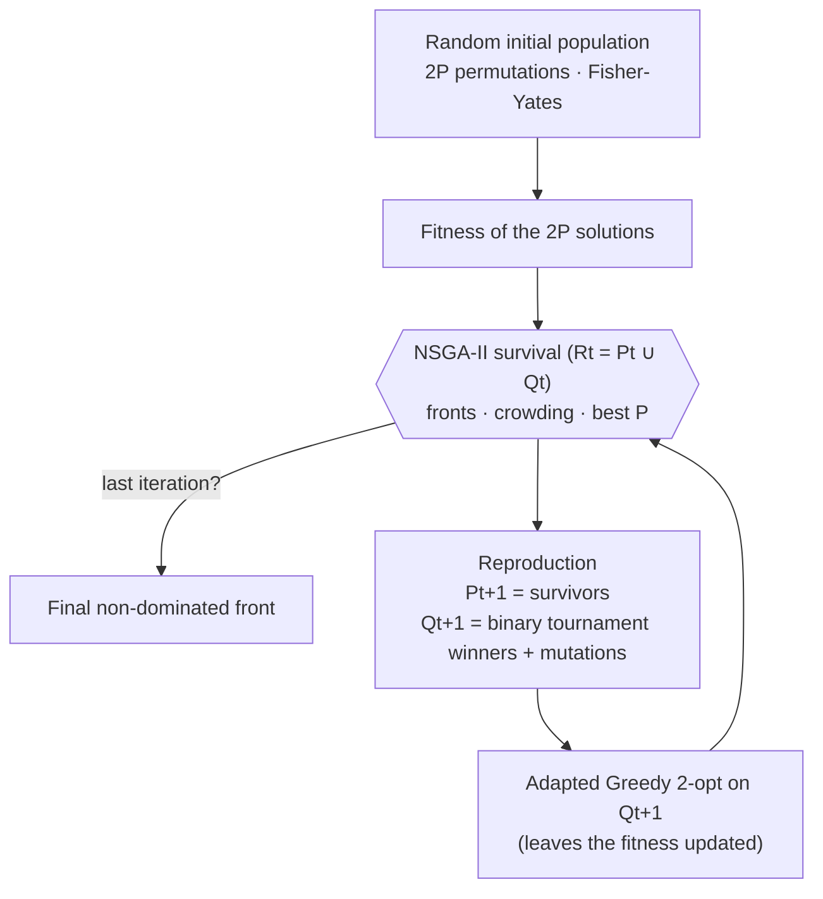
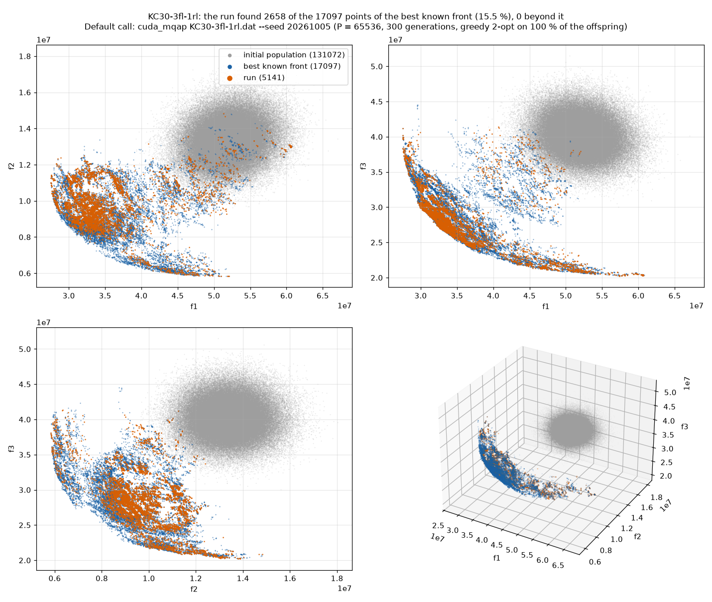
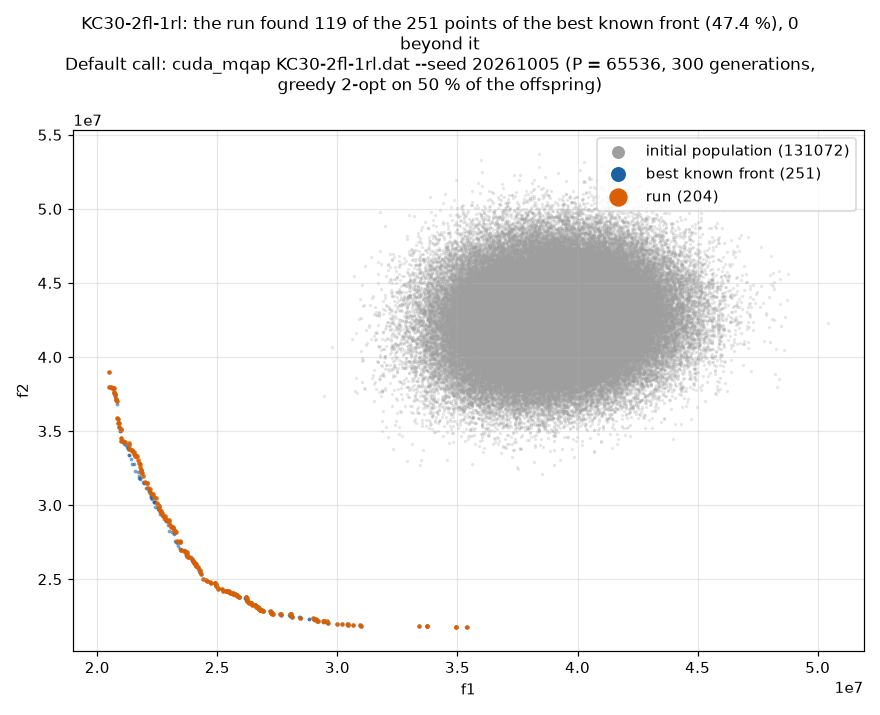
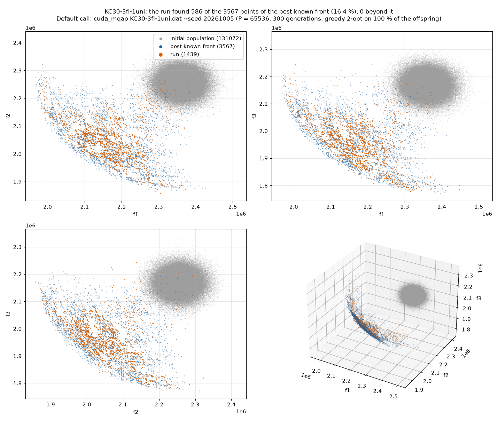
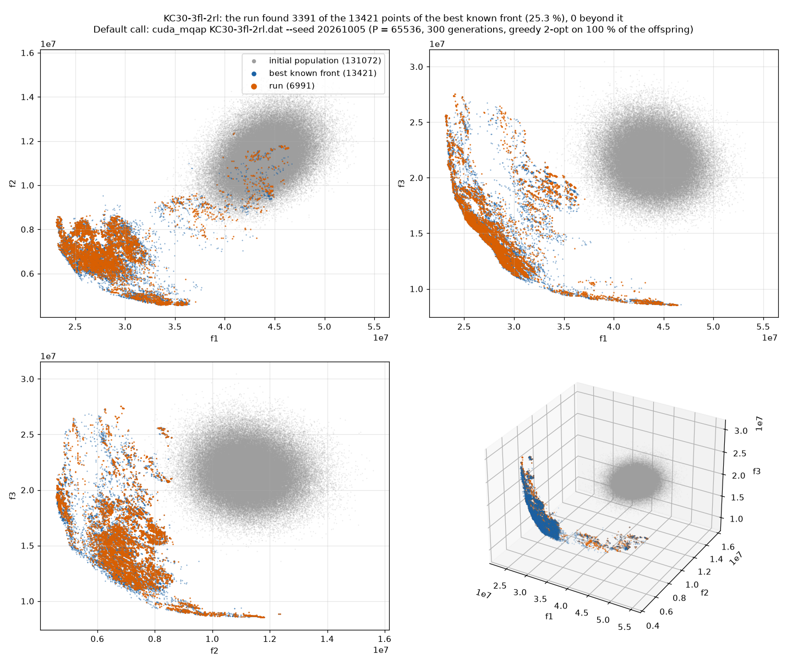
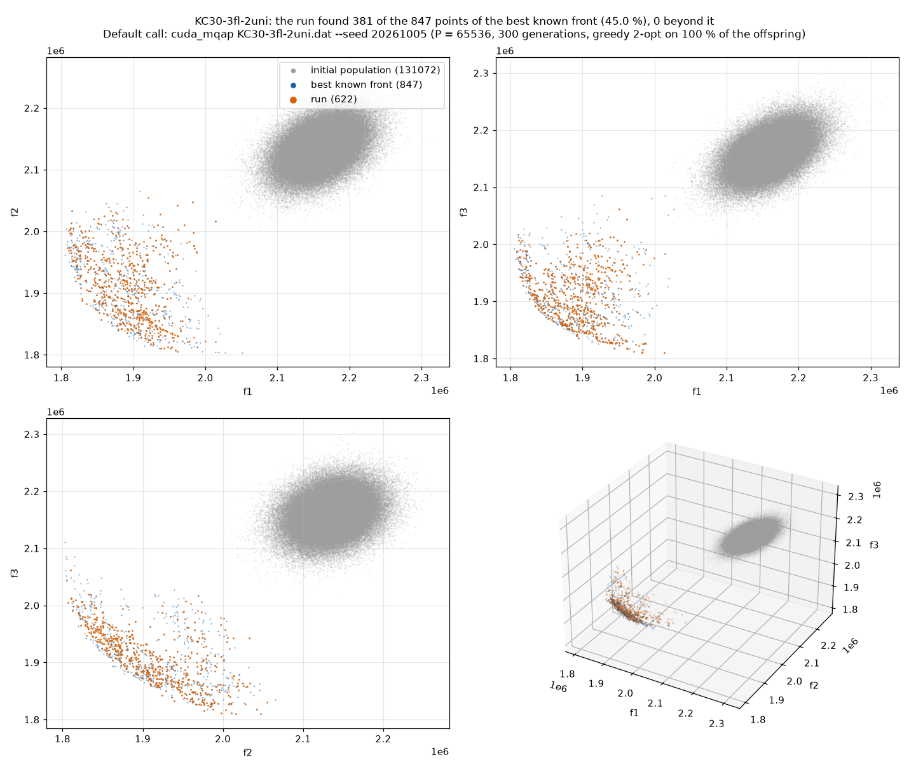
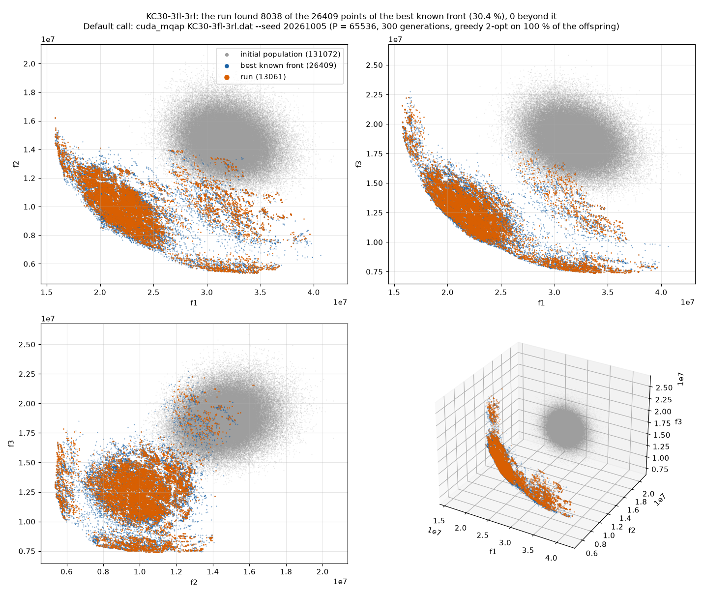
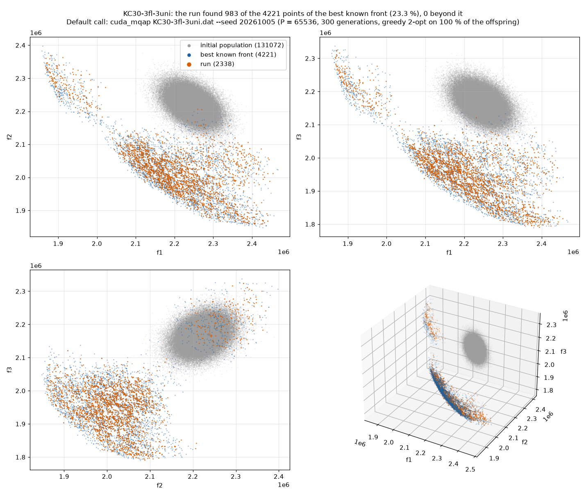

# cuda_mqap — NSGA-II + Adapted Greedy 2-opt in CUDA for the mQAP

**English** | [Español](LEEME.md)

GPU-parallel implementation (CUDA C++) of the multiobjective evolutionary algorithm **NSGA-II**,
combined with an **adapted Greedy 2-opt** local search, to solve instances of the
**multiobjective Quadratic Assignment Problem** (mQAP).

The whole algorithm runs on the GPU: fitness evaluation, non-dominated sorting,
[crowding distance](#g-crowding),
selection, mutation and local search. The host only copies the instance in before the loop and the
results out after it, so **it does not synchronize with the device inside the loop**. A generation takes **3 [kernel](#g-kernel) launches up to P = 256**, where the survival of each run
fits in one block; above that the multi-block survival adds a [cooperative
launch](#g-cooperative-launch) and the segmented sorts of [CUB](#g-cub) (NVIDIA's library of
parallel primitives), and it is 36 launches per generation from P = 512 to P = 4096 and 38 with P =
65536. **Several independent runs execute concurrently** in a single call to the program.

---

## Contents

1. [Features](#features)
2. [The problem: mQAP](#the-problem-mqap)
3. [The algorithm](#the-algorithm)
4. [Project architecture](#project-architecture)
5. [GPU design](#gpu-design)
6. [Requirements](#requirements)
7. [Build](#build)
8. [Usage](#usage)
9. [Experiments and metrics](#experiments-and-metrics)
10. [Visualizing the fronts](#visualizing-the-fronts)
11. [Tests and validation](#tests-and-validation)
12. [Performance](#performance)
13. [Improvements over the original version](#improvements-over-the-original-version)
14. [Population size limits and GPU resources](#population-size-limits-and-gpu-resources)
15. [Conclusions](#conclusions)
16. [Limitations and future work](#limitations-and-future-work)
17. [Troubleshooting](#troubleshooting)
18. [Glossary](#glossary)
19. [Credits and license](#credits-and-license)

---

## Features

**Algorithm**
- Complete NSGA-II: fast non-dominated sorting, crowding distance and
  [elitist (μ + λ)](#g-elitism) selection.
- Binary tournament selection, exchange mutation and transposition mutation (reversal of a segment).
- Greedy 2-opt adapted to several objectives: in each generation the improvement criterion is chosen at
  random, either the sum of all objectives or a single objective.
- The local search can be limited to a fraction of the offspring or to one generation in N
  (`--greedy-rate`, `--greedy-every`), and **each instance defaults to the configuration measured
  best for it**; see [The best configuration for each
  problem](#the-best-configuration-for-each-problem).
- Instances with 2 or 3 objectives (flow matrices) and up to 64 facilities. The loader rejects
  anything larger (`kMaxFacilities` in `include/config.h`), and with 3 objectives the effective
  limit is 63 on GPUs with 64 KB of *shared memory*, because the flow and distance matrices of a
  block already need 64 KB at n = 64. The multi-block survival does not change this: it only
  touches the survival, which does not depend on n.

**GPU performance**
- **O(n²)** fitness per chromosome (one [*warp*](#g-warp) per chromosome, with the matrices in
  [*shared memory*](#g-shared-memory)),
  instead of three O(n³) dense matrix products.
- Complete NSGA-II **on the GPU**: one block per run up to P = 256 (bit-packed dominance matrix in shared
  memory), and a multi-block survival with cooperative launch and segmented sorts (CUB) for P up to 65536.
- Greedy 2-opt with **O(n) [incremental (delta) evaluation](#g-delta)** of each swap; the local search of the whole
  offspring is a single kernel.
- Persistent [Philox](#g-philox) random states, initialized only once.
- **Independent runs in parallel** (`--runs R`) to use the whole GPU in experiment campaigns.

**Engineering**
- Strict host/device separation: `main.cpp` contains no CUDA code, and kernels are exposed through launcher functions.
- Instances read from the `.dat` files at runtime; parameters are passed on the command line, and
  the ones not given come from the table of the instance (`include/best_configuration.h`).
- `CUDA_CHECK`/`CUDA_CHECK_KERNEL` error checking and RAII memory management (`DeviceBuffer<T>`).
- **Plug and play in Visual Studio 2026**: clone, open `cuda_mqap.slnx`, press F5. The CUDA version,
  C++ toolset and GPU architectures adapt to the machine. Also `CMakeLists.txt` with `ctest`.
- Test suite that compares every kernel with an independent CPU implementation, plus the `--verify`
  option, which validates the results of every run.
- Reproducible results through a seed (`--seed`).

---

## The problem: mQAP

`n` facilities must be assigned to `n` locations. A solution is a permutation `p`, where `p[i]` is the
location of facility `i`. Each objective `k` has its own flow matrix `Fk`, and all of them share the
distance matrix `D`. The `m` costs are minimized simultaneously:

```
cost_k(p) = Σ_i Σ_j  Fk[i][j] · D[p(i)][p(j)]          k = 1..m   (m = 2 or 3)
```

This expression is equivalent to the matrix formulation `Trace(Fk · X · Dᵀ · Xᵀ)` used by the original
version, where `X` is the permutation matrix; the tests verify that equivalence. Because the objectives
conflict, the result is not a single solution but an approximation of the **Pareto front**: the set of
non-dominated solutions.

### Instances (`mQAPData/`)

The instances are Knowles and Corne's mQAP test suite
([archived page](https://web.archive.org/web/2019/http://www.cs.bham.ac.uk/~jdk/mQAP/)), taken from the copy at
<https://github.com/fredizzimo/keyboardlayout/tree/master/tests/mQAPData>. They are third-party data, not
covered by this project's license: see [Third-party data](#third-party-data).

| File | Content |
|---|---|
| `KC<n>-<m>fl-<type>.dat` | Header (`facilities = 10 objectives = 2 …` or `facilities: 10 objectives: 2 …`), the `n×n` distance matrix and `m` `n×n` flow matrices |
| `KC10-2fl-*.PO` | Published Pareto optimal front: each line holds a 1-based permutation and its `m` costs |

`rl` instances have *real-like* distances and flows, and `uni` instances have uniform values.
There are 23 instances with n = 10, 20 and 30, and the optimal fronts of the 8 KC10 instances.

---

## The algorithm


```mermaid
flowchart TD
    A[Random initial population<br/>2P permutations · Fisher-Yates] --> B[Fitness of the 2P solutions]
    B --> C{{"NSGA-II survival (Rt = Pt ∪ Qt)<br/>fronts · crowding · best P"}}
    C -->|last iteration?| Z[Final non-dominated front]
    C --> D["Reproduction<br/>Pt+1 = survivors<br/>Qt+1 = binary tournament winners + mutations"]
    D --> E["Adapted Greedy 2-opt on Qt+1<br/>(leaves the fitness updated)"]
    E --> C
```

Each generation does the following:

1. **NSGA-II survival** over the `2P` solutions of `Rt = Pt ∪ Qt`:
   - *Non-dominated sorting*: [rank](#g-rank) 1 for the first [Pareto front](#g-pareto-front),
     rank 2 for the next one, and so on.
   - *Crowding distance* of each front. For each objective the members of the front are sorted; the
     extremes get ∞ and the interior points add `(f[next] − f[previous]) / (max − min)`, with the maximum
     and minimum taken over the whole population.
   - The best `P` solutions by (rank ascending, crowding descending) are selected.
2. **Reproduction**. The `P` survivors form `Pt+1`. For each of them a **binary tournament** is held
   against another survivor chosen at random: the lower rank wins and, on a tie, the larger crowding.
   The winner is copied and mutated:
   - **Exchange mutation**: two random genes are swapped; it is applied twice.
   - **Transposition mutation**: the segment between two random positions is reversed.
3. **Adapted [Greedy 2-opt](#g-greedy-2opt)** on the offspring the configuration says — all of them
   unless `--greedy-rate` or `--greedy-every` say otherwise. The pairs of positions are visited in
   the order of the original version — `r` over `[0, n−2]`, `s` over `[1, n−1]`, skipping `r == s`,
   so most pairs are visited in both orders — and a swap is kept if it does not worsen the criterion
   of the generation, chosen at random for each run and generation: the sum of all objectives or a
   single objective `k`. Revisiting a pair after an accepted swap can improve it again, and that is
   what makes the quality match the original version; see [Quality versus the original Greedy
   2-opt](#quality-vs-original). The idea of adapting the criterion comes from
   <https://arxiv.org/ftp/arxiv/papers/1109/1109.1276.pdf>.

Parameters:

| Parameter | Where | Default |
|---|---|---|
| Population size `P` | `--population` | the one of the instance, or 64 (power of 2 between 16 and 65536) |
| Generations | `--iterations` | the ones of the instance, or 70 |
| Fraction of the offspring with local search | `--greedy-rate` | the one of the instance, or 1.0 |
| Generations between local searches | `--greedy-every` | the one of the instance, or 1 |
| Independent runs | `--runs` | 1 |
| Seed | `--seed` | random (printed) |
| Exchange mutations per child | `include/config.h` (`kExchangeMutations`) | 2 |
| Exchange / transposition probability | `include/config.h` | 1.0 / 1.0 |
| Pair traversal of the greedy 2-opt | `include/config.h` (`kGreedyFullPairs`) | `true`: the one of the original version, `(n−1) + (n−2)²` trials |

---

## Project architecture

```
cuda_mqap/
├── include/
│   ├── best_configuration.h  Configuration measured best for each instance, used as its defaults
│   ├── config.h            Limits (n, P, objectives) and operator parameters
│   ├── cuda_check.cuh      CUDA_CHECK / CUDA_CHECK_KERNEL
│   ├── device_buffer.cuh   DeviceBuffer<T>: GPU memory with RAII
│   ├── device_common.cuh   Shared __device__ functions (per-warp cost, greedy 2-opt delta, bitonic sort)
│   ├── instance.h          Instance struct, loadInstance(), reference CPU cost()
│   ├── kernels.cuh         Declaration of the kernel launchers and of the memory layout
│   ├── solver.h            SolverOptions, Solution, RunResult, solve()
│   └── survival_workspace.cuh   Buffers of the multi-block survival (allocated once)
├── src/
│   ├── main.cpp            Command line, result file and --verify (host only)
│   ├── instance.cpp        .dat parser and validation (including fitness overflow)
│   ├── solver.cu           Host orchestration: allocations, generation loop and result collection
│   ├── fitness.cu          Fitness kernel
│   ├── nsga2.cu            NSGA-II survival kernel (one block per run, P ≤ 256)
│   ├── nsga2_multiblock.cu NSGA-II survival across several blocks (P > 256)
│   ├── operators.cu        RNG, initial population, tournament and mutations
│   └── local_search.cu     Greedy 2-opt kernel
├── tests/test_kernels.cu   Tests of every kernel against CPU references
├── scripts/run_experiments.ps1   Experiment campaign with the parameters of each instance
├── scripts/run_convergence.ps1   Traces of every generation and their analysis (see below)
├── scripts/analyze_convergence.py   Hypervolume, stagnation and coverage of the optimal front
├── scripts/run_original_comparison.ps1   Comparison against the original version, many runs each
├── scripts/prepare_original.py   Build tree of the original version for one instance
├── scripts/compare_versions.py   Hypervolume, coverage and Mann-Whitney between two versions
├── scripts/run_rate_grid.ps1     Grid of population x greedy configuration, per instance
├── scripts/analyze_rate_grid.py  Scores the cells of the grid and reports the best configuration
├── scripts/build_reference.py    Builds the best known front of an instance (.KBP)
├── scripts/run_front_plot.ps1    Default run of each instance, plotted against its best known front
├── scripts/plot_fronts.py        Best known front, final front and initial population, in HTML and PNG
├── examples/fronts/        Output of run_front_plot.ps1 for the seven KC30 instances, HTML and PNG
├── mQAPData/               Instances (.dat) and optimal fronts (.PO)
├── reference/v0.x/         Best known fronts (.KBP) by version, with their summary.json
├── mQAPMetrics/            Node.js metric and 3D plot scripts
├── comparative_results_kcX_datasets.xlsx   Comparative results
├── cuda_mqap.slnx, cuda_mqap.vcxproj, test_kernels.vcxproj   Visual Studio solution and projects
├── cuda_mqap.props, cuda_toolkit.props   Shared settings and CUDA version detection
├── .vsconfig, .gitattributes             Visual Studio components and line endings
└── CMakeLists.txt
```

**Host/device separation.** The program is organized in three layers:

| Layer | Files | Responsibility |
|---|---|---|
| Application (host) | `main.cpp`, `instance.cpp` | Arguments, instance loading, result output and CPU verification |
| Orchestration (host) | `solver.cu` | Allocation of all memory once, launch sequence and final copy of the results |
| Kernels (device) | `fitness.cu`, `nsga2.cu`, `operators.cu`, `local_search.cu` | `template<int OBJ>` kernels (instantiated for 2 and 3 objectives) and their launchers |

The kernels live in the `mqap::detail` namespace. Outside their `.cu` file only the launchers declared in
`kernels.cuh` are visible (`launchFitness`, `launchSurvival`, `launchReproduce`, `launchGreedy2Opt`…),
and each one checks its launch with `CUDA_CHECK_KERNEL()`.

---

## GPU design

### Memory layout

For `R` runs, population `P`, `n` facilities and `OBJ` objectives:

| Buffer | Type and shape | Description |
|---|---|---|
| `genes` (×2, double buffer) | `short [R][2P][n]` | Rows `[0, P)`: survivors; rows `[P, 2P)`: offspring |
| `fitness` (×2) | `unsigned int [R][2P][OBJ]` | Cost of each objective |
| `survivorIndex / Rank / Crowding` | `[R][P]` | Survival result, ordered by (rank, −crowding) |
| `rng` | `curandStatePhilox4_32_10_t [R][2P]` | Persistent random states |
| `flow`, `dist` | `int [OBJ][n][n]`, `int [n][n]` | Instance matrices |

All memory is allocated **once** with `DeviceBuffer<T>` and released automatically. Between
generations only the pointers of the double buffer are swapped.

### Kernels

| Kernel | Grid × block | Parallelism | Techniques |
|---|---|---|---|
| `fitnessKernel<OBJ>` | `(⌈2P/4⌉, R)` × 128 | 1 warp per chromosome | `F` and `D` in *shared memory* (coalesced load); consecutive `F` reads per lane (no bank conflicts); reduction with `__shfl_down_sync` |
| `survivalKernel<OBJ>` (P ≤ 256) | `R` × `2P` | 1 block per run, 1 thread per individual | Bit-packed dominance (`2P × 2P/32` words), fronts with `__ballot_sync` + `__popc`, bitonic sort of 64-bit keys `(rank, fitness)` and `(rank, −crowding)` in *shared memory* |
| `reproduceKernel<OBJ>` | `(⌈P/128⌉, R)` × 128 | 1 thread per offspring | Philox state in registers; tournament, mutations and copy in a single pass |
| `greedy2OptKernel<OBJ>` | `(⌈P/4⌉, R)` × 128 | 1 warp per offspring | Matrices in *shared memory*; O(n) delta split across the 32 lanes; warp-uniform criterion (no divergence) |
| `initPopulationKernel` | `(⌈2P/128⌉, R)` × 128 | 1 thread per chromosome | Unbiased Fisher-Yates |
| `rngInitKernel` | `⌈R·2P/128⌉` × 128 | 1 thread per state | One independent Philox subsequence per thread |
| Multi-block survival (P > 256) | `(⌈2P/256⌉, R)` × 256, plus a cooperative launch | 1 thread per individual across the whole grid | Dominator counts with fitness tiles in *shared memory*, front peeling with `grid.sync()`, crowding and selection with segmented sorts (CUB) |

*Shared memory* per block:
- **Fitness and greedy 2-opt:** `(OBJ + 1)·n²·4 + 4·n·2` bytes, e.g. 14.6 KB for n = 30 and 3 objectives.
  When more than 48 KB are needed, the device's maximum *opt-in* is requested automatically
  (`cudaFuncAttributeMaxDynamicSharedMemorySize`), which allows n = 63 with 3 objectives on Turing,
  whose opt-in maximum is 64 KB: n = 63 needs 64,008 bytes and n = 64 needs 66,048, which the loader
  rejects.
- **Survival:** up to 46 KB with P = 256 (single-block path; 47,168 bytes with 3 objectives). The multi-block path (P > 256) only uses
  fitness tiles of about 3 KB; see [Population size limits](#population-size-limits-and-gpu-resources).

### Incremental evaluation of the greedy 2-opt

Swapping positions `r` and `s` of `p` only changes the cost terms in which `r` or `s` appear:

```
Δ(r,s) = (F_rr − F_ss)(D_{ps ps} − D_{pr pr}) + (F_rs − F_sr)(D_{ps pr} − D_{pr ps})
       + Σ_{k≠r,s} [ (F_kr − F_ks)(D_{pk ps} − D_{pk pr}) + (F_rk − F_sk)(D_{ps pk} − D_{pr pk}) ]
```

Each lane of the warp computes part of the sum and the result is reduced with `__shfl_down_sync`.
Each of the `(n−1) + (n−2)²` evaluations of the traversal (343 at n = 20) therefore costs O(n) instead
of recomputing the full fitness.
The accumulators are 64-bit.

### Synchronization

- All kernels are launched on the *default stream*, which already guarantees their order, so
  `cudaDeviceSynchronize` is not used during the run.
- The host only waits at the end (`cudaEventSynchronize`), to measure the time and copy the results.
- Inside the kernels, `__syncthreads()` only separates phases that share *shared memory*, and
  `__syncwarp()` makes the swap applied by the greedy 2-opt visible to the whole warp.
- The multi-block survival (P > 256) peels the Pareto fronts with a **cooperative launch**: the whole
  grid synchronizes with `grid.sync()` between the phases of each front, inside the kernel, without going
  back to the host.
- `--trace` is the exception: it copies the survivors once per generation, so a traced run does
  synchronize with the device and its time is not comparable with a normal one. `--initial` is not:
  its copy is device to device, queued on the stream, and reaches the host after the timer.
- In Debug builds, `MQAP_SYNC_CHECK` makes `CUDA_CHECK_KERNEL()` synchronize after every kernel, so an
  execution error is reported at the launch that caused it.

---

## Requirements

- NVIDIA GPU with *compute capability* ≥ 7.5 (GeForce RTX 20xx or newer) and an up-to-date driver.
- **Visual Studio 2026** with the *Desktop development with C++* workload. When the solution is opened,
  Visual Studio reads `.vsconfig` and offers to install any missing component.
- **CUDA Toolkit 12.x or 13.x** (≥ 11.8), installed **after** Visual Studio so that its *Visual Studio
  Integration* is added to it. The project detects the installed version automatically; it was developed
  with CUDA 13.4.
- Alternative without the IDE: CMake ≥ 3.24 + Ninja (both included with Visual Studio).

---

## Build

### Open in Visual Studio 2026 (plug and play)

```
git clone https://github.com/apupiales/cuda_mqap.git
cd cuda_mqap
git checkout develop_large_population_multiblock
start cuda_mqap.slnx
```

1. Visual Studio opens the solution with its two projects: `cuda_mqap` (the program, startup project) and
   `test_kernels` (the tests).
2. Select `Release | x64` and press **F5** (or Ctrl+F5). The program runs on
   `mQAPData\KC10-2fl-1rl.dat --verify` with the repository root as working directory. Edit the arguments
   in *Project → Properties → Debugging*.
3. To run the tests: right-click `test_kernels` → *Set as Startup Project* → Ctrl+F5.
4. The executables are written to `build\x64\<Configuration>\`.

Nothing depends on the machine where the project was created:

| What | How it adapts |
|---|---|
| CUDA version | `cuda_toolkit.props` takes it from `CUDA_PATH` (e.g. `...\CUDA\v12.6` → `CUDA 12.6.props`). To use another installed version: `set CudaVersion=12.6` before opening VS, or `msbuild /p:CudaVersion=12.6` |
| Missing CUDA integration | The build stops with a message that explains how to fix it (instead of "unknown item type CudaCompile") |
| C++ toolset | `$(DefaultPlatformToolset)` of the Visual Studio that opens it (v145 in VS 2026); Windows SDK `10.0` (the latest installed) |
| GPU | Native code for `sm_75`, `sm_80`, `sm_86` and `sm_89`, plus PTX that the driver compiles for newer GPUs (RTX 50xx) |
| Paths | All relative to the repository (`$(MSBuildThisFileDirectory)`); outputs in `build\` (ignored by git) |
| Line endings | `.gitattributes` keeps CRLF for the Visual Studio files |

The common configuration is in `cuda_mqap.props`: C++17, `/W4`, `-lineinfo` in Release, and `-G` plus
`MQAP_SYNC_CHECK` in Debug.

### CMake

```
cmake -S . -B build/cmake -G Ninja -DCMAKE_BUILD_TYPE=Release
cmake --build build/cmake
ctest --test-dir build/cmake --output-on-failure
```

By default it builds `sm_75`, `sm_80`, `sm_86` and `sm_89` plus PTX; for your GPU only use
`-DCMAKE_CUDA_ARCHITECTURES=native`. In Visual Studio you can also use *File → Open → Folder*.

### nvcc directly

From an *x64 Native Tools* console:

```
nvcc -O3 -arch=sm_75 -std=c++17 -Iinclude src\main.cpp src\instance.cpp src\solver.cu src\fitness.cu ^
     src\nsga2.cu src\nsga2_multiblock.cu src\operators.cu src\local_search.cu -o cuda_mqap.exe
```

---

## Usage

Without options, the population, the generations and the greedy 2-opt settings are the ones measured best
for the instance ([The best configuration for each
problem](#the-best-configuration-for-each-problem)); every option given overrides them.

```
cuda_mqap <instance.dat> [options]
  --population P   population size, power of two in [16, 65536] (default: of the instance, or 64)
  --iterations N   generations (default: of the instance, or 70)
  --greedy-rate R  fraction of the offspring the greedy 2-opt improves, in [0, 1]
  --greedy-every K the local search runs every K generations (default: of the instance, or 1)
  --untuned        ignore the table of the instance: population 64, 70 generations, greedy at 100 %
  --runs R         independent runs executed concurrently (default 1)
  --seed S         random seed (default: random, printed in the output)
  --output FILE    result file, appended (default result_<instance>_nsga2_greedy_2opt.txt)
  --trace FILE     write the front of every generation to FILE (CSV, overwritten)
  --trace-max N    points kept per run and generation in the trace (default 4096)
  --trace-every K  record the front every K generations, plus the last one (default 1)
  --initial FILE   write the initial population of every run to FILE (CSV, overwritten)
  --verify         check the final populations on the CPU
  --quiet          do not print the final solutions
```

Examples:

```
:: With the configuration measured best for the instance
build\x64\Release\cuda_mqap.exe mQAPData\KC10-2fl-1rl.dat --verify

:: With the generic configuration, P = 64 and 70 generations
build\x64\Release\cuda_mqap.exe mQAPData\KC10-2fl-1rl.dat --untuned --verify

:: 30 independent runs in parallel, reproducible
build\x64\Release\cuda_mqap.exe mQAPData\KC20-2fl-1rl.dat --runs 30 --seed 2026 --quiet

:: 3-objective instance with a small population
build\x64\Release\cuda_mqap.exe mQAPData\KC30-3fl-1rl.dat --population 32 --runs 10
```

Console output of the second one, the generic one, which is the one that fits in a few lines:

```
Instance KC10-2fl-1rl: n = 10, objectives = 2 | population = 64, iterations = 70, runs = 1, seed = 42
Greedy 2-opt on 100 % of the offspring | --untuned: generic defaults

FINAL SOLUTION (run 0, 37 non-dominated)
5 1 3 4 0 6 2 8 7 9 1665490 5884156
0 3 6 1 9 4 8 7 5 2 5925064 2282788
5 0 6 3 1 2 8 9 7 4 1874454 4641012
...
Verification: OK

Results appended to result_KC10-2fl-1rl_nsga2_greedy_2opt.txt
Time Spent: 0.112270 s (GPU 12.258 ms)
```

### The default call of each instance

With no options at all, the program takes the configuration measured best for the instance, so the
call is just the file of the instance:

```
build\x64\Release\cuda_mqap.exe mQAPData\KC10-2fl-1rl.dat
```

The second column of the table is the equivalent command written out. It gives exactly the same run
— checked byte for byte on KC10-2fl-1uni, KC10-2fl-2rl and KC10-2fl-2uni — and, carrying
`--untuned`, it does not depend on the table: it will keep meaning the same even if the table
changes. To either form the usual options are then added, `--runs`, `--seed`, `--verify`,
`--output`:

| Instance | Equivalent options |
|---|---|
| KC10-2fl-1rl | `--population 16384 --iterations 70 --greedy-rate 0.5 --untuned` |
| KC10-2fl-1uni | `--population 1024 --iterations 70 --greedy-rate 0.25 --untuned` |
| KC10-2fl-2rl | `--population 1024 --iterations 70 --greedy-rate 0.1 --untuned` |
| KC10-2fl-2uni | `--population 256 --iterations 70 --greedy-rate 0.1 --untuned` |
| KC10-2fl-3rl | `--population 16384 --iterations 70 --greedy-rate 0.1 --untuned` |
| KC10-2fl-3uni | `--population 65536 --iterations 70 --greedy-rate 0.1 --untuned` |
| KC10-2fl-4rl | `--population 16384 --iterations 70 --greedy-rate 0.1 --untuned` |
| KC10-2fl-5rl | `--population 16384 --iterations 70 --greedy-rate 0.1 --untuned` |
| KC20-2fl-1rl | `--population 65536 --iterations 300 --greedy-rate 0.25 --untuned` |
| KC20-2fl-1uni | `--population 65536 --iterations 300 --greedy-rate 1.0 --greedy-every 2 --untuned` |
| KC20-2fl-2rl | `--population 65536 --iterations 300 --greedy-rate 0.25 --untuned` |
| KC20-2fl-2uni | `--population 65536 --iterations 300 --greedy-rate 0.1 --untuned` |
| KC20-2fl-3rl | `--population 65536 --iterations 300 --greedy-rate 0.25 --untuned` |
| KC20-2fl-3uni | `--population 65536 --iterations 300 --greedy-rate 1.0 --untuned` |
| KC20-2fl-4rl | `--population 65536 --iterations 300 --greedy-rate 0.1 --untuned` |
| KC20-2fl-5rl | `--population 65536 --iterations 300 --greedy-rate 0.25 --untuned` |
| KC30-2fl-1rl | `--population 65536 --iterations 300 --greedy-rate 0.5 --untuned` |
| KC30-3fl-1rl | `--population 65536 --iterations 300 --greedy-rate 1.0 --untuned` |
| KC30-3fl-1uni | `--population 65536 --iterations 300 --greedy-rate 1.0 --untuned` |
| KC30-3fl-2rl | `--population 65536 --iterations 300 --greedy-rate 1.0 --untuned` |
| KC30-3fl-2uni | `--population 65536 --iterations 300 --greedy-rate 1.0 --untuned` |
| KC30-3fl-3rl | `--population 65536 --iterations 300 --greedy-rate 1.0 --untuned` |
| KC30-3fl-3uni | `--population 65536 --iterations 300 --greedy-rate 1.0 --untuned` |

It is worth knowing what it costs: on 15 of the 23 instances the best configuration is the
population cap with 300 generations, so a call with no options is minutes of GPU, not seconds.
`--untuned` on its own goes back to the generic configuration — population 64, 70 generations,
greedy at 100 % — which is the one the measurement scripts of the repository use.

The instances the table does not list use that generic configuration too, and the program says so
when it starts, on the line after the one with the instance.

### Result file

It keeps the original format, so the `mQAPMetrics` scripts still work. Each run appends a block with
the non-dominated (rank 1) solutions of the final population: the key is the permutation and the value,
its costs.

```
{
'0361948752': [5925064, 2282788],
'5134062879': [1665490, 5884156],
'5163028974': [1869616, 4670952],
},
```

The final population usually holds the same solution many times, because it converges and the survivors
are copies of each other. **The front is written without repetitions:** every distinct non-dominated
solution appears once, in the order NSGA-II gives it. The whole population, repetitions included, is what
`--verify` checks and what the final population of the run is.

### Verification (`--verify`)

Independently recomputes on the CPU every solution of the final population of every run, checking:
- that the permutation is valid;
- that the fitness matches the CPU `cost()` exactly;
- that rank 1 corresponds exactly to the non-dominated solutions (and that every solution with rank > 1
  is dominated by some survivor).

With `--initial`, it also checks the permutations and the fitness of the whole initial population.

If any check fails, the exit code is 1.

---

## Experiments and metrics

`scripts/run_experiments.ps1` runs the campaign of `comparative_results_kcX_datasets.xlsx` with the
population and iterations each instance used in the original version:

```
.\scripts\run_experiments.ps1 -Runs 30                              # all instances
.\scripts\run_experiments.ps1 -Runs 10 -Seed 2026 -Instances KC10-2fl-1rl,KC30-3fl-1rl
```

### How many generations each instance needs (`--trace`)

`--trace FILE` writes a CSV with `run,generation,f1,f2[,f3]`: the distinct non-dominated solutions of
**every** generation of every run, from the survival of the initial population (generation 0) to the
final front. It copies the survivors to the host once per generation, so it synchronizes with the device
and **the time of a traced run is not comparable** with a normal one; the copy is negligible next to a
generation with a large population, and noticeable with a small one.

`scripts/run_convergence.ps1` records the traces and analyses them with
`scripts/analyze_convergence.py`, which reports, per instance:

| Indicator | Meaning |
|---|---|
| `t_stall` | First generation after which the [hypervolume](#g-hypervolume) grows less than `--epsilon` (relative) during `--patience` generations. The survival is elitist, so the hypervolume can only grow: a flat curve is real stagnation, not noise |
| `t_final` | First generation whose front already equals the last one. It needs no reference data and says when nothing new is found again |
| `t_optimum` | First generation that covers the published `.PO` front. Only the KC10 instances have one |
| `coverage` | [Share of the optimal front](#g-coverage) found at the end |

The reference point of the hypervolume is fixed for the whole file (the worst corner of generation 0),
so the generations and the runs are comparable with each other. The three generation numbers are random
variables — every run stagnates at a different point — so the summary reports the median and the 90th
percentile over the runs, never a single value.

```
.\scripts\run_convergence.ps1 -Population 1024 -Iterations 200 -Runs 30
.\scripts\run_convergence.ps1 -Population 4096 -Iterations 300 -Instances KC10-2fl-1rl
python scripts\analyze_convergence.py results\convergence\*.csv --patience 30 --epsilon 1e-5
```

`--iterations` must be clearly above the expected stagnation or the measurement reports the cap instead;
the analysis warns when a run is still improving at the last generation. The per-generation curves are
written to `results/convergence/curves/<instance>_curve.csv` (median hypervolume, its fraction of the
final value and the median front size), ready to plot.

The generation count depends strongly on the population, so the useful answer is the total cost: the
time of a generation is known for each P (see [Performance](#performance)), so
`generations × time per generation` tells which pair (P, generations) reaches the target sooner.

#### Results of the campaign (RTX 2060, 2026-09-26)

Three populations per instance: P = 1024 capped at 2000 generations (30 runs on the 2-objective
instances, 10 on the 3-objective ones), and P = 16384 and P = 65536 with the cap each instance
needed, from 300 generations on KC10 to 100,000 on KC30-3fl-1rl, KC30-3fl-1uni and KC30-3fl-2uni.

Everything is measured on the same scale, and getting there took two decisions worth stating:

- **Quality is a share of a [reference front](#g-reference-front), not of the run itself.** On KC10
  that front is the published optimum, so the figure is the share of the optimal hypervolume. On
  KC20 and KC30 there is no published optimum, so the reference is the best front the campaign
  knows: the non-dominated union of the final fronts of every run and every population. Normalizing
  each run against its own last generation makes a 100 % appear by construction and hides the
  difference between populations.
- **The stagnation test uses the same window everywhere** (`--hv-window`): 20 generations on KC10
  and KC20, 50 on KC30. With each file picking its own window from the cost, the 3-objective
  instances looked like they stagnated far earlier than their traces say, and most of that
  difference was the window, not the algorithm.

**Generations until the front stops changing.** This is the number to use for `--iterations`: past
it. Each cell gives the median and the 90th percentile over the runs, because what a budget has to
cover is the slowest run. A "> N" means that with a cap of N generations the front was still
changing, so there the figure is the budget and not the measurement; the cap was raised until it
stopped being so wherever that was affordable. A "†" marks that the 90th percentile reached the cap
although the median did not: there the slowest run was still changing.

| Instance | P = 1024 | P = 16,384 | P = 65,536 |
|---|---|---|---|
| KC10-2fl-2uni | 1 | 1 | 5 |
| KC10-2fl-1uni | 19 · 42 | 4.5 · 6.1 | 10 · 13 |
| KC20-2fl-2uni | 80.5 · 1030.8 | 23.5 · 414.4 | 15 · 23 |
| KC10-2fl-2rl | 86 · 283.5 | 5.5 · 14.2 | 10 · 15 |
| KC10-2fl-1rl | 148 · 256.8 | 6 · 11.6 | 10 · 15 |
| KC10-2fl-5rl | 495 · 1471.5 | 12.5 · 159.4 | 20 · 83 |
| KC10-2fl-3rl | 816.5 · 1582.1 | 70 · 121.0 | 65 · 217 |
| KC10-2fl-4rl | 1301.5 · 1794.4 | 98.5 · 257.7 | 35 · 268 |
| KC10-2fl-3uni | 1333 · 1765.7 | 131.5 · 194.6 | 50 · 147 |
| KC20-2fl-1rl | 1552.5 · 1919.3 † | 2157 · 2870 † | 1325 · 1859 |
| KC20-2fl-1uni | 1851 · 1940.3 † | 2302 · 2731.4 | 700 · 900 |
| KC20-2fl-3uni | > 2000 | 93,050 · 98,045 † | 8950 · 9388 |
| KC30-3fl-2uni | > 2000 | > 5000 | > 100,000 |
| KC30-3fl-1uni | > 2000 | > 5000 | > 100,000 |
| KC30-3fl-1rl | > 2000 | > 5000 | > 100,000 |

**Quality reached.** Each cell has two numbers measured against the same reference front,
[`reference/v0.1`](#reference-versions), so the three columns can be read side by side:

- The **first is the [hypervolume](#g-hypervolume)** of the front the run ended with, as a share of
  the one the reference front dominates. It answers "how much of the interesting region of the
  objective space does this front cover", and it saturates quickly: a handful of well placed
  solutions already captures most of the volume.
- The **second is the [coverage](#g-coverage)**: how many points of the reference front the run
  actually found, as a share. It answers "how many distinct trade-offs does this front offer", and
  it is what separates the configurations.

KC30-3fl-2uni makes it obvious. Its reference front has 821 points in `v0.1`: with P = 1024 the run dominates
92.54 % of its volume having found 9.5 % of its points, about 78, and with P = 65536 it dominates
99.52 % having found 76.8 %, about 630. Almost the same volume, many more solutions to choose from.

| Instance | P = 1024 | P = 16,384 | P = 65,536 |
|---|---|---|---|
| KC10-2fl-2rl | 100 % · 100 % | 100 % · 100 % | 100 % · 100 % |
| KC10-2fl-2uni | 100 % · 100 % | 100 % · 100 % | 100 % · 100 % |
| KC10-2fl-1rl | 99.90 % · 74.1 % | 99.90 % · 74.3 % | 99.90 % · 76.2 % |
| KC20-2fl-1rl | 99.88 % · 87.6 % | 99.95 % · 95.0 % | 99.99 % · 95.8 % |
| KC10-2fl-1uni | 99.84 % · 84.6 % | 99.84 % · 84.6 % | 99.84 % · 84.6 % |
| KC10-2fl-3uni | 99.80 % · 71.3 % | 99.80 % · 72.0 % | 99.80 % · 72.8 % |
| KC10-2fl-5rl | 99.80 % · 52.6 % | 99.80 % · 53.5 % | 99.81 % · 54.7 % |
| KC20-2fl-1uni | 99.79 % · 75.8 % | 99.99 % · 97.5 % | 99.98 % · 98.0 % |
| KC20-2fl-3uni | 99.49 % · 54.2 % | 99.99 % · 97.2 % | 99.98 % · 94.2 % |
| KC10-2fl-4rl | 99.36 % · 45.6 % | 99.36 % · 46.2 % | 99.38 % · 49.1 % |
| KC20-2fl-2uni | 99.31 % · 70.4 % | 99.93 % · 92.5 % | 100 % · 100 % |
| KC10-2fl-3rl | 99.15 % · 54.5 % | 99.15 % · 55.1 % | 99.19 % · 57.1 % |
| KC30-3fl-1rl | 95.97 % · 1.3 % | 98.42 % · 28.3 % | 99.70 % · 74.3 % |
| KC30-3fl-2uni | 92.54 % · 9.5 % | 97.56 % · 43.3 % | 99.52 % · 76.8 % |
| KC30-3fl-1uni | 91.22 % · 2.0 % | 96.81 % · 23.4 % | 99.03 % · 61.3 % |

What the campaign says:

- **The hypervolume barely separates the 2-objective instances.** Every KC10 and KC20 configuration
  lands between 99.15 % and 100 % of its reference, and on KC10 that reference is the published
  optimum: the front found dominates practically the same volume as the optimum even with P = 1024.
- **What does separate them is how many solutions of that front they find.** On KC20-2fl-3uni it
  goes from 54.2 % of the reference points with P = 1024 to 94.2 % with P = 65536, and on
  KC30-3fl-1rl from 1.3 % to 74.3 %. A small population returns a front worth almost the same in
  volume with far fewer distinct solutions.
- **More population needs fewer generations**: the median of KC10-2fl-4rl goes from 1301.5
  generations to 35. A generation is not a fixed amount of work — with P = 65536 it evaluates 64
  times more offspring than with P = 1024 — so this says nothing about total time: on KC10-2fl-1rl a
  generation costs 0.82 ms per run with P = 1024 and 105 ms with P = 65536.
- **On KC10 there is a ceiling that neither the population nor the generations break**:
  KC10-2fl-1uni stays at 84.6 % of the published optimal points with all three populations. What is
  left is the algorithm: this combination of NSGA-II with the greedy 2-opt converges to a subset of
  the optimal front.
- **The 3-objective instances never stop**: KC30-3fl-1rl was still improving at generation 100,000
  with P = 65536, having reached 99.70 % of the reference hypervolume. Going from 5000 to 100,000
  generations added 0.21 points, measured on the trace curves. There the number of generations is a
  budget decision, not a measurement.

<a id="reference-versions"></a>

**The reference fronts are in the repository, by version**, so the percentages can be checked and the
fronts plotted or compared. On KC10 it is the published optimum, `mQAPData/<instance>.PO`, third-party
data that is never modified. On KC20 and KC30 it is the best front this project knows, written as a
`.KBP` file in the same format as a `.PO` — a 1-based permutation and its costs per line — and kept in
`reference/<version>/`, one directory per version.

**Every table of this document says which version it was measured against**, and the paragraph after
the table records which one each uses.
A solution that no front of a version dominates is always added, which does not invalidate what was
published against an earlier version: it says the best known front improved. A published version is never
edited; the addition creates the next directory. The rule and the command are in
[`reference/README.md`](reference/README.md).

| Instance | Reference front | `v0.1` | `v0.2` | `v0.3` |
|---|---|---|---|---|
| KC10-2fl-* | published optimum | 1 to 130, in [`mQAPData/*.PO`](mQAPData/) | the same, never versioned | — |
| KC20-2fl-1rl | best known | [91](reference/v0.1/KC20-2fl-1rl.KBP) | [94](reference/v0.2/KC20-2fl-1rl.KBP) | [94](reference/v0.3/KC20-2fl-1rl.KBP) |
| KC20-2fl-1uni | best known | [71](reference/v0.1/KC20-2fl-1uni.KBP) | [71](reference/v0.2/KC20-2fl-1uni.KBP) | [71](reference/v0.3/KC20-2fl-1uni.KBP) |
| KC20-2fl-2rl | best known | — | — | [150](reference/v0.3/KC20-2fl-2rl.KBP) |
| KC20-2fl-2uni | best known | [8](reference/v0.1/KC20-2fl-2uni.KBP) | [8](reference/v0.2/KC20-2fl-2uni.KBP) | [8](reference/v0.3/KC20-2fl-2uni.KBP) |
| KC20-2fl-3rl | best known | — | — | [215](reference/v0.3/KC20-2fl-3rl.KBP) |
| KC20-2fl-3uni | best known | [243](reference/v0.1/KC20-2fl-3uni.KBP) | [241](reference/v0.2/KC20-2fl-3uni.KBP) | [243](reference/v0.3/KC20-2fl-3uni.KBP) |
| KC20-2fl-4rl | best known | — | — | [99](reference/v0.3/KC20-2fl-4rl.KBP) |
| KC20-2fl-5rl | best known | — | — | [174](reference/v0.3/KC20-2fl-5rl.KBP) |
| KC30-2fl-1rl | best known | — | — | [251](reference/v0.3/KC30-2fl-1rl.KBP) |
| KC30-3fl-1rl | best known | [16,989](reference/v0.1/KC30-3fl-1rl.KBP) | [16,989](reference/v0.2/KC30-3fl-1rl.KBP) | [17,097](reference/v0.3/KC30-3fl-1rl.KBP) |
| KC30-3fl-1uni | best known | [3448](reference/v0.1/KC30-3fl-1uni.KBP) | [3448](reference/v0.2/KC30-3fl-1uni.KBP) | [3562](reference/v0.3/KC30-3fl-1uni.KBP) |
| KC30-3fl-2rl | best known | — | — | [13,388](reference/v0.3/KC30-3fl-2rl.KBP) |
| KC30-3fl-2uni | best known | [821](reference/v0.1/KC30-3fl-2uni.KBP) | [821](reference/v0.2/KC30-3fl-2uni.KBP) | [847](reference/v0.3/KC30-3fl-2uni.KBP) |
| KC30-3fl-3rl | best known | — | — | [26,219](reference/v0.3/KC30-3fl-3rl.KBP) |
| KC30-3fl-3uni | best known | — | — | [4181](reference/v0.3/KC30-3fl-3uni.KBP) |

`v0.2` adds the seven solutions the greedy-rate experiment found on KC20 with P = 65536. `v0.3` is the one
of the configuration grid: it gives a front for the first time to eight instances and improves four of the
seven that had one, so **the fifteen instances without a published optimum all have their front now**. The
tables of this document say which version they were measured against: the convergence campaign and the
comparison with the original against `v0.1`, and the grid and the Excel workbook against `v0.3`. A
hypervolume share published against `v0.1` rescales by 0.9999825 on KC20-2fl-1rl and 0.9999194 on
KC20-2fl-3uni, and a coverage share by 0.96809 and 1.00830.

The points are those that survive the dominance filter over the union of the final fronts of every
run and every population: 821 of 4428 on KC30-3fl-2uni, and 16,989 of 39,644 on KC30-3fl-1rl. Every
line was verified by recomputing the cost of its permutation against the instance.

### Results in the Excel workbook

On 2026-10-03 the two series of this version in `comparative_results_kcX_datasets.xlsx` were
measured again, with the pair traversal of the original version, which is now the default of the
branch (`kGreedyFullPairs = true`: 73 swap trials per individual on the KC10 instances and 343 on
the KC20 ones). No figure of the workbook is left from the previous traversal.

- **Instance tabs (KC10-\*, KC20-\*):** each tab has two blocks of this version to the right of the
  original ones, with 10 or 20 genes and 2 objectives per row, and two series in its chart: the
  **baseline** (green) uses the population and iterations of the tab, and **population cap** (red)
  those same iterations with P = 65536, the maximum of the branch. Both with `--verify` OK.
- On KC10 the baseline plots the first of 100 concurrent runs and the population cap a single run.
  On KC20, one run in both.
- Under each block there is a note with the date, the branch, the command, the seed and the number
  of distinct solutions.
- KC10-2fl-2uni ran with P = 16 (the original series used P = 2) and 30 iterations, which is what
  every series of its tab says, although its former settings file says 70.

On 2026-10-05 two more series were added, and the two earlier ones took the name of their role in
the experiment instead of their colour, which is what the legend of each chart says:

- **Best configuration** (blue): the one [the configuration
  grid](#the-best-configuration-for-each-problem) found for that instance. A single run, the first
  of the batch it was confirmed with.
- **Best known front** (grey), on the KC20 tabs only: `reference/v0.3`. On KC10 that role is already
  played by the "Optimo de Pareto" series of the original workbook, which is the published optimum.

| Instance | Best configuration | Points | Best known front | Points |
|---|---|---|---|---|
| KC10-2fl-1rl | P = 16384, greedy 50 %, 70 iterations | 58 | published optimum | 58 |
| KC10-2fl-1uni | P = 1024, greedy 25 %, 70 iterations | 13 | published optimum | 13 |
| KC10-2fl-2rl | P = 1024, greedy 10 %, 70 iterations | 15 | published optimum | 15 |
| KC10-2fl-2uni | P = 256, greedy 10 %, 30 iterations | 1 | published optimum | 1 |
| KC10-2fl-3rl | P = 16384, greedy 10 %, 70 iterations | 55 | published optimum | 55 |
| KC10-2fl-3uni | P = 65536, greedy 10 %, 25 iterations | 130 | published optimum | 130 |
| KC10-2fl-4rl | P = 16384, greedy 10 %, 70 iterations | 53 | published optimum | 53 |
| KC10-2fl-5rl | P = 16384, greedy 10 %, 70 iterations | 49 | published optimum | 49 |
| KC20-2fl-1rl | P = 65536, greedy 25 %, 300 iterations | 92 | reference/v0.3 | 94 |
| KC20-2fl-1uni | P = 65536, greedy 100 % every 2 generations, 300 iterations | 70 | reference/v0.3 | 71 |
| KC20-2fl-2uni | P = 65536, greedy 10 %, 300 iterations | 8 | reference/v0.3 | 8 |
| KC20-2fl-3uni | — | — | reference/v0.3 | 243 |

Every series of a tab uses the iterations of that tab, so on KC10-2fl-2uni and KC10-2fl-3uni the
best configuration ran with 30 and 25 iterations, not with the 70 the grid measured it with and the
program defaults to; with fewer generations it still reproduces the whole optimal front.

The notes of 2026-10-03 record the command as it was run then, before the program took its defaults
from the table of each instance: repeating them now needs `--untuned`, or the greedy settings of the
table are applied. The notes of 2026-10-05 name those settings `kGreedyRate` and `kGreedyPeriod`,
which are `--greedy-rate` and `--greedy-every` on the command line.

KC20-2fl-3uni has no best-configuration series because its best is the one the population cap
already plots, and repeating it with another seed would only crowd the legend. And a correction: the
update of 2026-10-03 had left the two series of this version **without a name**, because stripping
the columns of their block removed their header cell too and the legend was left with the name the
chart had cached; the header is written again now, and it says the role of the series.

With P = 65536 the whole final population is non-dominated, so the front the program writes has
65,536 rows, of which only 1 to 227 are distinct solutions. The block and the series keep the
distinct ones: since the program stopped repeating solutions in its output, the front it writes has
no repeated rows, and the repetitions would draw the same points.

Quality against the published optimal front (`.PO`). *Found* counts how many points of the optimum
the plotted run reproduces exactly; [gamma](#g-gamma) is the distance computed as
`mQAPMetrics/distance_metric_*.js` does (lower is better):

| Instance | `.PO` points | Baseline: found | Baseline: gamma | Cap: found | Cap: gamma |
|---|---|---|---|---|---|
| KC10-2fl-1rl | 58 | 38 | 4,415.64 | **43** | **231.74** |
| KC10-2fl-1uni | 13 | 10 | **32.89** | **11** | 212.35 |
| KC10-2fl-2rl | 15 | 13 | 0.00 | **15** | 0.00 |
| KC10-2fl-2uni | 1 | 1 | 0.00 | 1 | 0.00 |
| KC10-2fl-3rl | 55 | 25 | 25,093.97 | **31** | **18,809.27** |
| KC10-2fl-3uni | 130 | 61 | 328.38 | **93** | **76.71** |
| KC10-2fl-4rl | 53 | 21 | **8,608.65** | **24** | 10,749.13 |
| KC10-2fl-5rl | 49 | 17 | 35,863.35 | **26** | **23,388.89** |

The KC20 instances have no published front; their population-cap series hold 88, 69, 8, 227 distinct
points (1rl, 1uni, 2uni and 3uni). Every plotted permutation was checked on the host: its recomputed
cost matches the fitness the program wrote, and every front is non-dominated.

Times on the RTX 2060 for the runs with P = 65536: 13.6 to 21.6 s per KC10 tab and 58 to 65 s per
KC20 tab; 399 s for the twelve.

**What the pair traversal changed.** The population-cap series published on 2026-09-21 were measured
with the previous traversal, a single pass over `r < s`. Rebuilding the current code with
`kGreedyFullPairs = false` and repeating the eight runs with the same seed gives exactly the figures
that were published, to the last decimal, so the difference comes from the traversal and from
nothing else that landed on the branch in between. For the population cap on KC10, previous
traversal → current one (the better of the two in bold):

| Instance | Optimal points found | Gamma of the run | Mean of 100 runs |
|---|---|---|---|
| KC10-2fl-1rl | 46 → 43 | 568.78 → **231.74** | 557.92 → **72.22** |
| KC10-2fl-1uni | 12 → 11 | 0.00 → 212.35 | 0.00 → 97.78 |
| KC10-2fl-2rl | 15 → 15 | 0.00 → 0.00 | 0.00 → 0.00 |
| KC10-2fl-2uni | 1 → 1 | 0.00 → 0.00 | 0.00 → 0.00 |
| KC10-2fl-3rl | 40 → 31 | 17,757.93 → 18,809.27 | 16,132.53 → 17,895.91 |
| KC10-2fl-3uni | 114 → 93 | 11.47 → 76.71 | 12.51 → 131.74 |
| KC10-2fl-4rl | 40 → 24 | 3,793.44 → 10,749.13 | 3,001.91 → 8,967.04 |
| KC10-2fl-5rl | 39 → 26 | 2,629.04 → 23,388.89 | 3,409.13 → 17,656.55 |

That binary with `kGreedyFullPairs = false` was built for this attribution alone, outside the
repository: every figure installed in the workbook and quoted in this section uses the default
traversal, the one of the original version (`kernel.cu`, `greedy2Opt`: `i` from 0 to n-2, `j` from 1
to n-1 skipping `i == j`).

The full traversal finds fewer optimal points on six of the eight instances and worsens the mean of
the 100 runs on five. It is the same trade-off measured in [Effect of the population size on
quality](#effect-of-the-population-size-on-quality): a more exhaustive local search brings the
solutions it finds closer to the front, but collapses every child to its local optimum, and on small
instances with a large population the population loses diversity and ends on smaller fronts. On
KC10-2fl-1rl it shows in a single row: gamma falls from 568.78 to 231.74 while finding three optimal
points fewer.

On KC20 the effect goes the other way, and that is the case that decided the default: the four
population-cap series go from 86, 68, 8, 212 distinct points to 88, 69, 8, 227. See [Quality versus
the original Greedy 2-opt](#quality-vs-original).

**Distance Metric.** Columns F-G of the first table (mean and standard deviation of the baseline
series), H-I (those of the population cap) and columns H and I of the second table hold the gamma
distance of this version, measured with the same protocol as the original columns: **100 runs per
KC10 instance** with the iterations of its tab, `--seed 20260921`, and the distance computed as
`mQAPMetrics/distance_metric_*.js` does (per run, the mean over its unique permutations of the
distance to the nearest point of the `.PO` front; then the mean and the standard deviation over the
runs), truncated to two decimals like the cells that were already there. The note in A11 records the
command. Mean / standard deviation:

| Instance | Baseline (population of the tab) | Population cap (P = 65536) |
|---|---|---|
| KC10-2fl-1uni | 42.53 / 52.67 | 97.78 / 27.89 |
| KC10-2fl-1rl | 1,223.20 / 1,598.49 | 72.22 / 296.75 |
| KC10-2fl-2uni | 66.43 / 661.03 | 0.00 / 0.00 |
| KC10-2fl-2rl | 3,587.60 / 4,934.85 | 0.00 / 0.00 |
| KC10-2fl-3uni | 389.98 / 68.11 | 131.74 / 34.05 |
| KC10-2fl-3rl | 23,512.19 / 3,791.34 | 17,895.91 / 4,235.31 |
| KC10-2fl-4rl | 12,670.80 / 1,620.08 | 8,967.04 / 2,068.29 |
| KC10-2fl-5rl | 28,294.55 / 9,013.65 | 17,656.55 / 3,690.52 |

The run plotted in the charts is a different one, single and with seed 20260920; this table compares
the batches of 100 runs.

A gamma of 0.00 means that **every solution found in each of the 100 runs sits exactly on the
published optimal front**. It happens on two instances with P = 65536, KC10-2fl-2uni and
KC10-2fl-2rl, and on both of them every run also finds the whole front: the 15 points of
KC10-2fl-2rl and the single one of KC10-2fl-2uni, in all 100. It does not guarantee the latter:
KC10-2fl-1uni reached 0.00 with the previous traversal and now gives 97.78, because its runs find 12
or 13 distinct solutions of which 11 or 12 sit on the front of 13 points.

**One seed for the batch, one random stream per run.** `--seed` does not repeat the same randomness
in every run. `curand_init(seed, id, 0, ...)`, in `src/operators.cu`, gives each of the `runs × 2P`
states its own Philox subsequence, so run *r* draws its numbers from `[r·2P, (r+1)·2P)` and two runs
never share numbers: with the same seed, three runs of P = 16 and zero generations already give
three different populations. What repeats between runs is the convergence, not the randomness.
Counting the distinct fronts of the 100 runs with P = 65536:

| Instance | Distinct fronts / 100 | Sizes |
|---|---|---|
| KC10-2fl-3uni | 96 | 106–116 points |
| KC10-2fl-1rl | 31 | 43–46 points |
| KC10-2fl-1uni | 4 | 12–13 points |

On KC10-2fl-1rl, 47 of the 100 runs end on exactly the same front of 43 points, because with P =
65536 the search converges to it. The new traversal leaves more variety than the previous one —
KC10-2fl-3uni goes from 60 distinct fronts to 96, and KC10-2fl-1rl from 21 to 31 — which is the
other side of the same effect: each run explores more pairs and ends somewhere else, even though the
front it reaches holds fewer points.

A fixed seed keeps the batch reproducible: running the command in the note of A11 again gives
exactly the numbers of the table. A seed taken from the clock would add no independence between runs
— they already have it — and would lose that. What a timestamp does not answer either is whether the
result depends on the particular seed; that is checked by repeating the batch with a second fixed
seed and comparing the means.

<a id="quality-vs-original"></a>
**Quality versus the original Greedy 2-opt.** KC10 has a published optimal front, so its comparison
uses the [gamma distance](#g-gamma) over 100 runs and the parameters of each instance. The results
are mixed:

| Instance | Original | This version | Previous traversal (190 pairs) |
|---|---|---|---|
| KC10-2fl-1rl | 1,484.66 | **1,297.82** | 910.62 |
| KC10-2fl-3rl | **22,541.34** | 22,790.46 | 20,854.50 |
| KC10-2fl-4rl | 12,399.20 | **12,324.67** | 7,590.60 |
| KC10-2fl-5rl | 32,418.89 | **30,353.31** | 26,775.80 |
| KC10-2fl-3uni | **381.15** | 382.38 | 384.86 |
| KC10-2fl-1uni | 79.32 | **57.10** | 133.05 |
| KC10-2fl-2rl | 4,451.70 | **3,318.46** | 12,322.12 |
| KC10-2fl-2uni (different P, not comparable) | 1,346.43 | **0.00** | 136.45 |

This version has the better gamma distance on 6 of the eight instances and the original on 2. What
changed when the pair traversal of the original was adopted is *which* ones: with the previous
traversal, the third column, this version lost on KC10-2fl-1uni and KC10-2fl-2rl, and with the
current one it wins on both; on KC10-2fl-2uni it finds the whole optimal front in every run, hence
the 0. The share of the optimal front found does not always follow: it falls on KC10-2fl-4rl (from
53.4 % to 36.5 %) and on KC10-2fl-5rl (from 50.3 % to 39.2 %), and rises on KC10-2fl-2rl (from 71.9
% to 82.5 %) and on KC10-2fl-1uni (from 67.2 % to 71.2 %). A more thorough local search brings the
front closer but leaves fewer distinct solutions once the population is large; see [Effect of the
population size on quality](#effect-of-the-population-size-on-quality).

The KC20 instances have no published optimum, so their comparison uses the best known front of each
instance (its `.KBP` file) and the two indicators of the campaign: the [hypervolume](#g-hypervolume)
each run dominates, as a share of the one the [reference front](#g-reference-front) dominates, and
the [coverage](#g-coverage), the share of its points the run finds. There are **30 runs per
configuration** instead of one, and the difference is tested with the two-sided Mann-Whitney U test,
which compares distributions without assuming normality, as is usual when comparing stochastic
optimizers. The experiment and the computation are versioned:

```
powershell -ExecutionPolicy Bypass -File scripts\run_original_comparison.ps1
```

`scripts/prepare_original.py` builds the original version instance by instance from the `master`
branch, generating its settings file from the instance's own `.dat` and applying the memory fixes B1
and B2; `scripts/compare_versions.py` measures both versions against the same reference front and
runs the test.

With the configuration the original version ships with, P = 64 and 300 generations, the only one
where the two are directly comparable, **the test does not separate the two versions on three of the
four instances**. The original is still ahead on KC20-2fl-2uni:

| Instance | Hypervolume, original | Hypervolume, this version | p | Coverage, original | Coverage, this version | p |
|---|---|---|---|---|---|---|
| KC20-2fl-1rl | 99.27 % ± 0.19 | 99.22 % ± 0.32 | 0.98 | 39.0 % ± 3.8 | 39.4 % ± 4.5 | 0.86 |
| KC20-2fl-1uni | 96.25 % ± 0.71 | 95.91 % ± 0.98 | 0.17 | 8.6 % ± 3.2 | 8.1 % ± 4.1 | 0.64 |
| KC20-2fl-2uni | **90.95 % ± 8.91** | 87.77 % ± 10.10 | 0.021 | **32.9 % ± 15.2** | 25.0 % ± 13.1 | 0.048 |
| KC20-2fl-3uni | 95.69 % ± 0.51 | 95.75 % ± 0.53 | 0.62 | 2.8 % ± 1.7 | 2.9 % ± 1.3 | 0.76 |

**How it got here.** It was not always so. With the previous pair traversal, a single `r < s` pass,
this version lost on all four instances with p ≤ 1.1·10⁻⁵. The cause was not the NSGA-II rewrite but
two operator differences, which can be isolated by rebuilding:

- **Exchange mutation.** The original applies one exchange per child; this version applies two
  (`kExchangeMutations` in `include/config.h`).
- **Pairs the greedy 2-opt visits.** The original runs `r` over `[0, n−2]` and `s` over `[1, n−1]`
  skipping `r == s`, that is, most pairs in both orders: 343 swap trials at n = 20 against the 190 of
  a single `r < s` pass. Revisiting a pair after an accepted swap can improve it again, so it is a
  more thorough local search, not a redundant one.

Mean hypervolume over 30 runs, with P = 64 and 300 generations:

| Configuration | KC20-2fl-1rl | KC20-2fl-1uni | KC20-2fl-2uni | KC20-2fl-3uni |
|---|---|---|---|---|
| Original | 99.27 % | 96.25 % | 90.95 % | 95.69 % |
| 190 pairs, two exchanges (before the change) | 98.30 % (p = 2.4·10⁻¹⁰) | 93.72 % (p = 5.6·10⁻¹⁰) | 77.91 % (p = 1.1·10⁻⁵) | 94.70 % (p = 4.4·10⁻⁷) |
| 190 pairs, one exchange | 98.89 % (p = 3.1·10⁻⁶) | 93.96 % (p = 1.4·10⁻⁸) | 76.45 % (p = 2.9·10⁻⁶) | 95.23 % (p = 0.011) |
| **343 pairs, two exchanges (the default now)** | 99.22 % (p = 0.98) | 95.91 % (p = 0.17) | 87.77 % (p = 0.021) | 95.75 % (p = 0.62) |
| 343 pairs, one exchange | 99.33 % (p = 0.23) | 96.17 % (p = 0.98) | 81.71 % (p = 8.0·10⁻⁴) | 96.08 % (p = 0.022) |

The pair traversal accounts for almost all of the difference, which is why **it is the default** of
the branch. It costs 1.4 to 1.8 times the GPU time, depending on how much the local search weighs on
the instance. The exchange mutation was left alone: on its own it does not close the gap, and with
the new traversal its effect is no longer significant on three of the four instances.

KC20-2fl-2uni stays behind even with both differences restored, but it is the least conclusive of
the four: its reference front has 8 points and the standard deviation between runs is around 12.3
percentage points, an order of magnitude more than on the other three.

**What the population adds.** The comparison above uses P = 64 because that is what the original
version admits. Keeping the same 300 generations and raising only the population, this version
overtakes the original well before reaching its own maximum (hypervolume · coverage, mean of 30
runs):

| Configuration | KC20-2fl-1rl | KC20-2fl-1uni | KC20-2fl-2uni | KC20-2fl-3uni |
|---|---|---|---|---|
| Original, P = 64 | 99.27 % · 39.0 % | 96.25 % · 8.6 % | 90.95 % · 32.9 % | 95.69 % · 2.8 % |
| This version, P = 64 | 99.22 % · 39.4 % | 95.91 % · 8.1 % | 87.77 % · 25.0 % | 95.75 % · 2.9 % |
| This version, P = 256 | 99.70 % · 64.7 % | 98.04 % · 20.4 % | 93.55 % · 43.8 % | 97.74 % · 13.7 % |
| This version, P = 1024 | 99.80 % · 77.3 % | 99.41 % · 49.7 % | 99.12 % · 67.5 % | 98.70 % · 31.3 % |
| This version, P = 4096 | 99.86 % · 83.9 % | 99.84 % · 77.7 % | 99.59 % · 82.1 % | 99.22 % · 49.4 % |
| This version, P = 16384 | 99.90 % · 88.1 % | 99.94 % · 90.0 % | 99.74 % · 92.5 % | 99.52 % · 65.7 % |
| This version, P = 65536 | 99.95 % · 91.6 % | 99.99 % · 96.4 % | 100 % · 100 % | 99.70 % · 75.4 % |

That is the argument of this branch: the population of the original is the point where the local
search does almost all of the work and the two versions tie; what separates them are the populations
the original cannot run.

Everything is measured against `reference/v0.1`, the same fronts the campaign was
published against, so the two tables stay comparable. Those configurations found 2 solutions those
fronts do not dominate, 1 on KC20-2fl-1rl and 1 on KC20-2fl-3uni, so the fronts in the repository
are a lower bound: `scripts/compare_versions.py --update-reference` rebuilds them, but that would
change the figures already published against them, so they are left as they are.

**Workbook corrections (2026-09-19)**
- **KC20-2fl-3uni:** the NSGA-II, Greedy 2opt and hidden Pareto optimal chart series pointed to the
  KC20-2fl-1uni tab, and cell A1 read "KC20-2fl-1uni Pareto Optimal". They now use the tab's own data.
- **KC20-2fl-1rl:** the original series held results of instance **KC20-2fl-2rl**, because the former
  `settings_KC20_2fl_1rl.cu` contained those matrices (bug B3). They were re-run on the correct instance,
  P = 64 and 300 iterations, using the original code (`kernel.cu` of `ec882da`) with **only** the memory
  fixes B1 and B2:
  - NSGA-II: the `greedy2Opt` call commented out (2.8 s);
  - NSGA-II + Greedy 2opt: 104.5 s;
  - initial population: the one from the Greedy run.

  All 320 rows of the tab have fitness equal to their cost on KC20-2fl-1rl. The notes are in X67 and CS67,
  and the old data remains in the git history.
- **2019 data:** in all 12 tabs, every row of the NSGA-II, Greedy and initial population blocks has exactly
  the cost of its permutation, so the original results are internally consistent.
- **Open issue:** in the second column of Distance Metric, the NSGA-II value for KC10-2fl-2uni (27,629.49)
  does not match the current data in `mQAPMetrics/distance_metric_KC10_2fl_2uni.js` (15,195.66).

> **Warning about the original code.** With CUDA 13.4, `kernel.cu` of `ec882da` run without the Greedy
> 2-opt produces impossible fitness values (negative, or in the billions). The cause is the out-of-bounds
> writes of `curand_setup` (bug B1), which corrupt the NSGA-II buffers. To reproduce the original version,
> use commit `3f3a187` or apply at least fixes B1 and B2, and check it with
> `compute-sanitizer --tool memcheck`.

---

## Visualizing the fronts

`scripts/plot_fronts.py` draws, for one instance, three series on the same axes of the objective
space:

| Series | Where it comes from |
|---|---|
| Initial population (grey) | The 2P random permutations the run started from, written by `--initial FILE` |
| Run (orange) | The front the run ended with: the last block of its result file (`--output`) |
| Best known front (blue) | `mQAPData/<instance>.PO` when there is a published optimum; otherwise `reference/<version>/<instance>.KBP`, the latest version unless `--reference` says another |

It writes an interactive HTML (Plotly: a 3D scatter that rotates, zooms and hides series from the
legend; 2D for two objectives) and, with `--png`, a static figure (matplotlib) with the three
projections of the objective space and a 3D view. The title and the console say how many points of
the best known front the run found and how many of its points that front does not dominate, which
would improve it (see [`reference/README.md`](reference/README.md)).

`scripts/run_front_plot.ps1` does the whole process for the KC30 instances, or the ones `-Instances`
names: it runs the [default call](#the-default-call-of-each-instance) of each instance — one run,
`--verify`, its initial population with `--initial` — and plots it. The files go to `results/fronts/`,
which git ignores: `<instance>_result.txt`, `<instance>_initial.csv`, `<instance>.html` and, with
`-Png`, `<instance>.png`.

```
:: Requirements: the Release build, and Python with numpy, plotly and matplotlib
pip install numpy plotly matplotlib

:: The seven KC30 instances, with the default call of each (P = 65536 and 300 generations)
powershell -ExecutionPolicy Bypass -File scripts\run_front_plot.ps1 -Png

:: One instance, another seed, Plotly embedded so the HTML opens without a connection
powershell -ExecutionPolicy Bypass -File scripts\run_front_plot.ps1 -Instances KC30-3fl-1rl -Seed 2026 -SelfContained

:: Any run made by hand
build\x64\Release\cuda_mqap.exe mQAPData\KC30-3fl-2uni.dat --population 4096 --output r.txt --initial i.csv
python scripts\plot_fronts.py KC30-3fl-2uni --result r.txt --initial i.csv --out results\fronts --png
```

Each KC30 instance is one to two minutes of GPU on the RTX 2060 (KC30-3fl-1rl: 104 s), and the
CSV of its initial population is some 14 MB, because it holds 131,072 permutations. The HTML loads
Plotly from its CDN, so it needs a connection; `-SelfContained` (`--self-contained` in the Python
script) embeds the library, about 4.6 MB more per file.

**Example.** [`examples/fronts/`](examples/fronts/) holds the output of
`scripts\run_front_plot.ps1 -Png` for the seven KC30 instances, with the default seed, 20261005: the
default call of each one, a single run, verified OK. GitHub shows the source of an HTML file instead of
rendering it: download it (*Download raw file*) and open it in a browser.

| Instance | Objectives | Default call | GPU | Distinct solutions | Points of the best known front found | Grid, mean of 10 runs | Beyond the front | Figures |
|---|---|---|---|---|---|---|---|---|
| KC30-2fl-1rl | 2 | P = 65536, greedy 50 % | 53 s | 204 | 116 of 251 (46.2 %) | 45.30 % | 3 | [HTML](examples/fronts/KC30-2fl-1rl.html) · [PNG](examples/fronts/KC30-2fl-1rl.png) |
| KC30-3fl-1rl | 3 | P = 65536, greedy 100 % | 104 s | 5141 | 2658 of 17,097 (15.5 %) | 14.68 % | 0 | [HTML](examples/fronts/KC30-3fl-1rl.html) · [PNG](examples/fronts/KC30-3fl-1rl.png) |
| KC30-3fl-1uni | 3 | P = 65536, greedy 100 % | 105 s | 1439 | 575 of 3562 (16.1 %) | 14.64 % | 11 | [HTML](examples/fronts/KC30-3fl-1uni.html) · [PNG](examples/fronts/KC30-3fl-1uni.png) |
| KC30-3fl-2rl | 3 | P = 65536, greedy 100 % | 104 s | 6991 | 3324 of 13,388 (24.8 %) | 24.33 % | 67 | [HTML](examples/fronts/KC30-3fl-2rl.html) · [PNG](examples/fronts/KC30-3fl-2rl.png) |
| KC30-3fl-2uni | 3 | P = 65536, greedy 100 % | 104 s | 622 | 381 of 847 (45.0 %) | 42.99 % | 0 | [HTML](examples/fronts/KC30-3fl-2uni.html) · [PNG](examples/fronts/KC30-3fl-2uni.png) |
| KC30-3fl-3rl | 3 | P = 65536, greedy 100 % | 104 s | 13,061 | 7739 of 26,219 (29.5 %) | 28.20 % | 299 | [HTML](examples/fronts/KC30-3fl-3rl.html) · [PNG](examples/fronts/KC30-3fl-3rl.png) |
| KC30-3fl-3uni | 3 | P = 65536, greedy 100 % | 105 s | 2338 | 927 of 4181 (22.2 %) | 22.82 % | 56 | [HTML](examples/fronts/KC30-3fl-3uni.html) · [PNG](examples/fronts/KC30-3fl-3uni.png) |

All seven use 300 generations. The best known front is `reference/v0.3`; "beyond the front" counts
the points of the run that front does not dominate.

What the figures show:

- **The distance the search covers.** The initial population is a cloud of random permutations far
  from the front, and the run ends on it, spread along its whole length.
- **One run covers what the grid measured.** The share of the best known front found is within two
  points of the mean of the ten runs of the [grid](#the-best-configuration-for-each-problem), above it
  on six of the seven.
- **The best known fronts of KC30 can still improve.** On five of the seven instances this single run
  found points `reference/v0.3` does not dominate, 436 in all, 299 of them on KC30-3fl-3rl. The run
  verified OK, so their costs are exact. It is what [Conclusions](#conclusions) warns about: those
  fronts are the best this project knows, not proven optima. They are not added here, because a new
  version of the reference changes the figures published against it; `scripts/build_reference.py
  --from v0.3` would make `v0.4` from these result files.



<details>
<summary>The other six instances</summary>








</details>

---

## Tests and validation

`test_kernels` (the `test_kernels` project in Visual Studio, or `ctest`) compares every kernel with an
independent CPU implementation:

| Test | What it checks |
|---|---|
| Instance loading | All 23 `.dat` files load (in both header formats) and `n`/`m` match the file name |
| `.PO` optimal fronts | The **374 published optimal solutions** have exactly their published cost, both on the CPU and on the GPU |
| Fitness | The kernel matches the original version's literal `Trace(F·X·Dᵀ·Xᵀ)` on KC10, KC20 and KC30, with several runs |
| NSGA-II survival | Ranks, crowding and selection match a CPU NSGA-II for P = 16, 64 and 256, with 2 and 3 objectives |
| Multi-block survival | Same check with the multi-block path forced for P = 16, 64 and 256, and for P = 512, 1024 and 2048 |
| Large populations | With P = 32768 and P = 65536 (more than 32767 individuals per run): the survivors are distinct, ordered by (rank, crowding), and nobody in the population dominates a survivor of rank 1 |
| Greedy 2-opt | The resulting permutation is **identical** to that of a CPU greedy that recomputes the full cost (n = 10, 30 and 60, the latter with more than 48 KB of *shared memory*) |
| Greedy rate and period | An offspring the gate leaves out keeps its permutation and its fitness is written all the same: at a rate of 25 % and with a period of 2 on an odd generation |
| Reproduction | Survivors and their fitness are copied correctly and the children are valid permutations |
| Initial population | Every permutation is valid and shuffled |
| Final front | Every distinct solution appears once in the result file |
| Trace (`--trace`) | There is one front per generation and the last one matches the final front |
| Initial population (`--initial`) | 2P valid permutations per run with their exact cost; with zero generations every survivor comes from it and the final front is exactly its non-dominated set; recording it does not change the run |

There are **27 checks**; at the end it prints `ALL TESTS PASSED` or the detail of each failure with its
file and line.

```
build\x64\Release\test_kernels.exe mQAPData

:: --quick skips the two tests with more than 32767 individuals (too slow under compute-sanitizer)
build\x64\Release\test_kernels.exe mQAPData --quick
```

Additional validation performed with `compute-sanitizer` on the program and on the tests:

```
compute-sanitizer --tool memcheck --leak-check full build\x64\Release\cuda_mqap.exe mQAPData\KC30-3fl-1rl.dat --population 32 --iterations 5 --runs 2 --verify
compute-sanitizer --tool racecheck  ...
compute-sanitizer --tool synccheck  ...
compute-sanitizer --tool initcheck  ...
```

Result: 0 errors, 0 leaks and 0 *hazards*.

---

## Performance

GeForce RTX 2060 (sm_75, 30 SMs), Release builds, CUDA 13.4. The "Fixed original" column is the
previous monolithic code (`kernel.cu`, commit `3f3a187`) with its memory errors fixed.

| Case | Fixed original | This version | Speedup (wall time) |
|---|---|---|---|
| KC10-2fl-1rl, P=64, 70 gen., 1 run | 2.2 s | 0.13 s (16 ms GPU) | ~17× |
| KC10-2fl-1rl, P=64, 70 gen., 10 runs | 23.7 s | 0.13 s (29 ms GPU) | ~180× |
| KC20-2fl-1rl, P=64, 300 gen., 1 run | 48.8 s | 0.23 s (123 ms GPU) | ~210× |
| KC30-3fl-1rl, P=32, 70 gen., 1 run | 42.4 s | 0.17 s (65 ms GPU) | ~250× |
| KC30-3fl-1rl, P=32, 70 gen., 30 runs | ~21 min (estimated) | 0.34 s (250 ms GPU) | ~3,700× |

In this version the wall time is dominated by the creation of the CUDA context (~0.1 s), so the GPU
time reflects the cost of the algorithm better. The rows are measured with the greedy on every
offspring, which is what the original does, so reproducing them needs `--untuned`: otherwise each
instance uses its measured configuration and the time changes.

Nsight Systems profile (KC10-2fl-1rl, 70 generations, 1 run):

| Metric | Original (`ec882da`) | This version |
|---|---|---|
| Total time | 3.64 s | 0.13 s |
| Kernel launches | 87,510 | 214 |
| `cudaMemcpy` | 80,558 | 6 |
| `cudaDeviceSynchronize` | 68,335 | 0 |
| `cudaMalloc` / `cudaFree` | 21,507 / 20,724 (783 leaks) | 11 / 11 |
| Total kernel time | ~340 ms | ~8.3 ms, 73 % of it in the greedy 2-opt |

**Solution quality.** The quality comparison against the original version is in [Quality versus the
original Greedy 2-opt](#quality-vs-original): on KC10, 100 runs per instance measured as the gamma
distance to the published optimal front and the share of its points found exactly; on KC20, 30 runs
of each version per instance measured as hypervolume and coverage of the best known front, with the
Mann-Whitney U test. It replaces the single run per version that used to be reported here. Over the whole
campaign of the Excel workbook the results are mixed: see [Results in the Excel
workbook](#results-in-the-excel-workbook).

---

## Improvements over the original version

### Fixed bugs

| # | Bug in the original version | Fix |
|---|---|---|
| B1 | 1 `curandState` was allocated but up to 8,192 were initialized, writing out of bounds in GPU memory (with CUDA 13.4 it corrupts the results of the variant without Greedy) | Philox states sized per thread (`[R][2P]`) and persistent |
| B2 | The binary tournament used 2P blocks over arrays of size P (out-of-bounds accesses) | One thread per offspring, with a bounds guard |
| B3 | `settings_KC20_2fl_1rl.cu` contained the KC20-2fl-2rl matrices | Instances are read directly from the `.dat` files |
| B4 | The tournament seed was `time(NULL)` in every generation, so ~19 consecutive generations repeated adversaries | Persistent RNG with a single 64-bit seed |
| B5 | The initial shuffle used curand states shared between blocks and was biased | Fisher-Yates with one state per chromosome |
| B6 | In the crowding distance, `(unsigned)HUGE_VALF` (undefined behavior), a mis-detected front end and a possible division by zero | Crowding rewritten with a real ∞ and a range check |
| B7 | 11 GPU allocations per generation never released | RAII `DeviceBuffer<T>`; all allocations are made once |
| B9 | ~0.9 MB of debug arrays on the host stack (1 MB on Windows) | Removed |
| B10 | `DEV_MODE \|\| PRINT_*` instead of `&&`, and a wrong `sizeof` | Removed together with the debug code |
| B11 | The last iteration output only the first front mixed with stale rows | The output is exactly the non-dominated front of the final population |
| B12 | Solutions outside the front could win the crowding sort | Selection by a composite key (rank, −crowding) |

> **B8 was withdrawn.** It read "the greedy evaluated every pair twice ((i,j) and (j,i))", and the fix
> was to visit each pair `r < s` once. That was not a defect. Visiting a pair again after an accepted
> swap can improve it again, so the traversal of the original version is a more thorough local search,
> not a redundant one: with 30 runs per configuration, halving it cost quality on all four KC20
> instances. The traversal of the original version is the default again, at 1.4 to 1.8 times the GPU
> time; see [Quality versus the original Greedy 2-opt](#quality-vs-original).

### Optimizations

| Area | Before | Now |
|---|---|---|
| Fitness | 3 dense O(n³) matrix products, 32×32-thread blocks (≈10 % useful with n = 10), uncoalesced accesses and serialized constant memory | O(n²), one warp per chromosome, matrices in *shared memory*, *shuffle* reduction |
| NSGA-II | Host loop per front, with ~10 kernels and copies per front; bitonic sort with 2-thread blocks (28 launches per sort) | Up to P = 256, a single kernel per generation, everything in *shared memory*; above it, the multi-block survival, which does not go back to the host either |
| Greedy 2-opt | ~50 API calls per evaluated pair (full fitness, `cudaMalloc`/`cudaFree`, copies) | One launch per generation, O(n) delta |
| Launch configuration | 13 kernels with 1 thread per block (1/32 SIMT efficiency) | 1 thread or 1 warp per element, 128-thread blocks |
| Transfers | Always-on debug copies (~1,150 per generation) | Only 6 copies at the end of the run |
| Synchronization | `cudaDeviceSynchronize` after every kernel | None during the run |
| Scalability | Serial runs (`TIMES` loop) | Concurrent `--runs R` (`blockIdx.y = run`) |

### Engineering

- Monolithic `kernel.cu` (2096 lines) → modules with host/device separation.
- 15 `settings_*.cu` files recompiled per instance → instance and parameters at runtime.
- Ignored errors → `CUDA_CHECK` / `CUDA_CHECK_KERNEL` that abort with file and line.
- The original versions its own Visual Studio project since 2026-09-19; this one adds
  `CMakeLists.txt` and the project of the tests, so it builds without Visual Studio as well.
- No tests → `test_kernels` + `--verify` + `compute-sanitizer`.

### Behavior differences

- The greedy 2-opt visits the pairs in the order of the original version (`kGreedyFullPairs`), but
  with the "all objectives" criterion it compares the exact sum of the changes instead of averages
  truncated to integers.
- The result file contains only the non-dominated solutions of the final population; the original
  writes the whole final population, each distinct solution once since 2026-09-21.
- The minimum population is 16 (KC10-2fl-2uni used 4) and it must be a power of 2.
- The tournament adversary is chosen uniformly among the P survivors.

---

## Population size limits and GPU resources

**In this branch the maximum population is P = 65536 on any GPU, for the 23 instances of
`mQAPData/`**, which the grid of configurations ran at that population with `--verify` OK. Up to
P = 256 the NSGA-II survival of each run still runs in a single block of 2P threads (`nsga2.cu`);
above it, the multi-block survival of `nsga2_multiblock.cu` is used:

1. `countDominatorsKernel`: how many individuals dominate each one, with the fitness read in shared memory tiles.
2. `peelFrontsKernel`: **cooperative launch**, so the whole grid can synchronize (`grid.sync()`). For each
   front, the individuals without remaining dominators are appended to a front list and the others subtract
   the members that dominated them, until everyone is ranked.
3. Crowding distance: one **segmented sort** (CUB) per objective by (rank, fitness), which leaves every
   front contiguous, then the same accumulation as the single-block kernel.
4. Selection: segmented sort by (rank ascending, crowding descending); the first P of each run survive.

Every buffer is O(N) per run (N = 2P), not O(N²), so **the VRAM is not the limit either**: the cost of a
larger population is time, which grows with N². Survivor indices and ranks are `int`, so nothing breaks
past 32767 individuals; the cap of 65536 is a practical one, because beyond it a single generation already
costs hundreds of milliseconds (see the table below).

### Measured on the RTX 2060

- **P ≤ 256 gives identical results to `develop_with_claude_opus_5`** (same single-block kernel): with the
  same seed the result files match byte for byte on KC10, KC20 and KC30.
- **Larger populations run on all 23 `.dat` instances** with `--verify` OK (P = 8192), and so do
  KC10-2fl-1rl and KC30-3fl-1rl with P = 65536. GPU time of one run, with the iterations of each tab of the
  workbook:

| Instance (iterations) | P = 256 | P = 512 | P = 1024 | P = 2048 | P = 4096 |
|---|---|---|---|---|---|
| KC10-2fl-1rl (70) | 23 ms | 45 ms | 64 ms | 87 ms | 153 ms |
| KC30-3fl-1rl (70) | 64 ms | 138 ms | 206 ms | 367 ms | 683 ms |

  With the largest populations, GPU time of 10 generations of one run (seed 12345) and the resulting time
  per generation:

| Instance | P = 8192 | P = 16384 | P = 32768 | P = 65536 |
|---|---|---|---|---|
| KC10-2fl-1rl | 71 ms (7.1 ms/gen.) | 167 ms (16.7) | 353 ms (35.3) | 1,183 ms (118.3) |
| KC30-3fl-1rl | 206 ms (20.6 ms/gen.) | 439 ms (43.9) | 1,049 ms (104.9) | 2,800 ms (280.0) |

  Between P = 32768 and P = 65536 the time roughly triples: the O(N²) dominance counting starts to dominate
  the O(N) part of the generation. A complete run of 70 generations with P = 65536 takes 6.7 s of GPU time
  on KC10-2fl-1rl and 17.7 s on KC30-3fl-1rl.

### Effect of the population size on quality

KC10 instances, 70 iterations, 100 runs per case. The first figure is the gamma distance to the published
Pareto optimal front (lower is better, computed like `mQAPMetrics/distance_metric_*.js`); the percentage is
the average share of the optimal front found per run.

| Instance | P = 256 | P = 512 | P = 1024 | P = 2048 | P = 4096 |
|---|---|---|---|---|---|
| KC10-2fl-1rl | 436.89 / 68.3 % | 264.91 / 70.6 % | 122.18 / 72.5 % | 45.63 / 73.3 % | 13.93 / 73.8 % |
| KC10-2fl-5rl | 19,982.94 / 46.7 % | 18,587.26 / 49.1 % | 18,153.32 / 50.4 % | 17,938.56 / 51.1 % | 17,995.81 / 51.2 % |
| KC10-2fl-3uni | 238.82 / 59.8 % | 206.96 / 63.3 % | 191.45 / 65.2 % | 176.75 / 67.0 % | 162.48 / 68.4 % |

The share of the optimal front found grows with P on the three instances, and the gamma distance
falls, except on KC10-2fl-5rl, where between P = 1024 and P = 4096 it stops moving. The GPU time of
the whole batch (100 runs) grows roughly linearly with P: 0.82 s with P = 512 and 8.2 s with P =
4096 on KC10-2fl-1rl.

These cells were measured with the default pair traversal (`kGreedyFullPairs = true`). With the
previous one, a single `r < s` pass, and the same seed, the trade-off it introduces shows: on
KC10-2fl-1rl with P = 1024 the gamma distance was 629.04 instead of 122.18, but 78.5 % of the
optimal points were found instead of 72.5 %; and on KC10-2fl-5rl and KC10-2fl-3uni the previous
traversal is better on both metrics. A more thorough local search brings the front closer but
collapses each offspring to its local optimum, so on small instances with a large population the
population loses diversity and finds fewer distinct optimal points.

On KC20 the opposite happens, and that is the case that settled the default: the full traversal
improves the coverage at all five measured populations of KC20-2fl-1uni, KC20-2fl-2uni and
KC20-2fl-3uni — for instance 100 % against 97.5 % with P = 65536 on KC20-2fl-2uni — and on
KC20-2fl-1rl it wins up to P = 4096 and falls slightly behind from P = 16384 on. See [Quality versus
the original Greedy 2-opt](#quality-vs-original).

The population-cap series of `comparative_results_kcX_datasets.xlsx` shows the same effect at the cap
P = 65536, on the twelve instances of the workbook: see
[Results in the Excel workbook](#results-in-the-excel-workbook). How much local search is worth it then
is what the next section measures.

### How much local search is worth it (`--greedy-rate`)

The original version applies the greedy 2-opt to **every** offspring of **every** generation. This
one controls it with two options, `--greedy-rate` and `--greedy-every`, which allow measuring less
than that — the fraction of the offspring that gets the local search, and how often it runs —
because the previous section leaves a question open: if an exhaustive local search collapses the
diversity when the population is large, how much is worth it?

The decision is a stateless hash of (seed, run, offspring, generation), so it takes no numbers from
the random streams of the operators: with the rate at 1 none is drawn and a run is bit-identical to
the ones made before the option existed. The share measured with `--greedy-rate 0.5` is 50.07 % of
the offspring, uniform across generations and individuals.

**At the cap of the branch, P = 65536, the change on the KC10 instances is large.** Each cell gives
the mean gamma distance, the mean fraction of the published optimal front found per run, and how
many runs find it **whole**; 100 runs at the default and 30 at each of the others, same seeds, the
iterations of each tab:

| Instance | 100 % (default) | 50 % | 10 % |
|---|---|---|---|
| KC10-2fl-1rl | 72.22, 75.2 %, 0/100 | 66.97, 99.8 %, 28/30 | 0.00, 100.0 %, 30/30 |
| KC10-2fl-1uni | 97.78, 85.1 %, 0/100 | 0.00, 100.0 %, 30/30 | 0.00, 100.0 %, 30/30 |
| KC10-2fl-2rl | 0.00, 100.0 %, 100/100 | 0.00, 100.0 %, 30/30 | 0.00, 100.0 %, 30/30 |
| KC10-2fl-2uni | 0.00, 100.0 %, 100/100 | 0.00, 100.0 %, 30/30 | 0.00, 100.0 %, 30/30 |
| KC10-2fl-3rl | 17,895.91, 56.2 %, 0/100 | 86.89, 99.5 %, 26/30 | 0.00, 100.0 %, 30/30 |
| KC10-2fl-3uni | 131.74, 71.8 %, 0/100 | 1.86, 99.0 %, 11/30 | 0.06, 99.7 %, 23/30 |
| KC10-2fl-4rl | 8,967.04, 48.0 %, 0/100 | 0.00, 99.8 %, 28/30 | 0.00, 100.0 %, 30/30 |
| KC10-2fl-5rl | 17,656.55, 54.4 %, 0/100 | 15.88, 99.9 %, 29/30 | 0.00, 100.0 %, 30/30 |

With the greedy on 10 % of the offspring, **seven of the eight KC10 instances find the whole
published optimal front in all 30 runs**, and the eighth (KC10-2fl-3uni) in 23 of 30, with 99.8 % of
its points on average. At 100 % no run of any instance finds it whole except the two that already
did. Every difference is significant (p ≤ 5.5·10⁻¹⁷, two-sided Mann-Whitney on the fraction found),
and the fronts were checked on the host: recomputed cost and non-dominance.

The wall time does not change — 18 to 21 s per run at any of the rates — because with P = 65536 on a
KC10 instance what dominates is not the local search but the host work at the end: copying the
population back, deduplicating the solutions, verifying and writing them.

**No local search at all is not the answer either.** With `--greedy-rate 0`, that is NSGA-II with
its mutations and no greedy, over 30 runs at P = 65536: KC10-2fl-1rl and KC10-2fl-5rl still find the
whole front in all 30, but KC10-2fl-3uni falls to 96.1 % of its points and the whole front appears
in only one of the 30 runs, against 99.8 % and 23 of 30 at 10 % (p = 7.1·10⁻¹¹). A little local
search goes a long way; a lot takes diversity away; none leaves the hardest of the three without
closing the front.

**At the population of the original version, P = 64, the gain does not appear.** The same instances,
30 runs, mean fraction of the optimal front found:

| Instance | 100 % | 50 % | 25 % | 10 % |
|---|---|---|---|---|
| KC10-2fl-1rl | 61.2 % | 61.8 % | 57.7 % (p = 0.005) | 47.8 % (p = 4.9·10⁻¹¹) |
| KC10-2fl-1uni | 80.5 % | 82.3 % | 76.1 % (p = 0.02) | 61.7 % (p = 4.0·10⁻¹⁰) |
| KC10-2fl-2rl | 93.5 % | 94.0 % | 89.3 % (p = 0.004) | 73.1 % (p = 4.8·10⁻¹²) |
| KC10-2fl-2uni | 100.0 % | 100.0 % | 100.0 % | 83.3 % (p = 0.02) |
| KC10-2fl-3rl | 47.0 % | 50.4 % (p = 2.4·10⁻⁴) | 46.6 % | 40.0 % (p = 3.6·10⁻⁶) |
| KC10-2fl-3uni | 27.0 % | 22.2 % (p = 4.2·10⁻⁷) | 15.6 % (p = 4.1·10⁻¹¹) | 7.7 % (p = 2.8·10⁻¹¹) |
| KC10-2fl-4rl | 36.2 % | 43.5 % (p = 8.7·10⁻¹¹) | 44.5 % (p = 1.0·10⁻¹¹) | 42.4 % (p = 1.0·10⁻⁸) |
| KC10-2fl-5rl | 40.1 % | 42.3 % | 39.1 % | 34.2 % (p = 6.1·10⁻⁶) |

Only KC10-2fl-4rl and KC10-2fl-3rl gain something from a lower rate; KC10-2fl-3uni loses, and at 10
% seven of the eight get worse. What decides is not the size of the instance but **the size of the
population against the search space**: P = 65536 is 1.8 % of the 10! = 3,628,800 permutations of a
KC10 instance, so the population alone already covers the space and the exhaustive local search only
takes diversity away from it; with P = 64 it covers 0.002 % and the local search is what pushes.

**On KC20 at P = 64, lowering the rate breaks the equivalence with the original version.** Mean
coverage of the reference front [`reference/v0.1`](#reference-versions), 30 runs per configuration,
p against the original:

| Instance | Original | 100 % | 50 % | 25 % | 10 % |
|---|---|---|---|---|---|
| KC20-2fl-1rl | 39.0 % | 39.4 % (p = 0.85) | 30.2 % (p = 3.0·10⁻⁹) | 18.1 % (p = 2.7·10⁻¹¹) | 6.9 % (p = 2.7·10⁻¹¹) |
| KC20-2fl-1uni | 8.5 % | 8.1 % (p = 0.63) | 4.6 % (p = 5.4·10⁻⁶) | 1.7 % (p = 2.2·10⁻¹⁰) | 0.3 % (p = 3.7·10⁻¹²) |
| KC20-2fl-2uni | 32.9 % | 25.0 % (p = 0.04) | 17.9 % (p = 5.9·10⁻⁴) | 11.2 % (p = 2.1·10⁻⁶) | 5.4 % (p = 3.1·10⁻⁹) |
| KC20-2fl-3uni | 2.8 % | 2.9 % (p = 0.76) | 1.3 % (p = 5.0·10⁻⁴) | 0.5 % (p = 5.0·10⁻⁸) | 0.0 % (p = 5.9·10⁻¹¹) |

At 100 % the test does not distinguish the two versions on three of the four instances, which is the
result of [Quality versus the original Greedy 2-opt](#quality-vs-original). Any lower rate makes all
four significantly worse, and the hypervolume follows: from 99.2 % to 98.7 % at 50 % on KC20-2fl-1rl
and to 93.8 % at 10 %. The same happens applying the greedy every two or every four generations.

**On KC20 at P = 65536 the effect is mixed**, which is the fourth cell of the experiment. Ten runs
per configuration:

| Instance | 100 %: hypervolume / coverage | 50 %: hypervolume / coverage | p (coverage) |
|---|---|---|---|
| KC20-2fl-1rl | 99.93 % / 92.0 % | 99.99 % / 96.9 % | 2.9·10⁻⁴ |
| KC20-2fl-2uni | 100.00 % / 100.0 % | 100.00 % / 100.0 % | — |
| KC20-2fl-3uni | 99.70 % / 75.6 % | 99.65 % / 71.8 % | 6.4·10⁻⁴ |

KC20-2fl-1rl improves, KC20-2fl-2uni ties at 100 % of both measures and KC20-2fl-3uni loses coverage
with the hypervolume indistinguishable. With n = 20 the space holds 20! ≈ 2.4·10¹⁸ permutations, so
not even P = 65536 covers it and the local search is still needed: the effect is not about the size
of the population alone, but about the population **relative to the space**.

**Conclusion.** No single value is good for every instance, so there is no single default: the
program takes the one measured best for each instance, and a rate of 1 — what the original version
does, what holds the statistical equivalence with it, and the best choice where the search space is
not covered — is left as the value of the instances whose best configuration is that one and of
those that are not measured. Which configuration each one uses is in [The best configuration for
each problem](#the-best-configuration-for-each-problem).

> The runs on KC20 with P = 65536 found 7 solutions the reference front of KC20-2fl-1rl and
> KC20-2fl-3uni did not dominate (6 at 50 % and 1 at 100 %), and they are added in `reference/v0.2`.
> The figures of this section are against `reference/v0.1`; the factor that converts one into the
> other is in [Reference fronts](#reference-versions).

### The best configuration for each problem

The two greedy constants and the population size form a grid, and what follows is the whole of it:
the 23 instances of `mQAPData/` at five populations (256, 1024, 4096, 16,384 and 65,536) with six
greedy configurations (on 100 %, 50 %, 25 % and 10 % of the offspring, and on 100 % every two and
every four generations), ten runs per cell, `--seed 20260921` and `--verify` OK on all of them:
**690 cells**, 20.8 h of GPU on the RTX 2060.

```
powershell -ExecutionPolicy Bypass -File scripts\run_rate_grid.ps1
python scripts\analyze_rate_grid.py results\grid --out results\grid\best.json
```

The generation budget is fixed per family — 70 on KC10, 300 on KC20 and KC30 — so what the grid
answers is which configuration is best for a given budget, not how many generations an instance
needs, which is what [the convergence campaign](#how-many-generations-each-instance-needs---trace)
measures. The indicator is the [coverage](#g-coverage) of the reference front: the published optimum
on KC10 and [`reference/v0.3`](#reference-versions) on the rest, built from the non-dominated union
of the cells of the grid itself.

| Instance | Best configuration | Coverage | Best with the greedy at 100 % | Coverage | p |
|---|---|---|---|---|---|
| KC10-2fl-1rl | P = 16,384, greedy 50 % | 100.00 % | P = 65,536, greedy 100 % | 74.66 % | 4.0·10⁻⁵ |
| KC10-2fl-1uni | P = 1024, greedy 25 % | 100.00 % | P = 256, greedy 100 % | 84.62 % | 1.6·10⁻⁵ |
| KC10-2fl-2rl | P = 1024, greedy 10 % | 100.00 % | P = 16,384, greedy 100 % | 100.00 % | — |
| KC10-2fl-2uni | P = 256, greedy 10 % | 100.00 % | P = 256, greedy 100 % | 100.00 % | — |
| KC10-2fl-3rl | P = 16,384, greedy 10 % | 100.00 % | P = 65,536, greedy 100 % | 55.64 % | 4.8·10⁻⁵ |
| KC10-2fl-3uni | P = 65,536, greedy 10 % | 100.00 % | P = 65,536, greedy 100 % | 72.77 % | 5.5·10⁻⁵ |
| KC10-2fl-4rl | P = 16,384, greedy 10 % | 100.00 % | P = 65,536, greedy 100 % | 47.55 % | 4.8·10⁻⁵ |
| KC10-2fl-5rl | P = 16,384, greedy 10 % | 100.00 % | P = 65,536, greedy 100 % | 54.69 % | 5.4·10⁻⁵ |
| KC20-2fl-1rl | P = 65,536, greedy 25 % | 96.60 % | P = 65,536, greedy 100 % | 89.26 % | 1.6·10⁻⁴ |
| KC20-2fl-1uni | P = 65,536, greedy 100 %, every 2 generations | 98.03 % | P = 65,536, greedy 100 % | 95.92 % | 0.005 |
| KC20-2fl-2rl | P = 65,536, greedy 25 % | 58.87 % | P = 65,536, greedy 100 % | 41.20 % | 1.5·10⁻⁴ |
| KC20-2fl-2uni | P = 65,536, greedy 10 % | 100.00 % | P = 65,536, greedy 100 % | 100.00 % | — |
| KC20-2fl-3rl | P = 65,536, greedy 25 % | 59.67 % | P = 65,536, greedy 100 % | 45.63 % | 1.7·10⁻⁴ |
| KC20-2fl-3uni | **the same** | 73.54 % | P = 65,536, greedy 100 % | 73.54 % | — |
| KC20-2fl-4rl | P = 65,536, greedy 10 % | 48.38 % | P = 65,536, greedy 100 % | 30.91 % | 1.6·10⁻⁴ |
| KC20-2fl-5rl | P = 65,536, greedy 25 % | 63.45 % | P = 65,536, greedy 100 % | 54.25 % | 1.7·10⁻⁴ |
| KC30-2fl-1rl | P = 65,536, greedy 50 % | 45.30 % | P = 65,536, greedy 100 % | 41.27 % | 1.7·10⁻⁴ |
| KC30-3fl-1rl | **the same** | 14.68 % | P = 65,536, greedy 100 % | 14.68 % | — |
| KC30-3fl-1uni | **the same** | 14.64 % | P = 65,536, greedy 100 % | 14.64 % | — |
| KC30-3fl-2rl | **the same** | 24.33 % | P = 65,536, greedy 100 % | 24.33 % | — |
| KC30-3fl-2uni | **the same** | 42.99 % | P = 65,536, greedy 100 % | 42.99 % | — |
| KC30-3fl-3rl | **the same** | 28.20 % | P = 65,536, greedy 100 % | 28.20 % | — |
| KC30-3fl-3uni | **the same** | 22.82 % | P = 65,536, greedy 100 % | 22.82 % | — |

On 13 of the 23 instances a configuration with the greedy throttled covers more front than any with
the greedy at 100 %, and on 3 more it matches the coverage at a smaller population or a smaller
rate, that is, more cheaply. The pattern goes by family:

- **KC10** (n = 10): the local search has to be throttled. With the greedy on 10-50 % of the
  offspring all eight instances find **the whole published optimal front**, and at populations well
  below the cap: P = 256 on KC10-2fl-2uni, P = 1024 on two and P = 16,384 on four. On the six where
  the greedy at 100 % did not reach the whole front, it stays between 47.5 % and 84.6 % of its points.
- **KC20** (n = 20): the population cap always, P = 65,536, and the local search throttled on six of
  the eight, usually to 25 %, gaining 7 to 18 points of coverage. On KC20-2fl-3uni the default wins,
  and on KC20-2fl-1uni what wins is the whole greedy every two generations.
- **KC30** (n = 30): the greedy at 100 % on every generation is the best on the six with three
  objectives; on KC30-2fl-1rl, the one with two, throttling it to 50 % wins. Here the local search
  is not in the way: it is what pushes.

It is the same effect measured in [How much local search is worth
it](#how-much-local-search-is-worth-it---greedy-rate), now over all 23 instances: what decides is
neither the size of the instance nor the size of the population on its own, but **the population
against the search space**. P = 65,536 is 1.8 % of the 10! permutations of a KC10 instance,
2.7·10⁻¹¹ % of the 20! of a KC20 one and 2.5·10⁻²⁹ % of the 30! of a KC30 one: the less the
population covers, the more the local search is needed, and the more it covers, the more taking its
diversity away hurts.

**Confirmation on KC10.** The chosen cell is the cheapest one that reaches 100 % over ten runs, so
it is worth repeating with more runs and another seed. Thirty runs with `--seed 20261005`:

| Instance | Configuration | Optimum points | Found | Whole front |
|---|---|---|---|---|
| KC10-2fl-1rl | P = 16,384, greedy 50 % | 58 | 99.71 % | 25/30 |
| KC10-2fl-1uni | P = 1024, greedy 25 % | 13 | 98.71 % | 25/30 |
| KC10-2fl-2rl | P = 1024, greedy 10 % | 15 | 100.00 % | 30/30 |
| KC10-2fl-2uni | P = 256, greedy 10 % | 1 | 100.00 % | 30/30 |
| KC10-2fl-3rl | P = 16,384, greedy 10 % | 55 | 100.00 % | 30/30 |
| KC10-2fl-3uni | P = 65,536, greedy 10 % | 130 | 100.00 % | 30/30 |
| KC10-2fl-4rl | P = 16,384, greedy 10 % | 53 | 99.93 % | 29/30 |
| KC10-2fl-5rl | P = 16,384, greedy 10 % | 49 | 100.00 % | 30/30 |

The choice holds: 5 of the 8 instances close the optimal front in all thirty runs. The 3 that do not
(1rl, 1uni, 4rl) come close, with 98.71 % of the points in the worst case, which is what a cell
chosen on its result over ten runs should be expected to do: the cheapest one that reaches 100 %
over ten reaches it almost always over thirty, not always.

**Confirmation on KC20 and KC30.** On the instances where another configuration won, both with
thirty runs and `--seed 20261005`, at the population cap, and the wall time of each batch:

| Instance | Best configuration | Coverage | Greedy at 100 % | p | Minutes |
|---|---|---|---|---|---|
| KC20-2fl-1rl | P = 65,536, greedy 25 % | 96.20 % | 88.93 % | 2.0·10⁻¹¹ | 22.0 vs 28.5 |
| KC20-2fl-1uni | P = 65,536, greedy 100 %, every 2 generations | 97.46 % | 96.80 % | 0.08 | 24.9 vs 29.6 |
| KC20-2fl-2rl | P = 65,536, greedy 25 % | 58.88 % | 41.42 % | 2.3·10⁻¹¹ | 21.6 vs 29.0 |
| KC20-2fl-3rl | P = 65,536, greedy 25 % | 59.44 % | 45.22 % | 2.7·10⁻¹¹ | 21.8 vs 29.1 |
| KC20-2fl-4rl | P = 65,536, greedy 10 % | 48.04 % | 31.17 % | 2.1·10⁻¹¹ | 20.3 vs 30.6 |
| KC20-2fl-5rl | P = 65,536, greedy 25 % | 61.87 % | 53.94 % | 2.7·10⁻¹¹ | 21.4 vs 28.3 |
| KC30-2fl-1rl | P = 65,536, greedy 50 % | 45.17 % | 41.11 % | 1.0·10⁻⁹ | 32.0 vs 42.5 |

The gain holds on six of the seven, at p ≤ 1.1·10⁻⁹. The exception is KC20-2fl-1uni: the advantage
of the whole greedy every two generations came from the ten runs of the grid and stops being
significant over thirty (p = 0.081). And throttling the local search is also faster, between 20 %
and 34 % less wall time per batch, because there are fewer swap trials to evaluate.

**The table is what the program defaults to.** It lives in `include/best_configuration.h`, generated
from `results/grid/best.json`, and the program applies it by instance name: with no options,
`cuda_mqap.exe mQAPData\KC10-2fl-5rl.dat` uses P = 16,384, 70 generations and the greedy on 10 % of
the offspring, and says so when it starts. Any option on the command line wins over the table,
`--untuned` ignores it altogether (P = 64, 70 generations, greedy at 100 %), and an instance the
table does not list uses those same generic values.

```
cuda_mqap.exe mQAPData\KC10-2fl-5rl.dat                      # P = 16,384, greedy at 10 %
cuda_mqap.exe mQAPData\KC10-2fl-5rl.dat --greedy-rate 1.0    # the table, with the whole greedy
cuda_mqap.exe mQAPData\KC10-2fl-5rl.dat --untuned            # P = 64, greedy at 100 %
```

The generations are part of the table because a configuration is only best for the budget it was
measured with. And it is worth knowing what it costs: on KC20 and KC30 the best configuration is the
population cap with 300 generations, so a run with no options on a KC30 instance is minutes of GPU,
not seconds.

Repeating one of the confirmation runs with no options at all — only `--runs 30 --seed 20261005` —
gives the same file byte for byte on KC10-2fl-5rl, KC10-2fl-1uni, KC10-2fl-2uni and KC20-2fl-1rl,
which is the check that the table and the measurement say the same thing.

The measurement scripts of the repository pass `--untuned`: the series of the workbook, the
convergence campaign and the comparison against the original version are all measured with the whole
greedy on every offspring, which is what the original does, so the table must not change them.

### How to compute the limit for another GPU

1. **Code cap:** P ≤ 65536 (`kMaxPopulation` in `include/config.h`). It is a time limit, not a memory or
   index-type one: survivor indices and ranks are `int`.
2. **Shared memory:** only matters for P ≤ 256 (single-block path, 46 KB at most). The multi-block path
   uses fitness tiles of about 3 KB.
3. **Cooperative launch:** required for the front peeling; supported by every NVIDIA GPU since Pascal.
4. **VRAM:** determines how many concurrent runs fit:

```
max runs       = min(65 535, free VRAM / memory per run)
memory per run = 2P·(4n + 8·OBJ + 64) + 12P + 40·2P bytes     (the last term is the survival workspace)
```

With P = 4096 on KC30 a run takes about 2 MB, so 100 concurrent runs need around 200 MB. The workspace is
only allocated when P > 256.

| GPU | VRAM | Max. P (this branch) | Concurrent KC30 runs with P = 4096 (calculated) |
|---|---|---|---|
| RTX 2060 (measured) | 6 GB | **65536** | ~2,600 |
| RTX 3070 Laptop | 8 GB | **65536** | ~3,500 |
| RTX 3080 | 10–12 GB | **65536** | ~4,400–5,200 |
| RTX 4080 / 4090 | 16 / 24 GB | **65536** | ~7,000–10,500 |
| RTX 5080 / 5090 | 16 / 32 GB | **65536** | ~7,000–14,000 |

Only the RTX 2060 row was measured; the others use 85 % of the VRAM of each GPU. These run counts are far
above what the time allows: with P = 4096 each run of KC30 costs about 0.7 s of GPU time.

### How to explore more solutions

1. **More concurrent runs:** `--runs` (islands without migration for now).
2. **Larger population:** up to 65536 in this branch. From a few thousand individuals on, the O(N²)
   dominance counting dominates the cost of the generation, so the useful limit is the time you are willing
   to spend, not the memory.
3. **Both:** the product (runs × P) is limited by the VRAM, and in practice by the time.

---

## Conclusions

What follows is what the measurements in this repository support, each with the section that holds
it.

1. **Parallelizing costs no quality; what did cost it was an operator.** At the configuration the
   original version ships with, P = 64 and 300 generations, the Mann-Whitney U test over 30 runs
   does not separate the two versions on three of the four KC20 instances (p up to 0.98 on
   hypervolume). Getting there was not a matter of tuning the GPU but of visiting the pairs of the
   greedy 2-opt the way the original does: with a single pass over `r < s` the original won on all
   four at p ≤ 1.1·10⁻⁵. See [Quality versus the original Greedy 2-opt](#quality-vs-original).

2. **The GPU changes the scale of the experiment, not just the clock.** From 2.2 s to 0.13 s on one
   run of KC10-2fl-1rl and from ~21 min to 0.34 s on 30 runs of KC30-3fl-1rl, with 87,510 kernel
   launches cut to 214 and 80,558 `cudaMemcpy` to 6. That is what makes the rest affordable: a
   campaign of 690 cells, 100 runs per metric batch, and populations up to 65,536 against the 64 of
   the original. See [Performance](#performance).

3. **An exhaustive local search stops being the best choice once the population covers the space.**
   This is the central result of the grid: on 13 of the 23 instances a configuration with the greedy
   throttled covers more of the reference front than any with the whole greedy. On the eight KC10
   instances, with the greedy on 10-50 % of the offspring **the whole published optimal front** is
   found, while the whole greedy stays between 47.5 % and 84.6 % of its points; on KC20 the gain is 7 to
   18 points of coverage; and on the six KC30 instances with three objectives the whole greedy on
   every generation, what the original does, is still the best, at the population cap. What decides is neither the size of the instance nor the size of
   the population on its own, but the population against the search space. See [How much local
   search is worth it](#how-much-local-search-is-worth-it---greedy-rate) and [The best configuration
   for each problem](#the-best-configuration-for-each-problem).

4. **That result is applied, not just documented.** Each instance defaults to the configuration
   measured best for it, and repeating the measurement with no options at all gives the same file
   byte for byte. The confirmation with thirty runs and another seed holds: five of the eight KC10
   instances close the optimal front in all thirty, and on KC20 and KC30 the advantage holds on six
   of the seven at p ≤ 1.1·10⁻⁹. Throttling the local search also costs less time. See [The default
   call of each instance](#the-default-call-of-each-instance).

5. **The generation budget is set by the instance, not by the population.** With P = 65,536 the KC10
   instances stop changing within tens of generations, KC20-2fl-3uni needs some 8950, and the three
   KC30 instances with three objectives were still changing at 100,000. The hypervolume, on the
   other hand, saturates far earlier than the front, so saying "it converges" requires saying by
   which measure. See [How many generations each instance
   needs](#how-many-generations-each-instance-needs---trace).

6. **What holds the figures up.** 27 checks of the kernels against independent CPU references,
   `--verify` on every run of the campaigns, the four sanitizers with no errors, the costs of the
   374 published optimal solutions reproduced exactly, and the reference fronts versioned in
   `reference/`, with 15 instances that have one. One check sums up the method: on the eight KC10
   instances, out of 300 runs each, **0** found a point the published optimum does not dominate,
   which is exactly what must happen with a front that is proven optimal.

7. **What these measurements do not say.** The grid uses ten runs per cell and a single seed, so it
   picks a slightly optimistic configuration: the three KC10 instances that do not close the front
   over the thirty runs of the confirmation show it. The reference fronts of KC20 and KC30 are the
   best this project knows, not proven optima, so their percentages move when someone finds
   something better — which is why they are versioned. The generation budget is fixed per family,
   not per instance, so "best configuration" means "for that budget". And everything is measured on
   one RTX 2060: the relative times between configurations should carry over, the absolute ones
   should not. What is left to do is in [Limitations and future work](#limitations-and-future-work).

---

## Limitations and future work

**Current limits:**
- n ≤ 64. The available *shared memory* also matters: with 3 objectives, n ≤ 63 on GPUs with 64 KB *opt-in*.
- P is a power of 2 between 16 and 65536; up to 256 survival uses a block of 2P threads
  (see [Population size limits and GPU resources](#population-size-limits-and-gpu-resources)).
- Only 2 or 3 objectives are supported (the kernels are instantiated for those values).
- Costs are stored as 32-bit integers; the loader rejects instances that could overflow them.

**Possible improvements:**
- Island model with migration between the concurrent runs.
- CUDA Graphs to capture a generation: with 3 launches per generation up to P = 256 the expected benefit is
  small, but with the 36 to 38 of the multi-block survival it is worth measuring.
- Nsight Compute analysis of the survival: the single-block path (P ≤ 256) is latency bound, and in the
  multi-block path the interesting costs are `grid.sync()` and the segmented sorts of CUB.
- More crossover operators and variants of the greedy 2-opt criterion. The pair traversal is already
  the one of the original version, and the diversity it costs on small instances with a large population
  comes back by lowering the greedy rate (see
  [How much local search is worth it](#how-much-local-search-is-worth-it---greedy-rate)); what is open is
  whether a cheaper criterion gives the same without lowering the rate.

---

## Troubleshooting

| Symptom | Cause and solution |
|---|---|
| `CUDA Toolkit X.Y Visual Studio integration not found` | The CUDA Toolkit was installed before Visual Studio, or without its *Visual Studio Integration*: re-run the CUDA installer (custom install → Visual Studio Integration). With several toolkits installed, choose one with `CudaVersion` (see [Open in Visual Studio 2026](#open-in-visual-studio-2026-plug-and-play)) |
| `no kernel image is available for execution on the device` | The GPU is older than `sm_75`, or the driver is too old to JIT-compile the PTX: update the driver or add the architecture in `cuda_mqap.props` (`CodeGeneration`) |
| Visual Studio asks to install components when opening the solution | It comes from `.vsconfig`: accept to install the C++ workload and the Windows SDK |
| `population must be a power of two in [16, 65536]` | Use a power of two between 16 and 65536 |
| `instance too large: … shared memory` | The instance does not fit in the block's *shared memory* (see limits) |
| `costs may overflow 32-bit fitness values` | The instance could overflow the 32-bit fitness |
| Very slow execution in Debug | Expected: Debug compiles device code with `-G` and synchronizes after every kernel. Use Release to measure |
| `[CUDA] … at <file>:<line>` | CUDA error with its exact location; for more detail, run under `compute-sanitizer` |

---

## Glossary

Terms that appear throughout this document, in the meaning they have here.

**The GPU**

| Term | What it means |
|---|---|
| <a id="g-kernel"></a>Kernel | A function that runs on the GPU. The host *launches* it with a grid of thread blocks; a launch is what costs a few microseconds of overhead, which is why the number of launches per generation matters |
| <a id="g-block"></a>Thread block | A group of threads that run on the same multiprocessor, can share *shared memory* and can synchronize with each other (`__syncthreads()`). At most 1024 threads |
| <a id="g-warp"></a>Warp | The 32 threads that a multiprocessor really executes in lockstep. If they take different branches, the two paths run one after the other (*divergence*), and that is why the code keeps whole warps doing the same work |
| <a id="g-grid"></a>Grid | The set of blocks of one launch. Blocks of the same grid cannot synchronize with each other, unless the launch is cooperative |
| <a id="g-sm"></a>SM (*streaming multiprocessor*) | The unit that executes blocks. An RTX 2060 has 30, each holding up to 1024 resident threads, so 30,720 thread slots in total |
| <a id="g-shared-memory"></a>Shared memory | Memory inside the multiprocessor, shared by a block and about a hundred times faster than global memory. It is the scarce resource that caps the population of the single-block survival |
| <a id="g-occupancy"></a>Occupancy | How full the GPU is: here, the time-weighted average of the thread slots in use |
| <a id="g-cooperative-launch"></a>Cooperative launch | A launch in which the whole grid can synchronize (`grid.sync()`), because CUDA guarantees that every block is resident at once. The multi-block survival needs it to peel one Pareto front before starting the next |
| <a id="g-cub"></a>CUB | NVIDIA's library of parallel primitives for CUDA (sorts, scans, reductions), shipped with the toolkit. This project uses its *segmented sort*: one call sorts many independent blocks of data at once — here, the individuals of each run — instead of launching one sort per run |
| <a id="g-philox"></a>Philox | The counter-based random generator of cuRAND. Every thread gets its own subsequence of the same seed, so the runs are independent and reproducible |
| <a id="g-stream"></a>Stream | The queue where launches go. Everything here uses the default stream, which already keeps them in order |

**The algorithm**

| Term | What it means |
|---|---|
| <a id="g-mqap"></a>mQAP | Multiobjective Quadratic Assignment Problem: assign `n` facilities to `n` locations minimizing several flow-by-distance costs at once |
| <a id="g-dominance"></a>Dominance | A solution dominates another when it is not worse in any objective and is better in at least one |
| <a id="g-pareto-front"></a>Pareto front | The set of non-dominated solutions. With conflicting objectives there is no single best solution, but a front of trade-offs |
| <a id="g-rank"></a>Rank | Result of the non-dominated sorting: rank 1 is the front of the population, rank 2 the front of what is left, and so on |
| <a id="g-crowding"></a>Crowding distance | How isolated a solution is inside its front. NSGA-II prefers the isolated ones, to spread the front instead of crowding one region |
| <a id="g-elitism"></a>Elitism (μ + λ) | Parents and offspring compete together, so the best solutions cannot be lost between generations |
| <a id="g-greedy-2opt"></a>Greedy 2-opt | Local search that tries swapping every pair of positions of a permutation and keeps the swap when it does not worsen the criterion of the generation |
| <a id="g-delta"></a>Delta evaluation | Computing what a swap changes, in O(n), instead of recomputing the whole cost, in O(n²) |

**The metrics**

| Term | What it means |
|---|---|
| <a id="g-hypervolume"></a>Hypervolume | Volume of the region dominated by a front, bounded by a reference point. It is the usual quality measure because it rewards both getting close to the optimum and covering it; with an elitist survival it can only grow |
| <a id="g-reference-point"></a>Reference point | The corner that bounds the hypervolume. It has to be the same for every measurement being compared, or the numbers mean nothing next to each other |
| <a id="g-reference-front"></a>Reference front | What the quality is measured against: the published optimum (`.PO`) when it exists, and otherwise the best front the campaign knows |
| <a id="g-coverage"></a>Coverage | Share of the points of the reference front that a run actually found. It separates configurations that the hypervolume shows as almost equal |
| <a id="g-gamma"></a>Gamma distance | Average distance from each solution found to the closest point of the published front; it is the metric the original `mQAPMetrics` scripts compute |

---

## Credits and license

### Credits

- **Author:** Andrés Pupiales Arévalo — <apupiales@gmail.com> — <https://github.com/apupiales>. Project started in May 2019.
- **mQAP instances:** J. Knowles and D. Corne; Pareto optimal fronts by G. Lamont (see [Third-party data](#third-party-data)).
- **Refactoring and optimization of the current version:** done with the assistance of Claude (Anthropic).

### License

Copyright (C) 2019-2026 Andrés Pupiales Arévalo.

This program is free software: you can redistribute it and/or modify it under the terms of the
**GNU General Public License** as published by the Free Software Foundation, either **version 3** of the
License, or (at your option) any later version (`SPDX-License-Identifier: GPL-3.0-or-later`). It is
distributed in the hope that it will be useful, but **without any warranty**. See the full text in
[`LICENSE`](LICENSE).

Every source file carries the corresponding header.

**About CUDA.** NVIDIA's CUDA Toolkit (the `nvcc` compiler, the `cudart` runtime and the cuRAND headers)
**is not part of this repository**: it is proprietary NVIDIA software, distributed under its own license
(CUDA EULA), and it is required to build and run the program. The GPL v3 license covers only the code
of this project.

### Third-party data

The files in `mQAPData/` are **not covered by the GPL v3** license of this project: they are
third-party benchmark data, redistributed unmodified for academic and research use.

- **Instances (`.dat`):** mQAP test suite by Joshua Knowles and David Corne, generated with their
  generators `makeQAPuni`/`makeQAPrl` ((C) J. Knowles, 2002). The original page is no longer online;
  [archived copy](https://web.archive.org/web/2019/http://www.cs.bham.ac.uk/~jdk/mQAP/).
- **Pareto optimal fronts (`.PO`):** enumeration of the ten-facility instances by Gary Lamont, published
  on the same page.
- **Copy used:** [fredizzimo/keyboardlayout](https://github.com/fredizzimo/keyboardlayout/tree/master/tests/mQAPData)
  (identical files). The MIT license of that repository does not cover this data, whose authors are the ones above.
- **Terms:** no explicit license is published. The original page offers the generators as free software
  *"for academic or educational use"* and asks to contact the author for commercial use; apply the
  same criterion to the instances.
- **Citation:** J. D. Knowles and D. W. Corne, *Instance Generators and Test Suites for the Multiobjective
  Quadratic Assignment Problem*, EMO 2003, LNCS 2632, pp. 295–310, Springer, 2003.

Details and BibTeX entry in [`mQAPData/README.txt`](mQAPData/README.txt).
